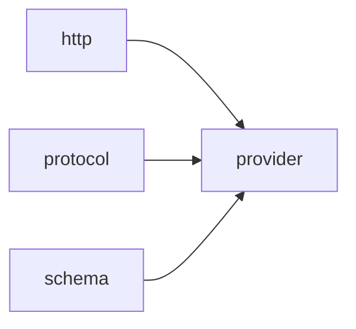

# Module `provider`

## Summary

模块 `provider` 负责为 LLM API 构建和验证网络请求。它封装了凭据读取、URL 拼接、请求对象验证以及工具参数序列化等任务，是 `clore::net` 库中的核心实现层。作为网络基础设施的一部分，它依赖 `http` 模块执行实际的网络调用，并利用 `protocol` 和 `schema` 模块来定义消息结构与 JSON 模式。该模块的公开接口集中在 `clore::net::detail` 命名空间下，包括诸如 `read_credentials`、`append_url_path`、`validate_completion_request`、`serialize_tool_arguments` 和 `parse_json_object` 等函数，用于请求的准备、校验和响应解析。此外，模块还管理运行时上下文（如请求状态和解析结果），确保与上层组件的无缝集成。

## Imports

- [`http`](../http/index.md)
- [`protocol`](../protocol/index.md)
- [`schema`](../schema/index.md)
- `std`

## Imported By

- [`anthropic`](../anthropic/index.md)
- [`openai`](../openai/index.md)

## Dependency Diagram

## Types

### `clore::net::detail::CredentialEnv`

Declaration: `network/provider.cppm:14`

Definition: `network/provider.cppm:14`

Declaration: [`Namespace clore::net::detail`](../../namespaces/clore/net/detail/index.md)

`clore::net::detail::CredentialEnv` 是一个纯数据聚合结构体，其内部仅包含两个 `std::string_view` 成员：`base_url_env` 和 `api_key_env`。这两个成员分别持有环境变量名称的视图，用于指示从当前进程环境中读取 base URL 和 API 密钥时使用的变量名。该结构体不拥有任何字符串资源，其核心不变量要求这两个 `std::string_view` 所指向的字符串必须具有大于或等于结构体使用生命周期的存储期——通常它们指向静态字符串字面量或由外部保证的长期存储。该结构体本身不定义任何构造函数、赋值操作或成员函数，完全依赖聚合初始化来设定环境变量名称，因此其行为完全由字段值的内容和外部环境查询逻辑共同决定。

#### Invariants

- Fields are `std::string_view` values naming environment variable identifiers.
- No explicit constraints on the content or validity of the environment variable names are enforced.

#### Key Members

- `base_url_env`
- `api_key_env`

#### Usage Patterns

- Instances are typically initialized with string literals (e.g., `{"MY_BASE_URL", "MY_API_KEY"}`) and passed to credential resolution logic.
- The struct is used within `clore::net::detail` to decouple environment variable name configuration from the rest of the credential lookup implementation.

## Functions

### `clore::net::detail::append_url_path`

Declaration: `network/provider.cppm:21`

Definition: `network/provider.cppm:43`

Declaration: [`Namespace clore::net::detail`](../../namespaces/clore/net/detail/index.md)

`clore::net::detail::append_url_path` 首先从参数 `base_url` 复制构造一个 `std::string url`，然后循环移除 `url` 末尾的所有斜杠（`'/'`）。接着对参数 `path` 执行对称操作：构造 `std::string suffix` 并循环删除其前导斜杠。如果处理后的 `suffix` 非空，则在 `url` 后追加一个斜杠和 `suffix`；否则直接返回 `url`。该函数仅依赖 C++ 标准库中的 `std::string` 和 `std::string_view`，不涉及外部工具或数据结构，内部控制流仅包含两个独立的循环和一个条件追加语句，逻辑清晰且无分支嵌套。

#### Side Effects

No observable side effects are evident from the extracted code.

#### Reads From

- parameters `base_url` and `path`

#### Usage Patterns

- Used to construct a valid HTTP request URL by normalizing the base and path components.

### `clore::net::detail::parse_json_object`

Declaration: `network/provider.cppm:27`

Definition: `network/provider.cppm:148`

Declaration: [`Namespace clore::net::detail`](../../namespaces/clore/net/detail/index.md)

该函数是 `json::parse` 的一个浅层包装，专用于将 `raw` 字符串解析为 `json::Object`。它利用 `context` 参数为可能的解析失败提供有意义的错误消息；当 `json::parse` 返回失效值时，函数构造一个 `LLMError`，其描述字符串由 `context` 与解析错误文本拼接而成。控制流仅包含一个分支：解析成功则直接返回解析结果，否则返回带有上下文的错误。主要依赖为 `json::parse`（特化为 `json::Object`）和 `LLMError` 类型。

#### Side Effects

No observable side effects are evident from the extracted code.

#### Reads From

- 参数 `raw` 字符串视图
- 参数 `context` 字符串视图
- `json::parse` 返回的解析错误信息（通过 `parsed.error().to_string()`）

#### Writes To

- 返回的 `json::Object`（成功时）
- 返回的 `LLMError`（失败时）

#### Usage Patterns

- 解析网络响应中的 JSON 对象
- 在解析失败时提供上下文描述以辅助调试

### `clore::net::detail::read_credentials`

Declaration: `network/provider.cppm:19`

Definition: `network/provider.cppm:39`

Declaration: [`Namespace clore::net::detail`](../../namespaces/clore/net/detail/index.md)

函数 `clore::net::detail::read_credentials` 作为薄包装层，从传入的 `clore::net::detail::CredentialEnv` 对象中提取 `base_url_env` 与 `api_key_env` 两个字段，并将它们转发给内部函数 `read_environment` 以完成实际的环境变量读取与 `EnvironmentConfig` 的构造。该函数不包含额外逻辑，其控制流完全由 `read_environment` 的实现驱动；若 `read_environment` 失败，则返回 `std::expected<EnvironmentConfig, LLMError>` 的错误状态，否则返回有效的配置对象。依赖关系集中于 `read_environment` 与 `CredentialEnv` 的字段定义。

#### Side Effects

No observable side effects are evident from the extracted code.

#### Reads From

- `CredentialEnv env` parameter (fields `base_url_env` and `api_key_env`)

#### Usage Patterns

- used to retrieve credentials from environment variables for network configuration
- called when initializing network provider with credential environment settings

### `clore::net::detail::serialize_tool_arguments`

Declaration: `network/provider.cppm:30`

Definition: `network/provider.cppm:158`

Declaration: [`Namespace clore::net::detail`](../../namespaces/clore/net/detail/index.md)

该函数首先将传入的 `arguments` 通过 `json::to_string` 序列化为 JSON 字符串，若转换失败则立即返回由 `context` 和序列化错误构造的 `unexpected_json_error` 错误。序列化成功后，再调用 `json::parse` 重新解析相同的字符串，这一步主要是为了校验序列化结果的可逆性并可能完成值规范化；若解析失败，则返回带有 `context` 和解析错误信息的 `LLMError`。最终，函数将序列化后的字符串和解析后的 `json::Value` 打包为 `std::pair` 返回。整个流程依赖 `json::to_string`、`json::parse`、`unexpected_json_error` 等内部工具，并在错误路径上使用 `std::format` 构造描述信息。

#### Side Effects

No observable side effects are evident from the extracted code.

#### Reads From

- `arguments` parameter
- `context` parameter

#### Usage Patterns

- round-trip JSON normalization
- validating tool arguments are serializable

### `clore::net::detail::validate_completion_request`

Declaration: `network/provider.cppm:23`

Definition: `network/provider.cppm:61`

Declaration: [`Namespace clore::net::detail`](../../namespaces/clore/net/detail/index.md)

该函数对 `CompletionRequest` 执行多层验证。首先检查 `request.model` 和 `request.messages` 是否为空，若空则直接失败。接着根据 `validate_response_format_schema` 标志选择性地对 `request.response_format` 调用 `validate_response_format` 进行校验；根据 `validate_tool_schemas` 标志选择性地遍历 `request.tools` 并对每个工具调用 `validate_tool_definition`。随后检查如果设置了 `request.tool_choice` 或 `request.parallel_tool_calls` 但 `request.tools` 为空，返回错误；若 `tool_choice` 为 `ForcedFunctionToolChoice`，则还需确认其指定的工具名存在于 `request.tools` 集合中。最后遍历 `request.messages`，对每条消息使用 `std::visit` 分派处理：对于 `AssistantToolCallMessage`，确保至少包含 `content` 或 `tool_calls`，并且每个工具调用的 `id` 和 `name` 非空且 `id` 无重复；对于 `ToolResultMessage`，确保 `tool_call_id` 非空。任何步骤失败均返回包含 `LLMError` 的 `std::unexpected`。函数主要依赖 `validate_response_format`、`validate_tool_definition`、`std::format` 以及 `std::unordered_set` 来实现具体校验和错误消息生成。

#### Side Effects

No observable side effects are evident from the extracted code.

#### Reads From

- `request.model`
- `request.messages`
- `request.response_format`
- `request.tools`
- `request.tool_choice`
- `request.parallel_tool_calls`
- individual message fields via `std::visit`

#### Usage Patterns

- Called before sending a completion request to ensure input validity
- Used in the network layer to pre-validate request parameters

## Internal Structure

`provider` 模块封装了与 LLM API 提供者交互的核心逻辑，对外隐藏了凭据管理、URL 拼接、请求验证和工具参数处理等细节。它内部划分为 `detail` 实现层，其中 `CredentialEnv` 结构描述了通过环境变量获取 API 基础 URL 和密钥的规则，若干辅助函数分别负责路径拼接、JSON 对象解析、工具参数序列化、凭据读取以及补全请求的有效性校验。模块主要依赖 `http` 执行网络调用，依赖 `protocol` 定义请求/响应数据结构，并依赖 `schema` 完成 JSON Schema 的生成与验证，从而将提供者适配与协议逻辑分离，便于扩展其他 API 提供商。

## Related Pages

- [Module http](../http/index.md)
- [Module protocol](../protocol/index.md)
- [Module schema](../schema/index.md)

