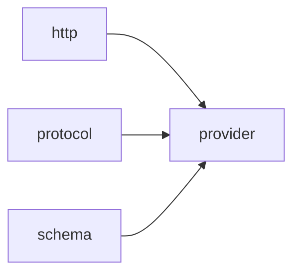

# Module `provider`

## Summary

provider 模块位于 `clore::net` 命名空间下，封装了与 LLM 提供者网络交互的底层细节。它负责从环境变量中读取凭据（通过 `CredentialEnv` 结构和 `read_credentials` 函数）、构造并规范化 HTTP 请求路径（`append_url_path`）、验证请求格式与工具模式（`validate_completion_request`、`validate_response_format_schema`、`validate_tool_schemas`），以及序列化工具参数和解析 JSON 对象。这些功能被组织在 `detail` 子命名空间中，作为内部实现层，供 `http`、`protocol` 和 `schema` 等上层模块使用，不构成公开 API 契约。

## Imports

- [`http`](../http/index.md)
- [`protocol`](../protocol/index.md)
- [`schema`](../schema/index.md)

## Imported By

- [`anthropic`](../anthropic/index.md)
- [`openai`](../openai/index.md)

## Dependency Diagram

```mermaid
graph LR
    M0["provider"]
    I0["http"]
    I0 --> M0
    I1["protocol"]
    I1 --> M0
    I2["schema"]
    I2 --> M0
```

## Types

### `clore::net::detail::CredentialEnv`

Declaration: `src/network/provider.cppm:21`

Definition: `src/network/provider.cppm:21`

Declaration: [`Namespace clore::net::detail`](../../namespaces/clore/net/detail/index.md)

`clore::net::detail::CredentialEnv` 是一个极简的内部结构，仅包含两个 `std::string_view` 成员：`base_url_env` 和 `api_key_env`。该结构的全部职责是存储指向环境变量名称或字符串常量的非拥有引用，用于在底层网络凭证初始化流程中定位相应的配置项。其不变量要求这两个字符串视图在结构体实例的整个生命周期内必须指向有效的、生命周期至少与实例一致的内存区域（通常为静态存储期字符串或调用方保证持久化的缓冲区），以保证后续对该结构的读取操作不会导致悬垂引用。由于结构不自行管理内存，它被设计为纯数据聚合体，编译器会为其生成 trivial 的拷贝/移动/析构行为，使它在传递和存储时具备极低的开销。

#### Invariants

- The string views must remain valid for the lifetime of the struct
- The referenced strings are expected to be null-terminated environment variable names

#### Key Members

- `base_url_env`
- `api_key_env`

#### Usage Patterns

- Used as a configuration input to credential lookup functions, specifying which environment variables to read for the base URL and API key

## Functions

### `clore::net::detail::append_url_path`

Declaration: `src/network/provider.cppm:28`

Definition: `src/network/provider.cppm:50`

Declaration: [`Namespace clore::net::detail`](../../namespaces/clore/net/detail/index.md)

函数 `clore::net::detail::append_url_path` 的实现通过两个独立的规范化步骤拼接 URL 路径。它将 `base_url` 复制到本地字符串 `url` 后，使用 `while` 循环移除末尾所有斜杠；同时将 `path` 复制到本地字符串 `suffix`，移除开头所有斜杠。若 `suffix` 非空，则在 `url` 后附加一个斜杠并追加 `suffix`，最后返回合并结果。整个算法仅依赖 `std::string` 的基本操作，控制流由两个循环和一个条件分支组成，不含外部函数调用。

#### Side Effects

No observable side effects are evident from the extracted code.

#### Reads From

- `base_url`
- path

#### Usage Patterns

- Construct URL from base and path
- Sanitize slashes when joining URL segments

### `clore::net::detail::parse_json_object`

Declaration: `src/network/provider.cppm:34`

Definition: `src/network/provider.cppm:155`

Declaration: [`Namespace clore::net::detail`](../../namespaces/clore/net/detail/index.md)

该函数尝试使用 `json::parse<json::Object>` 将原始字符串视图 `raw` 解析为 `json::Object`。如果解析成功，则直接返回解析后的对象；否则，构造一个包含上下文信息 `context` 和具体解析错误描述的 `LLMError`，并将其包装在 `std::unexpected` 中返回。该实现依赖于 `json::parse` 提供的错误字符串格式化功能，并利用 `std::expected` 进行成功或错误的二元返回，使调用方能够通过 `std::expected` 的错误路径统一处理解析失败的情况。

控制流仅包含一个条件分支：解析失败时立即构造错误并返回，成功时则返回解析结果。该函数不涉及复杂的状态或循环，所有依赖（如 `json::Object`、`LLMError`）均通过外部模块提供，本身保持简洁的代理角色——将原始的 JSON 解析结果适配为包含业务错误类型的返回值。

#### Side Effects

No observable side effects are evident from the extracted code.

#### Reads From

- `raw` parameter
- `context` parameter
- `json::parse<json::Object>` result
- `parsed.error().to_string()` for error formatting

#### Writes To

- returns a `std::expected<json::Object, LLMError>` by value

#### Usage Patterns

- called to parse JSON object responses from HTTP requests
- used in functions that validate or extract JSON object data, such as `validate_completion_request`
- called with a context string to provide meaningful error messages on parsing failure

### `clore::net::detail::read_credentials`

Declaration: `src/network/provider.cppm:26`

Definition: `src/network/provider.cppm:46`

Declaration: [`Namespace clore::net::detail`](../../namespaces/clore/net/detail/index.md)

该函数实现为一个薄包装器，直接委托给 `read_environment`。它从传入的 `clore::net::detail::CredentialEnv` 结构体中提取 `base_url_env` 和 `api_key_env` 两个字段（分别代表基础 URL 和 API 密钥的环境变量名称），并将它们作为参数传递给 `read_environment`。`read_environment` 负责实际的环境变量读取、解析和格式化校验，其返回值 `std::expected<EnvironmentConfig, LLMError>` 直接向上传递。整个实现不含分支或循环，唯一的控制流就是委托调用。

依赖方面，该函数仅耦合于 `clore::net::detail::CredentialEnv` 结构体的定义以及 `read_environment` 的签名。它不直接处理任何环境变量或错误逻辑，因此其内部行为完全由 `read_environment` 的具体实现驱动。

#### Side Effects

No observable side effects are evident from the extracted code.

#### Reads From

- `env.base_url_env`
- `env.api_key_env`

#### Usage Patterns

- 用于从环境变量中获取 base URL 和 API key 配置
- 常被配置初始化或认证流程调用

### `clore::net::detail::serialize_tool_arguments`

Declaration: `src/network/provider.cppm:37`

Definition: `src/network/provider.cppm:165`

Declaration: [`Namespace clore::net::detail`](../../namespaces/clore/net/detail/index.md)

该函数首先调用 `json::to_string` 将输入 `arguments` 序列化为标准 JSON 字符串，若失败则通过 `unexpected_json_error` 构造错误并返回。成功获取字符串后，立即用 `json::parse` 重新解析该字符串以生成一个新的 `json::Value`，确保输入是结构有效的 JSON 对象，并得到其规范化的内部表示。最终返回一个 `std::pair`，包含原始序列化字符串和重新解析后的 JSON 值，从而同时提供了字符串形式和对象形式的参数快照。

整个流程本质上是一次“序列化-反序列化”的往返校验，依赖 `json::to_string` 和 `json::parse` 的底层实现。错误处理全部基于 `std::expected`，将序列化/解析中的错误包装为 `LLMError` 并携带 `context` 字符串，便于上层定位问题。此实现并不修改参数语义，仅为下游组件提供稳定可用的一对表示。

#### Side Effects

No observable side effects are evident from the extracted code.

#### Reads From

- `arguments` (`json::Value`)
- `context` (`std::string_view`)

#### Usage Patterns

- validate and round‑trip JSON tool arguments
- prepare tool arguments for HTTP request serialization
- ensure arguments are serializable before further use

### `clore::net::detail::validate_completion_request`

Declaration: `src/network/provider.cppm:30`

Definition: `src/network/provider.cppm:68`

Declaration: [`Namespace clore::net::detail`](../../namespaces/clore/net/detail/index.md)

函数 `clore::net::detail::validate_completion_request` 首先对传入的 `CompletionRequest` 执行基础字段检查：若 `request.model` 或 `request.messages` 为空则立即返回 `std::unexpected`。随后根据参数 `validate_response_format_schema` 和 `validate_tool_schemas` 启动条件性模式验证：前者会在 `request.response_format` 存在时调用 `validate_response_format`，后者则遍历 `request.tools` 并逐个调用 `validate_tool_definition`。接着，函数验证工具选择的一致性——当 `request.tool_choice` 或 `request.parallel_tool_calls` 存在但 `request.tools` 为空时报错；若 `tool_choice` 为 `ForcedFunctionToolChoice` 类型，还需确认其 `name` 在 `request.tools` 中存在。最后对每条消息使用 `std::visit` 区分两种类型：对于 `AssistantToolCallMessage`，检查 `content` 与 `tool_calls` 至少提供一个，并确保所有 `tool_calls` 的 `id` 和 `name` 非空且 `id` 无重复；对于 `ToolResultMessage`，确保 `tool_call_id` 非空。全部通过后返回空 `expected`。核心依赖包括外部的模式验证函数、`std::format` 以及 `std::visit` 的 visitator。

#### Side Effects

No observable side effects are evident from the extracted code.

#### Reads From

- `request.model`
- `request.messages`
- `request.response_format`
- `request.tools`
- `request.tool_choice`
- `request.parallel_tool_calls`
- return value of `clore::net::detail::validate_response_format`
- return value of `clore::net::detail::validate_tool_definition`
- message fields: `content`, `tool_calls`, `id`, `name`, `tool_call_id`

#### Usage Patterns

- Called before sending a completion request to ensure all required fields are valid.
- Used with `validate_response_format_schema` and `validate_tool_schemas` flags to optionally enable deeper validation.
- Invoked by higher-level request sending functions like `clore::net::detail::request_text_once_async`.

## Internal Structure

`provider` 模块是 LLM 网络通信的核心构造层，它封装了从环境变量读取凭据、组装请求 URL 与路径、序列化工具参数以及校验完成请求的完整逻辑。内部按职责分解为凭据读取（`CredentialEnv` / `read_credentials`）、路径拼接（`append_url_path`）、JSON 解析（`parse_json_object`）、参数序列化（`serialize_tool_arguments`）和请求验证（`validate_completion_request`）等 `detail` 子模块，各子模块通过模块局部变量（如 `base_url`、`path`、`request`、`arguments`）在调用链中传递上下文。该模块导入 `http`（实际执行网络调用）、`protocol`（定义请求/响应类型）和 `schema`（提供 JSON Schema 校验能力），通过这些外部模块的抽象，将具体的网络细节与协议逻辑隔离开，使得 provider 仅关注构造和验证的正确性，而将传输和协议协商委托给下层依赖。

## Related Pages

- [Module http](../http/index.md)
- [Module protocol](../protocol/index.md)
- [Module schema](../schema/index.md)

