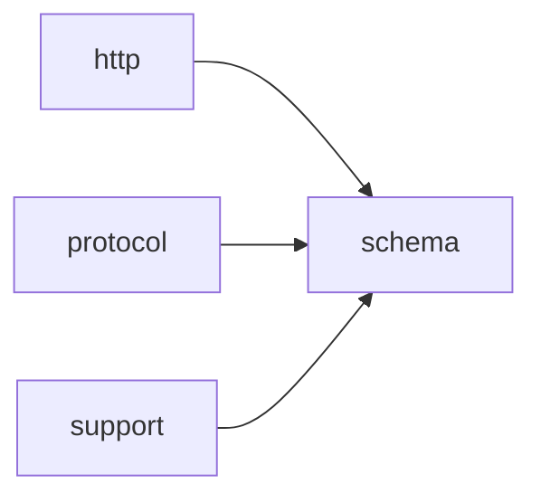

# Module `schema`

## Summary

This 模块负责从 C++ 类型自动推导并生成与 `OpenAI` API 兼容的 JSON Schema 表示。它提供了一套编译期类型特征（如 `is_optional`、`is_vector`、`is_array`）和运行时构建函数（`make_schema_object`、`make_scalar_type_schema`、`make_any_of_schema` 等），能够为标量、可选值、容器及复合类型正确地构造 schema 结构。同时，该模块包含一系列验证函数（`validate_openai_schema`、`validate_openai_schema_value`、`validate_response_format`、`validate_tool_definition` 等），用于确保生成的 schema 或传入的 JSON 数据满足 `OpenAI` 的格式约定。

其公开接口以模板函数 `response_format` 和 `function_tool` 为核心，让用户能够将 C++ 类型映射为请求结构中的 `response_format` 或工具定义。整个模块的职责集中于简化类型到 JSON Schema 的映射与验证，为构建结构化输出提供一致的基础设施。

## Imports

- [`http`](../http/index.md)
- [`protocol`](../protocol/index.md)
- `std`
- [`support`](../support/index.md)

## Imported By

- [`agent:tools`](../agent/tools.md)
- [`anthropic`](../anthropic/index.md)
- [`client`](../client/index.md)
- [`openai`](../openai/index.md)
- [`provider`](../provider/index.md)

## Dependency Diagram

## Types

### `clore::net::openai::schema::detail::array_inner`

Declaration: `network/schema.cppm:72`

Declaration: [`Namespace clore::net::openai::schema::detail`](../../namespaces/clore/net/openai/schema/detail/index.md)

`clore::net::openai::schema::detail::array_inner` 是一个模板结构体，定义于内部实现文件 `network/schema.cppm` 中。它没有公开的数据成员或成员函数，通常仅作为类型标签或类型萃取中的占位结构体使用。其唯一模板参数 `T` 代表数组所持有的元素类型，但结构体本身不存储任何运行时状态，也不公开任何操作。该结构体位于 `detail` 命名空间中，属于实现细节，因此其内部结构、不变量的具体定义不在公共契约中暴露，而是通过外部特化或元编程机制间接使用。

#### Invariants

- 类型 `T` 无约束

#### Key Members

- 模板参数 `T`

#### Usage Patterns

- 可能用于类型映射或元编程中的标签
- 作为 `detail` 命名空间下的实现细节

### `clore::net::openai::schema::detail::is_array`

Declaration: `network/schema.cppm:63`

Definition: `network/schema.cppm:63`

Declaration: [`Namespace clore::net::openai::schema::detail`](../../namespaces/clore/net/openai/schema/detail/index.md)

`clore::net::openai::schema::detail::is_array` 是一个模板类型特征，其主模板公开继承自 `std::false_type`。该结构体不定义任何额外的成员或函数，仅通过继承提供编译期常量值 `false`，为所有未特化的类型 `T` 指示“非数组”。该实现的设计意图是作为默认否定基类，后续通过显式特化（例如对 `T[]` 或 `T[N]`）覆盖为 `std::true_type`，从而在编译期区分数组类型。内部结构简单，不含状态或运行时成员，其不变性在于：对于任意未特化的 `T`，`is_array<T>::value` 恒为 `false`。

#### Invariants

- 默认 `value` 为 `false`
- 可通过模板特化为数组类型提供 `value` 为 `true`

#### Key Members

- 继承自 `std::false_type` 的静态常量 `value`

#### Usage Patterns

- 作为编译期类型判断的基础特征
- 可供其他模板通过特化来针对数组类型启用特定行为

### `clore::net::openai::schema::detail::is_optional`

Declaration: `network/schema.cppm:23`

Definition: `network/schema.cppm:23`

Declaration: [`Namespace clore::net::openai::schema::detail`](../../namespaces/clore/net/openai/schema/detail/index.md)

该结构体定义在内部命名空间 `clore::net::openai::schema::detail` 中，作为检测类型是否为 `std::optional` 的基础类型特征（trait）。它公开继承 `std::false_type`，因此其静态成员常量 `value` 默认为 `false`。对于任意类型 `T`，主模板的 `value` 均为 `false`；库通过模板特化（如针对 `std::optional<U>`）来覆盖该默认值，使 `value` 变为 `true`。整个结构体仅由继承的 `value` 常量和类型定义组成，不存在其他成员或复杂不变量。

#### Invariants

- Default value is `false`
- Inherits from `std::false_type`
- Value is constant at compile time

#### Key Members

- `value` (inherited from `std::false_type`)

#### Usage Patterns

- Used in template metaprogramming to conditionally enable code
- Specialized for types that are optional wrappers

### `clore::net::openai::schema::detail::is_vector`

Declaration: `network/schema.cppm:43`

Definition: `network/schema.cppm:43`

Declaration: [`Namespace clore::net::openai::schema::detail`](../../namespaces/clore/net/openai/schema/detail/index.md)

该结构体 `clore::net::openai::schema::detail::is_vector` 是一个模板类型特征，其主模板继承自 `std::false_type`。对于未显式特化的任意类型 `T`，其 `value` 成员常量恒为 `false`，标志着 `T` 并非向量类型。该实现遵循标准类型特征库的设计惯例，自身不包含额外数据成员或虚函数，完全通过基类继承机制提供编译期布尔值判断。

#### Invariants

- `value` 恒为 `false`，除非通过特化覆盖
- 所有实例化共享相同的 `false_type` 接口

#### Key Members

- 继承的 `std::false_type::value` 常量

#### Usage Patterns

- 作为基类用于定义向量类型的特征特化
- 在模板元编程中用作编译时布尔判定

### `clore::net::openai::schema::detail::optional_inner`

Declaration: `network/schema.cppm:32`

Declaration: [`Namespace clore::net::openai::schema::detail`](../../namespaces/clore/net/openai/schema/detail/index.md)

结构体 `clore::net::openai::schema::detail::optional_inner` 是 `optional` 类型的核心内部实现，负责存储值对象并跟踪其存在性。其内部通常包含一个通过 `aligned_storage` 或类似设施管理的原始内存缓冲区，以及一个 `bool` 标志位，指示缓冲区中是否已构造了 `T` 类型的对象。核心不变量是：当标志为 `true` 时，缓冲区中必须存在一个通过 placement new 完整构造的 `T` 实例；当标志为 `false` 时，缓冲区内容未初始化，任何读取操作均为未定义行为。重要成员实现包括：默认构造函数将标志置为 `false` 且不构造值对象；复制构造函数会根据源对象的标志状态，若源有值则复制构造新对象；析构函数仅在标志为 `true` 时调用该对象的析构函数并重置标志；赋值运算符通过复用现有存储或销毁旧值来精确管理生命周期，确保异常安全且不泄露资源。

### `clore::net::openai::schema::detail::schema_subject`

Declaration: `network/schema.cppm:83`

Definition: `network/schema.cppm:83`

Declaration: [`Namespace clore::net::openai::schema::detail`](../../namespaces/clore/net/openai/schema/detail/index.md)

结构体 `schema_subject` 是 `clore::net::openai::schema::detail` 命名空间下的一个内部类型转换工具。其核心实现仅通过一个公开的别名成员 `type`，对模板参数 `T` 应用 `std::remove_cvref_t` 来剥离引用和顶层 const/volatile 限定符，从而得到一个无引用的原始类型。该别名的存在意味着无论传入何种类型（包括左值引用、右值引用或 cv 限定类型），`schema_subject` 都能提供一个统一、干净的类型定义，供后续的模式推导或类型检查使用。整个结构体不维护任何运行时状态，其所有功能均在编译期完成，保证了零开销的抽象。

#### Invariants

- `type` 始终为 `T` 去除顶层 cv 和引用后的结果。
- 不存在运行时状态或可变成员。

#### Key Members

- 成员别名 `type`

#### Usage Patterns

- 作为类型萃取工具，用于获取实参的底层类型。
- 可能用于 SFINAE 上下文中约束模板参数。

### `clore::net::openai::schema::detail::schema_subject_t`

Declaration: `network/schema.cppm:95`

Declaration: [`Namespace clore::net::openai::schema::detail`](../../namespaces/clore/net/openai/schema/detail/index.md)

`schema_subject_t` 是一个模板类型别名，它通过 `schema_subject<T>::type` 间接推导出最终的类型。该别名不增加任何额外的逻辑或成员，仅作为元函数的简写形式，隐藏了 `typename schema_subject<T>::type` 这一完整语法。其实现完全依赖于 `schema_subject` 类模板的特化或主模板定义。

在使用该别名时，必须保证 `schema_subject<T>` 已经被正确特化并提供了有效的 `type` 成员。该别名在整个 schema 实现层中充当类型萃取层，允许其他代码以统一的方式获取 “T 在 schema 主题体系中的对应类型”。由于它只是一个别名，其本身不维护任何运行时状态，编译期计算完全由 `schema_subject` 完成。

### `clore::net::openai::schema::detail::vector_inner`

Declaration: `network/schema.cppm:52`

Declaration: [`Namespace clore::net::openai::schema::detail`](../../namespaces/clore/net/openai/schema/detail/index.md)

The struct `clore::net::openai::schema::detail::vector_inner` is a template defined with a single type parameter `T` and declared in `network/schema.cppm`. It resides in the `detail` namespace, marking it as an internal implementation component.

The struct likely provides a lightweight wrapper around a contiguous block of `T` elements, modeling a dynamic array or vector. Key invariants include element contiguity, correct element lifetime management, and proper memory alignment. Important member implementations, such as constructors and element accessors, are designed for efficiency and are not part of the public API.

## Variables

### `clore::net::openai::schema::detail::is_array_v`

Declaration: `network/schema.cppm:69`

Declaration: [`Namespace clore::net::openai::schema::detail`](../../namespaces/clore/net/openai/schema/detail/index.md)

This variable is read at compile time in template metaprogramming contexts to detect array types. It participates in conditional logic or specialization, though its exact usage is not observed in the provided evidence.

#### Mutation

No mutation is evident from the extracted code.

#### Usage Patterns

- Compile-time type detection
- Conditional template instantiation (inferred)

### `clore::net::openai::schema::detail::is_optional_v`

Declaration: `network/schema.cppm:29`

Declaration: [`Namespace clore::net::openai::schema::detail`](../../namespaces/clore/net/openai/schema/detail/index.md)

This variable is used as a type trait to enable conditional logic in schema validation or serialization code. It is read at compile time to select appropriate code paths, typically in conjunction with SFINAE or `if constexpr`.

#### Mutation

No mutation is evident from the extracted code.

### `clore::net::openai::schema::detail::is_vector_v`

Declaration: `network/schema.cppm:49`

Declaration: [`Namespace clore::net::openai::schema::detail`](../../namespaces/clore/net/openai/schema/detail/index.md)

This variable is used in template metaprogramming contexts to conditionally enable or select code paths based on whether a given type is a vector. It is read as a constant expression and participates in `if constexpr` logic or SFINAE constraints alongside similar traits like `is_optional_v` and `is_array_v`.

#### Mutation

No mutation is evident from the extracted code.

#### Usage Patterns

- template metaprogramming
- type trait checks
- compile-time branching

## Functions

### `clore::net::detail::validate_response_format`

Declaration: `network/schema.cppm:527`

Definition: `network/schema.cppm:535`

Declaration: [`Namespace clore::net::detail`](../../namespaces/clore/net/detail/index.md)

该函数首先检查传入的 `ResponseFormat` 对象中是否包含可选的 `schema` 字段：若 `format.schema` 无值，则直接返回一个空的 `expected` 表示校验通过。否则，继续校验 `format.name` 是否为空字符串，若为空则返回包含 `LLMError` 的 `unexpected` 结果。上述前置校验通过后，函数将实际的 Schema 对象、名称以及表示当前为根对象的布尔值 `true` 转发给 `openai::schema::detail::validate_openai_schema`，由该函数完成对 `OpenAI` 响应格式 Schema 的深层递归验证。整个流程依赖于 `validate_openai_schema` 这一核心验证例程，而本函数仅负责边界条件的快速退出和必要参数的准备。

#### Side Effects

No observable side effects are evident from the extracted code.

#### Reads From

- format`.schema`
- format`.name`

#### Usage Patterns

- validate response format before making API requests
- check `response_format``.name` and schema

### `clore::net::detail::validate_tool_definition`

Declaration: `network/schema.cppm:529`

Definition: `network/schema.cppm:545`

Declaration: [`Namespace clore::net::detail`](../../namespaces/clore/net/detail/index.md)

函数 `clore::net::detail::validate_tool_definition` 的实现首先对传入的 `tool` 参数进行基本验证：若 `tool.name` 为空，则返回含 `LLMError` 错误的 `std::unexpected`，消息为 "tool name must not be empty"；若 `tool.description` 为空，则返回含格式化消息 "tool '...' description must not be empty" 的 `std::unexpected`。这两项检查确保了工具定义的关键字段不为空。

基本验证通过后，函数将实际校验委托给 `openai::schema::detail::validate_openai_schema`，传入 `tool.parameters`、`tool.name` 和布尔值 `true`（表示当前上下文为根级别）。该调用负责对参数模式的合法性进行深层验证，并最终将 `std::expected<void, LLMError>` 结果直接返回给调用者。函数本身依赖 `std::format` 进行字符串格式化，并依赖 `LLMError` 类型传递错误描述。

#### Side Effects

No observable side effects are evident from the extracted code.

#### Reads From

- tool`.name`
- tool`.description`
- tool`.parameters`

#### Usage Patterns

- validate tool definition before API call
- ensure tool name and description are provided

### `clore::net::openai::schema::detail::make_any_of_schema`

Declaration: `network/schema.cppm:156`

Definition: `network/schema.cppm:156`

Declaration: [`Namespace clore::net::openai::schema::detail`](../../namespaces/clore/net/openai/schema/detail/index.md)

函数 `clore::net::openai::schema::detail::make_any_of_schema` 根据传入的 `std::vector<json::Value>` 构建一个包含 `anyOf` 字段的 JSON 模式对象。其内部控制流首先调用 `clore::net::detail::make_empty_object` 创建一个空 JSON 对象，若失败则立即返回 `std::unexpected`；接着调用 `clore::net::detail::make_empty_array` 创建一个空 JSON 数组，同样在失败时返回错误。随后，遍历 `choices` 中的每个元素，通过 `push_back` 将其移动至数组中。最后，将填充完毕的数组插入对象键 `"anyOf"` 下，并将整个对象包装为 `json::Value` 返回。该函数依赖于 `clore::net::detail` 的 `make_empty_object` 和 `make_empty_array` 来分配基础容器，并通过标准库容器与 `std::expected` 实现错误传播。

#### Side Effects

- allocates JSON objects
- transfers ownership of choice values into the schema

#### Reads From

- function parameter `choices` (vector of JSON values)
- return values from `make_empty_object` and `make_empty_array`

#### Writes To

- local JSON object and array built during execution
- the returned JSON value (ownership transferred to caller)

#### Usage Patterns

- building an `anyOf` schema from a list of choices

### `clore::net::openai::schema::detail::make_scalar_type_schema`

Declaration: `network/schema.cppm:146`

Definition: `network/schema.cppm:146`

Declaration: [`Namespace clore::net::openai::schema::detail`](../../namespaces/clore/net/openai/schema/detail/index.md)

函数 `clore::net::openai::schema::detail::make_scalar_type_schema` 负责为标量类型构造一个基础 JSON Schema 对象。其实现流程如下：首先调用 `clore::net::detail::make_empty_object` 创建一个空 JSON 对象，并将失败信息包装为 `std::unexpected` 返回；若创建成功，则向该对象插入键值对 `"type"` 与传入的 `type_name` 字符串，最后将填充后的对象包装为 `json::Value` 并返回。该函数仅依赖 `make_empty_object` 创建 JSON 对象的能力以及 `json::Value` 的构造函数，无额外控制流分支（除错误传播外），非常适合作为标量模式生成的统一入口。

#### Side Effects

- Allocates a new `json::Object` internally via `make_empty_object`
- Transfers ownership of the resulting `json::Value` to the caller

#### Reads From

- `type_name` parameter

#### Writes To

- Returns a new `json::Value` object

#### Usage Patterns

- Used to generate JSON schema for scalar types
- Called by other schema construction functions like `make_schema_value`

### `clore::net::openai::schema::detail::make_schema_object`

Declaration: `network/schema.cppm:132`

Definition: `network/schema.cppm:132`

Declaration: [`Namespace clore::net::openai::schema::detail`](../../namespaces/clore/net/openai/schema/detail/index.md)

函数 `clore::net::openai::schema::detail::make_schema_object` 依赖 `make_schema_value<T>()` 生成 JSON 模式值，并将结果存储在临时变量 `value` 中。若 `value` 不包含合法值，则立即返回 `std::unexpected` 包装的错误。随后通过 `value->get_object()` 提取底层 JSON 对象指针：如果指针为空（即生成的模式根不是 JSON 对象），同样返回错误；否则复制该 JSON 对象并返回成功结果。控制流仅在成功路径上分支，失败路径统一以 `LLMError` 类型传递错误信息。核心依赖为 `make_schema_value` 模板函数、`json::Object` 类型以及 `LLMError` 错误类型。

#### Side Effects

- allocates a `json::Object`
- returns error via `std::unexpected`

#### Reads From

- template type `T`

#### Writes To

- returns a `json::Object` by value

#### Usage Patterns

- generates `OpenAPI` schema object for type `T`
- used in schema serialization

### `clore::net::openai::schema::detail::make_schema_value`

Declaration: `network/schema.cppm:129`

Definition: `network/schema.cppm:225`

Declaration: [`Namespace clore::net::openai::schema::detail`](../../namespaces/clore/net/openai/schema/detail/index.md)

该函数是一个模板元编程驱动的JSON Schema生成器，通过编译期类型分发为不同类型生成对应的`OpenAI` schema结构。内部使用`if constexpr`依次检查`schema_subject_t<T>`是否为标量、`std::optional`、`std::vector`、`std::array`或反射类，并对每种情况递归构造嵌套schema。对于`std::optional`，先生成内层类型的schema，再与一个`null`类型schema组合成`anyOf`数组；对于`std::vector`和`std::array`，递归生成元素类型schema后作为`items`字段放入数组对象，其中`std::array`还会添加`minItems`和`maxItems`以固定大小；对于反射类，创建一个空JSON对象后调用`populate_object_schema`利用编译期反射填充属性。任何递归步骤失败（返回`std::unexpected`都会直接传播错误，未处理类型则触发`static_assert`。

函数依赖`make_scalar_type_schema`、`make_any_of_schema`和`populate_object_schema`等内部助手，以及`is_optional_v`、`vector_inner_t`、`meta::reflectable_class`等一系列类型萃取和反射设施，同时使用`clore::net::detail::make_empty_object`构造JSON容器。递归错误处理统一通过`std::expected`的`has_value`检查完成，若子调用失败则立即返回错误，避免了深层无效状态的累积。

#### Side Effects

No observable side effects are evident from the extracted code.

#### Reads From

- template parameter `T`
- type traits `std::same_as`, `std::integral`, `std::floating_point`, `is_optional_v`, `is_vector_v`, `is_array_v`, `meta::reflectable_class`
- helper functions `make_scalar_type_schema`, `make_any_of_schema`, `populate_object_schema`, `make_empty_object`

#### Writes To

- constructed `json::Value` object
- error `LLMError` via `std::unexpected`

#### Usage Patterns

- Generate JSON schema value for C++ types
- Recursively called for nested types
- Used within schema generation pipeline

### `clore::net::openai::schema::detail::populate_object_schema`

Declaration: `network/schema.cppm:173`

Definition: `network/schema.cppm:173`

Declaration: [`Namespace clore::net::openai::schema::detail`](../../namespaces/clore/net/openai/schema/detail/index.md)

该函数负责从给定的 `Object` 类型反射其字段模式，并填充到一个传入的 `json::Object` 中，形成 `OpenAI` 兼容的 schema 表示。它首先通过 `meta_attrs::validate_field_schema<Object>()` 在编译期校验字段模式的有效性（如名称冲突或别名问题），然后创建空的 `properties` 对象和 `required` 数组。核心算法在一个变参 lambda `append_field` 中完成，针对每个模板索引 `Indices`，利用 `meta_attrs::resolve_field<Object, index>` 获取字段的 schema 属性；若字段标记为跳过则直接返回，若为展开字段则返回错误，否则调用 `make_schema_value<field_type>()` 生成字段值 schema，并将规范名称插入 `properties` 和 `required` 中。所有索引的处理通过参数包展开并行执行，结果存入 `statuses` 数组，随后逐个检查是否成功。最终在 `object` 中插入固定的 `type` 值 `"object"`、填充好的 `properties` 和 `required`，以及 `additionalProperties` 为 `false`。

依赖方面，该函数使用了 `clore::net::detail::make_empty_object` 和 `make_empty_array` 创建容器，依赖 `meta_attrs::resolve_field` 获取字段元数据，并通过 `make_schema_value` 递归地为每个字段类型生成子 schema。整个流程通过 `std::index_sequence` 展开和 `std::expected` 的错误传播机制确保异常安全。

#### Side Effects

- 修改传入的 `json::Object&` 参数，插入多个键值对
- 创建临时 `json::Object` 和 `json::Array` 对象用于 `properties` 和 `required`

#### Reads From

- 模板参数 `Object` 的编译时字段反射信息（通过 `meta_attrs::resolve_field`）
- 参数 `std::index_sequence<Indices...>` 用于展开字段索引

#### Writes To

- 参数 `object`（`json::Object&`）

#### Usage Patterns

- 在 `OpenAI` schema 生成管线的内部调用
- 通常由 `make_object_schema` 等高级函数调用

### `clore::net::openai::schema::detail::sanitize_schema_name`

Declaration: `network/schema.cppm:97`

Definition: `network/schema.cppm:97`

Declaration: [`Namespace clore::net::openai::schema::detail`](../../namespaces/clore/net/openai/schema/detail/index.md)

该函数通过逐字符扫描输入字符串 `raw_name` 实现清理。对于每个字符 `ch`，将其转换为 `unsigned char` 后检查是否属于英文字母（大小写）或数字；若符合则直接追加到 `sanitized` 结果字符串，否则追加下划线 `'_'`。此替换逻辑不依赖外部函数或类型，仅使用标准库字符分类的等价手动比较。

追加完成后，连续移除前导和尾随的下划线字符：先用循环擦除开头的连续 `'_'`，再用循环弹出结尾的连续 `'_'`。最终返回修剪后的字符串。整个过程没有调用其他模块接口，仅依赖 `std::string` 的成员函数 `push_back`、`erase`、`pop_back` 和 `reserve`。

#### Side Effects

No observable side effects are evident from the extracted code.

#### Reads From

- 参数 `raw_name`

#### Usage Patterns

- 清理 `OpenAI` schema 的名称

### `clore::net::openai::schema::detail::schema_type_name`

Declaration: `network/schema.cppm:120`

Definition: `network/schema.cppm:120`

Declaration: [`Namespace clore::net::openai::schema::detail`](../../namespaces/clore/net/openai/schema/detail/index.md)

该函数首先通过 `meta::type_name<T>()` 获取类型 `T` 的原始名称字符串，然后将其传递给 `clore::net::openai::schema::detail::sanitize_schema_name` 进行清理。若清理后的结果为空字符串，则立即返回一个 `std::unexpected` 包装的 `LLMError`，表示生成的 schema 名称无效；否则直接返回清理后的字符串。整个实现仅依赖于 `sanitize_schema_name` 和 `meta::type_name`，控制流仅为一个条件判断，无额外分支或循环。

#### Side Effects

No observable side effects are evident from the extracted code.

#### Reads From

- template parameter `T` via `meta::type_name<T>()`
- call to `sanitize_schema_name` which reads its argument

#### Usage Patterns

- called during schema generation to derive a schema name for a C++ type
- used by `make_schema_object` and similar functions

### `clore::net::openai::schema::detail::validate_openai_schema`

Declaration: `network/schema.cppm:328`

Definition: `network/schema.cppm:373`

Declaration: [`Namespace clore::net::openai::schema::detail`](../../namespaces/clore/net/openai/schema/detail/index.md)

函数 `clore::net::openai::schema::detail::validate_openai_schema` 从输入的 JSON 对象中逐一检查 `OpenAI` 模式的关键字段。它首先检查是否存在 `anyOf` 字段：若存在且 `is_root` 为真则直接报错，否则递归调用 `validate_openai_schema_value` 验证每个备选方案。随后解析 `type` 字段，支持字符串或字符串数组形式，遇到数组时先通过 `validate_schema_array_of_types` 验证类型列表的合法性，再选取非 `null` 的类型作为 `schema_type`；若最终无法确定有效类型、根模式类型非 `object`、或类型字段缺失都会返回错误。根据解析出的 `schema_type`，若为 `object` 则要求必须存在 `properties`（验证为对象）、`required`（验证为数组）且 `additionalProperties` 必须显式设为 `false`，接着调用 `validate_required_properties` 确保必需属性全部出现在 `properties` 中，再递归验证每个属性值；若为 `array` 则验证 `items` 子模式。最后检查可选字段 `$defs`，若存在则将其视为对象并递归验证每个定义。整个流程依赖 `validate_openai_schema_value`、`validate_required_properties`、`validate_schema_array_of_types` 等内部辅助函数，并通过 `clore::net::detail::ObjectView` 和 `clore::net::detail::expect_array`、`expect_object` 等工具安全地访问 JSON 节点。

#### Side Effects

No observable side effects are evident from the extracted code.

#### Reads From

- `object` parameter (JSON object and its nested values via `ObjectView::get`)
- `path` parameter
- `is_root` parameter
- `validate_openai_schema_value` (recursively reads sub-schemas)

#### Usage Patterns

- Validating root schema objects from `OpenAI` API requests
- Validating nested schema definitions in tool-calling configurations
- Called during schema registration or preprocessing to ensure compliance

### `clore::net::openai::schema::detail::validate_openai_schema_value`

Declaration: `network/schema.cppm:331`

Definition: `network/schema.cppm:331`

Declaration: [`Namespace clore::net::openai::schema::detail`](../../namespaces/clore/net/openai/schema/detail/index.md)

该函数是 `validate_openai_schema` 的入口包装器，负责将传入的任意 JSON 值强制转换为对象后再进行校验。内部通过 `clore::net::detail::expect_object` 将 `value` 解析为一个 `json::Object` 视图，如果解析失败（例如输入为数组或标量）则直接返回错误；成功则解引用对象并调用 `clore::net::openai::schema::detail::validate_openai_schema`，传递相同的 `path` 和 `is_root` 标志，由后者执行具体的模式校验逻辑。

算法上仅包含一层前处理与委托，控制流简单：首先校验值类型是否为对象，然后完全依赖 `validate_openai_schema` 的递归模式验证。依赖集中于 `expect_object`（用于类型断言与错误包装）和 `validate_openai_schema`（用于实际的 `OpenAPI` 模式语义检查）。

#### Side Effects

No observable side effects are evident from the extracted code.

#### Reads From

- `value` parameter (a `json::Value`)
- `path` parameter (a `std::string_view`)
- `is_root` parameter (a `bool`)

#### Usage Patterns

- Used to validate a JSON value that is expected to be an `OpenAI` schema object
- Called by higher-level schema validation logic

### `clore::net::openai::schema::detail::validate_openai_schema_value`

Declaration: `network/schema.cppm:340`

Definition: `network/schema.cppm:340`

Declaration: [`Namespace clore::net::openai::schema::detail`](../../namespaces/clore/net/openai/schema/detail/index.md)

该函数是 `validate_openai_schema` 的一个轻量级包装器，负责处理从 `json::Cursor` 到 `json::Object` 的转换。内部控制流首先调用 `clore::net::detail::expect_object` 从 `value` 中提取一个对象，若提取失败则直接返回包装后的 `std::unexpected` 错误。成功获取对象后，立即将实际对象、路径 `path` 和根标志 `is_root` 转发给 `clore::net::openai::schema::detail::validate_openai_schema`，其返回值即为该函数的最终结果。该函数不进行任何额外的验证逻辑，完全依赖于下游的 `validate_openai_schema` 和 `expect_object` 的正确性。

#### Side Effects

No observable side effects are evident from the extracted code.

#### Reads From

- `json::Cursor value` parameter
- `std::string_view path` parameter
- `bool is_root` parameter
- The `json::Object` extracted from the cursor via `expect_object`

#### Writes To

- The return value of type `std::expected<void, LLMError>`

#### Usage Patterns

- Wrapping a JSON cursor into object validation
- Entry point for validating schema values from external JSON sources

### `clore::net::openai::schema::detail::validate_required_properties`

Declaration: `network/schema.cppm:349`

Definition: `network/schema.cppm:349`

Declaration: [`Namespace clore::net::openai::schema::detail`](../../namespaces/clore/net/openai/schema/detail/index.md)

函数 `clore::net::openai::schema::detail::validate_required_properties` 验证给定的 `properties` 对象视图与 `required` 数组视图的兼容性，以确保每个属性都出现在 `required` 列表中，反之亦然。它首先遍历 `required` 数组，调用 `clore::net::detail::expect_string` 将每个值解析为字符串，并将结果插入到 `required_names` 集合中；若解析失败，则立即返回对应的 `LLMError`。随后，它遍历 `properties` 的每个条目，检查条目的键是否存在于 `required_names` 中，若缺失则构建并返回一个描述路径和属性名称的错误。所有检查通过后返回空期望值。

该函数的核心依赖包括：`clore::net::detail::ObjectView` 和 `clore::net::detail::ArrayView` 用于封装 JSON 对象和数组视图的迭代接口；`clore::net::detail::expect_string` 负责从 JSON 值中安全提取字符串；以及 `LLMError` 错误类型用于报告验证失败。控制流完全基于两个线性遍历，没有深层递归或复杂分支，行为直接受限于输入数据的一致性。

#### Side Effects

No observable side effects are evident from the extracted code.

#### Reads From

- `properties` parameter
- `required` parameter
- `path` parameter

#### Usage Patterns

- Called during schema validation when `strict` mode is enabled
- Used to ensure all object properties are explicitly required

### `clore::net::openai::schema::detail::validate_schema_array_of_types`

Declaration: `network/schema.cppm:295`

Definition: `network/schema.cppm:295`

Declaration: [`Namespace clore::net::openai::schema::detail`](../../namespaces/clore/net/openai/schema/detail/index.md)

该函数实现了一种受限的 JSON Schema `type` 数组校验，仅允许包含一个具体类型（如 `"string"`、`"object"`）与可选的 `"null"` 值。内部控制流首先遍历 `array`，对每个元素调用 `clore::net::detail::expect_string` 以提取类型字符串，若转换失败则立即返回错误。若类型为 `"null"`，则设置 `saw_null` 标志并跳过；否则，若已记录过 `primary_type`（即出现第二个具体类型），则返回错误以拒绝多类型联合。循环结束后，函数检查两个额外约束：如果 `is_root` 为真，则根模式不可为可空类型，直接报错；如果 `primary_type` 未设置或 `saw_null` 为假（即缺少具体类型或 `"null"`），也返回错误。仅当所有检查通过时返回成功。该函数依赖 `clore::net::detail::expect_string` 进行类型提取，以及 `LLMError` 构造错误信息。

#### Side Effects

No observable side effects are evident from the extracted code.

#### Reads From

- `array` parameter
- `path` parameter
- `is_root` parameter

#### Usage Patterns

- used in schema validation pipelines
- called when processing `type` arrays in `OpenAI` schema objects

### `clore::net::schema::function_tool`

Declaration: `network/schema.cppm:520`

Definition: `network/schema.cppm:584`

Declaration: [`Namespace clore::net::schema`](../../namespaces/clore/net/schema/index.md)

函数的实现将模板参数 `T` 映射为根模式类型 `openai::schema::detail::schema_subject_t<T>`，并通过 `static_assert` 确保该类型支持反射。内部控制流首先校验 `name` 和 `description` 非空，若任一为空则直接返回 `std::unexpected` 错误。随后调用 `openai::schema::detail::make_schema_object<root_type>()` 生成完整的 JSON Schema 对象；若该过程失败，则将错误向上传播。成功时，构造并返回一个 `FunctionToolDefinition` 实例，其中 `parameters` 取自生成的 schema，`strict` 固定为 `true`。主要依赖包括类反射机制（`kota::meta::reflectable_class`）以及 `openai::schema::detail` 命名空间下的模式生成与验证函数。

#### Side Effects

No observable side effects are evident from the extracted code.

#### Reads From

- parameter `name`
- parameter `description`
- template parameter `T` (used to deduce `root_type`)

#### Usage Patterns

- Creates a function tool definition for an LLM from a reflectable type
- Used to validate tool name and description before constructing the definition

### `clore::net::schema::response_format`

Declaration: `network/schema.cppm:517`

Definition: `network/schema.cppm:561`

Declaration: [`Namespace clore::net::schema`](../../namespaces/clore/net/schema/index.md)

该函数首先通过 `clore::net::openai::schema::detail::schema_subject_t<T>` 提取根类型，并静态断言该类型满足 `kota::meta::reflectable_class` 约束，确保其可用于结构化输出生成。随后依次调用 `clore::net::openai::schema::detail::schema_type_name<root_type>()` 和 `clore::net::openai::schema::detail::make_schema_object<root_type>()`，分别获取类型名称和对应的 JSON Schema 对象；若任一步出错，则直接向上传播 `std::unexpected` 错误。成功后将名称、Schema 对象以及硬编码的 `strict = true` 组合为 `clore::net::schema::ResponseFormat` 并返回。该函数完全依赖 `clore::net::openai::schema::detail` 命名空间下的反射与 Schema 构造工具链，不涉及额外的验证或后处理逻辑。

#### Side Effects

No observable side effects are evident from the extracted code.

#### Reads From

- Type `T` via reflection (`static_assert` and helper functions `schema_type_name` and `make_schema_object`)

#### Usage Patterns

- Call with a reflectable struct type to obtain a `ResponseFormat` for LLM structured output

## Internal Structure

`schema` 模块被分解为三个主要层次：公共接口层 `clore::net::schema`、`OpenAI` 规范适配层 `clore::net::openai::schema` 以及内部实现细节层 `detail`。该模块导入 `http`、`protocol`、`support` 和标准库，分别用于网络通信、协议定义、基础工具和容器支持。

内部层次上，`detail` 层提供了模板元编程基础设施，包括类型特征（如 `is_optional`、`is_vector`、`is_array`）和类型萃取工具（如 `optional_inner`、`schema_subject`），用于从 C++ 类型推导出 JSON Schema 的表示。上层函数（如 `make_schema_object`、`populate_object_schema`、`validate_openai_schema`）构建并验证 schema 对象，而公共接口 `response_format` 和 `function_tool` 则封装了这些机制，向调用者提供简洁的模板函数入口。整体实现结构围绕编译期类型映射与运行时 JSON 构造紧密结合，确保了 schema 生成的正确性与灵活性。

## Related Pages

- [Module http](../http/index.md)
- [Module protocol](../protocol/index.md)
- [Module support](../support/index.md)

