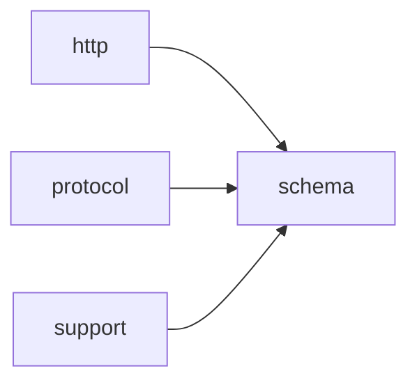

# Module `schema`

## Summary

`schema` 模块是 `clore::net` 库中负责生成和验证 `OpenAI` API 使用的 JSON Schema 定义的核心组件。它提供了一套类型特征和模板工具，用于在编译期识别 C++ 类型（如 `std::optional`、`std::vector`、`std::array`）并提取其内部元素类型，从而自动构造对应的 schema 结构。模块内部实现了从类型到 JSON 对象的映射、schema 名称的净化、必填属性校验以及任意类型组合（`anyOf`）的处理，最终通过公开函数 `response_format` 和 `function_tool` 将模式暴露给上层调用者。

在公开范围内，模块拥有两套主要实现：一套位于 `clore::net::openai::schema` 命名空间下，专注于 `OpenAI` 专有格式的 schema 构造与验证（包括顶层对象、数组、标量和可空类型的处理）；另一套位于 `clore::net::schema` 命名空间下，提供更通用的响应格式和工具定义接口。此外，模块还包含用于验证 JSON 值和对象是否符合预定义 schema 的验证函数，这些函数对外返回整数状态码，供调用者判断 schema 是否有效。

## Imports

- [`http`](../http/index.md)
- [`protocol`](../protocol/index.md)
- `std`
- [`support`](../support/index.md)

## Imported By

- [`agent:tools`](../agent/tools.md)
- [`anthropic`](../anthropic/index.md)
- [`client`](../client/index.md)
- [`openai`](../openai/index.md)
- [`provider`](../provider/index.md)

## Dependency Diagram

## Types

### `clore::net::openai::schema::detail::array_inner`

Declaration: `network/schema.cppm:72`

Declaration: [`Namespace clore::net::openai::schema::detail`](../../namespaces/clore/net/openai/schema/detail/index.md)

该结构体是用于内部实现的模板，类型参数 `T` 代表数组内元素的类型。它直接作为 `array_inner` 本身存在，不承载额外成员或基类，而是通过其自身的类型身份在 schema 描述中标记数组的内部结构层次。任何对 `array_inner` 的访问均直接通过类型 `T` 进行，不引入额外的状态或约束，从而保持数组内层表示与元素类型之间的静态关联。

### `clore::net::openai::schema::detail::is_array`

Declaration: `network/schema.cppm:63`

Definition: `network/schema.cppm:63`

Declaration: [`Namespace clore::net::openai::schema::detail`](../../namespaces/clore/net/openai/schema/detail/index.md)

类型特征 `clore::net::openai::schema::detail::is_array` 是 `std::false_type` 的直接派生类。该模板接受一个类型参数 `T`，其 `value` 成员常量恒为 `false`，作为默认的“非数组”判别。该结构体不定义任何额外成员或保持特殊不变式；其唯一作用是为后续通过模板特化实现特定类型（如数组类型）的 `value` 为 `true` 提供基础。它专用于内部 SFINAE 或标签分发场景，避免与标准库的 `std::is_array` 冲突，并确保在未显式特化的情况下所有类型均被视为非数组。

#### Invariants

- 对于任意类型 `T`，`is_array<T>::value` 恒为 `false`（基础模板）
- 无其他约束或保证

#### Key Members

- 继承的静态成员 `value`（类型 `bool`，值为 `false`）

#### Usage Patterns

- 作为编译时谓词用于类型检查或 SFINAE 上下文
- 可被特化以区分数组类型与非数组类型
- 其他特征或代码依赖其 `value` 进行条件编译

### `clore::net::openai::schema::detail::is_optional`

Declaration: `network/schema.cppm:23`

Definition: `network/schema.cppm:23`

Declaration: [`Namespace clore::net::openai::schema::detail`](../../namespaces/clore/net/openai/schema/detail/index.md)

`is_optional` 是一个模板类型特征，默认定义继承自 `std::false_type`，因此其静态成员 `value` 恒为 `false`。该特征的实际用途是作为基础模板，通过显式特化来识别 `std::optional` 等包装类型—当前实现仅包含未特化的默认情形，未提供任何额外的成员或逻辑。

#### Invariants

- 对于任意未特化的类型 `T`，`is_optional<T>::value` 恒为 `false`。
- 主模板不提供任何自定义成员或嵌套类型，仅继承 `std::false_type` 的接口。

#### Key Members

- 继承自 `std::false_type` 的静态常量 `value`
- 继承自 `std::false_type` 的 `value_type` 和 `type` 别名

#### Usage Patterns

- 在其他模板元编程中用作类型约束或条件分支的基础，例如 `if constexpr (is_optional<T>::value)`。
- 可作为特化模板（如针对 `std::optional`、`std::unique_ptr` 等）的基类，通过启用模板特化来标记特定类型为 optional。

### `clore::net::openai::schema::detail::is_vector`

Declaration: `network/schema.cppm:43`

Definition: `network/schema.cppm:43`

Declaration: [`Namespace clore::net::openai::schema::detail`](../../namespaces/clore/net/openai/schema/detail/index.md)

`clore::net::openai::schema::detail::is_vector` 是一个模板类型特征，其默认实现继承自 `std::false_type`，表示对于任意未特化的 `T`，该类型不是向量。该结构体仅作为标记基类存在，不引入任何额外成员或虚函数，其唯一目的是为后续的模板特化提供统一的判别接口。内部不变量即为 `value` 恒为 `false`（除非通过显式特化覆盖），这使得它在类型萃取中可作为编译期布尔常量使用。

#### Invariants

- For any unspecialized type `T`, `is_vector<T>::value` is `false`.
- Specializations for `std::vector` (or user-defined vector types) override `value` to `true`.
- The trait is intended for use in compile-time type introspection and SFINAE contexts.

#### Key Members

- Inherited `value` (static constexpr bool) from `std::false_type`.
- Inherited `type` (typedef for `std::false_type`) from `std::false_type`.

#### Usage Patterns

- Used as a base for type-disambiguation via partial or full specialization (e.g., `template<typename T> struct is_vector<std::vector<T>> : std::true_type {}`).
- Leveraged in conditionals like `if constexpr` or `std::enable_if` to activate code paths only for vector types.
- Expected to be queried by other traits or template metafunctions within the `clore::net::openai::schema` namespace.

### `clore::net::openai::schema::detail::optional_inner`

Declaration: `network/schema.cppm:32`

Declaration: [`Namespace clore::net::openai::schema::detail`](../../namespaces/clore/net/openai/schema/detail/index.md)

`clore::net::openai::schema::detail::optional_inner` 是一个模板结构体，模板参数为 `T`，位于实现细节命名空间内。它作为 `optional` 类型的核心内部存储组件，封装了对 `T` 值的生命周期管理。其内部结构通常由一个未初始化的对齐存储区域和一个布尔标志组成，该标志指示存储区域是否已构造一个活的 `T` 对象。关键的成员实现包括默认构造函数（将标志置为假）、构造和析构函数（通过放置 `new` 和显式析构调用来管理对象的创建与销毁），以及复制和移动操作（正确转移或复制底层值并同步标志状态）。不变量要求标志与存储的活跃状态始终一致，且所有值访问操作都必须在标志为真的前提下进行，从而保证仅当对象存在时才被访问。

### `clore::net::openai::schema::detail::schema_subject`

Declaration: `network/schema.cppm:83`

Definition: `network/schema.cppm:83`

Declaration: [`Namespace clore::net::openai::schema::detail`](../../namespaces/clore/net/openai/schema/detail/index.md)

该类是一个空结构体，仅通过成员别名 `type` 提供类型变换。其内部结构不包含任何数据成员或运行时状态，唯一的编译期成员 `type` 通过 `std::remove_cvref_t<T>` 实现，移除了模板参数 `T` 的引用和 cv 限定符。该别名是结构体的核心，且由于 `std::remove_cvref_t` 是标准库提供的高效类型转换，`schema_subject` 自身仅作为类型计算的载体，不存在运行时不变式——它是纯编译期工具，其正确性完全由依赖的 `std::remove_cvref_t` 保证。

#### Invariants

- `type` is always `std::remove_cvref_t<T>`
- The struct has no runtime state or behavior
- The alias is valid for any complete type `T`

#### Key Members

- `using type = std::remove_cvref_t<T>`

#### Usage Patterns

- Used by other schema classes to normalize type arguments
- May be instantiated as a base class or nested type for type erasure
- Provides a consistent way to obtain a canonical type from `T`

### `clore::net::openai::schema::detail::schema_subject_t`

Declaration: `network/schema.cppm:95`

Declaration: [`Namespace clore::net::openai::schema::detail`](../../namespaces/clore/net/openai/schema/detail/index.md)

类型别名 `clore::net::openai::schema::detail::schema_subject_t<T>` 是模板 `schema_subject<T>` 的 `type` 成员的直接别名，用于提取与 `T` 关联的模式主体类型。它属于 `detail` 命名空间，是内部实现的一部分，依赖于 `schema_subject` 模板的特化：对于每个模板参数 `T`，必须存在对应的 `schema_subject<T>` 特化，且该特化必须定义一个有效的嵌套类型 `type`，否则该别名将导致编译错误。该别名简化了对该元函数结果的访问，避免了在外部代码中反复书写 `typename schema_subject<T>::type`。

#### Invariants

- 必须存在 `schema_subject<T>::type` 定义
- 别名的解析结果由 `schema_subject` 特化决定
- 不保证对所有 `T` 均有效

#### Key Members

- `schema_subject<T>::type` 成员类型

#### Usage Patterns

- 作为便捷名称替代冗长的 `typename schema_subject<T>::type`
- 在模板元编程中统一对外暴露类型

### `clore::net::openai::schema::detail::vector_inner`

Declaration: `network/schema.cppm:52`

Declaration: [`Namespace clore::net::openai::schema::detail`](../../namespaces/clore/net/openai/schema/detail/index.md)

The struct `clore::net::openai::schema::detail::vector_inner` is a templated internal utility, parameterized by `T`. It provides the foundational storage and iteration machinery for vector-like representations within the schema implementation. Its invariants typically ensure contiguous element layout and proper lifetime management, with member functions that handle allocation, resizing, and element access without exposing ownership or allocation policy to external users.

#### Invariants

- 未从证据中提取到明确的不变性

#### Key Members

- 无已知的成员、嵌套类型或方法

#### Usage Patterns

- 未从证据中提取到使用模式

## Variables

### `clore::net::openai::schema::detail::is_array_v`

Declaration: `network/schema.cppm:69`

Declaration: [`Namespace clore::net::openai::schema::detail`](../../namespaces/clore/net/openai/schema/detail/index.md)

It is a compile-time type trait, likely used alongside `is_optional_v` and `is_vector_v` to categorize types during schema generation and validation logic.

#### Mutation

No mutation is evident from the extracted code.

### `clore::net::openai::schema::detail::is_optional_v`

Declaration: `network/schema.cppm:29`

Declaration: [`Namespace clore::net::openai::schema::detail`](../../namespaces/clore/net/openai/schema/detail/index.md)

Declared at `network/schema.cppm:29` as a compile-time constant. Its value is computed based on the template parameter `T` and is used to drive conditional logic in schema validation or serialization.

#### Mutation

No mutation is evident from the extracted code.

### `clore::net::openai::schema::detail::is_vector_v`

Declaration: `network/schema.cppm:49`

Declaration: [`Namespace clore::net::openai::schema::detail`](../../namespaces/clore/net/openai/schema/detail/index.md)

该变量作为编译时类型特征，参与 `clore::net::openai::schema` 命名空间内与 JSON Schema 生成相关的元编程逻辑。它通过检查类型是否为 `std::vector` 来指导后续的 Schema 序列化或类型映射行为。

#### Mutation

No mutation is evident from the extracted code.

#### Usage Patterns

- 作为编译时布尔常量用于判断类型是否为 `std::vector`
- 参与模板特化或条件编译中的类型筛选

## Functions

### `clore::net::detail::validate_response_format`

Declaration: `network/schema.cppm:527`

Definition: `network/schema.cppm:535`

Declaration: [`Namespace clore::net::detail`](../../namespaces/clore/net/detail/index.md)

该函数首先判断参数 `format.schema` 是否为空，若为空则直接返回成功，表明无需进一步验证。若模式存在，则检查 `format.name` 是否为空字符串，若为空则返回一个包含 `LLMError` 的错误结果。通过这两项前置检查后，最终委托给 `openai::schema::detail::validate_openai_schema` 进行递归验证，传入解引用后的模式对象、名称以及固定值 `true` 作为 `is_root` 参数。整个流程依赖 `ResponseFormat` 的内部结构定义以及 `validate_openai_schema` 的复杂校验逻辑。

#### Side Effects

No observable side effects are evident from the extracted code.

#### Reads From

- `format.schema`
- `format.name`
- the contents of `*format.schema` via `openai::schema::detail::validate_openai_schema`

#### Usage Patterns

- validating a response format before sending a request
- ensuring response format constraints are satisfied

### `clore::net::detail::validate_tool_definition`

Declaration: `network/schema.cppm:529`

Definition: `network/schema.cppm:545`

Declaration: [`Namespace clore::net::detail`](../../namespaces/clore/net/detail/index.md)

函数 `clore::net::detail::validate_tool_definition` 首先进行两项快速前提检查：如果 `tool.name` 为空，则返回 `LLMError("tool name must not be empty")`；如果 `tool.description` 为空，则返回包含 `std::format` 格式化消息的 `LLMError`。若均通过，则将 `tool.parameters`、`tool.name` 作为路径标识符和布尔值 `true` 一并委托给 `openai::schema::detail::validate_openai_schema` 执行核心验证。整个实现依赖 `LLMError` 错误类型和 `OpenAPI` schema 验证模块的内部逻辑，自身仅承担边界条件校验与参数传递的职责。

#### Side Effects

No observable side effects are evident from the extracted code.

#### Reads From

- tool`.name`
- tool`.description`
- tool`.parameters` (via `openai::schema::detail::validate_openai_schema`)

#### Usage Patterns

- Validate tool definitions before registering them
- Used in tool definition processing pipeline

### `clore::net::openai::schema::detail::make_any_of_schema`

Declaration: `network/schema.cppm:156`

Definition: `network/schema.cppm:156`

Declaration: [`Namespace clore::net::openai::schema::detail`](../../namespaces/clore/net/openai/schema/detail/index.md)

该函数通过构造一个 JSON 对象来生成 `anyOf` 架构。算法首先调用 `clore::net::detail::make_empty_object` 创建一个空对象，若失败则立即返回错误。接着调用 `clore::net::detail::make_empty_array` 创建一个空数组，同样处理失败情况。随后遍历输入的 `choices` 向量，将每个元素移动至数组中。最后将数组以键 `"anyOf"` 插入对象，并以 `json::Value` 形式返回对象。控制流完全围绕两个辅助构造函数的错误传播展开，不依赖其他内部 schema 生成逻辑。

#### Side Effects

No observable side effects are evident from the extracted code.

#### Reads From

- parameter `choices` (by value)

#### Writes To

- local variables `object` and `any_of`
- returned `json::Value`

#### Usage Patterns

- Used to assemble an `anyOf` schema from a list of sub-schemas
- Called when generating `OpenAI`-compatible schema representations

### `clore::net::openai::schema::detail::make_scalar_type_schema`

Declaration: `network/schema.cppm:146`

Definition: `network/schema.cppm:146`

Declaration: [`Namespace clore::net::openai::schema::detail`](../../namespaces/clore/net/openai/schema/detail/index.md)

该函数接收一个表示标量类型名称的 `std::string_view` 参数 `type_name`，并生成对应的 JSON Schema 对象。它首先调用 `clore::net::detail::make_empty_object` 创建一个空的 `json::Object` 实例，如果创建失败则直接返回错误；成功后在对象中插入一个键为 `"type"`、值为 `type_name` 的字段，最后将整个对象包装为 `json::Value` 返回。整个实现仅依赖 `make_empty_object` 辅助函数，控制流清晰且只有一次条件检查，无分支或循环逻辑。

#### Side Effects

- 动态内存分配用于创建 `json::Object`
- 修改所创建的 `json::Object`（插入键值对）

#### Reads From

- 参数 `type_name`（`std::string_view`）

#### Writes To

- 新创建的 `json::Object`，最终以 `json::Value` 形式返回

#### Usage Patterns

- 被高层 schema 构建函数（如 `make_schema_object`、`make_schema_value`）调用，将基础 C++ 类型映射为 `OpenAI` 兼容的 schema 格式

### `clore::net::openai::schema::detail::make_schema_object`

Declaration: `network/schema.cppm:132`

Definition: `network/schema.cppm:132`

Declaration: [`Namespace clore::net::openai::schema::detail`](../../namespaces/clore/net/openai/schema/detail/index.md)

`make_schema_object` 首先委托给 `make_schema_value<T>` 生成一个完整的 JSON schema 值。若该调用失败（返回 `std::unexpected`），则直接向上传递错误；否则，从成功值中提取 `json::Object` 指针。若提取出的指针为 `nullptr`（即顶层值不是对象），则构造一个 `LLMError` 并返回失败。否则，通过拷贝构造返回该 `json::Object`。整个流程不执行任何额外的验证或转换——所有 schema 构建、类型特化、名称清理以及可选的 `anyOf`/`array`/`object` 填充均由 `make_schema_value` 在内部完成，`make_schema_object` 仅负责将结果格式化为一个完整的顶层对象，并确保根节点为对象类型。

#### Side Effects

No observable side effects are evident from the extracted code.

#### Reads From

- template parameter `T` via `make_schema_value<T>()`
- result of `make_schema_value<T>()`
- `json::Object` pointer obtained from the value

#### Usage Patterns

- called when generating a JSON schema object for a type `T`
- used in schema construction pipeline alongside `make_schema_value` and `populate_object_schema`

### `clore::net::openai::schema::detail::make_schema_value`

Declaration: `network/schema.cppm:129`

Definition: `network/schema.cppm:225`

Declaration: [`Namespace clore::net::openai::schema::detail`](../../namespaces/clore/net/openai/schema/detail/index.md)

函数 `clore::net::openai::schema::detail::make_schema_value` 根据模板参数 `T` 的编译期类型特征，通过一系列 `if constexpr` 分支选择对应的 JSON Schema 生成路径。首先通过 `schema_subject_t<T>` 解析出实际的目标类型，然后依次匹配：标量类型（`std::string`、`std::string_view`、`bool`、整数、浮点数）直接调用 `make_scalar_type_schema` 并传入对应的类型名称；`std::optional` 类型则递归调用自身生成内部类型的 schema，再构造一个 `null` 类型 schema，最后通过 `make_any_of_schema` 将二者组合为一个 `anyOf` 结构；`std::vector` 和 `std::array` 类型先递归生成元素类型的 schema，然后构造一个包含 `type:"array"`、`items` 字段的 JSON 对象，对于 `std::array` 还会额外设置 `minItems` 和 `maxItems` 约束为固定长度；对于可反射（`meta::reflectable_class`）的结构体类型，则新建空 JSON 对象，并借助 `populate_object_schema` 使用 `std::make_index_sequence` 遍历所有字段填充属性；其余未支持的类型会触发 `static_assert` 编译错误。

控制流中关键依赖包括：类型萃取 `is_optional_v`、`is_vector_v`、`is_array_v` 及对应的 `inner` traits（`optional_inner_t`、`vector_inner_t`、`array_inner_t`）；辅助函数 `make_scalar_type_schema`、`make_any_of_schema`、`populate_object_schema`；以及 JSON 工具函数 `clore::net::detail::make_empty_object`。递归发生在 `std::optional`、`std::vector`、`std::array` 三种容器类型的内部元素生成中，确保 schema 构建能够层层展开直到基元类型。

#### Side Effects

- Allocates and populates `json::Object` instances
- Inserts key-value pairs into JSON objects
- Moves ownership of intermediate values and error states

#### Writes To

- Returned `json::Value` object representing the generated schema

#### Usage Patterns

- Used internally by `OpenAI` schema generation to produce `json::Value` for a given C++ type
- Called recursively for nested container and optional types
- Expected to be consumed by higher-level schema assembly functions

### `clore::net::openai::schema::detail::populate_object_schema`

Declaration: `network/schema.cppm:173`

Definition: `network/schema.cppm:173`

Declaration: [`Namespace clore::net::openai::schema::detail`](../../namespaces/clore/net/openai/schema/detail/index.md)

The function iterates over the index sequence `Indices...`, invoking a lambda `append_field` for each index. Inside the lambda, it uses `meta_attrs::resolve_field<Object, index>` to obtain the field’s schema metadata; if the field is skipped it returns early, and if it is flattened it returns an error (flattening is unsupported for automatic `OpenAI` schema generation). Otherwise, it calls `make_schema_value<field_type>` to create a JSON schema value for the field’s type, inserts the result into the `properties` object under the field’s canonical name, and pushes that name into the `required` array. The statuses of all field operations are collected into an `array` and checked; any failure causes an immediate `std::unexpected` return. On success, the function populates the supplied `object` with the keys `"type": "object"`, `"properties"`, `"required"`, and `"additionalProperties": false`, and returns an empty expected.

Dependencies include `meta_attrs::validate_field_schema` (used for a compile‑time assertion on field name validity), `meta_attrs::resolve_field`, `make_schema_value`, and the utility functions `make_empty_object` / `make_empty_array` from `clore::net::detail`. The control flow is strictly sequential per field, with early exit on any error, ensuring the generated JSON object conforms to the `OpenAI` schema specification.

#### Side Effects

- 修改传入的 `json::Object` 引用，插入 `type`、`properties`、`required` 和 `additionalProperties` 键
- 通过 `make_empty_object` 和 `make_empty_array` 分配新的 JSON 节点
- 调用 `make_schema_value` 可能进一步分配 JSON 节点
- 返回错误值时，错误对象 `LLMError` 包含堆内存分配

#### Reads From

- 模板参数 `Object` 的编译时元数据（通过 `meta_attrs::validate_field_schema` 和 `meta_attrs::resolve_field`）
- 索引序列 `Indices` 用于展开字段处理
- 传入的 `json::Object` 引用（实际内容不用于决策，仅作为写入目标）

#### Writes To

- 传入的 `json::Object` 引用（经过修改）

#### Usage Patterns

- 在自动生成 `OpenAI` schema 时用于处理结构体类型
- 与 `make_schema_value` 一起为每个字段创建 schema
- 通常在 `detail` 命名空间的更高层 schema 生成函数中被调用

### `clore::net::openai::schema::detail::sanitize_schema_name`

Declaration: `network/schema.cppm:97`

Definition: `network/schema.cppm:97`

Declaration: [`Namespace clore::net::openai::schema::detail`](../../namespaces/clore/net/openai/schema/detail/index.md)

该函数逐一处理输入字符串 `raw_name` 中的每个字符。对于每个字符 `ch`，它先将 `ch` 转换为 `unsigned char` 并保存在局部变量 `unsigned_ch` 中，然后检查该值是否属于字母数字范围（`'a'`–`'z'`、`'A'`–`'Z'` 或 `'0'`–`'9'`）。如果属于，则直接将原字符追加到结果字符串 `sanitized` 中；否则，将下划线字符 `'_'` 追加到 `sanitized` 中。遍历完成后，函数依次移除 `sanitized` 开头的所有连续下划线（通过 `erase`）和末尾的所有连续下划线（通过 `pop_back`）。整个过程中，`sanitized` 预先通过 `reserve` 分配了与 `raw_name` 等长的存储空间，以减少重分配。该算法不依赖任何外部库或同一模块中的其他函数，仅使用标准字符串操作与字符分类逻辑。

#### Side Effects

No observable side effects are evident from the extracted code.

#### Reads From

- 参数 `raw_name`

#### Usage Patterns

- 用于清理模式名称以符合标识符规则
- 在生成模式对象时作为辅助函数调用

### `clore::net::openai::schema::detail::schema_type_name`

Declaration: `network/schema.cppm:120`

Definition: `network/schema.cppm:120`

Declaration: [`Namespace clore::net::openai::schema::detail`](../../namespaces/clore/net/openai/schema/detail/index.md)

该函数为模板类型 `T` 计算一个适用于 JSON Schema 的规范化类型名称。其核心流程是利用 `meta::type_name<T>()` 获取类型的原始名称字符串，然后调用 `sanitize_schema_name` 进行净化处理，移除或替换掉非法或冗余的字符（如命名空间分隔符和模板参数标记）。如果净化结果为空字符串，则立即返回包含 `LLMError` 的 `std::unexpected`，表示无法生成有效的模式名称；否则返回净化后的字符串。整个实现完全依赖 `sanitize_schema_name` 与 `meta::type_name<T>()` 两个内部设施，不涉及任何外部状态或复杂分支。

#### Side Effects

No observable side effects are evident from the extracted code.

#### Reads From

- `meta::type_name<T>()`

#### Usage Patterns

- Generating schema type names for template types within the schema generation pipeline

### `clore::net::openai::schema::detail::validate_openai_schema`

Declaration: `network/schema.cppm:328`

Definition: `network/schema.cppm:373`

Declaration: [`Namespace clore::net::openai::schema::detail`](../../namespaces/clore/net/openai/schema/detail/index.md)

该函数接收一个 JSON 对象、路径字符串和根标志，递归验证其是否符合 `OpenAI` Schema 的结构约束。内部流程首先检查 `anyOf` 字段：若存在且当前为根节点则直接报错，否则遍历数组中的每个子模式，通过委托 `validate_openai_schema_value` 进行递归校验。随后提取 `type`，支持字符串或字符串数组形式，数组时会调用 `validate_schema_array_of_types` 验证并取第一个非 `"null"` 类型作为主类型；根节点的 `type` 必须为 `"object"`。对于 `"object"` 类型，要求 `properties`、`required` 和 `additionalProperties` 均存在，且 `additionalProperties` 必须为 `false`，然后调用 `validate_required_properties` 确保所有 `required` 中的键存在于 `properties` 中，并对每个属性的值递归调用 `validate_openai_schema_value`。对于 `"array"` 类型，验证 `items` 字段并递归校验。最后处理 `$defs` 字段，递归验证所有定义。该函数依赖 `validate_openai_schema_value`、`validate_schema_array_of_types`、`validate_required_properties` 以及 JSON 对象视图和数组校验的辅助函数。

#### Side Effects

No observable side effects are evident from the extracted code.

#### Reads From

- `const json::Object& object`
- `std::string_view path`
- `bool is_root`
- `clore::net::detail::ObjectView`
- internal helper functions such as `validate_openai_schema_value`, `expect_array`, `expect_object`, `validate_required_properties`

#### Usage Patterns

- Called recursively for nested schemas and sub-schemas
- Invoked in the `OpenAI` schema validation pipeline

### `clore::net::openai::schema::detail::validate_openai_schema_value`

Declaration: `network/schema.cppm:331`

Definition: `network/schema.cppm:331`

Declaration: [`Namespace clore::net::openai::schema::detail`](../../namespaces/clore/net/openai/schema/detail/index.md)

该函数首先通过 `clore::net::detail::expect_object` 尝试将输入的 `value` 解释为 JSON 对象。若解释失败，则直接返回其携带的错误；否则解引用返回的 `json::Object` 引用，并委派给同命名空间下的 `validate_openai_schema` 进行后续校验。整条路径的上下文（`path`）以及是否为根模式的标记（`is_root`）同时传递给子调用，确保错误报告和递归校验的语义一致。其核心依赖是 `expect_object` 的类型检查和 `validate_openai_schema` 的对象结构验证逻辑。

#### Side Effects

No observable side effects are evident from the extracted code.

#### Reads From

- const `json::Value`& value
- `std::string_view` path
- bool `is_root`

#### Usage Patterns

- used to validate a JSON value as an `OpenAI` schema object
- called by overloads that take a `json::Cursor` instead of `json::Value`

### `clore::net::openai::schema::detail::validate_openai_schema_value`

Declaration: `network/schema.cppm:340`

Definition: `network/schema.cppm:340`

Declaration: [`Namespace clore::net::openai::schema::detail`](../../namespaces/clore/net/openai/schema/detail/index.md)

该函数负责将传入的 JSON 光标解包为 JSON 对象，然后委托给核心验证流程。内部首先调用 `clore::net::detail::expect_object` 从 `json::Cursor` 中提取 `json::Object`，若提取失败（例如光标不指向对象）则直接返回错误。成功后将得到的对象、路径和 `is_root` 标志转发给 `validate_openai_schema`。整个函数扮演简单的适配器角色，自身不包含额外的验证逻辑，主要依赖 `expect_object` 进行类型检查并依赖 `validate_openai_schema` 完成语义验证。

#### Side Effects

No observable side effects are evident from the extracted code.

#### Reads From

- `json::Cursor value` (the JSON cursor being validated)
- `std::string_view path` (the path used for error messages)
- `bool is_root` (indicates if the schema is at the root level)
- The underlying JSON value accessed through the cursor

#### Usage Patterns

- Wraps cursor-to-object conversion for schema validation
- Delegates to `validate_openai_schema` after extracting the object
- Used in the schema validation chain
- Handles error propagation from `expect_object`

### `clore::net::openai::schema::detail::validate_required_properties`

Declaration: `network/schema.cppm:349`

Definition: `network/schema.cppm:349`

Declaration: [`Namespace clore::net::openai::schema::detail`](../../namespaces/clore/net/openai/schema/detail/index.md)

该函数的核心算法是构建一个无序集合存储 `required` 数组中的所有字段名，然后遍历 `properties` 映射的每个键并验证它是否出现在该集合中。控制流依赖于两个输入容器的顺序遍历：首先通过 `clore::net::detail::expect_string` 将 `required` 中的每个 JSON 值转换为字符串，失败时提前返回 `std::unexpected`；接着用 `required_names.contains` 检查每个属性键，若不存在则返回格式化错误。整个函数无额外状态变量，仅依赖 `std::unordered_set` 实现 O(n) 的哈希查找，确保所有属性都被标记为必需，以满足 strict structured output 的约束。

#### Side Effects

No observable side effects are evident from the extracted code.

#### Reads From

- `clore::net::detail::ObjectView properties`
- `clore::net::detail::ArrayView required`
- `std::string_view path`
- each element of `required` via `clore::net::detail::expect_string`

#### Usage Patterns

- called during schema validation to enforce strict mode requirement
- ensures all properties are referenced in the required array

### `clore::net::openai::schema::detail::validate_schema_array_of_types`

Declaration: `network/schema.cppm:295`

Definition: `network/schema.cppm:295`

Declaration: [`Namespace clore::net::openai::schema::detail`](../../namespaces/clore/net/openai/schema/detail/index.md)

函数 `clore::net::openai::schema::detail::validate_schema_array_of_types` 遍历输入的 JSON 数组，验证其中包含的“类型联合”模式是否符合仅允许一个非 `"null"` 类型加可选的 `"null"` 的约定。对于每个数组元素，它调用 `clore::net::detail::expect_string` 提取类型字符串：若遇到 `"null"` 则设置 `saw_null` 标志并跳过；否则检查 `primary_type` 是否已赋值，若已赋值则说明出现了第二个非空类型，立即返回包含格式化错误消息的 `std::unexpected`。遍历结束后，若 `is_root` 为 `true` 则报错（根模式禁止可空性），否则若 `primary_type` 缺失或 `saw_null` 为 `false` 也报错。只有当一个非空类型和 `"null"` 都出现时才返回空的 `std::expected` 表示验证成功。该函数完全依赖 `clore::net::detail::expect_string` 提取类型字符串，并使用 `std::format` 和 `LLMError` 构造并报告验证失败信息。

#### Side Effects

No observable side effects are evident from the extracted code.

#### Reads From

- `array` parameter (const `json::Array&`)
- `path` parameter (`std::string_view`)
- `is_root` parameter (`bool`)
- via `clore::net::detail::expect_string` on each array element (reads the JSON value as a string)

#### Usage Patterns

- Called when the `type` field of a schema is an array (e.g., `["string", "null"]`)
- Used by higher-level validation functions like `clore::net::openai::schema::detail::validate_openai_schema`
- Ensures compliance with `OpenAI` schema constraints on type unions

### `clore::net::schema::function_tool`

Declaration: `network/schema.cppm:520`

Definition: `network/schema.cppm:584`

Declaration: [`Namespace clore::net::schema`](../../namespaces/clore/net/schema/index.md)

该函数首先通过 `openai::schema::detail::schema_subject_t<T>` 推导出根类型 `root_type`，并利用静态断言确保该类型满足 `kota::meta::reflectable_class` 约束，随后检查输入参数 `name` 与 `description` 的非空性，若为空则直接返回一个包含 `LLMError` 的未预期结果。核心流程委托给 `openai::schema::detail::make_schema_object<root_type>()`，该调用负责根据可反射的根类型递归构建一个符合 `OpenAI` 函数工具规范的 JSON Schema 对象；若构建失败（例如内部类型无法映射）则传播错误。成功后组装一个 `FunctionToolDefinition`，将 `name`、`description`、生成的 `parameters` schema 以及固定为 `true` 的 `strict` 字段一并返回。该函数整体依赖 `clore::net::openai::schema::detail` 命名空间下的类型萃取（如 `schema_subject_t`）和 Schema 生成基础设施，以及编译期反射元数据。

#### Side Effects

- 动态分配内存用于创建模式对象
- 移动传入的 `name` 和 `description` 字符串所有权
- 转移局部 `schema` 对象的所有权到返回值

#### Reads From

- 参数 `name`
- 参数 `description`
- 模板类型参数 `T` 的反射信息

#### Writes To

- 返回的 `FunctionToolDefinition` 结构体中的 `name`、`description`、`parameters` 和 `strict` 字段

#### Usage Patterns

- 用于自动生成 LLM 函数调用的工具定义
- 调用者传入函数名称、描述和可反射的类型来定义工具模式

### `clore::net::schema::response_format`

Declaration: `network/schema.cppm:517`

Definition: `network/schema.cppm:561`

Declaration: [`Namespace clore::net::schema`](../../namespaces/clore/net/schema/index.md)

函数 `clore::net::schema::response_format` 首先通过类型别名 `openai::schema::detail::schema_subject_t<T>` 推导根类型 `root_type`，并静态断言该类型满足 `kota::meta::reflectable_class` 约束。内部实现完全依赖 `openai::schema::detail` 命名空间下的辅助函数：先调用 `schema_type_name<root_type>` 生成模式名称，再调用 `make_schema_object<root_type>` 生成 JSON Schema 对象；两者均可能返回 `std::expected` 错误，若任一失败，函数立即返回包含错误信息的 `std::unexpected`。成功获取名称和模式后，函数构造一个 `ResponseFormat` 对象，将 `name` 和 `schema` 属性移动赋值，并将 `strict` 属性固定为 `true`，最终返回该对象。流程为线性顺序执行，无分支或循环，依赖项集中 `OpenAI` 模式生成工具链与 `kota::meta` 反射元数据层。

#### Side Effects

No observable side effects are evident from the extracted code.

#### Reads From

- 模板参数 `T` 的元类型信息（通过 `openai::schema::detail::schema_subject_t`、`schema_type_name` 和 `make_schema_object` 读取）

#### Writes To

- 返回的 `std::expected<ResponseFormat, LLMError>` 对象（包括内部的 `ResponseFormat` 字段 `name`、`schema`、`strict`）

#### Usage Patterns

- 在需要为可反射类型自动生成 LLM 结构化输出模式时调用
- 结合 `clore::net::schema::function_tool` 等函数使用，为工具调用提供模式

## Internal Structure

`schema` 模块是 `clore::net` 库中专用于生成与验证 `OpenAI` API JSON Schema 的组件。它导入 `std`、`support`（提供字符串工具与类型转换）、`http`（网络层基础设施）和 `protocol`（消息与响应格式定义），从而将 C++ 类型结构映射为符合 `OpenAI` 规范的 schema 对象。模块内部主要分为两层：公开的 `clore::net::schema` 命名空间提供 `response_format` 和 `function_tool` 模板函数，供上层调用方获取指定类型的 schema 或工具定义；实现细节集中在 `clore::net::openai::schema::detail` 命名空间，包含一系列编译期类型特征（如 `is_vector`、`is_optional`、`is_array`）和内层类型萃取（`vector_inner`、`optional_inner`、`array_inner`），用于递归剥除容器包装并提取基础类型。

在实现结构上，这些类型特征驱动一系列 schema 构建函数（如 `make_schema_object`、`make_scalar_type_schema`、`make_any_of_schema`、`populate_object_schema`）生成 JSON schema 的各个部分，同时配合验证函数（如 `validate_openai_schema`、`validate_openai_schema_value`、`validate_required_properties`）对最终 JSON 对象进行合规性检查。`sanitize_schema_name` 负责将原始名称清理为合法标识符，而 `schema_subject` 则递归定位需要描述的类型。整个模块通过细致的编译期类型内省与运行时构建/验证分离的设计，实现了从 C++ 类型到 `OpenAI` schema 的无缝转换，并为上层协议层提供了简洁的类型驱动的 API。

## Related Pages

- [Module http](../http/index.md)
- [Module protocol](../protocol/index.md)
- [Module support](../support/index.md)

