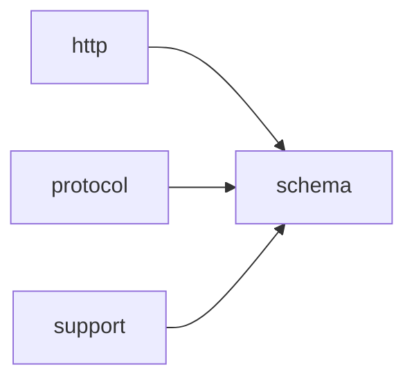

# Module `schema`

## Summary

`schema` 模块提供了将 C++ 类型映射为 `OpenAI` 兼容 JSON Schema 的能力，用于结构化输出和工具调用。它在 `clore::net::schema` 下公开了 `response_format` 和 `function_tool` 模板函数作为主要入口，同时在 `clore::net::openai::schema::detail` 内部封装了类型萃取（如 `is_optional`、`is_vector`、`schema_subject`）、模式构建（`make_schema_object`、`make_scalar_type_schema`、`populate_object_schema`）和验证（`validate_openai_schema`、`validate_required_properties`）等实现细节。该模块确保生成的结构化模式符合 `OpenAI` API 规范，并依赖 `http`、`protocol` 和 `support` 模块完成网络交互与协议处理。

## Imports

- [`http`](../http/index.md)
- [`protocol`](../protocol/index.md)
- [`support`](../support/index.md)

## Imported By

- [`agent:tools`](../agent/tools.md)
- [`anthropic`](../anthropic/index.md)
- [`client`](../client/index.md)
- [`openai`](../openai/index.md)
- [`provider`](../provider/index.md)

## Dependency Diagram

```mermaid
graph LR
    M0["schema"]
    I0["http"]
    I0 --> M0
    I1["protocol"]
    I1 --> M0
    I2["support"]
    I2 --> M0
```

## Types

### `clore::net::openai::schema::detail::array_inner`

Declaration: `src/network/schema.cppm:82`

Declaration: [`Namespace clore::net::openai::schema::detail`](../../namespaces/clore/net/openai/schema/detail/index.md)

struct `clore::net::openai::schema::detail::array_inner` 是一个模板结构体，位于 `detail` 命名空间，用于作为实现细节，支持对 JSON Schema 数组中元素类型的处理。它可能存储或推导与元素类型 `T` 相关的类型信息，其具体实现在模块 `schema.cppm` 中定义。该结构体的设计旨在封装数组内部元素类型的操作，避免暴露给外部使用者。

### `clore::net::openai::schema::detail::is_array`

Declaration: `src/network/schema.cppm:73`

Definition: `src/network/schema.cppm:73`

Declaration: [`Namespace clore::net::openai::schema::detail`](../../namespaces/clore/net/openai/schema/detail/index.md)

`clore::net::openai::schema::detail::is_array` 是一个模板结构体，继承自 `std::false_type`，作为默认实现，其静态常量 `value` 为 `false`。这表明对于未特化的类型 `T`，该类型特征指示 `T` 不是数组。该结构体旨在通过显式特化或部分特化来为数组类型提供 `true` 值，从而实现类型数组检测功能。其内部结构保持最小，仅依赖标准库类型特征基类来表达布尔结果。

#### Invariants

- 对于 primary template，`value` 始终为 `false`
- 继承自 `std::false_type`，符合 C++ traits 惯例
- 无运行时状态，仅在编译时使用

#### Key Members

- 继承的 `value` 成员（`false`）
- 继承的 `type` 类型别名（`std::false_type`）

#### Usage Patterns

- 用于编译时判断类型是否为数组，配合模板特化或 SFINAE
- 可能作为其他 traits 的基础或默认实现

### `clore::net::openai::schema::detail::is_optional`

Declaration: `src/network/schema.cppm:33`

Definition: `src/network/schema.cppm:33`

Declaration: [`Namespace clore::net::openai::schema::detail`](../../namespaces/clore/net/openai/schema/detail/index.md)

模板结构体 `clore::net::openai::schema::detail::is_optional` 的主定义继承自 `std::false_type`，因此其 `value` 静态成员常量在默认情况下为 `false`。该结构体不包含任何额外的成员变量、成员函数或虚函数，其全部行为完全由基类提供，内部不维护任何运行时状态。作为类型特征的基础默认值，它不依赖任何模板参数的特化结构，仅通过继承关系表达编译期常量。由于未提供任何显式特化，该定义仅作为通用占位符，实际对 `std::optional` 的检测通常通过针对 `std::optional` 的偏特化或全特化实现，但证据片段中并未包含这些特化。

#### Invariants

- Default value is `false` for all types unless a specialization overrides it
- Inherits from `std::false_type`
- Primary template itself provides no custom logic

#### Key Members

- Implicit static constant `value` (from `std::false_type`)
- Inherited `operator()` returning `false`

#### Usage Patterns

- Used in template metaprogramming to query if a type is optional
- Expected to be specialized for actual optional types (e.g., `std::optional`)
- Checked via `is_optional<T>::value` in conditional enable-if constructs

### `clore::net::openai::schema::detail::is_vector`

Declaration: `src/network/schema.cppm:53`

Definition: `src/network/schema.cppm:53`

Declaration: [`Namespace clore::net::openai::schema::detail`](../../namespaces/clore/net/openai/schema/detail/index.md)

The type trait template `clore::net::openai::schema::detail::is_vector<T>` inherits from `std::false_type` unconditionally, defining its static `value` member as `false` for all primary template instantiations.  Its sole invariant is that no special member functions, constructors, or conversion `operator`s are present; the struct acts purely as a compile‑time boolean constant sink.  The implementation relies on explicit specializations (not shown here) to rebind the base class to `std::true_type` for specific `T`, thereby enabling SFINAE‑based dispatch within the schema‑parsing machinery.

### `clore::net::openai::schema::detail::optional_inner`

Declaration: `src/network/schema.cppm:42`

Declaration: [`Namespace clore::net::openai::schema::detail`](../../namespaces/clore/net/openai/schema/detail/index.md)

`clore::net::openai::schema::detail::optional_inner` 是内部实现中用于承载可选值存储的模板结构体。它通过模板参数 `T` 泛化，内部通常维护一个标志位和一块原始存储区域，以确保仅在需要时构造和析构 `T` 对象。其关键不变性在于标志为真时存储区域包含有效对象，否则为空。重要成员包括底层的构造、析构及访问函数，这些函数由外部类通过友元或内部接口调用，以维持可选项的语义正确性。

#### Invariants

- 无已知不变性

#### Key Members

- 无公开成员

#### Usage Patterns

- 未在现有证据中明确描述

### `clore::net::openai::schema::detail::schema_subject`

Declaration: `src/network/schema.cppm:93`

Definition: `src/network/schema.cppm:93`

Declaration: [`Namespace clore::net::openai::schema::detail`](../../namespaces/clore/net/openai/schema/detail/index.md)

The template `clore::net::openai::schema::detail::schema_subject<T>` is a thin metafunction that exposes a single member alias `type`, defined as `std::remove_cvref_t<T>`. This derivation strips any top-level `const`, `volatile`, and reference qualifiers from the supplied type, yielding a canonical unqualified form. The struct itself serves as a implementation-level helper within the schema internals, likely to normalize types before further processing such as attribute generation or validation. No additional state or invariants are present; the sole purpose is to provide uniform access to the cleaned type through its `type` member.

#### Invariants

- `schema_subject<T>::type` 始终为移除 cv 限定符和引用后的类型

#### Key Members

- 类型别名 `type`

#### Usage Patterns

- 在 `clore::net::openai::schema` 内部用于获取模板参数的底层类型
- 用于构建或推导模式定义中的实际类型

### `clore::net::openai::schema::detail::schema_subject_t`

Declaration: `src/network/schema.cppm:105`

Declaration: [`Namespace clore::net::openai::schema::detail`](../../namespaces/clore/net/openai/schema/detail/index.md)

`clore::net::openai::schema::detail::schema_subject_t<T>` 是模板类 `schema_subject<T>` 内嵌类型成员 `type` 的纯类型别名。该别名的解析完全依赖于 `schema_subject` 特化对 `type` 的定义；其自身不定义任何数据、方法或约束。内部不变量隐含在 `schema_subject` 的各特化中：对于给定的 `T`，所暴露的 `type` 必须表示该类型在 `OpenAI` 模式层级中的对应主题类型，通常与 JSON Schema 的 `$defs` 或 `oneOf` 引用有关，且 `type` 不应是 `void` 或无法由模式系统处理的类型。该别名简化了外部对嵌套类型的访问，同时将主题类型的推导逻辑集中封装在 `schema_subject` 中，是模式生成流程中结构化的关键枢纽。

#### Invariants

- `schema_subject<T>` 必须为每个使用到的 `T` 提供有效的 `type` 嵌套类型
- 别名自身不引入任何约束或副作用

#### Key Members

- 别名 `schema_subject_t` 无成员，其作用依赖于 `schema_subject<T>::type`

#### Usage Patterns

- 其他模板代码通过 `schema_subject_t<T>` 获取关联的主题类型
- 常用于元编程中简化类型提取

### `clore::net::openai::schema::detail::vector_inner`

Declaration: `src/network/schema.cppm:62`

Declaration: [`Namespace clore::net::openai::schema::detail`](../../namespaces/clore/net/openai/schema/detail/index.md)

`clore::net::openai::schema::detail::vector_inner` 是一个模板结构体，位于内部实现命名空间 `clore::net::openai::schema::detail` 中。根据提供的声明，它仅被定义为一个空的结构体骨架，未公开任何数据成员、基类或成员函数。因此，其内部结构为空，不变量仅依赖于其为平凡的聚合类型，这意味着它不持有资源，且其默认构造、析构、拷贝和移动操作均为隐式平凡实现。由于缺少成员定义，该结构体的重要成员实现可能通过模板特化或在整个翻译单元中通过 `T` 的实例化来赋予具体行为，但本节证据未展示这些细节。

#### Invariants

- No invariants are specified in the evidence.

#### Key Members

- No key members are documented in the evidence.

#### Usage Patterns

- The struct is intended for use within the `clore::net::openai::schema` detail implementation, but specific usage patterns are not provided.

## Variables

### `clore::net::openai::schema::detail::is_array_v`

Declaration: `src/network/schema.cppm:79`

Declaration: [`Namespace clore::net::openai::schema::detail`](../../namespaces/clore/net/openai/schema/detail/index.md)

该变量作为类型 trait 使用，通过 `constexpr` 求值，在 schema 验证或类型分支逻辑中，常用于检查某个类型是否为数组，但其具体的读取点或参与的条件分支未在提供的证据中直接展示。

#### Mutation

No mutation is evident from the extracted code.

### `clore::net::openai::schema::detail::is_optional_v`

Declaration: `src/network/schema.cppm:39`

Declaration: [`Namespace clore::net::openai::schema::detail`](../../namespaces/clore/net/openai/schema/detail/index.md)

As a constexpr value, `is_optional_v` is never mutated after initialization. It is intended for use in compile-time type trait checks to determine whether a given type should be treated as optional.

#### Mutation

No mutation is evident from the extracted code.

### `clore::net::openai::schema::detail::is_vector_v`

Declaration: `src/network/schema.cppm:59`

Declaration: [`Namespace clore::net::openai::schema::detail`](../../namespaces/clore/net/openai/schema/detail/index.md)

该变量作为类型特征，通常参与模板元编程逻辑，用于根据类型是否向量来选择合适的解析或验证分支。其值在编译期决定，不可变。

#### Mutation

No mutation is evident from the extracted code.

## Functions

### `clore::net::detail::validate_response_format`

Declaration: `src/network/schema.cppm:537`

Definition: `src/network/schema.cppm:545`

Declaration: [`Namespace clore::net::detail`](../../namespaces/clore/net/detail/index.md)

函数 `clore::net::detail::validate_response_format` 首先检查传入的 `ResponseFormat` 中的 `schema` 可选字段是否存在；若不存在则立即返回一个空的成功预期。随后验证 `name` 非空，否则返回一个包含 `LLMError` 的错误预期。通过这两项前置检查后，函数将任务委派给 `openai::schema::detail::validate_openai_schema`，传入解引用后的模式对象、`name` 作为路径根以及一个 `true` 的根标志。该函数扮演了验证管道的轻量入口，将快速拒绝对无效或未命名的响应格式的逻辑与递归的模式验证过程分离。

#### Side Effects

No observable side effects are evident from the extracted code.

#### Reads From

- parameter `format.schema`
- parameter `format.name`

#### Usage Patterns

- Called during request validation pipeline
- Ensures response format constraints before sending HTTP request

### `clore::net::detail::validate_tool_definition`

Declaration: `src/network/schema.cppm:539`

Definition: `src/network/schema.cppm:555`

Declaration: [`Namespace clore::net::detail`](../../namespaces/clore/net/detail/index.md)

函数 `clore::net::detail::validate_tool_definition` 接收一个 `FunctionToolDefinition` 类型的 `tool` 对象。内部控制流首先检查 `tool.name` 是否为空字符串，若为空则立即返回包含错误信息 `"tool name must not be empty"` 的 `std::unexpected`。接着检查 `tool.description` 是否为空，若为空则返回包含格式化错误信息 `"tool '...' description must not be empty"` 的 `std::unexpected`。两项前置验证通过后，函数将 `tool.parameters`、`tool.name` 以及布尔值 `true` 转发给 `openai::schema::detail::validate_openai_schema`，由该深度嵌套的辅助函数完成 JSON Schema 的递归校验。验证过程依赖于 `clore::net::openai::schema::detail` 命名空间下的模式验证设施，包括类型检查、必需属性校验、嵌套对象与数组处理等，最终返回 `std::expected<void, LLMError>` 表示整体成功或错误。

#### Side Effects

No observable side effects are evident from the extracted code.

#### Reads From

- tool`.name`
- tool`.description`
- tool`.parameters`

#### Usage Patterns

- validation before using tool definitions
- called during configuration or initialization

### `clore::net::openai::schema::detail::make_any_of_schema`

Declaration: `src/network/schema.cppm:166`

Definition: `src/network/schema.cppm:166`

Declaration: [`Namespace clore::net::openai::schema::detail`](../../namespaces/clore/net/openai/schema/detail/index.md)

该函数创建一个新的 JSON 对象用于容纳 `anyOf` 结构。它首先调用 `clore::net::detail::make_empty_object` 生成一个空对象，若失败则直接返回对应的 `std::unexpected<LLMError>`。接着调用 `clore::net::detail::make_empty_array` 生成一个空数组，同样检查错误。之后遍历传入的 `choices` 向量，将每个 `json::Value` 通过 `std::move` 移入数组中。最后将填充完毕的数组以键 `"anyOf"` 插入到对象中，并将该对象包装为 `json::Value` 返回。整个流程仅依赖这两个辅助函数和 `json::Value` 的基本线性操作，不存在分支或递归。

#### Side Effects

No observable side effects are evident from the extracted code.

#### Reads From

- `choices` parameter of type `std::vector<json::Value>`

#### Usage Patterns

- Called to produce an `anyOf` schema from a collection of alternative schemas
- Used to wrap multiple schema options into a single `json::Value` object

### `clore::net::openai::schema::detail::make_scalar_type_schema`

Declaration: `src/network/schema.cppm:156`

Definition: `src/network/schema.cppm:156`

Declaration: [`Namespace clore::net::openai::schema::detail`](../../namespaces/clore/net/openai/schema/detail/index.md)

函数 `clore::net::openai::schema::detail::make_scalar_type_schema` 负责为给定的标量类型名称生成一个最小化的 JSON Schema 对象。其实现首先调用 `clore::net::detail::make_empty_object` 创建一个空的 JSON 对象，若创建失败则立即返回包装了错误的 `std::unexpected`。成功获得对象后，向其中插入键 `"type"`，其值即为传入的 `type_name` 字符串，最后将该对象包装为 `json::Value` 并返回。该函数无分支或循环，依赖关系仅限于 `clore::net::detail::make_empty_object` 和标准库的错误处理机制，设计上用于构造如 `"type": "string"` 这类基本的 JSON Schema 类型声明。

#### Side Effects

- Allocates memory for an empty JSON object via `make_empty_object`
- Allocates memory for storing the string `type_name` within the JSON object
- May return an error result that captures a moved error object

#### Reads From

- Parameter `type_name` of type `std::string_view`

#### Writes To

- Creates a new `json::Value` containing the constructed object
- Inserts a key-value pair into the local `json::Object`

#### Usage Patterns

- Called when building JSON schemas for scalar types (e.g., string, number, boolean)
- Part of the `OpenAI` schema generation utility functions

### `clore::net::openai::schema::detail::make_schema_object`

Declaration: `src/network/schema.cppm:142`

Definition: `src/network/schema.cppm:142`

Declaration: [`Namespace clore::net::openai::schema::detail`](../../namespaces/clore/net/openai/schema/detail/index.md)

该函数首先委托给 `make_schema_value<T>()` 以生成底层的 `json::Value`，若该调用返回错误，则立即通过 `std::unexpected` 转发该错误。否则，它检查生成的值是否为 JSON 对象：如果 `get_object()` 返回空指针，则构造一个 `LLMError` 并返回失败。最后，它通过从内部对象复制来构造一个 `json::Object` 并返回。整个流程完全依赖于 `make_schema_value` 的递归模式生成逻辑，并利用 `LLMError` 类型进行错误传播，不执行任何额外的模式验证或转换。

#### Side Effects

No observable side effects are evident from the extracted code.

#### Usage Patterns

- Generating root schema object for a type `T`
- Creating JSON object schema from a C++ type for `OpenAI` compatibility

### `clore::net::openai::schema::detail::make_schema_value`

Declaration: `src/network/schema.cppm:139`

Definition: `src/network/schema.cppm:235`

Declaration: [`Namespace clore::net::openai::schema::detail`](../../namespaces/clore/net/openai/schema/detail/index.md)

该函数是一个模板，依据 `clore::net::openai::schema::detail::schema_subject_t<T>` 的编译期特性分支处理。对于基本类型（`std::string`、`std::string_view`、`bool`、整数、浮点数），它直接委托给 `clore::net::openai::schema::detail::make_scalar_type_schema` 并传入对应 JSON Schema 类型名称。对于 `std::optional`，它递归调用自身生成内部类型的模式，再调用 `clore::net::openai::schema::detail::make_any_of_schema` 将内部模式与 `null` 类型的标量模式组合，实现可选语义。对于 `std::vector` 和 `std::array`，它先递归生成元素类型模式，然后构造一个类型为 `"array"` 的 JSON 对象，并将 `"items"` 设为目标模式；`std::array` 额外插入 `"minItems"` 与 `"maxItems"` 约束为固定大小。对于可反射的聚合类型，函数通过 `clore::net::openai::schema::detail::populate_object_schema` 用成员反射信息填充 JSON 对象的属性和必需字段。所有分支均使用 `std::expected<json::Value, LLMError>` 返回，遇到错误时及早通过 `std::unexpected` 传递下层错误。未支持的类型则被 `static_assert` 阻挡。

#### Side Effects

No observable side effects are evident from the extracted code.

#### Usage Patterns

- Called during JSON schema generation for a type `T` as part of building prompt definitions or validation schemas.
- Used in conjunction with `validate_openai_schema`, `populate_object_schema`, and other schema utilities to produce the final schema object.

### `clore::net::openai::schema::detail::populate_object_schema`

Declaration: `src/network/schema.cppm:183`

Definition: `src/network/schema.cppm:183`

Declaration: [`Namespace clore::net::openai::schema::detail`](../../namespaces/clore/net/openai/schema/detail/index.md)

The function iterates over each field index in the `Indices` pack, using `meta_attrs::resolve_field` to obtain per‑field schema metadata. For every field that is not skipped and not flattened (flattening is explicitly rejected), it calls `make_schema_value` with the field’s type to generate the corresponding JSON schema value, inserts the value into a `properties` object keyed by the field’s canonical name, and appends that name to a `required` array. After processing all fields, it checks a collection of `expected` statuses; if any field failed, it returns immediately with the first error. Finally, it inserts `"type": "object"`, the constructed `properties` and `required` entries, plus `"additionalProperties": false` into the given `object`.

The control flow is driven by a static assertion that pre‑validates field metadata, followed by the creation of empty JSON containers via `clore::net::detail::make_empty_object` and `make_empty_array`. The core work is done in a `append_field` lambda that is expanded across the index sequence using a pack expansion inside an `std::array`. All field successes are accumulated and individually checked, ensuring early exit on failure. Key internal dependencies include `meta_attrs::validate_field_schema`, `meta_attrs::resolve_field`, `make_schema_value`, and the JSON object manipulation utilities provided by the library.

#### Side Effects

- Modifies the `json::Object` parameter by inserting keys.
- Allocates memory for JSON objects and arrays during insertions.

#### Reads From

- Compile-time field metadata from `meta_attrs::resolve_field`
- The `std::index_sequence` parameter

#### Writes To

- The input `json::Object& object`: inserts `type`, `properties`, `required`, `additionalProperties`
- Temporary `properties` and `required` JSON objects are mutated before being moved into `object`

#### Usage Patterns

- Called when generating an `OpenAI`-compatible JSON schema for a structured type
- Used in conjunction with `make_schema_value` and other schema utilities
- Typically invoked for aggregate types with multiple fields

### `clore::net::openai::schema::detail::sanitize_schema_name`

Declaration: `src/network/schema.cppm:107`

Definition: `src/network/schema.cppm:107`

Declaration: [`Namespace clore::net::openai::schema::detail`](../../namespaces/clore/net/openai/schema/detail/index.md)

该函数实现了一个简单的名称清理算法：逐个字符遍历输入字符串 `raw_name`，将非字母数字的字符替换为下划线 `_`，然后去除结果字符串首尾多余的连续下划线。内部控制流为线性扫描加两次循环删除前导与尾部下划线，不依赖任何外部函数或数据结构，所有操作均在局部 `sanitized` 字符串上执行。最终返回一个符合基本命名规则的字符串。

#### Side Effects

No observable side effects are evident from the extracted code.

#### Reads From

- parameter `raw_name`

#### Usage Patterns

- sanitize externally provided schema names for use as identifiers
- called internally during schema object creation to ensure valid property names

### `clore::net::openai::schema::detail::schema_type_name`

Declaration: `src/network/schema.cppm:130`

Definition: `src/network/schema.cppm:130`

Declaration: [`Namespace clore::net::openai::schema::detail`](../../namespaces/clore/net/openai/schema/detail/index.md)

该函数首先获取类型 `T` 的原始名称，通过 `meta::type_name<T>()` 获得一个字符串，然后调用 `sanitize_schema_name` 对其进行清理（如去除命名空间前缀、特殊字符等），结果存入 `sanitized`。若 `sanitized` 为空，则函数返回 `std::unexpected` 包装的 `LLMError`，错误消息为 `"generated schema name is empty"`；否则正常返回 `sanitized`。

内部控制流仅包含一次空值判断，是典型的“获取-转换-验证”模式。依赖包括：`meta::type_name`（需提供类型到字符串的映射）、`sanitize_schema_name`（负责名称净化）、`LLMError`（错误类型）以及 `std::expected` 和 `std::unexpected`（C++23 或者实验性标准库组件）。函数本身不涉及递归或循环，也未使用 `schema_type_name` 以外的本模块内部函数。

#### Side Effects

No observable side effects are evident from the extracted code.

#### Reads From

- `meta::type_name<T>()`
- `sanitize_schema_name`

#### Writes To

- return value of type `std::expected<std::string, LLMError>`

#### Usage Patterns

- Called by schema generation functions to obtain a validated type name
- Used to convert a C++ type name into a sanitized `OpenAI` schema name

### `clore::net::openai::schema::detail::validate_openai_schema`

Declaration: `src/network/schema.cppm:338`

Definition: `src/network/schema.cppm:383`

Declaration: [`Namespace clore::net::openai::schema::detail`](../../namespaces/clore/net/openai/schema/detail/index.md)

该函数对 JSON Schema 对象执行递归的结构化验证，遵循 `OpenAI` 模式约定的严格规则。它首先检查是否存在 `anyOf` 字段：如果存在且 `is_root` 为真则立即失败，否则对 `anyOf` 数组中的每个子模式调用 `validate_openai_schema_value` 进行递归验证。随后它强制 `type` 字段必须存在，且取值为字符串或字符串数组；对于数组，会跳过值为 `"null"` 的条目并提取第一个非 null 类型作为有效类型。如果 `is_root` 为真，该类型必须等于 `"object"`。对于 `"object"` 类型，函数检查 `properties` 和 `required` 必须存在且为有效格式，`additionalProperties` 必须显式设为布尔值 `false`，然后通过 `validate_required_properties` 验证所有必需属性均在属性表中声明，最后递归验证每个属性值。对于 `"array"` 类型，它验证 `items` 字段存在并递归处理。在完成主体类型检查后，函数还会查找 `$defs` 字段并对其内每个定义递归执行相同的验证逻辑。整个流程依赖 `clore::net::detail::ObjectView` 进行安全字段提取，以及 `clore::net::detail::expect_array` 和 `clore::net::detail::expect_object` 进行类型强转并生成带路径的错误信息。

#### Side Effects

No observable side effects are evident from the extracted code.

#### Reads From

- `object` parameter
- `path` parameter
- `is_root` parameter
- fields of the JSON object: `anyOf`, `type`, `properties`, `required`, `additionalProperties`, `items`, `$defs`

#### Usage Patterns

- called from schema validation entry points
- used recursively via `validate_openai_schema_value`
- applied to both root and nested schemas
- integral to ensure schema conforms to `OpenAI` restrictions

### `clore::net::openai::schema::detail::validate_openai_schema_value`

Declaration: `src/network/schema.cppm:350`

Definition: `src/network/schema.cppm:350`

Declaration: [`Namespace clore::net::openai::schema::detail`](../../namespaces/clore/net/openai/schema/detail/index.md)

此函数充当 `validate_openai_schema` 的外层包装，专注于将底层的 `json::Cursor` 值安全地转换为一个有效的 JSON 对象。它首先调用 `clore::net::detail::expect_object` 来检查当前 `value` 是否指向一个对象；如果预期失败，则直接返回包含 `LLMError` 的 `std::unexpected`。成功获取对象后，流程立即委托给核心验证函数 `clore::net::openai::schema::detail::validate_openai_schema`，传递解引用后的对象、路径及根标志。整个函数将游标操作与深层验证逻辑清晰分离，降低了 `validate_openai_schema` 的职责边界。

#### Side Effects

No observable side effects are evident from the extracted code.

#### Reads From

- 参数 `value`（`json::Cursor`）
- 参数 `path`（`std::string_view`）
- 参数 `is_root`（`bool`）

#### Usage Patterns

- 作为验证 `OpenAI` schema 值的外部入口
- 在递归或迭代遍历 schema 时对单个值进行验证

### `clore::net::openai::schema::detail::validate_openai_schema_value`

Declaration: `src/network/schema.cppm:341`

Definition: `src/network/schema.cppm:341`

Declaration: [`Namespace clore::net::openai::schema::detail`](../../namespaces/clore/net/openai/schema/detail/index.md)

该函数首先委托给 `clore::net::detail::expect_object` 将传入的 JSON 值强制转换为一个 JSON 对象，若转换失败（例如值为数组或标量）则直接返回该转换产生的错误；否则将解引用后的 JSON 对象、原始路径 `path` 以及 `is_root` 标志转发给 `clore::net::openai::schema::detail::validate_openai_schema` 执行后续的结构化验证。整个流程因此依赖于 `expect_object` 的格式检查与 `validate_openai_schema` 的递归验证逻辑，自身仅仅充当一层守卫，确保入口值满足对象类型要求后再进入深层处理。

#### Side Effects

No observable side effects are evident from the extracted code.

#### Reads From

- parameter `value` of type `const json::Value &`
- parameter `path` of type `std::string_view`
- parameter `is_root` of type `bool`
- internal call to `clore::net::detail::expect_object` which reads the JSON value
- internal call to `clore::net::openai::schema::detail::validate_openai_schema` which reads the JSON object

#### Usage Patterns

- used in schema validation pipeline to validate that a JSON value is an `OpenAI` schema object
- called by higher-level schema processing functions
- invoked with top-level JSON values and nested schema values

### `clore::net::openai::schema::detail::validate_required_properties`

Declaration: `src/network/schema.cppm:359`

Definition: `src/network/schema.cppm:359`

Declaration: [`Namespace clore::net::openai::schema::detail`](../../namespaces/clore/net/openai/schema/detail/index.md)

函数 `clore::net::openai::schema::detail::validate_required_properties` 遍历 `required` 数组中的每个值，调用 `clore::net::detail::expect_string` 将每个值转换为 `std::string`，并插入到内部 `std::unordered_set<std::string>` 中。若转换失败，直接返回 `std::unexpected`（包装 `LLMError`）。随后，函数遍历 `properties` 的每个键值对，若键（即属性名）不在已构建的容器中，则立即返回 `std::unexpected`，附带格式化的错误消息，指明该属性必须出现在 `required` 列表中。仅当所有属性均在 `required` 中出现时，函数才返回 `std::expected<void, LLMError>` 的成功值。整个逻辑依赖 `clore::net::detail::expect_string` 进行输入验证，并依赖 `LLMError` 类型传递错误信息。

#### Side Effects

No observable side effects are evident from the extracted code.

#### Reads From

- `clore::net::detail::ObjectView properties`
- `clore::net::detail::ArrayView required`
- `std::string_view path`

#### Usage Patterns

- Validating that all object properties are listed in required array for strict structured output

### `clore::net::openai::schema::detail::validate_schema_array_of_types`

Declaration: `src/network/schema.cppm:305`

Definition: `src/network/schema.cppm:305`

Declaration: [`Namespace clore::net::openai::schema::detail`](../../namespaces/clore/net/openai/schema/detail/index.md)

该函数遍历传入的 JSON 数组，逐个提取并验证每个元素是否为字符串类型，通过调用 `clore::net::detail::expect_string` 实现。它跟踪遇到的第一个非 `"null"` 类型作为 `primary_type`，并用 `saw_null` 标记是否出现 `"null"`。一旦发现第二个非空类型，立即返回表示不支持的联合类型的错误。若数组为空或未同时包含一个具体类型和 `"null"`，也会报错。此外，当 `is_root` 为真时，拒绝允许 `nullable` 的根 schema。整个流程仅依赖 `clore::net::detail::expect_string` 和 `LLMError`，无其他内部状态或递归调用。

#### Side Effects

No observable side effects are evident from the extracted code.

#### Reads From

- 参数`array`
- 参数`path`
- 参数`is_root`

#### Usage Patterns

- 在`schema`验证流程中被`validate_openai_schema`调用，用于处理`type`字段值为数组的情况。

### `clore::net::schema::function_tool`

Declaration: `src/network/schema.cppm:530`

Definition: `src/network/schema.cppm:594`

Declaration: [`Namespace clore::net::schema`](../../namespaces/clore/net/schema/index.md)

函数 `clore::net::schema::function_tool` 的核心逻辑在于将模板参数 `T` 的反射式结构自动转换为 `OpenAI` 兼容的 JSON Schema 工具定义。实现首先通过 `static_assert` 确保 `kota::meta::reflectable_class<root_type>` 成立，其中 `root_type` 由 `openai::schema::detail::schema_subject_t<T>` 推导；接着检查 `name` 与 `description` 是否为空字符串，任一为空则返回 `std::unexpected` 封装的 `LLMError`。验证通过后，调用 `openai::schema::detail::make_schema_object<root_type>()` 生成一个 JSON Object 形式的 schema，若返回无值则传递该错误并提前退出。最终构造一个 `FunctionToolDefinition` 结构体，其 `name`、`description` 与 `parameters` 分别取自参数与已生成的 schema，并将 `strict` 硬编码为 `true`。该函数依赖 `kota::meta::reflectable_class` 的编译期反射能力以及 `openai::schema::detail` 命名空间下的 schema 生成与类型萃取设施。

#### Side Effects

No observable side effects are evident from the extracted code.

#### Reads From

- 参数 `name`
- 参数 `description`
- 模板参数 `T` 的反射信息

#### Usage Patterns

- 使用可反射类自动生成 LLM 工具函数定义
- 与 LLM 工具调用 API 集成

### `clore::net::schema::response_format`

Declaration: `src/network/schema.cppm:527`

Definition: `src/network/schema.cppm:571`

Declaration: [`Namespace clore::net::schema`](../../namespaces/clore/net/schema/index.md)

该实现首先通过 `openai::schema::detail::schema_subject_t<T>` 推导出反射根类型 `root_type`，并利用静态断言确保该类型可反射。随后依次调用 `openai::schema::detail::schema_type_name<root_type>()` 和 `openai::schema::detail::make_schema_object<root_type>()` 获取类型名称与 JSON Schema 对象。若任一调用返回错误，则函数直接返回 `std::unexpected`，携带上游的错误信息；否则构造一个 `ResponseFormat`，填充 `name`、`schema` 字段，并将 `strict` 硬编码为 `true` 后返回。

整个流程完全依赖 `clore::net::openai::schema::detail` 命名空间中的类型萃取与 schema 生成设施，不涉及额外的验证或后处理逻辑。错误类型统一为 `LLMError`，由 `schema_type_name` 或 `make_schema_object` 内部产生，函数本身仅作为编排与转发层。

#### Side Effects

No observable side effects are evident from the extracted code.

#### Reads From

- Template parameter `T` via type reflection and `openai::schema::detail` utilities
- Compile-time type information

#### Usage Patterns

- Used to create a response format for structured LLM output
- Typically called with a reflectable class type in LLM tool or schema generation

## Internal Structure

该模块以 `clore::net::openai::schema` 命名空间为核心，向下通过 `detail` 子层封装了完整的实现链：类型萃取单元（如 `is_optional_v`、`schema_subject_t` 等）在编译期剥离容器或可选包装，提取底层类型；工厂函数（`make_schema_value`、`make_scalar_type_schema`、`make_any_of_schema` 等）基于萃取结果递归构造 JSON Schema 对象；验证层（`validate_openai_schema`、`validate_required_properties`、`validate_schema_array_of_types` 等）提供运行时校验，确保产物符合 `OpenAI` 规范。公共入口 `clore::net::schema::response_format` 和 `function_tool` 将这些细节整合为模板函数，供外部以最小接口调用。模块导入 `http`、`protocol` 与 `support`，依赖它们提供 HTTP 抽象、协议定义及通用工具，使 schema 模块能专注于类型到 JSON Schema 的映射与验证逻辑，而将网络通信与工具函数交由下层处理。

## Related Pages

- [Module http](../http/index.md)
- [Module protocol](../protocol/index.md)
- [Module support](../support/index.md)

