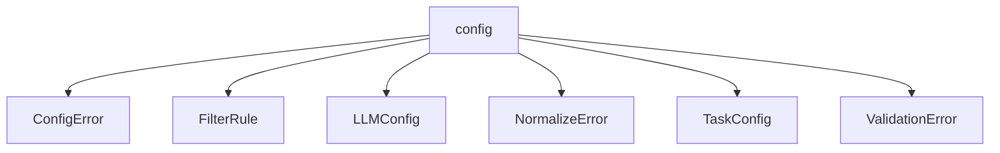

# Namespace `clore::config`

## Summary

`clore::config` 命名空间封装了配置加载、验证和规范化的完整生命周期。它定义了核心配置数据结构（如 `LLMConfig`、`TaskConfig` 和 `FilterRule`）以及对应的错误类型（`ConfigError`、`NormalizeError`、`ValidationError`），并提供标准接口：`load_config` 从文件路径加载配置，`load_config_from_string` 从字符串加载配置，`validate` 检查配置是否满足预设规则，`normalize` 将配置值转换为内部标准形式。该命名空间在 `clore` 架构中充当配置子系统的统一入口，确保所有配置在投入使用前经过可靠解析、验证和规范化，从而为上层业务逻辑提供安全、一致的配置环境。

## Diagram

## Types

### `clore::config::ConfigError`

Declaration: `config/load.cppm:15`

Definition: `config/load.cppm:15`

Implementation: [`Module config:load`](../../../modules/config/load.md)

Insufficient evidence to summarize; provide more EVIDENCE.

#### Invariants

- The `message` member is always a valid `std::string` (default-constructible).

#### Key Members

- `std::string message`

#### Usage Patterns

- Returned or thrown to indicate a configuration loading failure.
- Inspected by callers to retrieve the error description.

### `clore::config::FilterRule`

Declaration: `config/schema.cppm:7`

Definition: `config/schema.cppm:7`

Implementation: [`Module config:schema`](../../../modules/config/schema.md)

Insufficient evidence to summarize; provide more EVIDENCE.

#### Invariants

- Both `include` and `exclude` vectors can be empty
- No implied ordering or mutual exclusivity between the two lists

#### Key Members

- `include`
- `exclude`

#### Usage Patterns

- Used as a building block in configuration systems to filter items based on inclusion and exclusion criteria
- Likely checked by other code to decide whether to allow or deny a given element

### `clore::config::LLMConfig`

Declaration: `config/schema.cppm:12`

Definition: `config/schema.cppm:12`

Implementation: [`Module config:schema`](../../../modules/config/schema.md)

Insufficient evidence to summarize; provide more EVIDENCE.

#### Invariants

- `retry_limit` 为无符号整数，值域为 `[0, UINT32_MAX]`
- `system_prompt` 可以是任意字符串，无长度或内容约束

#### Key Members

- `system_prompt`
- `retry_limit`

#### Usage Patterns

- 直接作为配置参数传递给 LLM 相关的函数或类
- 通过聚合初始化或成员赋值创建实例
- 可能被序列化为 JSON 或 YAML 等格式以持久化配置

### `clore::config::NormalizeError`

Declaration: `config/normalize.cppm:10`

Definition: `config/normalize.cppm:10`

Implementation: [`Module config:normalize`](../../../modules/config/normalize.md)

Insufficient evidence to summarize; provide more EVIDENCE.

#### Invariants

- No documented invariants beyond the usual validity of `std::string`.

#### Key Members

- `message` – a `std::string` that stores the error description.

#### Usage Patterns

- Used as an error type in normalization-related operations.
- Likely returned or caught in code paths that validate or transform configuration data.

### `clore::config::TaskConfig`

Declaration: `config/schema.cppm:17`

Definition: `config/schema.cppm:17`

Implementation: [`Module config:schema`](../../../modules/config/schema.md)

Insufficient evidence to summarize; provide more EVIDENCE.

#### Invariants

- All path fields should refer to valid filesystem locations when the struct is used
- `filter` and `llm` sub-configurations must be fully initialized before task execution

#### Key Members

- `compile_commands_path`
- `project_root`
- `output_root`
- `workspace_root`
- `filter`
- `llm`

#### Usage Patterns

- Instantiated and populated from a configuration file or command-line arguments
- Passed to task infrastructure components to control LLM interaction and file filtering
- Used as a data transfer object for task setup

### `clore::config::ValidationError`

Declaration: `config/validate.cppm:8`

Definition: `config/validate.cppm:8`

Implementation: [`Module config:validate`](../../../modules/config/validate.md)

Insufficient evidence to summarize; provide more EVIDENCE.

#### Invariants

- `message` 存储验证失败时的描述文本
- 不包含任何运行时或编译期约束

#### Key Members

- `std::string message`

#### Usage Patterns

- 在验证函数中作为返回值类型使用，报告具体的验证失败原因
- 创建 `ValidationError` 实例并设置 `message` 后传递给调用方

## Functions

### `clore::config::load_config`

Declaration: `config/load.cppm:19`

Definition: `config/load.cppm:81`

Implementation: [`Module config:load`](../../../modules/config/load.md)

函数 `clore::config::load_config` 接受一个 `std::string_view` 参数，解析并加载配置，返回一个 `int` 值表示操作结果。调用者应确保传入的字符串视图在函数执行期间保持有效。返回值为 `0` 通常表示成功，非零值表示错误码，具体含义由调用者依据实现文档解读。该函数不修改其参数，也不持有参数引用。

#### Usage Patterns

- loading configuration for application startup
- parsing a user-specified configuration file

### `clore::config::load_config_from_string`

Declaration: `config/load.cppm:21`

Definition: `config/load.cppm:110`

Implementation: [`Module config:load`](../../../modules/config/load.md)

函数 `clore::config::load_config_from_string` 接受一个 `std::string_view` 参数，并从该字符串表示的配置内容中加载配置。调用者负责提供有效的配置字符串；函数返回一个 `int` 值，表示加载操作的结果状态。

#### Usage Patterns

- 从外部源获取TOML字符串后调用
- 可能由 `clore::config::load_config` 调用以适应文件读取逻辑
- 在需要从内存中解析配置时作为入口点

### `clore::config::normalize`

Declaration: `config/normalize.cppm:14`

Definition: `config/normalize.cppm:22`

Implementation: [`Module config:normalize`](../../../modules/config/normalize.md)

`clore::config::normalize` 接受一个 `int` 左值引用，在适当范围内对引用所持有的值进行规范化（可能修改该值），并返回一个 `int` 指示操作结果。调用者应确保传入的值代表一个有效的配置参数；该值可能会被调整为符合内部标准的规范化形式。

返回值是约定的结果码：零通常表示成功，非零值表示特定错误或警告。调用者有责任在后续使用该值前检查返回的状态，并确认规范化后的值满足预期用途。函数对引用参数所做的修改是调用者预期的副作用。

#### Usage Patterns

- Called after `clore::config::load_config` to normalize configuration paths
- Used as part of configuration validation and preparation before further processing

### `clore::config::validate`

Declaration: `config/validate.cppm:12`

Definition: `config/validate.cppm:42`

Implementation: [`Module config:validate`](../../../modules/config/validate.md)

验证给定的配置表示（作为 `const int &` 传入）是否满足预定义的规则。成功时返回 `0`；非零返回值表示特定的验证失败原因，调用方应据此决定是否忽略、回退或拒绝该配置。该函数通常会在调用 `clore::config::load_config` 或 `clore::config::load_config_from_string` 之后，或在调用 `clore::config::normalize` 之前/之后执行，以确保待处理的配置状态是安全的。

#### Usage Patterns

- called after `load_config` to validate the configuration before use
- used in configuration parsing pipeline to ensure correctness

## Related Pages

- [Namespace clore](../index.md)

