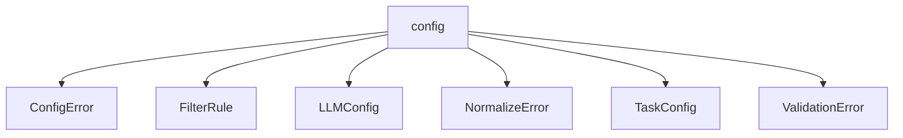

# Namespace `clore::config`

## Summary

命名空间 `clore::config` 是 clore 库中配置管理的核心模块，负责配置的加载、验证与规范化。它提供了 `load_config`、`load_config_from_string` 等加载函数，以及 `validate`、`normalize` 等处理函数，确保配置值在使用前符合预期约束并转换为标准形式。该命名空间还定义了 `LLMConfig`、`TaskConfig` 等配置结构体，以及 `ConfigError`、`NormalizeError`、`ValidationError` 等错误类型，共同构成了一套完整的配置处理管线。在架构上，它隔离了配置的输入、校验与标准化逻辑，为库的其他部分提供统一的配置访问入口。

## Diagram

## Types

### `clore::config::ConfigError`

Declaration: `config/load.cppm:15`

Definition: `config/load.cppm:15`

Implementation: [`Module config:load`](../../../modules/config/load.md)

Insufficient evidence to summarize; provide more EVIDENCE.

#### Invariants

- `message` 应当包含有意义的错误描述
- 结构体无其他状态约束

#### Key Members

- `message` 成员

#### Usage Patterns

- 在配置解析失败时构造并返回该错误
- 用户通过读取 `message` 获取错误信息

### `clore::config::FilterRule`

Declaration: `config/schema.cppm:7`

Definition: `config/schema.cppm:7`

Implementation: [`Module config:schema`](../../../modules/config/schema.md)

Insufficient evidence to summarize; provide more EVIDENCE.

#### Invariants

- Each member is independently mutable
- No constraints between include and exclude lists

#### Key Members

- `include`
- `exclude`

#### Usage Patterns

- Used to represent filter configurations
- Lists can be populated by callers to define filtering behavior

### `clore::config::LLMConfig`

Declaration: `config/schema.cppm:12`

Definition: `config/schema.cppm:12`

Implementation: [`Module config:schema`](../../../modules/config/schema.md)

Insufficient evidence to summarize; provide more EVIDENCE.

#### Invariants

- `retry_limit` 初始化为0

#### Key Members

- `system_prompt`
- `retry_limit`

#### Usage Patterns

- 作为配置对象传递给LLM接口
- 从配置文件中解析

### `clore::config::NormalizeError`

Declaration: `config/normalize.cppm:10`

Definition: `config/normalize.cppm:10`

Implementation: [`Module config:normalize`](../../../modules/config/normalize.md)

Insufficient evidence to summarize; provide more EVIDENCE.

#### Invariants

- The `message` field should typically be non-empty when an error is present.

#### Key Members

- `message`: a `std::string` describing the normalization error.

#### Usage Patterns

- Returned or thrown by normalization functions to indicate failure.
- Checked by callers to determine the reason for normalization failure.

### `clore::config::TaskConfig`

Declaration: `config/schema.cppm:17`

Definition: `config/schema.cppm:17`

Implementation: [`Module config:schema`](../../../modules/config/schema.md)

Insufficient evidence to summarize; provide more EVIDENCE.

#### Invariants

- Paths are stored as `std::string`.
- `filter` is of type `FilterRule`.
- `llm` is of type `LLMConfig`.

#### Key Members

- `compile_commands_path`
- `project_root`
- `output_root`
- `workspace_root`
- `filter`
- `llm`

#### Usage Patterns

- Used as a configuration container passed to task execution functions.
- Aggregates directory paths and sub-configurations for filtering and LLM interaction.

### `clore::config::ValidationError`

Declaration: `config/validate.cppm:8`

Definition: `config/validate.cppm:8`

Implementation: [`Module config:validate`](../../../modules/config/validate.md)

Insufficient evidence to summarize; provide more EVIDENCE.

#### Invariants

- 无额外不变量，结构体仅作为错误消息的容器。

#### Key Members

- `std::string message`：存储验证错误消息。

#### Usage Patterns

- 被验证函数返回或赋值以报告错误。
- 作为错误集合的一部分被收集和检查。

## Functions

### `clore::config::load_config`

Declaration: `config/load.cppm:19`

Definition: `config/load.cppm:81`

Implementation: [`Module config:load`](../../../modules/config/load.md)

`clore::config::load_config` 接受一个 `std::string_view` 参数并返回 `int`。调用者应提供表示配置数据的字符串视图；函数负责加载该配置并返回一个结果码，指示操作成功或失败。返回值可以进一步传递给 `clore::config::validate` 以确认配置状态，或用于后续决策。该函数的公共契约保证：只要输入是一个格式正确的配置字符串，它就会尝试处理并返回一个合适的整数结果；调用者无需关心内部如何加载或转换数据。

#### Usage Patterns

- loading application configuration from a configuration file at startup
- part of a configuration subsystem to parse config files with relative path resolution

### `clore::config::load_config_from_string`

Declaration: `config/load.cppm:21`

Definition: `config/load.cppm:110`

Implementation: [`Module config:load`](../../../modules/config/load.md)

函数 `clore::config::load_config_from_string` 接受一个 `std::string_view` 参数，返回一个 `int` 值。调用者应提供包含完整配置数据的字符串视图，函数解析后将结果以整型状态码的形式返回。该函数的契约与 `clore::config::load_config` 类似，但直接从内存中的字符串而非文件路径加载配置。

#### Usage Patterns

- called with a string containing TOML content
- used in config loaders that receive configuration as text
- part of the `clore::config` API for parsing configuration strings

### `clore::config::normalize`

Declaration: `config/normalize.cppm:14`

Definition: `config/normalize.cppm:22`

Implementation: [`Module config:normalize`](../../../modules/config/normalize.md)

`clore::config::normalize` 接受一个 `int` 引用并对其执行规范化。调用者负责提供一个可修改的 `int` 对象；函数将该值转换为标准形式，并通过引用参数更新它。返回值通常表示规范化后的结果或指示操作成败的状态码，具体契约依赖于调用 `clore::config::normalize` 的配置上下文。该函数属于配置处理管线，通常与 `clore::config::validate` 配合使用，确保配置值在进一步处理前已标准化。

#### Usage Patterns

- Called before using the configuration to ensure all paths are absolute and normalized.
- Used to prepare a `TaskConfig` for further processing or validation.

### `clore::config::validate`

Declaration: `config/validate.cppm:12`

Definition: `config/validate.cppm:42`

Implementation: [`Module config:validate`](../../../modules/config/validate.md)

`clore::config::validate` 对给定的配置值执行验证。它接受一个 `const int &` 参数，该参数表示需要校验的配置值；函数本身不修改该值，仅判断其是否符合预期的约束条件（例如范围、枚举有效性等）。调用方应提供一个已加载或已生成的配置值作为输入。

返回值类型为 `int`，表示验证结果。通常返回 0 表示验证通过，非零值对应特定的错误码或失败原因。调用方应检查返回值以确认输入是否有效，并根据约定处理可能的错误情况。该函数是配置处理流程中的典型校验环节，与 `clore::config::load_config`、`clore::config::load_config_from_string` 及 `clore::config::normalize` 协同工作，确保最终使用的配置合法可靠。

#### Usage Patterns

- validate a loaded `TaskConfig` before use
- called after `load_config` or `load_config_from_string`

## Related Pages

- [Namespace clore](../index.md)

