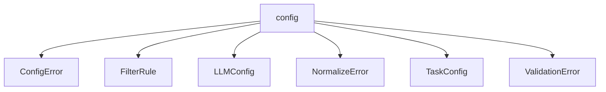

# Namespace `clore::config`

## Summary

`clore::config` 命名空间封装了应用程序配置的加载、验证与规范化逻辑。它提供 `load_config` 和 `load_config_from_string` 函数从不同来源读取配置并返回整数句柄，随后可调用 `validate` 和 `normalize` 对句柄进行合规性检查与规范化处理。该命名空间定义了 `LLMConfig`、`TaskConfig`、`FilterRule` 等配置结构体，以及 `ConfigError`、`NormalizeError`、`ValidationError` 等错误类型，确保配置处理过程中的错误能以类型安全的方式传递。在架构上，`clore::config` 作为独立的配置管理模块，将配置的解析、校验与标准化从业务逻辑中解耦，为上层提供统一、可靠的配置获取和处理接口。

## Diagram

```mermaid
graph TD
    NS["config"]
    T0["ConfigError"]
    NS --> T0
    T1["FilterRule"]
    NS --> T1
    T2["LLMConfig"]
    NS --> T2
    T3["NormalizeError"]
    NS --> T3
    T4["TaskConfig"]
    NS --> T4
    T5["ValidationError"]
    NS --> T5
```

## Types

### `clore::config::ConfigError`

Declaration: `src/config/load.cppm:30`

Definition: `src/config/load.cppm:30`

Implementation: [`Module config:load`](../../../modules/config/load.md)

Insufficient evidence to summarize; provide more EVIDENCE.

#### Invariants

- The `message` member may be empty or contain any string describing the error condition.
- No further invariants or guarantees are implied by the evidence.

#### Key Members

- `clore::config::ConfigError::message` – the text describing the error.

#### Usage Patterns

- Likely used as an exception type or error result when configuration parsing fails.
- Other code may construct `ConfigError` with a descriptive string and then throw or return it.

### `clore::config::FilterRule`

Declaration: `src/config/schema.cppm:13`

Definition: `src/config/schema.cppm:13`

Implementation: [`Module config:schema`](../../../modules/config/schema.md)

Insufficient evidence to summarize; provide more EVIDENCE.

#### Invariants

- 包含列表和排除列表独立存在，不隐含优先级或覆盖关系
- 列表中的字符串顺序不影响过滤逻辑

#### Key Members

- `include`：存储需要包含的字符串模式
- `exclude`：存储需要排除的字符串模式

#### Usage Patterns

- 作为函数参数传递过滤条件
- 在配置文件解析中填充该结构体
- 用于遍历集合时根据包含/排除列表决定元素保留或丢弃

### `clore::config::LLMConfig`

Declaration: `src/config/schema.cppm:18`

Definition: `src/config/schema.cppm:18`

Implementation: [`Module config:schema`](../../../modules/config/schema.md)

Insufficient evidence to summarize; provide more EVIDENCE.

#### Invariants

- `retry_limit` 默认值为 0，调用方应确保其为非负整数
- `system_prompt` 可包含任意字符串，无内容约束

#### Key Members

- `system_prompt`
- `retry_limit`

#### Usage Patterns

- 作为配置数据结构在模块 `clore.config` 内部传递
- 被高层配置类或解析器填充后传递给 LLM 执行组件

### `clore::config::NormalizeError`

Declaration: `src/config/normalize.cppm:17`

Definition: `src/config/normalize.cppm:17`

Implementation: [`Module config:normalize`](../../../modules/config/normalize.md)

Insufficient evidence to summarize; provide more EVIDENCE.

#### Invariants

- `message` 成员存储错误描述
- 无其他隐式约束或保证

#### Key Members

- `message` 成员

#### Usage Patterns

- 作为 `clore::config` 命名空间中规范化操作失败时的错误类型
- 可被 `catch` 或用于返回错误信息

### `clore::config::TaskConfig`

Declaration: `src/config/schema.cppm:23`

Definition: `src/config/schema.cppm:23`

Implementation: [`Module config:schema`](../../../modules/config/schema.md)

Insufficient evidence to summarize; provide more EVIDENCE.

#### Invariants

- No invariants are visible from the evidence; all fields are publicly assignable.

#### Key Members

- `compile_commands_path`
- `project_root`
- `output_root`
- `workspace_root`
- `filter`
- `llm`

#### Usage Patterns

- The type is intended to be populated with task configuration data, likely from a configuration file or user input.
- No usage examples are present in the evidence; the struct appears as a simple data container.

### `clore::config::ValidationError`

Declaration: `src/config/validate.cppm:14`

Definition: `src/config/validate.cppm:14`

Implementation: [`Module config:validate`](../../../modules/config/validate.md)

Insufficient evidence to summarize; provide more EVIDENCE.

#### Key Members

- message

#### Usage Patterns

- Created by validation logic and returned or stored in a collection to report config problems.
- Consumed by error-handling code that reads the `message` field to present to the user or log.

## Functions

### `clore::config::load_config`

Declaration: `src/config/load.cppm:34`

Definition: `src/config/load.cppm:96`

Implementation: [`Module config:load`](../../../modules/config/load.md)

`clore::config::load_config` 接受一个 `std::string_view` 作为配置数据源，并返回一个 `int` 值。调用者应提供一个可解析的配置表示，函数返回的整数可被视为该配置的标识句柄，用于后续查询或操作。函数不承担验证或规范化责任；调用者应确保返回值的有效性和使用上下文。

#### Usage Patterns

- Call to load a configuration from a file, obtaining a `TaskConfig` on success
- Used to parse configuration files and automatically set the workspace root to the file's directory

### `clore::config::load_config_from_string`

Declaration: `src/config/load.cppm:36`

Definition: `src/config/load.cppm:125`

Implementation: [`Module config:load`](../../../modules/config/load.md)

`clore::config::load_config_from_string` 从给定的字符串加载配置。调用者负责提供包含有效配置内容的 `std::string_view`。函数返回一个 `int`，代表加载的配置句柄或状态码；该返回值通常应传递给 `clore::config::validate` 和 `clore::config::normalize` 以完成完整的配置处理管线。

#### Usage Patterns

- Used to load configuration from a TOML string
- Typically used in configuration deserialization pipelines

### `clore::config::normalize`

Declaration: `src/config/normalize.cppm:21`

Definition: `src/config/normalize.cppm:29`

Implementation: [`Module config:normalize`](../../../modules/config/normalize.md)

`clore::config::normalize` 对给定的整数配置值进行规范化。它通过引用接收一个 `int`，并在成功时返回 `std::expected<void, NormalizeError>`。如果规范化失败，返回的预期包含描述错误的 `NormalizeError` 实例。调用者负责提供可修改的整数，并应当检查返回值以确定操作是否成功。

#### Usage Patterns

- Used after loading a configuration to ensure paths are normalized before further processing
- Expected to be called on a `TaskConfig` instance that has been populated by functions like `load_config` or `load_config_from_string`

### `clore::config::validate`

Declaration: `src/config/validate.cppm:18`

Definition: `src/config/validate.cppm:48`

Implementation: [`Module config:validate`](../../../modules/config/validate.md)

函数 `clore::config::validate` 接受一个 `const int &` 类型的配置值，并返回一个 `std::expected<void, ValidationError>`。调用者应通过 `load_config`、`load_config_from_string` 或 `normalize` 等函数获取该值，然后交由 `validate` 确认其是否满足有效配置的约束。若验证通过，返回空 `expected`；若失败，则返回一个描述错误的 `ValidationError`，使得调用方能够以类型安全的方式处理不合规的配置。

## Related Pages

- [Namespace clore](../index.md)

