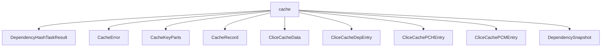

# Namespace `clore::extract::cache`

## Summary

命名空间 `clore::extract::cache` 封装了编译缓存系统的核心逻辑，负责为提取（extract）阶段和 Clice 缓存提供持久化、键值管理及依赖追踪能力。其关键声明包括面向不同缓存类型的保存/加载函数（如 `save_extract_cache`、`load_extract_cache`、`save_clice_cache`、`load_clice_cache`），以及用于构建缓存键和签名的工具（`build_cache_key`、`build_compile_signature`、`hash_file`）。此外，还提供了依赖快照的捕获与变更检测函数（`capture_dependency_snapshot`、`dependencies_changed`）和缓存键解析函数（`split_cache_key`），配合 `CacheRecord`、`CliceCacheData`、`CacheError` 等数据结构和错误类型，形成一套完整的缓存操作接口。

在架构上，该命名空间位于 `clore::extract` 下层，作为独立的缓存抽象层，剥离了具体的编译流程细节，专注于高效的缓存键构造、数据读写和依赖一致性校验。通过提供统一的 `build_cache_key` 与哈希函数，确保了缓存键的唯一性与可复原性；依赖快照机制支持在增量编译场景下快速判断缓存是否失效。这些设计使得上层编译模块能够以声明式的方式使用缓存，而不必关心底层存储格式或并发控制细节。

## Diagram

## Types

### `clore::extract::cache::CacheError`

Declaration: `extract/cache.cppm:20`

Definition: `extract/cache.cppm:20`

Implementation: [`Module extract:cache`](../../../../modules/extract/cache.md)

Insufficient evidence to summarize; provide more EVIDENCE.

#### Invariants

- The `message` member must be set to a descriptive error string when an error occurs.

#### Key Members

- `message`: a `std::string` that stores the error description.

#### Usage Patterns

- Can be thrown as an exception or returned as an error result in cache-related functions.

### `clore::extract::cache::CacheKeyParts`

Declaration: `extract/cache.cppm:24`

Definition: `extract/cache.cppm:24`

Implementation: [`Module extract:cache`](../../../../modules/extract/cache.md)

Insufficient evidence to summarize; provide more EVIDENCE.

#### Invariants

- No explicit invariants documented; likely expects `path` to be a valid file path and `compile_signature` to be non-zero? Not confirmed.

#### Key Members

- `std::string path`
- `std::uint64_t compile_signature`

#### Usage Patterns

- Used to uniquely identify cache entries based on a file and its compile-time signature.

### `clore::extract::cache::CacheRecord`

Declaration: `extract/cache.cppm:36`

Definition: `extract/cache.cppm:36`

Implementation: [`Module extract:cache`](../../../../modules/extract/cache.md)

Insufficient evidence to summarize; provide more EVIDENCE.

#### Invariants

- Fields are default-initialized to zero or default-constructed.
- `source_hash` and `compile_signature` are expected to be non-zero after a successful extraction.
- `ast_deps`, scan, and ast hold consistent results from the same extraction.

#### Key Members

- `compile_signature`
- `source_hash`
- `ast_deps`
- scan
- ast

#### Usage Patterns

- Populated by the extraction pipeline after a successful extraction.
- Retrieved by the cache module to return cached results.
- Stored in a cache container keyed by source hash and compile signature.

### `clore::extract::cache::CliceCacheData`

Declaration: `extract/cache.cppm:68`

Definition: `extract/cache.cppm:68`

Implementation: [`Module extract:cache`](../../../../modules/extract/cache.md)

Insufficient evidence to summarize; provide more EVIDENCE.

#### Invariants

- `paths`、`pch`、`pcm` 中的各个字段是相互独立的向量
- 无显式的不变式约束

#### Key Members

- `paths`
- `pch`
- `pcm`

#### Usage Patterns

- 作为缓存系统的一部分，存储提取的文件路径和对应的编译产物数据
- 可能由缓存填充逻辑写入，由读取逻辑遍历并使用

### `clore::extract::cache::CliceCacheDepEntry`

Declaration: `extract/cache.cppm:46`

Definition: `extract/cache.cppm:46`

Implementation: [`Module extract:cache`](../../../../modules/extract/cache.md)

Insufficient evidence to summarize; provide more EVIDENCE.

#### Invariants

- Fields are default-initialized to zero.
- The struct layout is compatible with an external `CacheData` schema.

#### Key Members

- `path`
- `hash`

#### Usage Patterns

- Used in clice workspace cache structures for dependency tracking.
- Serialized or interpreted in a schema-compatible manner with `CacheData`.

### `clore::extract::cache::CliceCachePCHEntry`

Declaration: `extract/cache.cppm:51`

Definition: `extract/cache.cppm:51`

Implementation: [`Module extract:cache`](../../../../modules/extract/cache.md)

Insufficient evidence to summarize; provide more EVIDENCE.

### `clore::extract::cache::CliceCachePCMEntry`

Declaration: `extract/cache.cppm:60`

Definition: `extract/cache.cppm:60`

Implementation: [`Module extract:cache`](../../../../modules/extract/cache.md)

Insufficient evidence to summarize; provide more EVIDENCE.

### `clore::extract::cache::DependencySnapshot`

Declaration: `extract/cache.cppm:29`

Definition: `extract/cache.cppm:29`

Implementation: [`Module extract:cache`](../../../../modules/extract/cache.md)

Insufficient evidence to summarize; provide more EVIDENCE.

## Functions

### `clore::extract::cache::build_cache_key`

Declaration: `extract/cache.cppm:76`

Definition: `extract/cache.cppm:228`

Implementation: [`Module extract:cache`](../../../../modules/extract/cache.md)

函数 `clore::extract::cache::build_cache_key` 根据调用者提供的文件标识符（第一个参数 `std::string_view`）和编译签名哈希（第二个参数 `std::uint64_t`）构造并返回一个用于缓存查找或存储的标准化键字符串。调用者负责提供与缓存条目对应的源文件路径或逻辑标识符，以及由 `clore::extract::cache::build_compile_signature` 等函数生成的64位编译签名值；该函数仅执行键的组装，不访问文件系统或执行I/O操作。返回的 `std::string` 可直接用于其他缓存接口（如 `clore::extract::cache::load_extract_cache` 或 `clore::extract::cache::save_extract_cache`）作为缓存键参数。

#### Usage Patterns

- Used to build a key for caching extraction results based on a file path and a compile signature.

### `clore::extract::cache::build_compile_signature`

Declaration: `extract/cache.cppm:74`

Definition: `extract/cache.cppm:224`

Implementation: [`Module extract:cache`](../../../../modules/extract/cache.md)

该函数负责为给定的编译输入生成一个唯一的64位签名，供缓存系统用于键值构建和一致性校验。调用方需提供一个 `const int &` 类型的引用，该引用通常代表文件描述符、进程句柄或编译单元标识符；返回值 `std::uint64_t` 是根据输入的内容计算出的哈希值，可用于与后续同一输入的签名进行比较，以判断编译环境是否发生变化。

`build_compile_signature` 是缓存键生成流程的一部分：其输出通常作为参数传递给 `clore::extract::cache::build_cache_key`，与缓存键字符串共同组成最终的键值。调用方不应假定签名的具体算法，但可以依赖其确定性：相同的输入始终产生相同的签名。该函数可以独立于缓存的其他操作使用，例如在 `clore::extract::cache::dependencies_changed` 之前检测到的差异。

#### Usage Patterns

- Used to generate a unique compile signature for cache key computation.
- Called in caching logic to identify compile configurations.

### `clore::extract::cache::capture_dependency_snapshot`

Declaration: `extract/cache.cppm:83`

Definition: `extract/cache.cppm:282`

Implementation: [`Module extract:cache`](../../../../modules/extract/cache.md)

函数 `clore::extract::cache::capture_dependency_snapshot` 接受一个 `const int &` 参数（通常代表一个文件标识或内部索引），并返回一个 `std::expected<DependencySnapshot, CacheError>`。调用者应提供正确的标识符，函数会基于当前状态生成对应的依赖关系快照；成功时返回 `DependencySnapshot` 实例，失败时返回 `CacheError` 指示具体错误原因。此快照可用于后续的变更检测（例如与 `dependencies_changed` 配合使用），调用者必须处理 `std::expected` 中的错误情况以确保缓存逻辑正确性。

#### Usage Patterns

- called to capture dependency information for cache invalidation checks
- used before comparing with a previous snapshot via `dependencies_changed`

### `clore::extract::cache::dependencies_changed`

Declaration: `extract/cache.cppm:86`

Definition: `extract/cache.cppm:401`

Implementation: [`Module extract:cache`](../../../../modules/extract/cache.md)

检查给定 `DependencySnapshot` 中记录的依赖项相对于缓存状态是否已发生变化。当且仅当至少有一个依赖项发生更改时，函数返回 `true`；否则返回 `false`。该函数通常用于判断缓存是否需要失效，调用者应在使用缓存数据前调用它，并基于返回值决定是否重新提取。

#### Usage Patterns

- called before loading extract cache to determine freshness
- used to decide whether to re-extract dependencies

### `clore::extract::cache::hash_file`

Declaration: `extract/cache.cppm:81`

Definition: `extract/cache.cppm:270`

Implementation: [`Module extract:cache`](../../../../modules/extract/cache.md)

计算指定文件的哈希值，该哈希值通常用于缓存键的构建或依赖关系的追踪。接受一个 `std::string_view` 类型的文件路径，返回一个 `std::expected<std::uint64_t, CacheError>`，成功时携带文件内容的哈希结果，失败时则携带 `CacheError` 错误信息。

调用者应确保提供的路径可访问且指向一个有效文件。该函数不处理路径解析或文件打开之外的前置条件；任何文件系统层面的失败（如文件不存在、读取权限不足）均会以 `CacheError` 的形式呈现给调用者。

#### Usage Patterns

- used by cache-key building functions to hash source files
- called by `build_compile_signature` or `capture_dependency_snapshot` to incorporate file content into cache keys
- part of the cache layer's file integrity verification

### `clore::extract::cache::load_clice_cache`

Declaration: `extract/cache.cppm:95`

Definition: `extract/cache.cppm:670`

Implementation: [`Module extract:cache`](../../../../modules/extract/cache.md)

函数 `clore::extract::cache::load_clice_cache` 负责从缓存中加载与给定标识符关联的 `CliceCacheData`。调用者传入一个 `std::string_view` 作为缓存键，函数返回 `std::expected<CliceCacheData, CacheError>`；成功时包含对应的缓存数据，失败时返回 `CacheError` 以指示错误原因（例如缓存缺失或读取失败）。该函数假设缓存已被正确初始化和维护，由调用者保证键格式符合缓存系统的预期。

#### Usage Patterns

- load cached clice data before extraction
- check if a valid clice cache exists
- used in pair with `save_clice_cache`

### `clore::extract::cache::load_extract_cache`

Declaration: `extract/cache.cppm:88`

Definition: `extract/cache.cppm:457`

Implementation: [`Module extract:cache`](../../../../modules/extract/cache.md)

`clore::extract::cache::load_extract_cache` 尝试从提取缓存中加载与给定 `std::string_view` 键关联的整数数据，并返回该整数值。调用者应确保提供的键对应一个有效的缓存条目——若键不存在或加载失败，函数行为未定义。返回的 `int` 先前应通过 `clore::extract::cache::save_extract_cache` 写入，因此其含义由该写入逻辑决定。

#### Usage Patterns

- called before extraction to check if a cached result exists
- used in conjunction with `save_extract_cache` for read-write caching

### `clore::extract::cache::save_clice_cache`

Declaration: `extract/cache.cppm:97`

Definition: `extract/cache.cppm:710`

Implementation: [`Module extract:cache`](../../../../modules/extract/cache.md)

函数 `clore::extract::cache::save_clice_cache` 将给定的 `CliceCacheData` 持久化存储到与指定键相关联的缓存条目中。调用者必须提供一个有效的缓存键（`std::string_view`）和完整的 `CliceCacheData` 对象。如果保存操作成功，函数返回 `std::expected<void, CacheError>` 的空值；否则返回一个 `CacheError`，描述失败原因。该函数假定调用者已确保缓存键的唯一性或更新语义，且返回的错误应被调用者妥善处理，以避免缓存状态不一致。

#### Usage Patterns

- Persist clice extract cache
- Called after extraction to update cache data

### `clore::extract::cache::save_extract_cache`

Declaration: `extract/cache.cppm:91`

Definition: `extract/cache.cppm:533`

Implementation: [`Module extract:cache`](../../../../modules/extract/cache.md)

函数 `clore::extract::cache::save_extract_cache` 将给定的 `int` 值与指定的缓存键关联并持久化。调用者应提供一个有效的缓存键（通常通过 `clore::extract::cache::build_cache_key` 或其他键构造函数获得）以及要缓存的数据。操作成功时返回空的 `std::expected`，失败时返回 `clore::extract::cache::CacheError`。此函数不保证立即刷新到存储；调用者若需要确保写入完成，应依赖后续的同步机制。

#### Usage Patterns

- Called to persist extract cache after a successful extraction pass
- Used to store incremental build cache for later reuse

### `clore::extract::cache::split_cache_key`

Declaration: `extract/cache.cppm:79`

Definition: `extract/cache.cppm:238`

Implementation: [`Module extract:cache`](../../../../modules/extract/cache.md)

`clore::extract::cache::split_cache_key` 接受一个代表完整缓存键的 `std::string_view`，并将其解析为 `CacheKeyParts` 结构，该结构将键的各个组成部分（例如源标识符和签名）进行分离。如果输入字符串不符合预期的键格式，函数返回一个 `CacheError` 来指示失败原因。调用方应使用此函数来解构由 `build_cache_key` 生成的缓存键，以便独立地检查或操作键的各个部分。

#### Usage Patterns

- Parsing cache keys previously built by `build_cache_key`
- Extracting path and signature before cache lookup operations

## Related Pages

- [Namespace clore::extract](../index.md)

