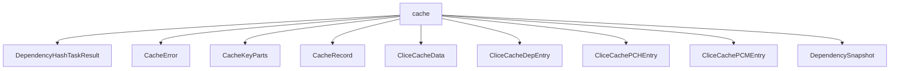

# Namespace `clore::extract::cache`

## Summary

该命名空间为 `clore` 提取流程提供完整的缓存基础设施，主要职责是序列化、反序列化及失效检测。其核心声明包括：`CacheRecord`、`CliceCacheData`、`DependencySnapshot` 等数据载体，以及 `build_cache_key`、`split_cache_key`、`hash_file` 等键与指纹生成函数；`save_clice_cache`、`load_clice_cache` 管理持久化存储，`capture_dependency_snapshot` 与 `dependencies_changed` 实现依赖变更检测，`CacheError` 统一错误处理。

从架构上看，该命名空间位于提取层与文件系统之间，通过编译签名（`build_compile_signature`）和文件哈希（`hash_file`）构建唯一缓存键，以支持增量重构建。内部使用 `std::expected` 的返回模式分离成功与错误路径，不暴露文件 I/O 细节，为上层提供确定性缓存命中/失效接口。

## Diagram

## Types

### `clore::extract::cache::CacheError`

Declaration: `extract/cache.cppm:20`

Definition: `extract/cache.cppm:20`

Implementation: [`Module extract:cache`](../../../../modules/extract/cache.md)

Insufficient evidence to summarize; provide more EVIDENCE.

#### Invariants

- The `message` member may be empty or contain any string
- No additional constraints beyond standard `std::string` behavior

#### Key Members

- `message`

#### Usage Patterns

- Returned or caught as an error result from cache operations
- Constructed with a descriptive string to indicate failure cause
- Likely used with `std::expected` or `std::variant` error handling patterns

### `clore::extract::cache::CacheKeyParts`

Declaration: `extract/cache.cppm:24`

Definition: `extract/cache.cppm:24`

Implementation: [`Module extract:cache`](../../../../modules/extract/cache.md)

Insufficient evidence to summarize; provide more EVIDENCE.

#### Invariants

- `path` 应该是一个有效的文件系统路径
- `compile_signature` 应当唯一标识一个编译单元的特定版本

#### Key Members

- `path`：文件路径
- `compile_signature`：编译签名

#### Usage Patterns

- 用作缓存键的一部分，与完整的缓存键组合或比较
- 可能通过其成员来生成哈希或进行相等性判断

### `clore::extract::cache::CacheRecord`

Declaration: `extract/cache.cppm:36`

Definition: `extract/cache.cppm:36`

Implementation: [`Module extract:cache`](../../../../modules/extract/cache.md)

Insufficient evidence to summarize; provide more EVIDENCE.

#### Invariants

- `compile_signature` 与 `source_hash` 的组合唯一标识一个编译单元
- 缓存记录中的 `ast_deps`、`scan`、`ast` 应与对应的 `source_hash` 和 `compile_signature` 保持一致
- 当源文件或编译配置变化时，相关字段应失效或更新

#### Key Members

- `compile_signature`
- `source_hash`
- `ast_deps`
- `scan`
- `ast`

#### Usage Patterns

- 在缓存查找时通过 `source_hash` 和 `compile_signature` 匹配记录
- 提取过程中生成新的 `CacheRecord` 实例并存储到缓存中
- 其他代码通过读取成员（如 `scan`、`ast`）获取缓存的分析结果

### `clore::extract::cache::CliceCacheData`

Declaration: `extract/cache.cppm:68`

Definition: `extract/cache.cppm:68`

Implementation: [`Module extract:cache`](../../../../modules/extract/cache.md)

Insufficient evidence to summarize; provide more EVIDENCE.

#### Invariants

- All three member vectors may be empty; no non‑empty guarantee is implied.
- The struct provides no validation or ordering invariants beyond what `std::vector` offers.

#### Key Members

- `paths`
- `pch`
- `pcm`

#### Usage Patterns

- Used to aggregate and transfer cache data in the extraction pipeline.
- Likely populated by serialization or extraction routines and consumed by cache lookup or storage logic.

### `clore::extract::cache::CliceCacheDepEntry`

Declaration: `extract/cache.cppm:46`

Definition: `extract/cache.cppm:46`

Implementation: [`Module extract:cache`](../../../../modules/extract/cache.md)

Insufficient evidence to summarize; provide more EVIDENCE.

#### Invariants

- `path` 和 `hash` 的类型固定为 `std::uint32_t` 和 `std::uint64_t`
- 所有成员初始化为零，表示空或未设置状态
- 结构的字段布局与外部 `CacheData` 保持兼容

#### Key Members

- `path`
- `hash`

#### Usage Patterns

- 作为缓存数据结构中的元素，用于存储依赖项的路径和哈希值
- 通过比较 `path` 和 `hash` 判断依赖是否发生变化
- 是 `CliceCacheEntry` 或其他缓存容器的一部分（未在证据中明确）

### `clore::extract::cache::CliceCachePCHEntry`

Declaration: `extract/cache.cppm:51`

Definition: `extract/cache.cppm:51`

Implementation: [`Module extract:cache`](../../../../modules/extract/cache.md)

Insufficient evidence to summarize; provide more EVIDENCE.

#### Invariants

- `hash` uniquely identifies the PCH content
- `deps` holds all dependency entries for the PCH
- `build_at` is a timestamp (likely Unix epoch in seconds or milliseconds)
- `bound` represents a binding count or reference counter

#### Key Members

- `filename`
- `source_file`
- `hash`
- `bound`
- `build_at`
- `deps`

#### Usage Patterns

- Used as element in a cache container (e.g., map or vector)
- Fields accessed directly for read/write by cache serialization and comparison logic
- Dependency information stored in `deps` for validity checks

### `clore::extract::cache::CliceCachePCMEntry`

Declaration: `extract/cache.cppm:60`

Definition: `extract/cache.cppm:60`

Implementation: [`Module extract:cache`](../../../../modules/extract/cache.md)

Insufficient evidence to summarize; provide more EVIDENCE.

#### Invariants

- `source_file` and `build_at` default to zero when not explicitly initialized
- `deps` is a vector that may be empty

#### Key Members

- `filename`
- `module_name`
- `source_file`
- `build_at`
- `deps`

#### Usage Patterns

- Stored in a cache collection managed by `clore::extract::cache`
- Populated during PCM extraction and used for build system dependency tracking
- Likely serialized or persisted to disk for incremental builds

### `clore::extract::cache::DependencySnapshot`

Declaration: `extract/cache.cppm:29`

Definition: `extract/cache.cppm:29`

Implementation: [`Module extract:cache`](../../../../modules/extract/cache.md)

Insufficient evidence to summarize; provide more EVIDENCE.

#### Invariants

- No documented invariants; the vectors are not explicitly constrained to have the same length.

#### Key Members

- `files`
- `hashes`
- `mtimes`
- `build_at`

#### Usage Patterns

- Used to bundle file paths, hashes, modification times, and build timestamp for caching purposes.

## Functions

### `clore::extract::cache::build_cache_key`

Declaration: `extract/cache.cppm:76`

Definition: `extract/cache.cppm:228`

Implementation: [`Module extract:cache`](../../../../modules/extract/cache.md)

调用者使用 `clore::extract::cache::build_cache_key` 生成一个唯一字符串键，用于缓存存储或检索。该函数接受一个 `std::string_view` 标识符（通常代表源文件路径或提取目标）和一个 `std::uint64_t` 签名（例如由 `build_compile_signature` 提供的编译指纹），并返回一个格式化的 `std::string` 键。调用者必须确保提供的签名与特定内容强关联，以维持缓存键的正确性与唯一性。返回的键设计为可与 `load_extract_cache` 或 `save_extract_cache` 等接口配套使用。

#### Usage Patterns

- 被缓存相关函数用于构建唯一缓存键

### `clore::extract::cache::build_compile_signature`

Declaration: `extract/cache.cppm:74`

Definition: `extract/cache.cppm:224`

Implementation: [`Module extract:cache`](../../../../modules/extract/cache.md)

函数 `clore::extract::cache::build_compile_signature` 接受一个 `const int &` 类型的引用参数，返回一个 `std::uint64_t` 类型的编译签名。调用者需要提供一个表示编译输入源（例如文件描述符或内部标识符）的有效引用，该签名用于唯一标识当前编译输入的快照状态。返回的签名可以与其他签名进行比较，以判断编译输入是否发生变化，从而支持缓存命中与失效的判断。调用者必须确保传入的引用在其生命周期内保持有效且指向预期的输入；函数本身不对引用的有效性做校验。

#### Usage Patterns

- Used to obtain a compile signature for cache key operations by delegating to the core signature builder.

### `clore::extract::cache::capture_dependency_snapshot`

Declaration: `extract/cache.cppm:83`

Definition: `extract/cache.cppm:282`

Implementation: [`Module extract:cache`](../../../../modules/extract/cache.md)

函数 `clore::extract::cache::capture_dependency_snapshot` 接受一个 `const int &` 参数（表示编译单元或文件标识符），返回一个 `std::expected<DependencySnapshot, CacheError>`。调用者通过该函数获取当前依赖关系的不可变快照，该快照可用于后续的依赖变更检测（如与 `dependencies_changed` 配合使用）。

成功时，调用者得到一个完整的 `DependencySnapshot` 对象；失败时，`CacheError` 提供具体的错误信息（如文件不可读或哈希失败）。调用者应确保传入的标识符有效，且函数不会修改任何持久状态：捕获过程是只读的，契约保证快照反映了调用时刻的依赖文件系统状态。

#### Usage Patterns

- Capturing dependency state for incremental compilation cache
- Feeding snapshot to `dependencies_changed` for change detection
- Storing snapshot in cache via `save_clice_cache`

### `clore::extract::cache::dependencies_changed`

Declaration: `extract/cache.cppm:86`

Definition: `extract/cache.cppm:401`

Implementation: [`Module extract:cache`](../../../../modules/extract/cache.md)

确定给定依赖快照所载的文件依赖集合是否已发生变更。此函数接受一个 `DependencySnapshot` 对象，并将其内部记录的依赖状态与当前文件系统的实际状态进行比较，返回一个 `bool` 值。

调用者需确保传入的快照是之前通过 `capture_dependency_snapshot` 捕获的有效实例。返回 `true` 表示至少有一个依赖项的内容或存在性已改变；返回 `false` 则表示所有依赖项均未变化。该函数不修改快照本身，且不依赖任何外部持久化状态。

#### Usage Patterns

- Called before deciding whether to reuse a cached extraction result
- Used in conjunction with `capture_dependency_snapshot` and cache loading/saving functions

### `clore::extract::cache::hash_file`

Declaration: `extract/cache.cppm:81`

Definition: `extract/cache.cppm:270`

Implementation: [`Module extract:cache`](../../../../modules/extract/cache.md)

函数 `clore::extract::cache::hash_file` 接受一个 `std::string_view` 类型的文件路径，并返回一个 `std::expected<std::uint64_t, CacheError>`。成功时，该函数以 `uint64_t` 形式提供文件的哈希值；失败时，则提供 `CacheError` 中的错误信息。该函数是缓存子系统的一部分，用于生成可唯一标识文件内容（或文件状态）的数值指纹，常被其他缓存函数（如 `build_cache_key`）使用。

调用者应确保传入的文件路径是有效的、可访问的，并且不对临时或已移除的文件调用此函数。处理返回的 `expected` 对象时，必须检查其是否持有有效值，或通过错误分支处理 `CacheError`，从而保证缓存逻辑的健壮性。此函数的设计明确将错误与成功路径分离，调用者无需自行处理异常。

#### Usage Patterns

- 用于计算文件内容的哈希值，通常作为缓存键的一部分
- 被 `build_cache_key` 或类似缓存管理函数调用

### `clore::extract::cache::load_clice_cache`

Declaration: `extract/cache.cppm:95`

Definition: `extract/cache.cppm:670`

Implementation: [`Module extract:cache`](../../../../modules/extract/cache.md)

调用 `clore::extract::cache::load_clice_cache` 尝试加载与给定缓存键关联的 CLICE 缓存数据。该函数接收一个 `std::string_view` 类型的缓存键，并返回 `std::expected<CliceCacheData, CacheError>`。成功时返回先前通过 `save_clice_cache` 保存的 `CliceCacheData`；失败时返回 `CacheError`，表示缓存不存在、格式错误或其他读取故障。调用者应确保缓存键对应一条有效记录，否则将得到错误返回值。

#### Usage Patterns

- called to load previously cached clice data from disk
- used before processing to check for stale cache

### `clore::extract::cache::load_extract_cache`

Declaration: `extract/cache.cppm:88`

Definition: `extract/cache.cppm:457`

Implementation: [`Module extract:cache`](../../../../modules/extract/cache.md)

`clore::extract::cache::load_extract_cache` 尝试使用指定的缓存键从提取缓存中恢复之前保存的数据。调用者提供一个 `std::string_view` 类型的键；函数返回一个 `int` 表示操作结果：非负值指示成功加载，负值表示缓存缺失或发生错误。调用者必须检查返回值以判断缓存是否命中，并据此决定是否重新执行提取或使用返回的数据。

#### Usage Patterns

- load cached extraction results before performing extraction
- check cache validity and optionally fall back to empty cache
- used in conjunction with `save_extract_cache` for cache round-trip

### `clore::extract::cache::save_clice_cache`

Declaration: `extract/cache.cppm:97`

Definition: `extract/cache.cppm:710`

Implementation: [`Module extract:cache`](../../../../modules/extract/cache.md)

函数 `clore::extract::cache::save_clice_cache` 尝试将给定的 `CliceCacheData` 持久化到缓存系统中，使用一个字符串键进行标识。若保存成功，函数返回一个空的 `std::expected<void, CacheError>`；否则返回一个 `CacheError`，指示写入失败或序列化错误。调用者应确保提供的键是有效的，并且缓存数据的状态是完整的（例如，由先前调用的 `clore::extract::cache::load_clice_cache` 或其他构建路径填充）。此函数不负责检查依赖项是否更改或生成签名；它仅负责将数据写入缓存存储。

#### Usage Patterns

- Called to save/update clice cache data after extraction.
- Used similarly to `save_extract_cache` but for a different data type.
- Expected to be paired with `load_clice_cache` for persistence.

### `clore::extract::cache::save_extract_cache`

Declaration: `extract/cache.cppm:91`

Definition: `extract/cache.cppm:533`

Implementation: [`Module extract:cache`](../../../../modules/extract/cache.md)

`clore::extract::cache::save_extract_cache` 持久化存储一个提取操作的缓存条目。它接受一个缓存键（`std::string_view`）以及一个表示提取结果的整数值（`const int &`），将该键值对存入缓存系统中，以便后续通过 `load_extract_cache` 检索。若操作成功，返回 `std::expected<void, CacheError>`；若出现缓存写入失败或键格式无效等情况，则返回对应的 `CacheError`。调用方应确保提供的缓存键与 `split_cache_key` 的预期格式一致。

#### Usage Patterns

- called during extract caching to persist processed `CacheRecord` data to disk
- used after building a collection of cache records for the workspace

### `clore::extract::cache::split_cache_key`

Declaration: `extract/cache.cppm:79`

Definition: `extract/cache.cppm:238`

Implementation: [`Module extract:cache`](../../../../modules/extract/cache.md)

函数 `clore::extract::cache::split_cache_key` 接受一个表示缓存键的 `std::string_view`，并尝试将其分解为结构化的 `CacheKeyParts`。调用者应确保传入的缓存键格式符合预期（例如由 `clore::extract::cache::build_cache_key` 生成）；解析成功时返回 `CacheKeyParts`，失败时返回 `CacheError` 指示错误原因（如键格式不合法或数据损坏）。该函数的职责是将完整的缓存键字符串还原为原始组成部分，便于后续按部件进行匹配或检查。

#### Usage Patterns

- 解析由 `build_cache_key` 生成的缓存键
- 从组合缓存键中提取文件路径和签名
- 在使用缓存键组件前验证其格式

## Related Pages

- [Namespace clore::extract](../index.md)

