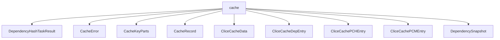

# Namespace `clore::extract::cache`

## Summary

命名空间 `clore::extract::cache` 实现了 Clore 工具集中用于管理提取（extract）结果的缓存子系统。其核心职责包括生成与解析缓存键（`build_cache_key`、`split_cache_key`）、计算编译签名和文件哈希（`build_compile_signature`、`hash_file`）、捕获与检测依赖项变更（`capture_dependency_snapshot`、`dependencies_changed`），以及执行两种分层缓存的持久化操作：较简单的整数型提取缓存（`load_extract_cache`、`save_extract_cache`）和包含完整编译产物与依赖元数据的 clice 缓存（`load_clice_cache`、`save_clice_cache`）。通过这一系列函数，该命名空间支撑着增量编译和缓存复用，避免重复执行耗时的提取步骤。

在结构上，命名空间内部定义了一组记录类型（如 `CacheRecord`、`CliceCacheData`、`CliceCacheDepEntry`、`CliceCachePCMEntry`、`CliceCachePCHEntry`）和辅助类型（`CacheError`、`CacheKeyParts`、`DependencySnapshot`），共同构成了缓存数据的结构化表示。这些类型与对应的读写操作紧密结合，使得上游模块可以基于通用的缓存键和依赖快照决定是否使用缓存结果，从而在编译流程中扮演桥梁角色：将编译单元的状态映射为可存储和比较的令牌，并通过持久化层保持状态的一致性。

## Diagram

```mermaid
graph TD
    NS["cache"]
    T0["DependencyHashTaskResult"]
    NS --> T0
    T1["CacheError"]
    NS --> T1
    T2["CacheKeyParts"]
    NS --> T2
    T3["CacheRecord"]
    NS --> T3
    T4["CliceCacheData"]
    NS --> T4
    T5["CliceCacheDepEntry"]
    NS --> T5
    T6["CliceCachePCHEntry"]
    NS --> T6
    T7["CliceCachePCMEntry"]
    NS --> T7
    T8["DependencySnapshot"]
    NS --> T8
```

## Types

### `clore::extract::cache::CacheError`

Declaration: `src/extract/cache.cppm:36`

Definition: `src/extract/cache.cppm:36`

Implementation: [`Module extract:cache`](../../../../modules/extract/cache.md)

Insufficient evidence to summarize; provide more EVIDENCE.

#### Invariants

- The `message` field holds a human-readable error description.

#### Key Members

- `message`

#### Usage Patterns

- Returned or thrown as an error type within the `clore::extract::cache` module.
- Its `message` member is expected to be accessed to obtain error details.

### `clore::extract::cache::CacheKeyParts`

Declaration: `src/extract/cache.cppm:40`

Definition: `src/extract/cache.cppm:40`

Implementation: [`Module extract:cache`](../../../../modules/extract/cache.md)

Insufficient evidence to summarize; provide more EVIDENCE.

#### Invariants

- `path` stores a file path as a string.
- `compile_signature` stores a 64-bit unsigned integer representing a compile-time signature.
- Both members together uniquely identify a cache entry.

#### Key Members

- `path`
- `compile_signature`

#### Usage Patterns

- Used as a key part for caching extract results based on file path and compile signature.
- Aggregate initialization allows straightforward construction in cache lookup code.

### `clore::extract::cache::CacheRecord`

Declaration: `src/extract/cache.cppm:52`

Definition: `src/extract/cache.cppm:52`

Implementation: [`Module extract:cache`](../../../../modules/extract/cache.md)

Insufficient evidence to summarize; provide more EVIDENCE.

#### Invariants

- `compile_signature` and `source_hash` are initialized to zero
- No further invariants are specified in the evidence

#### Key Members

- `compile_signature`
- `source_hash`
- `ast_deps`
- `scan`
- `ast`

#### Usage Patterns

- Populated and stored in a cache keyed by compile signature and source hash
- Retrieved to reuse previously computed scan and AST results

### `clore::extract::cache::CliceCacheData`

Declaration: `src/extract/cache.cppm:84`

Definition: `src/extract/cache.cppm:84`

Implementation: [`Module extract:cache`](../../../../modules/extract/cache.md)

Insufficient evidence to summarize; provide more EVIDENCE.

#### Invariants

- No explicit invariants are stated; the vectors are independent containers.

#### Key Members

- `paths` — a vector of file paths as strings
- `pch` — a vector of `CliceCachePCHEntry` objects
- `pcm` — a vector of `CliceCachePCMEntry` objects

#### Usage Patterns

- Used to aggregate cache entries for PCH and PCM along with their associated paths
- Likely serialized or passed around within the caching subsystem

### `clore::extract::cache::CliceCacheDepEntry`

Declaration: `src/extract/cache.cppm:62`

Definition: `src/extract/cache.cppm:62`

Implementation: [`Module extract:cache`](../../../../modules/extract/cache.md)

`clore::extract::cache::CliceCacheDepEntry` 是 clice 工作区缓存系统中的一种数据结构，代表单个依赖项的缓存条目。它与服务器端 `CacheData` 结构保持模式兼容，主要用于在提取过程中存储依赖项的相关信息（例如依赖项的哈希或状态），作为 `CliceCacheData` 或 `CacheRecord` 的一部分被序列化和读取，以实现增量缓存和依赖项跟踪。

#### Invariants

- `path` 和 `hash` 均为无符号整数类型
- 默认初始化时两个成员均为零
- 结构体为平凡类型，无自定义构造函数或析构函数

#### Key Members

- `path`：32 位路径标识符
- `hash`：64 位内容哈希

#### Usage Patterns

- 作为 `CliceCache` 或其内部容器中的元素类型
- 与 server 端的 `CacheData` 结构体保持二进制兼容，用于磁盘缓存读写
- 通过直接比较 `hash` 和 `path` 来实现依赖项的快速匹配

### `clore::extract::cache::CliceCachePCHEntry`

Declaration: `src/extract/cache.cppm:67`

Definition: `src/extract/cache.cppm:67`

Implementation: [`Module extract:cache`](../../../../modules/extract/cache.md)

`clore::extract::cache::CliceCachePCHEntry` 表示预编译头文件（PCH）的缓存条目。在提取过程的缓存系统中，它与 `CliceCachePCMEntry`（对应模块单元缓存）、`CliceCacheDepEntry`（对应依赖缓存）等结构体配合，共同构成 `CacheRecord` 的核心组成部分。每个实例封装了一个 PCH 文件的缓存元数据（例如文件标识、哈希值或时间戳），用于判断后续构建中该 PCH 是否仍然有效，从而避免重复的编译与验证步骤。

#### Invariants

- All integer fields are zero-initialized.
- The `filename` and `deps` are empty by default.
- The `deps` vector contains only valid `CliceCacheDepEntry` objects if non-empty.

#### Key Members

- `filename` - the path or name of the PCH file
- `source_file` - index of the source file associated with the PCH
- `hash` - 64-bit content hash of the PCH
- `bound` - unsigned integer counting bindings to this entry
- `build_at` - 64-bit timestamp of when the PCH was built
- `deps` - vector of `CliceCacheDepEntry` representing dependencies

#### Usage Patterns

- Used as the value type in a cache container (e.g., a map from filename to entry).
- Entries are created when a PCH is built and looked up during cache validation.
- The `deps` field is populated with the dependencies of the PCH to track changes.

### `clore::extract::cache::CliceCachePCMEntry`

Declaration: `src/extract/cache.cppm:76`

Definition: `src/extract/cache.cppm:76`

Implementation: [`Module extract:cache`](../../../../modules/extract/cache.md)

Insufficient evidence to summarize; provide more EVIDENCE.

#### Invariants

- `source_file` defaults to `0`
- `build_at` defaults to `0`
- `deps` holds a vector of `CliceCacheDepEntry` objects

#### Key Members

- `filename` field
- `source_file` field
- `module_name` field
- `build_at` field
- `deps` field

#### Usage Patterns

- Used within the cache system to store PCM entry data
- Likely serialized or deserialized as part of cache persistence

### `clore::extract::cache::DependencySnapshot`

Declaration: `src/extract/cache.cppm:45`

Definition: `src/extract/cache.cppm:45`

Implementation: [`Module extract:cache`](../../../../modules/extract/cache.md)

Insufficient evidence to summarize; provide more EVIDENCE.

#### Invariants

- The vectors `files`, `hashes`, and `mtimes` are expected to have the same size (parallel sequences).
- The `build_at` field provides a timestamp for the snapshot, defaulting to zero.

#### Key Members

- `files`
- `hashes`
- `mtimes`
- `build_at`

#### Usage Patterns

- Used to cache dependency information and compare against current file states to determine if a rebuild is necessary.
- Likely serialized and deserialized for persistence across build invocations.
- Consumed by code that validates or updates cached dependency data.

## Functions

### `clore::extract::cache::build_cache_key`

Declaration: `src/extract/cache.cppm:92`

Definition: `src/extract/cache.cppm:244`

Implementation: [`Module extract:cache`](../../../../modules/extract/cache.md)

`clore::extract::cache::build_cache_key` 接受一个 `std::string_view`（代表缓存条目标识符，例如文件路径）和一个 `std::uint64_t`（代表对应的编译期签名），返回一个 `std::string` 形式的唯一缓存键。调用者负责确保传入的标识符和签名正确匹配该缓存条目，且返回的键可用于后续的缓存加载、存储或拆分操作；该函数不校验输入的有效性，由调用者保证参数符合缓存系统的预期格式。

#### Usage Patterns

- Used by cache save and load functions to generate keys for file-based caching of extraction data
- Pairs with `split_cache_key` for round-trip parsing

### `clore::extract::cache::build_compile_signature`

Declaration: `src/extract/cache.cppm:90`

Definition: `src/extract/cache.cppm:240`

Implementation: [`Module extract:cache`](../../../../modules/extract/cache.md)

`clore::extract::cache::build_compile_signature` 为调用者生成一个代表编译单元当前状态的 `std::uint64_t` 签名。它接受一个 `const int &` 参数，该参数标识要为其计算签名的特定编译单元。返回的签名可用于后续的依赖项变化检测或缓存键生成；调用者负责在调用期间保持传入的整数引用有效，并理解该签名仅对生成它时的编译上下文有意义。

#### Usage Patterns

- called to compute a hash‑based compile signature for caching purposes
- used internally by other cache functions such as `load_extract_cache` or `save_extract_cache`

### `clore::extract::cache::capture_dependency_snapshot`

Declaration: `src/extract/cache.cppm:99`

Definition: `src/extract/cache.cppm:298`

Implementation: [`Module extract:cache`](../../../../modules/extract/cache.md)

`clore::extract::cache::capture_dependency_snapshot` 为给定的缓存条目生成当前依赖关系的快照。该函数接受一个 `const int&` 参数（通常是由 `clore::extract::cache::load_extract_cache` 返回的标识符），并返回一个 `std::expected<DependencySnapshot, CacheError>`。成功时，调用者获得一个 `DependencySnapshot` 对象，该对象捕获了该条目所引用的依赖项集合的状态。此快照可以与 `clore::extract::cache::dependencies_changed` 配合使用，以确定自快照捕获以来依赖项是否发生变更。如果快照无法生成（例如由于文件系统错误或无效标识符），函数会返回一个 `CacheError` 来描述失败原因。

#### Usage Patterns

- Called to capture the current state of a set of dependency files
- Used to compare against a previous snapshot to detect changes
- Typically invoked as part of cache invalidation or rebuild logic

### `clore::extract::cache::dependencies_changed`

Declaration: `src/extract/cache.cppm:102`

Definition: `src/extract/cache.cppm:417`

Implementation: [`Module extract:cache`](../../../../modules/extract/cache.md)

函数 `clore::extract::cache::dependencies_changed` 接受一个 `const DependencySnapshot &` 并返回一个 `bool`。调用者应提供一个表示当前编译输入依赖状态的快照。该函数返回 `true` 当且仅当该快照与缓存中记录的上一次成功提取的依赖状态不一致，即至少有一个依赖项（如包含的头文件或所依赖的源文件）发生改变。返回 `false` 表示依赖未改变，因此缓存的提取结果仍然有效。调用者依赖此结果来决定是否应跳过耗时的提取过程，直接复现之前缓存的输出。

#### Usage Patterns

- Called before recompilation or extraction to test cache validity
- Part of cache invalidation logic in extract cache system

### `clore::extract::cache::hash_file`

Declaration: `src/extract/cache.cppm:97`

Definition: `src/extract/cache.cppm:286`

Implementation: [`Module extract:cache`](../../../../modules/extract/cache.md)

计算给定文件的哈希值。调用方需要提供文件路径（`std::string_view`），成功时返回 `std::uint64_t` 表示文件内容的哈希值，失败时返回 `CacheError`。该哈希可用于缓存键构建、请购签名对比等场景，前提是调用方保证文件可读且路径有效。

#### Usage Patterns

- Used to generate a hash of a source file for cache key derivation
- Called before caching dependencies or compile signatures to detect file changes

### `clore::extract::cache::load_clice_cache`

Declaration: `src/extract/cache.cppm:111`

Definition: `src/extract/cache.cppm:686`

Implementation: [`Module extract:cache`](../../../../modules/extract/cache.md)

`clore::extract::cache::load_clice_cache` 接收一个 `std::string_view` 类型的缓存键，尝试加载并返回与该键关联的 `CliceCacheData`。成功时返回一个包含数据的 `std::expected`，失败时返回 `CacheError` 描述失败原因。调用者负责提供有效的缓存键，并处理可能的加载错误。

#### Usage Patterns

- 在提取流程开始时加载缓存，若返回空 `CliceCacheData` 则表示无可用缓存或缓存失效
- 与 `save_clice_cache` 配合实现缓存生命周期管理

### `clore::extract::cache::load_extract_cache`

Declaration: `src/extract/cache.cppm:104`

Definition: `src/extract/cache.cppm:473`

Implementation: [`Module extract:cache`](../../../../modules/extract/cache.md)

函数 `clore::extract::cache::load_extract_cache` 接受一个 `std::string_view` 作为缓存键，加载对应的提取缓存，并返回一个 `int` 表示操作结果。调用者应依赖该返回值判断加载是否成功，但本函数不抛出异常，也不使用 `std::expected` 报告错误。

#### Usage Patterns

- called with a workspace root to retrieve previously saved extract cache data
- used before extracting to check if a cached result exists
- typically paired with `save_extract_cache` for caching extraction results

### `clore::extract::cache::save_clice_cache`

Declaration: `src/extract/cache.cppm:113`

Definition: `src/extract/cache.cppm:726`

Implementation: [`Module extract:cache`](../../../../modules/extract/cache.md)

`clore::extract::cache::save_clice_cache` 接受一个 `std::string_view` 标识符和一个 `const CliceCacheData &` 数据对象，尝试将提供的缓存数据持久化到与该标识符关联的存储中。该函数返回一个 `std::expected<void, CacheError>`：如果操作成功，期望包含 `void`；如果保存过程中遇到错误（如文件系统失败、序列化问题或存储冲突），则包含一个 `CacheError` 描述失败原因。

调用者负责确保标识符有效且唯一，并保证传入的 `CliceCacheData` 对象已正确构造并包含需要缓存的完整状态。成功保存后，后续对 `clore::extract::cache::load_clice_cache` 的调用将能够恢复该数据，前提是存储内容未被外部修改或清除。

#### Usage Patterns

- called to persist a `CliceCacheData` snapshot to disk
- used after cache computation completes to store results
- likely invoked by `clore::extract::cache::save_extract_cache` or similar cache-saving routines

### `clore::extract::cache::save_extract_cache`

Declaration: `src/extract/cache.cppm:107`

Definition: `src/extract/cache.cppm:549`

Implementation: [`Module extract:cache`](../../../../modules/extract/cache.md)

`clore::extract::cache::save_extract_cache` 负责将提取缓存持久化到存储后端。调用方提供一个缓存标识符（`std::string_view`）和一个关联的整数值（`const int &`），函数尝试保存该键值对；成功时返回空的 `std::expected<void, CacheError>`，失败时返回描述错误的 `CacheError`。

该函数是缓存系统中写入操作的基础设施，与 `load_extract_cache` 对称。调用方应确保提供的标识符与后续读取时使用的标识符一致，并检查返回的 `expected` 以处理可能的持久化失败（例如文件系统错误或校验和不匹配）。

#### Usage Patterns

- Called to persist a collection of `CacheRecord` entries after an extraction pass
- Used in the cache management pipeline alongside `load_extract_cache`
- Typically invoked when the caller has built the records from compilation and dependency analysis

### `clore::extract::cache::split_cache_key`

Declaration: `src/extract/cache.cppm:95`

Definition: `src/extract/cache.cppm:254`

Implementation: [`Module extract:cache`](../../../../modules/extract/cache.md)

`clore::extract::cache::split_cache_key` 负责将单个缓存键字符串（`std::string_view`）拆分为结构化的 `CacheKeyParts`。若输入格式符合预期且解析成功，返回包含分解后各部分的 `std::expected`；否则返回 `CacheError` 指示失败原因。

调用者应确保传入的字符串是由系统内部其他缓存函数（如 `build_cache_key`）生成的合法缓存键。此函数不会修改原始输入，所有权由调用方保留。失败时返回的错误可用于诊断缓存键不匹配或格式错误等问题。

#### Usage Patterns

- decompose keys built by `build_cache_key`
- validate and extract parts of a cache key before further processing

## Related Pages

- [Namespace clore::extract](../index.md)

