# Namespace `clore::extract`

## Summary

`clore::extract` 命名空间负责从 C++ 项目中提取符号、模块和依赖关系，是代码提取工具的核心。它声明了若干关键类型与函数：`ProjectModel` 表示项目模型，`SymbolInfo` 和 `SymbolKind` 描述提取的符号；`CompilationDatabase`、`CompileEntry` 管理编译配置；`ModuleUnit`、`DependencyGraph` 处理模块及依赖图谱；`ScanCache`、`ASTResult` 支持缓存和高效解析。此外，还提供了用于规范化路径、清理编译参数、重建索引和异步提取的实用工具（如 `normalize_entry_file`、`sanitize_driver_arguments`、`rebuild_lookup_maps`、`extract_project_async` 等）。在架构上，该命名空间将原始编译数据转化为结构化的符号与依赖信息，为上层分析工具提供统一的查询接口。

## Diagram

```mermaid
graph TD
    NS["extract"]
    T0["LocalIndexData"]
    NS --> T0
    T1["ASTError"]
    NS --> T1
    T2["ASTResult"]
    NS --> T2
    T3["CompDbError"]
    NS --> T3
    T4["CompilationDatabase"]
    NS --> T4
    T5["CompileEntry"]
    NS --> T5
    T6["DependencyEdge"]
    NS --> T6
    T7["DependencyGraph"]
    NS --> T7
    T8["ExtractError"]
    NS --> T8
    T9["ExtractedRelation"]
    NS --> T9
    T10["FileInfo"]
    NS --> T10
    T11["IncludeInfo"]
    NS --> T11
    T12["ModuleUnit"]
    NS --> T12
    T13["NamespaceInfo"]
    NS --> T13
    T14["PathResolveError"]
    NS --> T14
    T15["ProjectModel"]
    NS --> T15
    T16["ScanCache"]
    NS --> T16
    T17["ScanError"]
    NS --> T17
    T18["ScanResult"]
    NS --> T18
    T19["SourceLocation"]
    NS --> T19
    T20["SourceRange"]
    NS --> T20
    T21["SymbolID"]
    NS --> T21
    T22["SymbolInfo"]
    NS --> T22
    T23["SymbolKind"]
    NS --> T23
    NSC0["cache"]
    NS --> NSC0
```



## Subnamespaces

- [`clore::extract::cache`](cache/index.md)

## Types

### `clore::extract::ASTError`

Declaration: `extract/ast.cppm:26`

Definition: `extract/ast.cppm:26`

Implementation: [`Module extract:ast`](../../../modules/extract/ast.md)

Insufficient evidence to summarize; provide more EVIDENCE.

#### Invariants

- `message` 成员始终包含有效的错误描述字符串。

#### Key Members

- `message`

#### Usage Patterns

- 作为 `clore::extract` 命名空间中错误处理的结果类型使用。

### `clore::extract::ASTResult`

Declaration: `extract/ast.cppm:37`

Definition: `extract/ast.cppm:37`

Implementation: [`Module extract:ast`](../../../modules/extract/ast.md)

Insufficient evidence to summarize; provide more EVIDENCE.

#### Invariants

- 字段均为公共向量，可自由读写
- 无显式不变量约束

#### Key Members

- `symbols`
- `relations`
- `dependencies`

#### Usage Patterns

- 作为提取管道的输出类型
- 由分析函数填充并返回
- 消费者遍历各向量以获取提取结果

### `clore::extract::CompDbError`

Declaration: `extract/compiler.cppm:38`

Definition: `extract/compiler.cppm:38`

Implementation: [`Module extract:compiler`](../../../modules/extract/compiler.md)

Insufficient evidence to summarize; provide more EVIDENCE.

#### Invariants

- The `message` member is always default-constructible and movable.

#### Key Members

- `message`

#### Usage Patterns

- Caught or checked by callers of `clore::extract` functions that may fail.

### `clore::extract::CompilationDatabase`

Declaration: `extract/compiler.cppm:31`

Definition: `extract/compiler.cppm:31`

Implementation: [`Module extract:compiler`](../../../modules/extract/compiler.md)

Insufficient evidence to summarize; provide more EVIDENCE.

#### Member Functions

##### `clore::extract::CompilationDatabase::has_cached_toolchain`

Declaration: `extract/compiler.cppm:35`

Definition: `extract/compiler.cppm:229`

Implementation: [`Module extract:compiler`](../../../modules/extract/compiler.md)

###### Declaration

```cpp
auto () const -> bool;
```

### `clore::extract::CompileEntry`

Declaration: `extract/compiler.cppm:21`

Definition: `extract/compiler.cppm:21`

Implementation: [`Module extract:compiler`](../../../modules/extract/compiler.md)

Insufficient evidence to summarize; provide more EVIDENCE.

#### Invariants

- 字段的默认值为空字符串、空向量、零或 `std::nullopt`，表示使用前应被填充。

#### Key Members

- `file`
- `directory`
- `arguments`
- `normalized_file`
- `compile_signature`
- `source_hash`
- `cache_key`

#### Usage Patterns

- 用于表示从编译数据库或构建系统中提取的单个编译条目。
- 可能用于编译缓存或重新执行的输入。

### `clore::extract::DependencyEdge`

Declaration: `extract/scan.cppm:51`

Definition: `extract/scan.cppm:51`

Implementation: [`Module extract:scan`](../../../modules/extract/scan.md)

Insufficient evidence to summarize; provide more EVIDENCE.

#### Invariants

- The struct has exactly two `std::string` members: `from` and `to`.
- Both members are publicly accessible.

#### Key Members

- `from`: the source node identifier.
- `to`: the target node identifier.

#### Usage Patterns

- Used in the `clore::extract` module to represent dependencies between extracted symbols.
- Edges are combined into lists or sets to form dependency graphs.

### `clore::extract::DependencyGraph`

Declaration: `extract/scan.cppm:56`

Definition: `extract/scan.cppm:56`

Implementation: [`Module extract:scan`](../../../modules/extract/scan.md)

Insufficient evidence to summarize; provide more EVIDENCE.

#### Invariants

- Each element in `edges` references indices or paths in `files` (implied by typical dependency graph usage, but not explicitly guaranteed by the evidence).

#### Key Members

- `files`: a `std::vector<std::string>` of file paths.
- `edges`: a `std::vector<DependencyEdge>` of dependency relationships.

#### Usage Patterns

- Used to represent the complete dependency information extracted from source files.
- Consumed by downstream analysis or transformation passes.

### `clore::extract::ExtractError`

Declaration: `extract/extract.cppm:21`

Definition: `extract/extract.cppm:21`

Implementation: [`Module extract`](../../../modules/extract/index.md)

Insufficient evidence to summarize; provide more EVIDENCE.

### `clore::extract::ExtractedRelation`

Declaration: `extract/ast.cppm:30`

Definition: `extract/ast.cppm:30`

Implementation: [`Module extract:ast`](../../../modules/extract/ast.md)

Insufficient evidence to summarize; provide more EVIDENCE.

#### Invariants

- `from` 和 `to` 必须为有效的 `SymbolID`
- `is_call` 和 `is_inheritance` 至少一个为 true 或均为 false

#### Key Members

- `from`：关系的源符号标识
- `to`：关系的目标符号标识
- `is_call`：是否为调用关系
- `is_inheritance`：是否为继承关系

#### Usage Patterns

- 用于构建符号之间的调用图
- 用于记录继承层次结构
- 在提取阶段填充此结构体以描述符号间依赖

### `clore::extract::FileInfo`

Declaration: `extract/model.cppm:122`

Definition: `extract/model.cppm:122`

Implementation: [`Module extract:model`](../../../modules/extract/model.md)

Insufficient evidence to summarize; provide more EVIDENCE.

#### Invariants

- Each `symbols` entry corresponds to a distinct symbol extracted from the file
- `path` uniquely identifies the source file within the extraction context
- `includes` lists the immediate file dependencies as seen by the extractor

#### Key Members

- `path`
- `symbols`
- `includes`

#### Usage Patterns

- Used to represent the result of extracting symbols and dependencies from a single file
- Collected into lists or maps keyed by file path for downstream analysis
- Consumed by tools that transform or visualize include hierarchies and symbol definitions

### `clore::extract::IncludeInfo`

Declaration: `extract/scan.cppm:24`

Definition: `extract/scan.cppm:24`

Implementation: [`Module extract:scan`](../../../modules/extract/scan.md)

Insufficient evidence to summarize; provide more EVIDENCE.

#### Invariants

- The `path` member holds the include path as specified in the source
- The `is_angled` member distinguishes between `#include <...>` (true) and `#include "..."` (false)

#### Key Members

- `path`
- `is_angled`

#### Usage Patterns

- Created when parsing include directives from source code
- Used to reconstruct or analyze include statements

### `clore::extract::ModuleUnit`

Declaration: `extract/model.cppm:135`

Definition: `extract/model.cppm:135`

Implementation: [`Module extract:model`](../../../modules/extract/model.md)

`clore::extract::ModuleUnit` 表示一个单一的 C++20 模块单元，即模块接口单元或模块分区单元。该类型是 `clore::extract` 命名空间中模型结构的一部分，用于在提取工具中描述和操作模块系统的组成单元，通常与其他模型类型（如 `ProjectModel`、`DependencyGraph` 等）配合使用，以构建对项目结构的理解。

#### Invariants

- `name`是完整的模块名，例如"foo"或"foo:bar"
- `is_interface`为真表示导出模块，为假表示非导出模块
- `source_file`是归一化后的源文件路径
- `imports`列出该模块单元的导入
- `symbols`列出在该模块单元中声明的`SymbolID`

#### Key Members

- `name`
- `is_interface`
- `source_file`
- `imports`
- `symbols`

#### Usage Patterns

- 用于在提取过程中表示每个模块单元
- 作为模块信息的元数据容器

### `clore::extract::NamespaceInfo`

Declaration: `extract/model.cppm:128`

Definition: `extract/model.cppm:128`

Implementation: [`Module extract:model`](../../../modules/extract/model.md)

Insufficient evidence to summarize; provide more EVIDENCE.

#### Invariants

- `name` is the fully qualified or relative namespace name
- `symbols` contains `SymbolIDs` of entities directly declared in this namespace
- `children` lists the names of immediately nested namespaces

#### Key Members

- `name` identifies the namespace
- `symbols` stores direct symbol references
- `children` holds child namespace names

#### Usage Patterns

- Populated by extraction code to represent namespace hierarchy
- Consumed by documentation generators to produce namespace pages

### `clore::extract::PathResolveError`

Declaration: `extract/filter.cppm:8`

Definition: `extract/filter.cppm:8`

Implementation: [`Module extract:filter`](../../../modules/extract/filter.md)

Insufficient evidence to summarize; provide more EVIDENCE.

#### Invariants

- The `message` member contains a description of the error.

#### Key Members

- `message`

#### Usage Patterns

- Returned by functions that perform path resolution to indicate failure.
- Calling code can inspect `message` to display or log the error.

### `clore::extract::ProjectModel`

Declaration: `extract/model.cppm:143`

Definition: `extract/model.cppm:143`

Implementation: [`Module extract:model`](../../../modules/extract/model.md)

Insufficient evidence to summarize; provide more EVIDENCE.

#### Invariants

- `symbols` 中的每个 `SymbolID` 唯一标识一个符号。
- `files` 和 `modules` 的键都是规范化的源文件路径。
- `file_order` 保持源文件的解析顺序。
- `symbol_ids_by_qualified_name` 允许一个限定名对应多个重载。
- `uses_modules` 仅在检测到至少一个模块声明时为 true。

#### Key Members

- `symbols`
- `files`
- `namespaces`
- `file_order`
- `modules`
- `symbol_ids_by_qualified_name`
- `module_name_to_sources`
- `uses_modules`

#### Usage Patterns

- 提取阶段填充模型，后续生成代码或证据时查询。
- 通过 `symbol_ids_by_qualified_name` 进行符号的精确限定名查找。
- 通过 `modules` 和 `module_name_to_sources` 处理 C++20 模块依赖。
- `uses_modules` 用于判断是否采用模块化编译策略。

### `clore::extract::ScanCache`

Declaration: `extract/scan.cppm:40`

Definition: `extract/scan.cppm:40`

Implementation: [`Module extract:scan`](../../../modules/extract/scan.md)

`clore::extract::ScanCache` 是一个持久化的缓存结构，用于在多次连续的依赖扫描之间共享数据。其设计目的是避免重复计算，从而提高扫描效率。当编译数据库或文件系统状态发生变化时，调用方必须主动清除或丢弃该缓存，以确保扫描结果与当前环境一致。

#### Invariants

- Cache entries are valid only as long as the compilation database and file system state remain unchanged.
- The map key uniquely identifies a scan target (e.g., source file or header).
- The cache should be cleared or replaced when external state changes.

#### Key Members

- `scan_results`: the underlying hash map storing cached scan results.

#### Usage Patterns

- Used by scan functions to avoid redundant re‑scanning of unchanged input files.
- Callers are responsible for clearing or discarding the cache when the compilation DB or file system is modified.
- Typically passed by reference to scan utilities so that results accumulate across multiple calls.

### `clore::extract::ScanError`

Declaration: `extract/scan.cppm:20`

Definition: `extract/scan.cppm:20`

Implementation: [`Module extract:scan`](../../../modules/extract/scan.md)

证据不足，无法总结；请提供更多证据。

#### Key Members

- `message` field (type `std::string`)

### `clore::extract::ScanResult`

Declaration: `extract/scan.cppm:29`

Definition: `extract/scan.cppm:29`

Implementation: [`Module extract:scan`](../../../modules/extract/scan.md)

Insufficient evidence to summarize; provide more EVIDENCE.

#### Invariants

- All vectors are properly initialized (default-constructed empty).
- `module_name` is a valid empty or non-empty string.
- `is_interface_unit` is either `true` or `false`.

#### Key Members

- `module_name`
- `is_interface_unit`
- `includes`
- `module_imports`

#### Usage Patterns

- Returned from scanning functions to represent the parsed module data.
- Inspected by callers to access the module name, imports, includes, and interface status.

### `clore::extract::SourceLocation`

Declaration: `extract/model.cppm:64`

Definition: `extract/model.cppm:64`

Implementation: [`Module extract:model`](../../../modules/extract/model.md)

Insufficient evidence to summarize; provide more EVIDENCE.

#### Invariants

- `line == 0` indicates the source location is unknown; otherwise `line >= 1`
- `file` and `column` have no guaranteed constraints (may be empty/0)

#### Key Members

- `file` field
- `line` field
- `column` field
- `is_known()` method

#### Usage Patterns

- Returned or accepted by extraction `APIs` to describe where source content was found
- Checked via `is_known()` before using the location

#### Member Functions

##### `clore::extract::SourceLocation::is_known`

Declaration: `extract/model.cppm:70`

Definition: `extract/model.cppm:70`

Implementation: [`Module extract:model`](../../../modules/extract/model.md)

###### Declaration

```cpp
bool () const noexcept;
```

### `clore::extract::SourceRange`

Declaration: `extract/model.cppm:75`

Definition: `extract/model.cppm:75`

Implementation: [`Module extract:model`](../../../modules/extract/model.md)

Insufficient evidence to summarize; provide more EVIDENCE.

### `clore::extract::SymbolID`

Declaration: `extract/model.cppm:28`

Definition: `extract/model.cppm:28`

Implementation: [`Module extract:model`](../../../modules/extract/model.md)

Insufficient evidence to summarize; provide more EVIDENCE.

#### Invariants

- `hash` 为 0 表示无效标识符，有效标识符的 `hash` 必为非零
- `signature` 用于在极小概率的 64 位哈希碰撞时进行区分
- 默认比较操作符比较所有字段（先 `hash`，后 `signature`）

#### Key Members

- `hash`
- `signature`
- `is_valid()`
- `operator==`
- `operator<=>`

#### Usage Patterns

- 作为符号的唯一标识符被其他代码使用
- 通过 `is_valid()` 检查标识符是否有效
- 利用默认比较操作符进行排序或集合操作

#### Member Functions

##### `clore::extract::SymbolID::is_valid`

Declaration: `extract/model.cppm:35`

Definition: `extract/model.cppm:35`

Implementation: [`Module extract:model`](../../../modules/extract/model.md)

###### Declaration

```cpp
bool () const noexcept;
```

##### `clore::extract::SymbolID::operator<=>`

Declaration: `extract/model.cppm:40`

Definition: `extract/model.cppm:40`

Implementation: [`Module extract:model`](../../../modules/extract/model.md)

###### Declaration

```cpp
auto (const SymbolID &) const;
```

##### `clore::extract::SymbolID::operator==`

Declaration: `extract/model.cppm:39`

Definition: `extract/model.cppm:39`

Implementation: [`Module extract:model`](../../../modules/extract/model.md)

###### Declaration

```cpp
bool (const SymbolID &) const;
```

### `clore::extract::SymbolInfo`

Declaration: `extract/model.cppm:80`

Definition: `extract/model.cppm:80`

Implementation: [`Module extract:model`](../../../modules/extract/model.md)

`clore::extract::SymbolInfo` 表示提取过程中遇到的单个符号的完整元数据。它通常结合 `clore::extract::SymbolKind` 枚举以描述符号种类（如变量、函数、类型等），并可能通过 `clore::extract::SymbolID` 提供唯一标识，同时引用 `clore::extract::SourceLocation` 或 `clore::extract::SourceRange` 记录其在源代码中的位置。该结构是构建 `clore::extract::ProjectModel` 和 `clore::extract::DependencyGraph` 等高层模型的基础组件，用于在 C++ 项目提取结果中表示符号的层级关系与上下文信息。

#### Invariants

- `id` uniquely identifies the symbol
- `declaration_location` is always set
- `source_snippet` may be empty, in which case `source_snippet_offset`, `source_snippet_length`, `source_snippet_file_size`, and `source_snippet_hash` reference the raw source text in `declaration_location.file`
- `parent` and `children` form a tree hierarchy
- `bases` and `derived` reflect inheritance relationships
- `calls` and `called_by` are symmetric directed edges from call graph
- `references` and `referenced_by` are symmetric directed edges from reference graph

#### Key Members

- `id`
- `name`
- `qualified_name`
- `kind`
- `declaration_location`
- `parent`
- `children`
- `bases`
- `derived`
- `calls`
- `called_by`
- `references`
- `referenced_by`

#### Usage Patterns

- Serialized as part of extracted symbol database
- Consumed by tools for code navigation, dependency analysis, and documentation generation
- Populated by the extraction pass that processes AST nodes
- Queried via `SymbolID` to traverse relationships

### `clore::extract::SymbolKind`

Declaration: `extract/model.cppm:8`

Definition: `extract/model.cppm:8`

Implementation: [`Module extract:model`](../../../modules/extract/model.md)

Insufficient evidence to summarize; provide more EVIDENCE.

#### Member Variables

##### `clore::extract::SymbolKind::Class`

Declaration: `extract/model.cppm:10`

Implementation: [`Module extract:model`](../../../modules/extract/model.md)

###### Declaration

```cpp
Class
```

##### `clore::extract::SymbolKind::Concept`

Declaration: `extract/model.cppm:22`

Implementation: [`Module extract:model`](../../../modules/extract/model.md)

###### Declaration

```cpp
Concept
```

##### `clore::extract::SymbolKind::Enum`

Declaration: `extract/model.cppm:13`

Implementation: [`Module extract:model`](../../../modules/extract/model.md)

###### Declaration

```cpp
Enum
```

##### `clore::extract::SymbolKind::EnumMember`

Declaration: `extract/model.cppm:14`

Implementation: [`Module extract:model`](../../../modules/extract/model.md)

###### Declaration

```cpp
EnumMember
```

##### `clore::extract::SymbolKind::Field`

Declaration: `extract/model.cppm:18`

Implementation: [`Module extract:model`](../../../modules/extract/model.md)

###### Declaration

```cpp
Field
```

##### `clore::extract::SymbolKind::Function`

Declaration: `extract/model.cppm:15`

Implementation: [`Module extract:model`](../../../modules/extract/model.md)

###### Declaration

```cpp
Function
```

##### `clore::extract::SymbolKind::Macro`

Declaration: `extract/model.cppm:20`

Implementation: [`Module extract:model`](../../../modules/extract/model.md)

###### Declaration

```cpp
Macro
```

##### `clore::extract::SymbolKind::Method`

Declaration: `extract/model.cppm:16`

Implementation: [`Module extract:model`](../../../modules/extract/model.md)

###### Declaration

```cpp
Method
```

##### `clore::extract::SymbolKind::Namespace`

Declaration: `extract/model.cppm:9`

Implementation: [`Module extract:model`](../../../modules/extract/model.md)

###### Declaration

```cpp
Namespace
```

##### `clore::extract::SymbolKind::Struct`

Declaration: `extract/model.cppm:11`

Implementation: [`Module extract:model`](../../../modules/extract/model.md)

###### Declaration

```cpp
Struct
```

##### `clore::extract::SymbolKind::Template`

Declaration: `extract/model.cppm:21`

Implementation: [`Module extract:model`](../../../modules/extract/model.md)

###### Declaration

```cpp
Template
```

##### `clore::extract::SymbolKind::TypeAlias`

Declaration: `extract/model.cppm:19`

Implementation: [`Module extract:model`](../../../modules/extract/model.md)

###### Declaration

```cpp
TypeAlias
```

##### `clore::extract::SymbolKind::Union`

Declaration: `extract/model.cppm:12`

Implementation: [`Module extract:model`](../../../modules/extract/model.md)

###### Declaration

```cpp
Union
```

##### `clore::extract::SymbolKind::Unknown`

Declaration: `extract/model.cppm:23`

Implementation: [`Module extract:model`](../../../modules/extract/model.md)

###### Declaration

```cpp
Unknown
```

##### `clore::extract::SymbolKind::Variable`

Declaration: `extract/model.cppm:17`

Implementation: [`Module extract:model`](../../../modules/extract/model.md)

###### Declaration

```cpp
Variable
```

## Variables

### `clore::extract::append_unique`

Declaration: `extract/merge.cppm:12`

Implementation: [`Module extract:merge`](../../../modules/extract/merge.md)

`clore::extract::append_unique` is a public template variable declared in `extract/merge.cppm` at line 12, accepting a type parameter `typename T`. It resides in the `clore::extract` namespace and is listed alongside other variables used in symbol extraction and merging logic.

### `clore::extract::append_unique_range`

Declaration: `extract/merge.cppm:19`

Implementation: [`Module extract:merge`](../../../modules/extract/merge.md)

This is a public template variable `clore::extract::append_unique_range` declared in `extract/merge.cppm`. The available snippet `void append_unique_range` indicates it is defined as a function taking no arguments and returning void, but the exact nature as a variable is unclear.

### `clore::extract::deduplicate`

Declaration: `extract/merge.cppm:49`

Implementation: [`Module extract:merge`](../../../modules/extract/merge.md)

{
  "`overview_markdown`": "A template function `deduplicate` is declared as `void deduplicate`.",
  "`details_markdown`": "No additional details are available from the evidence.",
  "`is_mutated`": false,
  "`mutation_sources`": "",
  "`usage_patterns`": ""
}

## Functions

### `clore::extract::build_compile_signature`

Declaration: `extract/compiler.cppm:58`

Definition: `extract/compiler.cppm:110`

Implementation: [`Module extract:compiler`](../../../modules/extract/compiler.md)

函数 `clore::extract::build_compile_signature` 为给定的 `CompileEntry` 计算一个唯一的 64 位编译签名。该签名可用于快速识别或区分编译配置，常用于缓存、去重或索引场景。调用者应预期该签名对编译条目中的关键属性（如源文件路径、编译选项、宏定义等）敏感，且对同一逻辑配置始终返回相同的值。

调用者应假设 `build_compile_signature` 的返回值在 `CompileEntry` 的生存期内稳定，并适用于作为哈希表键或相等性比较的依据。该函数不会抛出异常，并提供强确定性输出；若需对编译条目进行标准化处理，函数内部依赖 `normalize_entry_file` 来规范化文件路径，从而提升签名的稳定性。

#### Usage Patterns

- Used to obtain a stable identifier for a compile entry.
- Likely used for caching or detecting changes in compile configurations.

### `clore::extract::build_dependency_graph_async`

Declaration: `extract/scan.cppm:61`

Definition: `extract/scan.cppm:370`

Implementation: [`Module extract:scan`](../../../modules/extract/scan.md)

函数 `clore::extract::build_dependency_graph_async` 异步地构建模块依赖图。调用者必须提供一个引用标识符（`const int &`）、一个用于接收结果的可修改 `DependencyGraph &` 对象、一个可选的 `ScanCache *` 指针（允许为 `nullptr`），以及一个 `kota::event_loop &` 来调度异步任务。函数将依赖图填充到提供的 `DependencyGraph` 中，并通过返回的非负 `int` 值指示操作是否成功发起。调用者负责确保 `DependencyGraph` 和 `ScanCache`（若提供）在异步操作完成前保持有效，且事件循环持续运行直至任务结束。未提供 `ScanCache` 时，函数会从头扫描；提供时则可利用缓存加速重复构建。

#### Usage Patterns

- called to asynchronously construct a dependency graph before topological ordering
- used in build or analysis pipelines where concurrency is needed
- invoked with a `ScanCache*` to accelerate repeated scans

### `clore::extract::canonical_graph_path`

Declaration: `extract/filter.cppm:21`

Definition: `extract/filter.cppm:103`

Implementation: [`Module extract:filter`](../../../modules/extract/filter.md)

函数 `clore::extract::canonical_graph_path` 接受一个 `const int &` 参数（通常表示一个路径的索引或标识），并返回一个 `int`（表示该路径的规范化形式）。其职责是将输入的路径标识转换为该路径在提取的工具（如依赖图或符号查找）中使用的唯一、规范化的表示。调用者有责任确保传入的参数对应一个有效的、已知的图路径；返回的规范值可用于在图结构内进行一致且无歧义的比较或查找。

#### Usage Patterns

- used to obtain a unique, normalised graph path for file-based nodes
- called during graph construction to canonicalize source file paths

### `clore::extract::create_compiler_instance`

Declaration: `extract/compiler.cppm:65`

Definition: `extract/compiler.cppm:297`

Implementation: [`Module extract:compiler`](../../../modules/extract/compiler.md)

函数 `clore::extract::create_compiler_instance` 根据提供的 `CompileEntry` 创建一个新的编译器实例。它接受一个对 `CompileEntry` 的常量引用，并最终返回一个整数，该整数指示操作的结果（通常成功时返回 `0`，错误时返回非零错误码）。调用者必须确保 `CompileEntry` 包含有效的编译参数（如编译器路径、源文件路径和编译选项），因为该函数依赖这些信息来正确配置和初始化编译器。

#### Usage Patterns

- Typically called by extraction pipeline to obtain a compiler instance for parsing source files

### `clore::extract::ensure_cache_key`

Declaration: `extract/compiler.cppm:60`

Definition: `extract/compiler.cppm:225`

Implementation: [`Module extract:compiler`](../../../modules/extract/compiler.md)

Declaration: [Declaration](functions/ensure-cache-key.md)

函数 `clore::extract::ensure_cache_key` 确保给定的 `CompileEntry` 对象已具备可用于缓存查询的唯一键值。该函数会就地修改传入的条目，为后续的工具链参数缓存（例如由 `clore::extract::query_toolchain_cached` 执行的操作）建立正确的匹配依据。调用方应在依赖缓存机制的流程之前调用此函数，以保证缓存体系的一致性。

#### Usage Patterns

- Called by `query_toolchain_cached` before attempting to use cached toolchain information to ensure the entry has a valid cache key.

### `clore::extract::ensure_cache_key_impl`

Declaration: `extract/compiler.cppm:119`

Definition: `extract/compiler.cppm:119`

Implementation: [`Module extract:compiler`](../../../modules/extract/compiler.md)

Declaration: [Declaration](functions/ensure-cache-key-impl.md)

该函数负责在给定的 `CompileEntry` 对象中建立或更新缓存键，确保后续对工具链参数的缓存操作（例如由 `clore::extract::query_toolchain_cached` 执行的操作）能够基于一致且唯一的键值进行匹配。调用方应预期该函数会就地修改传入的条目，使其具备可供缓存体系使用的标识信息。

此函数是 `clore::extract::ensure_cache_key` 的内部实现，调用方通常应使用后者提供的公开接口。在需要直接控制缓存键生成流程或进行更精细的生命周期管理时，可以调用此实现函数，但必须保证在调用任何依赖缓存键的函数前完成调用。函数不返回任何值，仅通过引用参数施加副作用。

#### Usage Patterns

- Called by `clore::extract::ensure_cache_key`

### `clore::extract::extract_project_async`

Declaration: `extract/extract.cppm:25`

Definition: `extract/extract.cppm:539`

Implementation: [`Module extract`](../../../modules/extract/index.md)

调用者调用 `clore::extract::extract_project_async` 以启动指定项目的异步符号提取。该函数接受一个项目标识符（通过 `const int &` 参数传递）和一个 `kota::event_loop &` 事件循环引用，后者负责调度所有异步工作。函数立即返回一个 `int`，表示操作启动的结果（成功或错误码）。提取期间，调用者必须确保参数在操作完成前保持有效；具体完成或取消机制由底层事件循环驱动。

#### Usage Patterns

- Called as the main entry point for extracting a project's symbols asynchronously
- Uses coroutine pattern with `kota::task` and `co_await`
- Cooperates with caching subsystem to avoid redundant AST extraction
- Relies on parallel AST extraction batch task for performance
- Handles errors via `kota::fail` and custom error type `ExtractError`

### `clore::extract::extract_symbols`

Declaration: `extract/ast.cppm:43`

Definition: `extract/ast.cppm:669`

Implementation: [`Module extract:ast`](../../../modules/extract/ast.md)

调用 `clore::extract::extract_symbols` 以执行符号提取操作。此函数接收一个对 `int` 的 `const` 引用作为输入，通常代表已加载或已解析的项目模型标识符。调用方需确保传入的参数对应一个可用的项目状态，且该状态已满足提取前置条件（例如，依赖项已被解析、编译数据库已被加载）。函数返回一个 `int` 值，表示提取结果的状态码或提取到的符号数量，调用方应根据该返回值判断操作是否成功。

#### Usage Patterns

- Used to extract symbols from a single compile entry
- Called as part of a larger extraction pipeline (e.g., `extract_project_async`)
- Returns an `expected` that callers handle for success or error

### `clore::extract::filter_root_path`

Declaration: `extract/filter.cppm:27`

Definition: `extract/filter.cppm:161`

Implementation: [`Module extract:filter`](../../../modules/extract/filter.md)

`clore::extract::filter_root_path` 接受一个表示路径的整数标识，并返回该路径经过过滤后的根路径标识。该函数负责从给定的路径中提取或规约出一个对应于项目根或筛选后根目录的标识，用于后续的路径比较、依赖分析或相对路径计算。调用者应保证传入的路径标识有效且属于当前已知的路径集合；函数不修改外部状态，且假设输入标识对应的路径已正确解析或注册。

#### Usage Patterns

- Used to obtain a canonical root path for filtering operations
- Called when a normalized base directory is required

### `clore::extract::find_module_by_name`

Declaration: `extract/model.cppm:188`

Definition: `extract/model.cppm:416`

Implementation: [`Module extract:model`](../../../modules/extract/model.md)

`clore::extract::find_module_by_name` 在给定的 `ProjectModel` 中查找与指定标识符对应的模块单元。第二个参数 `int` 表示模块名称的内部标识符；该标识符通常从 `ProjectModel` 的名称查找机制获得。函数返回指向匹配 `ModuleUnit` 的常量指针，如果未找到任何模块则返回空指针。调用者必须确保提供的标识符在 `ProjectModel` 的上下文中有意义，且函数不修改模型。调用者不应缓存返回指针的生存期，因为模型的生命周期由调用者管理。

#### Usage Patterns

- Resolve a single module by name for symbol extraction
- Disambiguate between multiple modules with the same name by preferring interface units
- Fail gracefully when ambiguous module names exist

### `clore::extract::find_module_by_source`

Declaration: `extract/model.cppm:194`

Definition: `extract/model.cppm:449`

Implementation: [`Module extract:model`](../../../modules/extract/model.md)

`clore::extract::find_module_by_source` 接受一个 `ProjectModel` 引用和一个整数标识符（代表源文件或翻译单元），然后返回一个指向 `ModuleUnit` 的常量指针。如果项目模型中存在与给定源标识符关联的模块单元，则返回指向该单元的指针；否则返回 `nullptr`。调用方负责确保传入的整数标识符在项目模型的上下文中有效，但无需预判查找结果——该函数始终以安全的方式执行查询。

#### Usage Patterns

- Used to retrieve a module unit given its source file path
- Often called after scanning or building the project model

### `clore::extract::find_modules_by_name`

Declaration: `extract/model.cppm:191`

Definition: `extract/model.cppm:395`

Implementation: [`Module extract:model`](../../../modules/extract/model.md)

`clore::extract::find_modules_by_name` 接受一个 `ProjectModel` 引用和一个整数参数，该整数代表要查找的模块名称的标识符或索引。它返回一个 `int`，指示操作的结果——通常是匹配的模块数量或状态码。调用者应确保传入的整数参数有效，并依据返回值判断是否成功找到指定的模块。该函数与 `clore::extract::find_module_by_name` 不同，后者返回单个 `const ModuleUnit *`，而此函数侧重于数量或批量结果。

#### Usage Patterns

- retrieve modules by name from project model
- look up module units by module name

### `clore::extract::find_symbol`

Declaration: `extract/model.cppm:179`

Definition: `extract/model.cppm:371`

Implementation: [`Module extract:model`](../../../modules/extract/model.md)

函数 `clore::extract::find_symbol` 在给定的 `ProjectModel` 中根据一个整数标识符查找对应的符号信息。调用方应传入有效的项目模型引用和表示符号唯一ID的整数值，函数返回指向 `SymbolInfo` 的常量指针，若未找到则返回空指针。返回的指针指向模型内部管理的生命周期，调用方不得持有超过模型更新或销毁的时间点。

### `clore::extract::find_symbol`

Declaration: `extract/model.cppm:181`

Definition: `extract/model.cppm:379`

Implementation: [`Module extract:model`](../../../modules/extract/model.md)

函数 `clore::extract::find_symbol` 在给定的 `ProjectModel` 中根据两个整数参数定位一个符号，并返回指向对应 `SymbolInfo` 的指针。如果未找到匹配的符号，则返回空指针。调用方负责提供有效的 `ProjectModel` 引用以及含义明确的参数值（例如符号 ID 或索引）。返回的指针指向模型内部数据，调用方不得修改其内容。

#### Usage Patterns

- locate a specific symbol by both name and signature
- fall back to name-only lookup when signature is not provided

### `clore::extract::find_symbols`

Declaration: `extract/model.cppm:185`

Definition: `extract/model.cppm:354`

Implementation: [`Module extract:model`](../../../modules/extract/model.md)

`clore::extract::find_symbols` 在提供的 `ProjectModel` 中执行符号查找。它接受一个 `int` 参数（通常用于指定符号的标识符或筛选条件），并返回一个 `int` 表示操作结果，例如匹配的符号数量或状态码。调用者应确保 `ProjectModel` 已正确初始化，并根据具体上下文解释返回的整数值。

#### Usage Patterns

- Retrieve all symbols matching a given fully qualified name during extraction.

### `clore::extract::join_qualified_name_parts`

Declaration: `extract/model.cppm:59`

Definition: `extract/model.cppm:328`

Implementation: [`Module extract:model`](../../../modules/extract/model.md)

`clore::extract::join_qualified_name_parts` 接受两个不透明整数标识符作为参数，分别代表限定名称的两个组成部分（例如命名空间前缀和简单名称），并返回一个表示连接后完整限定名称的新整数标识符。调用者必须确保传入的标识符对应有效的名称部分；该函数仅执行纯粹的拼接操作，不进行验证或查找。返回值可用于后续的名称查询或比较操作。

#### Usage Patterns

- Reconstruct qualified names from a list of namespace or name parts

### `clore::extract::load_compdb`

Declaration: `extract/compiler.cppm:42`

Definition: `extract/compiler.cppm:127`

Implementation: [`Module extract:compiler`](../../../modules/extract/compiler.md)

`clore::extract::load_compdb` 接受一个表示编译数据库文件路径的 `std::string_view`，并返回一个 `int` 值指示操作结果。调用者应提供可访问的编译数据库路径；返回的整数通常表示成功（零）或错误代码，调用者应根据其含义进行相应处理。

#### Usage Patterns

- Typically invoked at the start of the extraction pipeline to obtain the compilation database
- Used in conjunction with other extraction functions like `query_toolchain_cached` or `extract_project_async`

### `clore::extract::lookup`

Declaration: `extract/compiler.cppm:44`

Definition: `extract/compiler.cppm:164`

Implementation: [`Module extract:compiler`](../../../modules/extract/compiler.md)

函数 `clore::extract::lookup` 在给定的 `CompilationDatabase` 中，基于一个 `std::string_view` 执行查找并返回一个整数。该整数表示与查询匹配的编译条目或结果的标识符。调用方应当将返回的整数值视为一个不透明的句柄，可将其传递给 `clore::extract` 命名空间中的其他函数（如 `find_symbol` 或 `lookup_symbol`）以进行后续的提取操作。

#### Usage Patterns

- Lookup compile entries for a specific source file

### `clore::extract::lookup_symbol`

Declaration: `extract/model.cppm:177`

Definition: `extract/model.cppm:349`

Implementation: [`Module extract:model`](../../../modules/extract/model.md)

函数 `clore::extract::lookup_symbol` 负责在给定的 `ProjectModel` 中按 `SymbolID` 查找符号信息。它返回一个指向 `SymbolInfo` 的常量指针；如果指定的符号存在，则返回非空指针，否则返回空指针。调用者不应释放返回的指针，其生命周期由传入的 `ProjectModel` 管理。

#### Usage Patterns

- Checking if a `SymbolID` exists in the model
- Retrieving a symbol's details for further processing

### `clore::extract::matches_filter`

Declaration: `extract/filter.cppm:23`

Definition: `extract/filter.cppm:124`

Implementation: [`Module extract:filter`](../../../modules/extract/filter.md)

`clore::extract::matches_filter` 接受三个 `const int &` 参数并返回一个 `bool` 值。它用于判定这些参数是否匹配某个内部定义的过滤条件，调用者可通过此函数决定是否保留或处理对应的元素。

该函数的契约是：调用者拥有提供正确整数引用的责任；函数不会修改参数内容。返回 `true` 表示参数组合满足过滤条件，`false` 表示不满足。具体的过滤逻辑由实现定义，但返回值可以安全地用于条件分支或断言。

#### Usage Patterns

- Used to determine if a source file should be processed based on filtering rules

### `clore::extract::merge_symbol_info`

Declaration: `extract/merge.cppm:54`

Definition: `extract/merge.cppm:211`

Implementation: [`Module extract:merge`](../../../modules/extract/merge.md)

`clore::extract::merge_symbol_info` 将第二个符号信息对象的内容合并到第一个符号信息对象中。调用者需确保第一个参数（`int &`）是可修改的左值，用于接收合并结果；第二个参数（`int &&`）应为临时对象或通过 `std::move` 传入的右值，其数据将被提取并整合到第一个对象中。函数不返回值，合并完成后第一个对象持有来自两个来源的符号信息。

#### Usage Patterns

- 在符号提取过程中，用于将新解析的符号信息合并到已有的符号信息结构中
- 作为高效更新接口，利用右值引用避免拷贝开销

### `clore::extract::merge_symbol_info`

Declaration: `extract/merge.cppm:55`

Definition: `extract/merge.cppm:215`

Implementation: [`Module extract:merge`](../../../modules/extract/merge.md)

`clore::extract::merge_symbol_info` 将来源符号信息合并到目标符号信息中。目标引用被就地更新以包含两个集合的并集。来源可以通过常量引用或右值引用传递，分别表示只读查看或移动语义。当来源为右值引用时，实现可能窃取资源以提高效率。调用者负责确保目标可修改且来源有效。

#### Usage Patterns

- Updating an existing symbol info with data from another symbol info.
- Consolidating symbol information from multiple sources.

### `clore::extract::namespace_prefix_from_qualified_name`

Declaration: `extract/model.cppm:62`

Definition: `extract/model.cppm:341`

Implementation: [`Module extract:model`](../../../modules/extract/model.md)

函数 `clore::extract::namespace_prefix_from_qualified_name` 接受一个表示完全限定名称的整数参数，并返回其命名空间前缀对应的整数。调用者应提供有效的完全限定名称标识符，并预期返回的前缀标识符可用于进一步的名称解析或分层处理。该操作不修改输入参数，且不会抛出异常。

#### Usage Patterns

- Used to obtain the namespace prefix of a qualified name during symbol extraction and name manipulation.

### `clore::extract::normalize_argument_path`

Declaration: `extract/compiler.cppm:49`

Definition: `extract/compiler.cppm:188`

Implementation: [`Module extract:compiler`](../../../modules/extract/compiler.md)

该函数接收两个 `std::string_view` 参数——通常是一个基路径和一个待处理的参数路径——并返回一个 `int` 值。其职责是将参数路径标准化为统一的内部表示，例如解析相对路径、处理冗余分隔符或统一目录分隔符，以供后续处理使用。

调用者应保证两个输入字符串为合法的路径格式，且第一个参数（基路径）在需要时提供上下文。函数返回的 `int` 可能指示操作是否成功、一个错误码，或代表规范化后路径的某种标识符，具体含义由调用约定定义。返回值必须按函数实际契约进行解释，一般为非负值表示成功，负值表示错误。

#### Usage Patterns

- Normalizes file paths from compilation database entries
- Standardizes paths before comparison or indexing in extraction pipeline

### `clore::extract::normalize_entry_file`

Declaration: `extract/compiler.cppm:56`

Definition: `extract/compiler.cppm:91`

Implementation: [`Module extract:compiler`](../../../modules/extract/compiler.md)

Declaration: [Declaration](functions/normalize-entry-file.md)

返回与指定 `clore::extract::CompileEntry` 关联的规范化源文件路径。该路径是条目的主要输入文件经过标准化后的表现形式，可用于唯一标识编译单元，并作为构建签名或缓存键的组成部分。调用方应依赖该函数提供的稳定标识符，而非原始的文件名或路径。

#### Usage Patterns

- Used by `build_compile_signature` to create a stable file key
- Used by `ensure_cache_key_impl` to normalize the file path before caching

### `clore::extract::path_prefix_matches`

Declaration: `extract/filter.cppm:12`

Definition: `extract/filter.cppm:33`

Implementation: [`Module extract:filter`](../../../modules/extract/filter.md)

`clore::extract::path_prefix_matches` 检查一个路径是否以另一个路径作为前缀。它接受两个 `int` 参数，分别表示待检查的路径和期望的前缀，返回 `bool` 指示匹配结果：如果路径以给定前缀开头则返回 `true`，否则返回 `false`。

#### Usage Patterns

- used to filter paths by a prefix pattern
- likely called during project model filtering or path matching

### `clore::extract::project_relative_path`

Declaration: `extract/filter.cppm:14`

Definition: `extract/filter.cppm:64`

Implementation: [`Module extract:filter`](../../../modules/extract/filter.md)

调用方应提供两个表示路径标识符的整数参数：第一个是要转换的路径，第二个是项目根目录的路径标识符。函数 `clore::extract::project_relative_path` 计算从项目根目录到目标路径的相对路径，并返回表示该相对路径的整数标识符。返回的标识符可在该提取模块的其他路径操作函数中直接使用。

调用方需确保传入的路径标识符均有效（即先前已通过本模块的路径解析或注册函数获得）。此函数本身不执行 I/O 或文件系统校验——它仅在内部声明的路径标识符空间内进行路径关系计算。如果输入路径不在项目根目录之下，行为取决于具体实现（可能返回表示根路径的标识符或特定错误码，但调用方应依据函数契约确定处理方式）。

#### Usage Patterns

- `project_relative_path(file_path, project_root)`
- determining whether a file is under a project root and its relative path

### `clore::extract::query_toolchain_cached`

Declaration: `extract/compiler.cppm:62`

Definition: `extract/compiler.cppm:233`

Implementation: [`Module extract:compiler`](../../../modules/extract/compiler.md)

函数 `clore::extract::query_toolchain_cached` 从编译数据库的缓存中检索与指定编译条目关联的工具链信息。它接受一个可修改的 `CompilationDatabase` 引用和一个 `CompileEntry`，并返回一个整数标识符，表示该条目匹配的缓存工具链。调用者应当确保编译条目已经通过 `ensure_cache_key` 初始化了缓存键，以便函数能够正确查找或创建对应的缓存记录。该函数是提取流程中工具链管理环节的公开入口，常用于避免重复解析编译器驱动程序参数。

#### Usage Patterns

- Caching sanitized tool arguments for compile entries
- Avoiding repeated sanitization of tool arguments

### `clore::extract::rebuild_lookup_maps`

Declaration: `extract/merge.cppm:59`

Definition: `extract/merge.cppm:428`

Implementation: [`Module extract:merge`](../../../modules/extract/merge.md)

函数 `clore::extract::rebuild_lookup_maps` 负责重建内部查找映射，以确保后续查询操作（如 `lookup_symbol` 或 `find_symbol`）反映最新的提取数据。调用者应在项目模型或符号信息发生变更后调用此函数，以维护映射的一致性。它接受一个 `int &` 参数，该参数标识需要更新其映射的目标上下文或实体。

#### Usage Patterns

- called after symbol extraction to update lookup structures
- called to prepare the model for subsequent lookups by qualified name or module name

### `clore::extract::rebuild_model_indexes`

Declaration: `extract/merge.cppm:57`

Definition: `extract/merge.cppm:219`

Implementation: [`Module extract:merge`](../../../modules/extract/merge.md)

`clore::extract::rebuild_model_indexes` 是一个公有函数，负责重建与指定模型关联的索引结构。它接受一个 `const int &` 参数表示模型标识符，以及一个 `int &` 参数作为输出索引。调用者应保证传入的模型标识符有效，并在函数返回后使用第二个参数中填充的更新后索引值。该函数不返回任何值，但通过引用参数提供结果。

#### Usage Patterns

- Called after merging symbol data to rebuild all derived indexes
- Part of the extraction pipeline to ensure model consistency

### `clore::extract::resolve_path_under_directory`

Declaration: `extract/filter.cppm:18`

Definition: `extract/filter.cppm:79`

Implementation: [`Module extract:filter`](../../../modules/extract/filter.md)

函数 `clore::extract::resolve_path_under_directory` 接受两个整数引用（`const int &`），分别表示待解析的路径标识和基础目录标识，并返回一个整数标识解析后的路径。调用方必须确保传入的标识符指向已注册的有效路径和目录实体；该函数根据内部映射将路径相对于给定目录进行规范化解析，返回的新整数标识代表解析结果。如果解析失败，返回的标识可能对应一个特殊值（如无效或不存在的路径）。

#### Usage Patterns

- resolve compilation database file paths
- normalize relative paths against a base directory

### `clore::extract::resolve_source_snippet`

Declaration: `extract/model.cppm:200`

Definition: `extract/model.cppm:455`

Implementation: [`Module extract:model`](../../../modules/extract/model.md)

函数 `clore::extract::resolve_source_snippet` 负责根据给定的 `SymbolInfo` 对象中记录的 `source_snippet_offset` 和 `source_snippet_length` 字段，从磁盘上的源文件读取对应的源码片段，并填充到该 `SymbolInfo` 的 `source_snippet` 成员中。调用者需要确保传入的 `SymbolInfo` 对象已经包含了有效的偏移量和长度信息，且对应的源文件可访问。

该函数的返回值指示解析结果：返回 `true` 表示成功（包括之前已缓存的情况），此时 `source_snippet` 包含有效的源码片段；返回 `false` 表示解析失败，`source_snippet` 的状态未定义（可能为空或未修改）。调用者应当先检查 `SymbolInfo` 中是否已存在 `source_snippet`（例如通过其他方式已缓存），以避免不必要的调用。

#### Usage Patterns

- Called to lazily resolve the textual source snippet for a symbol during navigation or display
- Used after symbol extraction to load snippet on demand from disk

### `clore::extract::sanitize_driver_arguments`

Declaration: `extract/compiler.cppm:52`

Definition: `extract/compiler.cppm:207`

Implementation: [`Module extract:compiler`](../../../modules/extract/compiler.md)

`clore::extract::sanitize_driver_arguments` 接受一个 `CompileEntry` 引用并返回一个 `int`。调用者负责在调用任何依赖于驱动程序参数的编译‑相关函数之前调用此函数，以确保参数中的路径、标志和编译器‑特定设置被标准化为一致且可预测的形式。返回的 `int` 值指示操作是否成功——非零值表示无法对输入执行清理，此时不应继续使用该 `CompileEntry` 进行后续提取步骤。该函数不修改原始参数集的语义，仅移除冗余或无效的元素，并转换路径表示为统一的内部格式。

#### Usage Patterns

- used to clean up compiler argument lists before invoking the driver
- called to avoid duplicate source file arguments

### `clore::extract::sanitize_tool_arguments`

Declaration: `extract/compiler.cppm:54`

Definition: `extract/compiler.cppm:221`

Implementation: [`Module extract:compiler`](../../../modules/extract/compiler.md)

接受一个 `CompileEntry` 对象，并对其中的工具（编译器）命令行参数进行清理（sanitization）。该函数负责标准化参数表示，例如移除重复项、解析或规范化路径，或剥离与工具无关的选项。返回一个整数，通常为零表示成功，非零表示发生错误。调用者可以在查询编译数据库或创建编译器实例之前调用此函数，以确保后续处理与缓存逻辑能够基于一致的参数进行。

#### Usage Patterns

- Used in the extraction pipeline to normalize compile commands before parsing or analysis

### `clore::extract::scan_file`

Declaration: `extract/scan.cppm:44`

Definition: `extract/scan.cppm:238`

Implementation: [`Module extract:scan`](../../../modules/extract/scan.md)

函数 `clore::extract::scan_file` 负责对一个已打开的文件执行符号提取扫描。调用者须传入一个有效的整数引用作为文件标识（通常对应已打开的文件描述符或内部索引），该函数会尝试解析文件内容并返回一个 `std::expected<ScanResult, ScanError>`：成功时包含扫描结果，失败时包含详细的错误信息。调用者应检查返回值的有效性，并根据错误类型决定后续处理（如重试或跳过文件）。该函数是文件级扫描的入口，依赖于 `scan_module_decl` 等底层处理例程，但调用者无需关心内部实现细节。

#### Usage Patterns

- Called for each file in a compilation database during project scanning
- Used as the primary entry point for extracting symbols from a single translation unit

### `clore::extract::scan_module_decl`

Declaration: `extract/scan.cppm:49`

Definition: `extract/scan.cppm:141`

Implementation: [`Module extract:scan`](../../../modules/extract/scan.md)

Declaration: [Declaration](functions/scan-module-decl.md)

函数 `clore::extract::scan_module_decl` 接收一个 `std::string_view` 表示的待扫描内容和一个可变的 `ScanResult` 引用。调用者负责提供有效的输入字符串，并确保 `ScanResult` 对象在其生命周期内有效；函数会向该结果中填充模块名称、是否为接口单元以及模块导入列表等字段，而无需运行完整的预处理器。此函数专为快速扫描模块声明而设计，是更高层函数（如 `clore::extract::scan_file`）的底层依赖，调用者无需关心其内部实现，但应使用 `ScanResult` 中填充的信息来构建模块依赖关系。

#### Usage Patterns

- Called by `clore::extract::scan_file` to perform fast module scanning on source files.
- Used as a lightweight alternative to full preprocessing for module dependency discovery.

### `clore::extract::split_top_level_qualified_name`

Declaration: `extract/model.cppm:57`

Definition: `extract/model.cppm:265`

Implementation: [`Module extract:model`](../../../modules/extract/model.md)

`clore::extract::split_top_level_qualified_name` 将一个完全限定名称（例如 `"A::B::C"`）分解为其最顶层组成部分。它返回一个整数，指示该顶层名称在输入中的边界（如长度或索引），使得调用者可以据此分离出该组件及剩余部分。该函数是名称解析流水线的一环，调用者应确保输入是合法格式的限定名称；结果依赖于该假设，否则未定义。

#### Usage Patterns

- Parsing qualified names for symbol resolution
- Extracting namespace prefixes
- Caching parsed results for efficiency

### `clore::extract::strip_compiler_path`

Declaration: `extract/compiler.cppm:47`

Definition: `extract/compiler.cppm:181`

Implementation: [`Module extract:compiler`](../../../modules/extract/compiler.md)

函数 `clore::extract::strip_compiler_path` 接受一个 `const int &` 参数并返回 `int`。调用者需要提供一个表示编译器路径的整数值，函数负责剥离路径中的编译器相关信息并返回净化后的结果。该函数是提取管线中处理编译条目或路径数据时用于移除编译器特定部分的基础工具，其契约要求传入有效的路径标识符，并返回一个可用于后续操作的修正标识符。

#### Usage Patterns

- Used to extract compiler flags from a compilation command, e.g., when processing `CompileEntry` arguments.

### `clore::extract::symbol_kind_name`

Declaration: `extract/model.cppm:26`

Definition: `extract/model.cppm:244`

Implementation: [`Module extract:model`](../../../modules/extract/model.md)

`clore::extract::symbol_kind_name` 将给定的 `SymbolKind` 枚举值转换为一个整数，该整数唯一标识该符号种类的内部名称。调用者有责任传入一个有效的 `SymbolKind` 实例；行为在值无效时未定义。返回的整数可用于后续的名称解析或显示目的，但其具体含义（如是否是索引、哈希值或错误码）不在本函数契约范围内。

#### Usage Patterns

- Retrieving a string label for a `SymbolKind` value
- Used in logging, error messages, or display purposes

### `clore::extract::topological_order`

Declaration: `extract/scan.cppm:66`

Definition: `extract/scan.cppm:495`

Implementation: [`Module extract:scan`](../../../modules/extract/scan.md)

函数 `clore::extract::topological_order` 接受一个 `const DependencyGraph &` 并返回 `int`。调用者应提供一个完全构建好的依赖图，函数会尝试计算其拓扑排序。返回值表示结果的状态：通常成功时返回图中节点的数量，失败时返回错误码或特殊值以指示图中存在环。调用者负责确保依赖图在调用前已正确填充，并在调用后检查返回值以判断排序是否成功。

#### Usage Patterns

- Called after building a dependency graph to determine a valid compilation order
- Used to detect cycles in the include graph

## Related Pages

- [Namespace clore](../index.md)
- [Namespace clore::extract::cache](cache/index.md)

