# Namespace `clore::extract`

## Summary

`clore::extract` 命名空间是代码提取管线的主工作区，负责将编译数据库、源文件与工具链信息转换为结构化的项目模型和符号集合。其核心职责涵盖编译数据库的加载与规范化（如 `load_compdb`、`sanitize_driver_arguments`）、源文件的独立扫描与分析（`scan_file`、`scan_module_decl`）、符号提取与合并（`extract_symbols`、`extract_project_async`）、依赖图构建（`build_dependency_graph_async`）、以及基于模块或名称的查找辅助（`find_module_by_name`、`find_symbol`、`lookup_symbol`）。命名空间中定义的关键数据类型（如 `ProjectModel`、`CompilationDatabase`、`CompileEntry`、`ModuleUnit`、`SymbolInfo`）协同描述了一个完整的 C++ 项目结构。`extract` 命名空间在 `clore` 体系中扮演中间层的角色：它上接命令行或外部配置输入，下连具体的 AST 解析与缓存系统，通过异步接口（如 `extract_project_async`）和确定性辅助函数（如 `build_compile_signature`、`matches_filter`）将多步提取任务解耦为可组合的单元，从而支持增量、并行和可重入的项目分析流程。

## Diagram

```mermaid
graph TD
    NS["extract"]
    T0["LocalIndexData"]
    NS --> T0
    T1["ASTError"]
    NS --> T1
    T2["ASTResult"]
    NS --> T2
    T3["CompDbError"]
    NS --> T3
    T4["CompilationDatabase"]
    NS --> T4
    T5["CompileEntry"]
    NS --> T5
    T6["DependencyEdge"]
    NS --> T6
    T7["DependencyGraph"]
    NS --> T7
    T8["ExtractError"]
    NS --> T8
    T9["ExtractedRelation"]
    NS --> T9
    T10["FileInfo"]
    NS --> T10
    T11["IncludeInfo"]
    NS --> T11
    T12["ModuleUnit"]
    NS --> T12
    T13["NamespaceInfo"]
    NS --> T13
    T14["PathResolveError"]
    NS --> T14
    T15["ProjectModel"]
    NS --> T15
    T16["ScanCache"]
    NS --> T16
    T17["ScanError"]
    NS --> T17
    T18["ScanResult"]
    NS --> T18
    T19["SourceLocation"]
    NS --> T19
    T20["SourceRange"]
    NS --> T20
    T21["SymbolID"]
    NS --> T21
    T22["SymbolInfo"]
    NS --> T22
    T23["SymbolKind"]
    NS --> T23
    NSC0["cache"]
    NS --> NSC0
```



## Subnamespaces

- [`clore::extract::cache`](cache/index.md)

## Types

### `clore::extract::ASTError`

Declaration: `extract/ast.cppm:26`

Definition: `extract/ast.cppm:26`

Implementation: [`Module extract:ast`](../../../modules/extract/ast.md)

Insufficient evidence to summarize; provide more EVIDENCE.

#### Invariants

- `message` 成员持有有效的字符串对象

#### Key Members

- message

#### Usage Patterns

- 作为错误类型传递给调用者或存储在异常中

### `clore::extract::ASTResult`

Declaration: `extract/ast.cppm:37`

Definition: `extract/ast.cppm:37`

Implementation: [`Module extract:ast`](../../../modules/extract/ast.md)

Insufficient evidence to summarize; provide more EVIDENCE.

#### Invariants

- 各向量成员可能为空
- 成员之间没有隐含的顺序或一致性约束

#### Key Members

- `symbols`
- `relations`
- `dependencies`

#### Usage Patterns

- 作为 `clore::extract` 模块中提取操作的返回类型
- 调用方通过访问 `symbols`、`relations`、`dependencies` 字段获取提取结果

### `clore::extract::CompDbError`

Declaration: `extract/compiler.cppm:38`

Definition: `extract/compiler.cppm:38`

Implementation: [`Module extract:compiler`](../../../modules/extract/compiler.md)

Insufficient evidence to summarize; provide more EVIDENCE.

#### Invariants

- Contains only a `std::string` member for the error message
- No enforced invariants beyond the string being present

#### Key Members

- `message` member

#### Usage Patterns

- Used as a return type or exception type to report errors in extraction logic
- The `message` string is expected to be consumed by logging or error handling code

### `clore::extract::CompilationDatabase`

Declaration: `extract/compiler.cppm:31`

Definition: `extract/compiler.cppm:31`

Implementation: [`Module extract:compiler`](../../../modules/extract/compiler.md)

Insufficient evidence to summarize; provide more EVIDENCE.

#### Member Functions

##### `clore::extract::CompilationDatabase::has_cached_toolchain`

Declaration: `extract/compiler.cppm:35`

Definition: `extract/compiler.cppm:229`

Implementation: [`Module extract:compiler`](../../../modules/extract/compiler.md)

###### Declaration

```cpp
auto () const -> bool;
```

### `clore::extract::CompileEntry`

Declaration: `extract/compiler.cppm:21`

Definition: `extract/compiler.cppm:21`

Implementation: [`Module extract:compiler`](../../../modules/extract/compiler.md)

Insufficient evidence to summarize; provide more EVIDENCE.

#### Key Members

- `file`
- `directory`
- `arguments`
- `normalized_file`
- `compile_signature`
- `source_hash`
- `cache_key`

#### Usage Patterns

- Used to store and pass compilation command details generated during extraction.

### `clore::extract::DependencyEdge`

Declaration: `extract/scan.cppm:51`

Definition: `extract/scan.cppm:51`

Implementation: [`Module extract:scan`](../../../modules/extract/scan.md)

Insufficient evidence to summarize; provide more EVIDENCE.

#### Invariants

- No invariants are documented beyond the default properties of `std::string`.

#### Key Members

- `from`
- `to`

#### Usage Patterns

- Acts as a data container for a dependency edge in extraction processes.

### `clore::extract::DependencyGraph`

Declaration: `extract/scan.cppm:56`

Definition: `extract/scan.cppm:56`

Implementation: [`Module extract:scan`](../../../modules/extract/scan.md)

Insufficient evidence to summarize; provide more EVIDENCE.

#### Invariants

- The `files` vector contains paths of all scanned source files.
- The `edges` vector contains all discovered dependency relationships.

#### Key Members

- `clore::extract::DependencyGraph::files`
- `clore::extract::DependencyGraph::edges`

#### Usage Patterns

- Populated by the extraction pipeline when scanning source modules.
- Consumed by downstream consumers to analyze or visualize dependencies.

### `clore::extract::ExtractError`

Declaration: `extract/extract.cppm:21`

Definition: `extract/extract.cppm:21`

Implementation: [`Module extract`](../../../modules/extract/index.md)

Insufficient evidence to summarize; provide more EVIDENCE.

#### Invariants

- 包含错误描述字符串
- 无其他约束或保证

#### Key Members

- `message` 成员

#### Usage Patterns

- 作为提取函数的错误返回类型
- 调用者通过读取 `message` 获取错误详情

### `clore::extract::ExtractedRelation`

Declaration: `extract/ast.cppm:30`

Definition: `extract/ast.cppm:30`

Implementation: [`Module extract:ast`](../../../modules/extract/ast.md)

Insufficient evidence to summarize; provide more EVIDENCE.

#### Invariants

- `from` 和 `to` 应为有效的 `SymbolID`
- 默认情况下，两个布尔标志均为 `false`，表示未分类的关系
- 当 `is_inheritance == true` 时，`from` 代表派生符号，`to` 代表基类符号

#### Key Members

- `from`
- `to`
- `is_call`
- `is_inheritance`

#### Usage Patterns

- 设置 `is_call` 或 `is_inheritance` 以标识边的语义
- 通过 `from` 和 `to` 遍历或查询符号间的关系
- 在提取流程中存储调用图或继承图的边

### `clore::extract::FileInfo`

Declaration: `extract/model.cppm:122`

Definition: `extract/model.cppm:122`

Implementation: [`Module extract:model`](../../../modules/extract/model.md)

Insufficient evidence to summarize; provide more EVIDENCE.

#### Invariants

- 成员 `path` 为 `std::string` 类型，无隐含约束
- 成员 `symbols` 为 `std::vector<SymbolID>` 类型，表示可能为空的符号列表
- 成员 `includes` 为 `std::vector<std::string>` 类型，表示可能为空的包含路径列表

#### Key Members

- `path`
- `symbols`
- `includes`

#### Usage Patterns

- 用于表示提取操作的结果，将文件路径与其符号和包含项关联起来
- 可能被传递给其他处理函数或序列化

### `clore::extract::IncludeInfo`

Declaration: `extract/scan.cppm:24`

Definition: `extract/scan.cppm:24`

Implementation: [`Module extract:scan`](../../../modules/extract/scan.md)

Insufficient evidence to summarize; provide more EVIDENCE.

#### Invariants

- `path` is a valid `std::string` (may be empty)
- `is_angled` is either `true` or `false`

#### Key Members

- `path`: the textual representation of the include target
- `is_angled`: indicates whether the include uses angle brackets (`#include <...>`) or quotes (`#include "..."`)

#### Usage Patterns

- Used as a building block for representing parsed include directives in the `clore::extract` module
- Likely consumed by higher-level extraction logic that processes include chains

### `clore::extract::ModuleUnit`

Declaration: `extract/model.cppm:135`

Definition: `extract/model.cppm:135`

Implementation: [`Module extract:model`](../../../modules/extract/model.md)

结构体 `clore::extract::ModuleUnit` 表示一个 C++20 模块单元，可以是模块接口单元或分区单元。它在提取流程中用于建模编译单元所属的模块结构，常与 `clore::extract::ProjectModel` 等类型配合，以支持模块间依赖分析和符号解析。

### `clore::extract::NamespaceInfo`

Declaration: `extract/model.cppm:128`

Definition: `extract/model.cppm:128`

Implementation: [`Module extract:model`](../../../modules/extract/model.md)

Insufficient evidence to summarize; provide more EVIDENCE.

#### Invariants

- `name` 是命名空间的标识字符串
- `symbols` 和 `children` 可能为空向量
- `symbols` 中的每个元素是有效的 `SymbolID` 值

#### Key Members

- `name`
- `symbols`
- `children`

#### Usage Patterns

- 在提取过程中由相关逻辑填充
- 在文档生成或其他下游处理中遍历 `symbols` 和 `children` 以构建命名空间树

### `clore::extract::PathResolveError`

Declaration: `extract/filter.cppm:8`

Definition: `extract/filter.cppm:8`

Implementation: [`Module extract:filter`](../../../modules/extract/filter.md)

Insufficient evidence to summarize; provide more EVIDENCE.

### `clore::extract::ProjectModel`

Declaration: `extract/model.cppm:143`

Definition: `extract/model.cppm:143`

Implementation: [`Module extract:model`](../../../modules/extract/model.md)

Insufficient evidence to summarize; provide more EVIDENCE.

#### Invariants

- `symbols` 中的每个 `SymbolID` 映射到唯一 `SymbolInfo`。
- `files` 和 `modules` 的键是标准化源文件路径。
- `symbol_ids_by_qualified_name` 中一个限定名可对应多个 `SymbolID`（存在重载时）。
- `module_name_to_sources` 中一个模块名可对应多个源文件路径。
- `uses_modules` 为 `true` 当且仅当项目中发现至少一个模块声明。

#### Key Members

- `symbols`
- `files`
- `namespaces`
- `modules`
- `symbol_ids_by_qualified_name`
- `module_name_to_sources`
- `file_order`
- `uses_modules`

#### Usage Patterns

- 作为 `clore::extract::ProjectExtractor` 的输出结果，填充后传递给代码生成阶段。
- 其他组件通过 `symbol_ids_by_qualified_name` 进行符号的精确限定名查找。
- 模块依赖分析和交叉链接依赖 `modules` 和 `module_name_to_sources`。
- 文档生成、代码补全等功能读取 `symbols`、`namespaces` 等字段获取项目信息。

### `clore::extract::ScanCache`

Declaration: `extract/scan.cppm:40`

Definition: `extract/scan.cppm:40`

Implementation: [`Module extract:scan`](../../../modules/extract/scan.md)

`clore::extract::ScanCache` 是一个持久化的缓存，用于在连续的依赖扫描之间共享状态，以避免重复计算。当编译数据库或文件系统状态发生变更时，调用者应清空或丢弃此缓存来保证扫描结果的正确性。

#### Invariants

- 缓存中的扫描结果在依赖关系稳定时保持有效
- 编译数据库或文件系统变化后缓存可能失效
- 调用者负责在环境变化时丢弃缓存

#### Key Members

- `scan_results`

#### Usage Patterns

- 扫描函数通过此缓存避免重复扫描相同的依赖项
- 调用者在环境变化时创建新的 `ScanCache` 实例或清空现有实例

### `clore::extract::ScanError`

Declaration: `extract/scan.cppm:20`

Definition: `extract/scan.cppm:20`

Implementation: [`Module extract:scan`](../../../modules/extract/scan.md)

Insufficient evidence to summarize; provide more EVIDENCE.

#### Invariants

- The `message` member always contains a valid string (may be empty).
- The struct has no other state or constraints beyond the string.

#### Key Members

- `message`

#### Usage Patterns

- Returned from `clore::extract` scanning functions to indicate failure.
- Inspected by callers to obtain the error description.

### `clore::extract::ScanResult`

Declaration: `extract/scan.cppm:29`

Definition: `extract/scan.cppm:29`

Implementation: [`Module extract:scan`](../../../modules/extract/scan.md)

Insufficient evidence to summarize; provide more EVIDENCE.

#### Invariants

- `module_name` may be empty if no module name was declared
- `is_interface_unit` defaults to `false`
- `includes` and `module_imports` are initially empty vectors
- No guarantees about the ordering or uniqueness of elements in the vectors

#### Key Members

- `module_name`
- `is_interface_unit`
- `includes`
- `module_imports`

#### Usage Patterns

- Returned by scanning functions to represent a parsed C++ module unit
- Consumed by downstream extraction or analysis code to access module metadata

### `clore::extract::SourceLocation`

Declaration: `extract/model.cppm:64`

Definition: `extract/model.cppm:64`

Implementation: [`Module extract:model`](../../../modules/extract/model.md)

Insufficient evidence to summarize; provide more EVIDENCE.

#### Member Functions

##### `clore::extract::SourceLocation::is_known`

Declaration: `extract/model.cppm:70`

Definition: `extract/model.cppm:70`

Implementation: [`Module extract:model`](../../../modules/extract/model.md)

###### Declaration

```cpp
bool () const noexcept;
```

### `clore::extract::SourceRange`

Declaration: `extract/model.cppm:75`

Definition: `extract/model.cppm:75`

Implementation: [`Module extract:model`](../../../modules/extract/model.md)

Insufficient evidence to summarize; provide more EVIDENCE.

#### Invariants

- `begin` 和 `end` 分别是范围的起始和结束位置
- 范围通常是左闭右开或左右均包含，但具体语义由使用上下文决定

#### Key Members

- `begin`：起始位置的 `SourceLocation`
- `end`：结束位置的 `SourceLocation`

#### Usage Patterns

- 用于表示解析器、词法分析器或错误报告中的源代码区间
- 作为其他结构体或函数的成员，传递代码片段范围

### `clore::extract::SymbolID`

Declaration: `extract/model.cppm:28`

Definition: `extract/model.cppm:28`

Implementation: [`Module extract:model`](../../../modules/extract/model.md)

Insufficient evidence to summarize; provide more EVIDENCE.

#### Invariants

- 有效 `SymbolID` 的 `hash` 必须非零
- `hash` 为 0 时 `signature` 应被忽略，是无效哨兵

#### Key Members

- `hash`: 主要哈希值，非零表示有效
- `signature`: 附加签名，用于消除哈希碰撞
- `is_valid()`: 通过检查 `hash != 0` 判断是否有效
- `operator==` 和 `operator<=>`: 默认实现的比较操作

#### Usage Patterns

- 作为符号的唯一键在集合或映射中使用
- 通过 `is_valid()` 快速判断标识是否初始化
- 依赖默认比较进行排序和去重

#### Member Functions

##### `clore::extract::SymbolID::is_valid`

Declaration: `extract/model.cppm:35`

Definition: `extract/model.cppm:35`

Implementation: [`Module extract:model`](../../../modules/extract/model.md)

###### Declaration

```cpp
bool () const noexcept;
```

##### `clore::extract::SymbolID::operator<=>`

Declaration: `extract/model.cppm:40`

Definition: `extract/model.cppm:40`

Implementation: [`Module extract:model`](../../../modules/extract/model.md)

###### Declaration

```cpp
auto (const SymbolID &) const;
```

##### `clore::extract::SymbolID::operator==`

Declaration: `extract/model.cppm:39`

Definition: `extract/model.cppm:39`

Implementation: [`Module extract:model`](../../../modules/extract/model.md)

###### Declaration

```cpp
bool (const SymbolID &) const;
```

### `clore::extract::SymbolInfo`

Declaration: `extract/model.cppm:80`

Definition: `extract/model.cppm:80`

Implementation: [`Module extract:model`](../../../modules/extract/model.md)

Insufficient evidence to summarize; provide more EVIDENCE.

#### Invariants

- `id` is a unique identifier for the symbol
- `kind` defaults to `SymbolKind::Unknown`
- `declaration_location` always stores a valid `SourceLocation`
- If `source_snippet` is empty, the snippet text can be retrieved from the file indicated by `declaration_location.file` using the offset/length/`file_size`/hash fields
- `parent` is empty for top-level symbols; `children` lists immediate child symbols
- `bases` and `derived` are only populated for class types
- `calls` and `called_by` are used for functions and callable objects
- `references` and `referenced_by` indicate cross-references between symbols

#### Key Members

- `id`: unique identifier for the symbol
- `kind`: enum indicating the symbol type
- `name`: the simple name of the symbol
- `qualified_name`: fully qualified name
- `declaration_location`: `SourceLocation` of the declaration
- `parent`: optional `SymbolID` of the enclosing symbol
- `children`: list of direct child `SymbolID`s
- `bases` and `derived`: inheritance relationships
- `calls` and `called_by`: call graph edges
- `references` and `referenced_by`: reference graph edges
- `source_snippet_offset`, `source_snippet_length`, `source_snippet_file_size`, `source_snippet_hash`: lazy snippet resolution metadata

#### Usage Patterns

- Filled by the extraction engine when traversing translation units
- Used by documentation generators to render symbol pages
- Consumed by graph analysis tools to build dependency or call trees
- Referenced by other structures via `SymbolID` lists (e.g. `children`, `bases`, `calls`)
- The optional lazy-snippet fields allow on-demand reading of source text to reduce memory footprint

### `clore::extract::SymbolKind`

Declaration: `extract/model.cppm:8`

Definition: `extract/model.cppm:8`

Implementation: [`Module extract:model`](../../../modules/extract/model.md)

Insufficient evidence to summarize; provide more EVIDENCE.

#### Member Variables

##### `clore::extract::SymbolKind::Class`

Declaration: `extract/model.cppm:10`

Implementation: [`Module extract:model`](../../../modules/extract/model.md)

###### Declaration

```cpp
Class
```

##### `clore::extract::SymbolKind::Concept`

Declaration: `extract/model.cppm:22`

Implementation: [`Module extract:model`](../../../modules/extract/model.md)

###### Declaration

```cpp
Concept
```

##### `clore::extract::SymbolKind::Enum`

Declaration: `extract/model.cppm:13`

Implementation: [`Module extract:model`](../../../modules/extract/model.md)

###### Declaration

```cpp
Enum
```

##### `clore::extract::SymbolKind::EnumMember`

Declaration: `extract/model.cppm:14`

Implementation: [`Module extract:model`](../../../modules/extract/model.md)

###### Declaration

```cpp
EnumMember
```

##### `clore::extract::SymbolKind::Field`

Declaration: `extract/model.cppm:18`

Implementation: [`Module extract:model`](../../../modules/extract/model.md)

###### Declaration

```cpp
Field
```

##### `clore::extract::SymbolKind::Function`

Declaration: `extract/model.cppm:15`

Implementation: [`Module extract:model`](../../../modules/extract/model.md)

###### Declaration

```cpp
Function
```

##### `clore::extract::SymbolKind::Macro`

Declaration: `extract/model.cppm:20`

Implementation: [`Module extract:model`](../../../modules/extract/model.md)

###### Declaration

```cpp
Macro
```

##### `clore::extract::SymbolKind::Method`

Declaration: `extract/model.cppm:16`

Implementation: [`Module extract:model`](../../../modules/extract/model.md)

###### Declaration

```cpp
Method
```

##### `clore::extract::SymbolKind::Namespace`

Declaration: `extract/model.cppm:9`

Implementation: [`Module extract:model`](../../../modules/extract/model.md)

###### Declaration

```cpp
Namespace
```

##### `clore::extract::SymbolKind::Struct`

Declaration: `extract/model.cppm:11`

Implementation: [`Module extract:model`](../../../modules/extract/model.md)

###### Declaration

```cpp
Struct
```

##### `clore::extract::SymbolKind::Template`

Declaration: `extract/model.cppm:21`

Implementation: [`Module extract:model`](../../../modules/extract/model.md)

###### Declaration

```cpp
Template
```

##### `clore::extract::SymbolKind::TypeAlias`

Declaration: `extract/model.cppm:19`

Implementation: [`Module extract:model`](../../../modules/extract/model.md)

###### Declaration

```cpp
TypeAlias
```

##### `clore::extract::SymbolKind::Union`

Declaration: `extract/model.cppm:12`

Implementation: [`Module extract:model`](../../../modules/extract/model.md)

###### Declaration

```cpp
Union
```

##### `clore::extract::SymbolKind::Unknown`

Declaration: `extract/model.cppm:23`

Implementation: [`Module extract:model`](../../../modules/extract/model.md)

###### Declaration

```cpp
Unknown
```

##### `clore::extract::SymbolKind::Variable`

Declaration: `extract/model.cppm:17`

Implementation: [`Module extract:model`](../../../modules/extract/model.md)

###### Declaration

```cpp
Variable
```

## Variables

### `clore::extract::append_unique`

Declaration: `extract/merge.cppm:12`

Implementation: [`Module extract:merge`](../../../modules/extract/merge.md)

`clore::extract::append_unique` is a public function template declared in `extract/merge.cppm`. Its purpose is to append a value to a collection only if it is not already present, ensuring uniqueness.

### `clore::extract::append_unique_range`

Declaration: `extract/merge.cppm:19`

Implementation: [`Module extract:merge`](../../../modules/extract/merge.md)

The variable `clore::extract::append_unique_range` is a public template variable declared in `extract/merge.cppm` at line 19. Its exact type is not discernible from the evidence, which only shows the fragment `void append_unique_range`.

### `clore::extract::deduplicate`

Declaration: `extract/merge.cppm:49`

Implementation: [`Module extract:merge`](../../../modules/extract/merge.md)

`clore::extract::deduplicate` 是一个返回 `void` 的函数，属于 `clore::extract` 命名空间。

#### Usage Patterns

- 作为函数被调用

## Functions

### `clore::extract::build_compile_signature`

Declaration: `extract/compiler.cppm:58`

Definition: `extract/compiler.cppm:110`

Implementation: [`Module extract:compiler`](../../../modules/extract/compiler.md)

调用者使用 `clore::extract::build_compile_signature` 将一个 `CompileEntry` 对象转换为一个 `std::uint64_t` 类型的编译签名。该签名旨在唯一标识一次编译调用的特征，在提取管线的后续步骤（如缓存查询、依赖图构建）中作为轻量级键值使用。函数不修改传入的条目，返回的签名值具有确定性和可重复性。

调用者必须保证提供的 `CompileEntry` 是已规范的（例如通过 `normalize_entry_file` 完成路径归一化），因为签名隐式依赖条目的规范化状态。对于等价的编译配置，无论原始条目如何表示，函数都应当产生相同的签名。如果条目的语义发生变更（如更改源文件或编译选项），签名将随之改变。

#### Usage Patterns

- Cache-aware computation of compile signatures
- Called before further extraction steps that depend on unique compile identity

### `clore::extract::build_dependency_graph_async`

Declaration: `extract/scan.cppm:61`

Definition: `extract/scan.cppm:370`

Implementation: [`Module extract:scan`](../../../modules/extract/scan.md)

`clore::extract::build_dependency_graph_async` 依据给定的标识符（`const int &`）在指定的事件循环（`kota::event_loop &`）上异步构建依赖图。调用者需提供可变的 `DependencyGraph &` 用于存储构建结果，并可选择传入 `ScanCache *` 以复用已有的扫描缓存。该函数返回一个 `int` 值，指示操作的成功状态或错误码；在操作完成前，调用者必须确保依赖图对象保持有效。

#### Usage Patterns

- 作为依赖图构建阶段的核心入口，通常在 `extract_project_async` 或类似提取流程中调用
- 配合 `CompilationDatabase` 和可选缓存，用于增量或全量分析

### `clore::extract::canonical_graph_path`

Declaration: `extract/filter.cppm:21`

Definition: `extract/filter.cppm:103`

Implementation: [`Module extract:filter`](../../../modules/extract/filter.md)

`clore::extract::canonical_graph_path` 接受一个 `const int &` 参数（表示原始图形路径的某种标识或索引），并返回一个 `int` 值，代表该路径的规范化（canonical）形式。调用方负责传递有效的原始路径标识，函数根据当前模块内的路径解析规则返回一个唯一确定的规范化结果，供后续过滤或路径匹配场景使用。

#### Usage Patterns

- Normalizing file paths for consistent representation in a graph
- Canonicalizing paths for use as identifiers or keys
- Handling filesystem errors gracefully by falling back to lexical normalization

### `clore::extract::create_compiler_instance`

Declaration: `extract/compiler.cppm:65`

Definition: `extract/compiler.cppm:297`

Implementation: [`Module extract:compiler`](../../../modules/extract/compiler.md)

调用者通过向 `clore::extract::create_compiler_instance` 传入一个 `const CompileEntry &` 来请求创建编译器实例。返回值 `int` 代表所创建实例的句柄或状态码，调用者应将其用于后续提取操作或根据其语义进行错误处理。该函数不修改传入的 `CompileEntry`。

#### Usage Patterns

- used as a helper to instantiate a clang-based compiler for a compile entry
- called during project extraction to prepare a compiler instance

### `clore::extract::ensure_cache_key`

Declaration: `extract/compiler.cppm:60`

Definition: `extract/compiler.cppm:225`

Implementation: [`Module extract:compiler`](../../../modules/extract/compiler.md)

Declaration: [Declaration](functions/ensure-cache-key.md)

函数 `clore::extract::ensure_cache_key` 负责为给定的 `CompileEntry` 建立可用于缓存查找的键值。它接收一个 `CompileEntry &` 类型参数并返回 `void`，通过修改该条目使其满足下游缓存函数（如 `clore::extract::query_toolchain_cached`）的契约要求。调用者应在对 `CompileEntry` 进行任何可能影响缓存一致性的更改后调用此函数，以确保后续的缓存操作基于正确的键值发生。该函数的调用不保证键的唯一性或完整性，但保证 `CompileEntry` 在缓存系统中具有可被识别的状态。

#### Usage Patterns

- Called before `clore::extract::query_toolchain_cached` to ensure a cache key is present.

### `clore::extract::ensure_cache_key_impl`

Declaration: `extract/compiler.cppm:119`

Definition: `extract/compiler.cppm:119`

Implementation: [`Module extract:compiler`](../../../modules/extract/compiler.md)

Declaration: [Declaration](functions/ensure-cache-key-impl.md)

函数 `clore::extract::ensure_cache_key_impl` 为给定的 `CompileEntry` 对象填充或更新用于缓存查找的内部键值。调用者应在对该 `CompileEntry` 执行任何可能改变其编译特征的操作之后调用此函数，以确保后续的缓存查询（例如通过 `clore::extract::query_toolchain_cached`）能够基于一致的键值工作。该函数不保证生成的键在所有上下文中唯一，但保证 `CompileEntry` 在缓存系统中处于可被识别的状态。

#### Usage Patterns

- Called by `clore::extract::ensure_cache_key` to populate cache metadata for a single compile entry

### `clore::extract::extract_project_async`

Declaration: `extract/extract.cppm:25`

Definition: `extract/extract.cppm:539`

Implementation: [`Module extract`](../../../modules/extract/index.md)

`clore::extract::extract_project_async` 启动对指定项目的异步提取操作。第一个参数（类型 `const int &`）是唯一标识待提取项目的整数引用。第二个参数（类型 `kota::event_loop &`）是用于调度并处理异步操作的事件循环。函数返回一个 `int` 值，0 表示提取成功启动，非零值表示发生错误。

调用者负责确保在异步操作完成之前，传递给第一个参数的对象保持有效且不被修改。该函数是非阻塞的；实际提取工作通过事件循环驱动。返回的 `int` 值就是操作的结果状态码，调用者应在事件循环中检查该值以确定提取是否成功。

#### Usage Patterns

- top-level extraction entry point
- called in an asynchronous context with `co_await`
- used to generate the project model for further analysis or IDE features

### `clore::extract::extract_symbols`

Declaration: `extract/ast.cppm:43`

Definition: `extract/ast.cppm:669`

Implementation: [`Module extract:ast`](../../../modules/extract/ast.md)

`clore::extract::extract_symbols` 从一个由整数引用标识的源中提取符号。该函数同步执行提取操作，并返回一个整数，该整数表示操作的结果或提取的符号数量。调用者必须保证传入的 `const int &` 参数引用一个有效且已初始化的资源标识符。

#### Usage Patterns

- Called to extract symbols from a single `CompileEntry`
- Used as a building block for project-wide extraction
- Typically invoked per translation unit in an extraction pipeline

### `clore::extract::filter_root_path`

Declaration: `extract/filter.cppm:27`

Definition: `extract/filter.cppm:161`

Implementation: [`Module extract:filter`](../../../modules/extract/filter.md)

`clore::extract::filter_root_path` 接受一个 `const int &` 参数，该参数代表一个路径的标识符，并返回一个 `int` 值作为过滤后的根路径的标识符。调用者有责任确保传入的标识符对应于一个有效的路径对象；函数的行为在输入无效时未定义。返回的整数结果应被视为一个资源句柄，其生命周期和所有权遵循 `clore::extract` 模块中针对此类标识符的约定。

#### Usage Patterns

- Used to obtain a normalized root directory path from task configuration
- Provides the effective base path for filtering or extraction operations

### `clore::extract::find_module_by_name`

Declaration: `extract/model.cppm:188`

Definition: `extract/model.cppm:416`

Implementation: [`Module extract:model`](../../../modules/extract/model.md)

函数 `clore::extract::find_module_by_name` 在给定的 `ProjectModel` 中，根据一个整数标识符查找并返回指向对应 `ModuleUnit` 的常量指针。调用者有责任传入一个有效的模块标识符；如果指定名称的模块不存在于模型中，则返回空指针（即 `nullptr`）。

#### Usage Patterns

- Resolve module ambiguity by preferring interface units
- Lookup module by name in project model
- Fallback to first unit when no interface

### `clore::extract::find_module_by_source`

Declaration: `extract/model.cppm:194`

Definition: `extract/model.cppm:449`

Implementation: [`Module extract:model`](../../../modules/extract/model.md)

函数 `clore::extract::find_module_by_source` 根据给定的项目模型和源标识符查找并返回对应的模块单元。调用者应确保传入的整数参数是一个有效的源文件索引或标识符，指向 project model 中某个已知的源文件。返回的指针指向 `ModuleUnit` 对象，该对象的生命周期由 `ProjectModel` 管理；如果找不到匹配的模块单元，则返回 `nullptr`。调用者在使用前必须检查返回值是否为空，且不得直接删除或修改返回的对象。

#### Usage Patterns

- Used to retrieve a module unit by its source file path during extraction or analysis.

### `clore::extract::find_modules_by_name`

Declaration: `extract/model.cppm:191`

Definition: `extract/model.cppm:395`

Implementation: [`Module extract:model`](../../../modules/extract/model.md)

`clore::extract::find_modules_by_name` 接受一个 `const ProjectModel &` 引用和一个 `int` 参数，后者标识要查询的模块名称。该函数返回一个 `int`，调用者应将其解释为查找操作的执行结果或匹配模块的数量。返回值的确切语义由调用约定定义，调用者需据此采取相应后续动作，例如验证查找成功或根据数量进行迭代处理。

#### Usage Patterns

- Used to find all modules with a specific name in the project model
- Called during extraction to collect module units for processing

### `clore::extract::find_symbol`

Declaration: `extract/model.cppm:179`

Definition: `extract/model.cppm:371`

Implementation: [`Module extract:model`](../../../modules/extract/model.md)

在给定的 `ProjectModel` 中，查找与整数符号标识符对应的符号。返回指向该符号的 `SymbolInfo` 的指针，若未找到则为 `nullptr`。调用者需确保提供的 `ProjectModel` 中包含有效的提取数据，且标识符对应于先前已知的符号。返回的指针在 `ProjectModel` 生命周期内有效，但若模型被修改（例如重新提取）则可能失效。

#### Usage Patterns

- single symbol lookup by qualified name
- convenience wrapper around `clore::extract::find_symbols`
- returns `nullptr` when no unique symbol is found

### `clore::extract::find_symbol`

Declaration: `extract/model.cppm:181`

Definition: `extract/model.cppm:379`

Implementation: [`Module extract:model`](../../../modules/extract/model.md)

`clore::extract::find_symbol` 接受一个 `ProjectModel` 引用和两个整数参数，返回指向 `SymbolInfo` 的常量指针。它用于在项目模型中根据两个整数标识符定位特定符号的详细信息。如果找不到与提供标识符对应的符号，返回 `nullptr`。调用者需确保 `ProjectModel` 有效，且整数参数的含义由项目模型的索引约定决定。

#### Usage Patterns

- Used to look up a symbol by both its qualified name and exact signature, typically to disambiguate overloaded names.
- Called internally by other extraction logic that needs to identify a specific symbol instance.

### `clore::extract::find_symbols`

Declaration: `extract/model.cppm:185`

Definition: `extract/model.cppm:354`

Implementation: [`Module extract:model`](../../../modules/extract/model.md)

在 `ProjectModel` 中执行符号查找操作，并返回匹配的符号数量。调用者负责提供有效的 `ProjectModel` 以及一个整数参数，该参数通常表示指定的源文件索引或搜索标识符。返回的 `int` 值表示成功匹配的符号计数；如果未找到任何符号，则返回 `0`。

#### Usage Patterns

- 按限定名称查找所有符号实例
- 供符号搜索或重命名等工具使用

### `clore::extract::join_qualified_name_parts`

Declaration: `extract/model.cppm:59`

Definition: `extract/model.cppm:328`

Implementation: [`Module extract:model`](../../../modules/extract/model.md)

函数 `clore::extract::join_qualified_name_parts` 接收表示限定名称各组成部分的输入，并将它们连接成一个完整的限定名称返回。调用者负责提供需要合并的名称部分；函数保证返回符合命名空间/类限定语义的正确连接结果。具体参数与返回值的类型由实现决定，但函数的行为等同于拼接各部分并插入适当的分隔符。

#### Usage Patterns

- 构建命名空间前缀或完全限定类型名称

### `clore::extract::load_compdb`

Declaration: `extract/compiler.cppm:42`

Definition: `extract/compiler.cppm:127`

Implementation: [`Module extract:compiler`](../../../modules/extract/compiler.md)

`clore::extract::load_compdb` 接受一个文件路径（以 `std::string_view` 形式传入），加载并解析对应的编译数据库（compilation database）。调用者需确保传入的路径指向一个有效的编译数据库文件（通常为 `compile_commands.json`）。函数返回一个 `int` 值，用非零错误码或零表示操作结果，调用者应检查该返回值以判断加载是否成功。

该函数是 `clore::extract` 命名空间中获取编译数据库的入口点，在后续提取流程（如 `clore::extract::extract_project_async`）之前调用。调用者需保证在调用其他依赖编译数据库的函数之前先成功调用此函数。

#### Usage Patterns

- called by code that needs to load a compilation database for a project
- typically used before extracting symbols or building dependency graphs
- the returned `CompilationDatabase` is passed to other extraction functions like `query_toolchain_cached` or `extract_project_async`

### `clore::extract::lookup`

Declaration: `extract/compiler.cppm:44`

Definition: `extract/compiler.cppm:164`

Implementation: [`Module extract:compiler`](../../../modules/extract/compiler.md)

`clore::extract::lookup` 在给定的 `CompilationDatabase` 中根据一个 `std::string_view` 描述符查找并返回一个整数标识符。调用者负责提供有效的数据库引用和非空字符串视图；返回值是查找结果的映射标识符，其具体语义由数据库状态决定。如果查询条件不匹配，行为是未指定的——调用者应在使用结果前检查其有效性。

#### Usage Patterns

- Used to map a source file to its corresponding compile command entries in a compilation database.
- Supports extraction pipelines that require entry lookup by file path.

### `clore::extract::lookup_symbol`

Declaration: `extract/model.cppm:177`

Definition: `extract/model.cppm:349`

Implementation: [`Module extract:model`](../../../modules/extract/model.md)

使用给定的 `ProjectModel` 和 `SymbolID` 查找对应的符号信息。如果存在匹配的符号，则返回指向该符号的 `SymbolInfo` 的指针；否则返回空指针。  

调用者应确保 `SymbolID` 是有效的（例如通过 `SymbolID::is_valid` 检查），但函数本身对传入的标识符不做假设。返回值不为空时，指针在 `ProjectModel` 的生命周期内保持有效。

#### Usage Patterns

- check if a symbol exists in the model
- retrieve symbol info for a given ID
- used in symbol resolution and caching logic

### `clore::extract::matches_filter`

Declaration: `extract/filter.cppm:23`

Definition: `extract/filter.cppm:124`

Implementation: [`Module extract:filter`](../../../modules/extract/filter.md)

函数 `clore::extract::matches_filter` 接受三个 `const int &` 参数并返回一个 `bool`。调用者使用它来判断给定的三个整数值是否满足某个内部的过滤条件。该函数的行为是纯函数式的：其结果完全取决于传入的参数，且不产生任何副作用。它旨在提供一种可复用的判断机制，让调用方在不暴露过滤实现细节的前提下，快速检查一组输入是否符合预先定义的标准。

#### Usage Patterns

- Filtering source files during project extraction
- Evaluating include/exclude rules for scanning
- Deciding whether to process a compilation entry

### `clore::extract::merge_symbol_info`

Declaration: `extract/merge.cppm:54`

Definition: `extract/merge.cppm:211`

Implementation: [`Module extract:merge`](../../../modules/extract/merge.md)

函数 `clore::extract::merge_symbol_info` 将第二个参数（类型为 `int &&`）所表示的数据合并到第一个参数（类型为 `int &`）中。调用方应确保第一个参数指向一个有效且可修改的目标对象，第二个参数是一个即将被移动的临时对象。合并完成后，第一个参数将包含来自两个参数的整合结果，而第二个参数将处于有效但未指定的状态（由移动语义保证）。该函数不提供任何失败信号的返回方式（签名返回 `void`），因此调用方有责任确保参数在语义上可合并。

#### Usage Patterns

- Used to combine symbol information from two sources, such as when encountering duplicate symbols or applying incremental updates.
- Typically called when a new `SymbolInfo` instance (rvalue) is available and its data should be incorporated into an existing one.

### `clore::extract::merge_symbol_info`

Declaration: `extract/merge.cppm:55`

Definition: `extract/merge.cppm:215`

Implementation: [`Module extract:merge`](../../../modules/extract/merge.md)

`clore::extract::merge_symbol_info` 将源自符号信息合并到目标符号信息中。第一个参数 `int &` 指向被修改的目标，第二个参数 `const int &` 为源，合并过程中源不会被更改。此函数适用于将不同来源的符号信息聚合到单一实体中，例如处理重复符号或增量提取场景。

调用者需保证目标参数所引用的符号信息对象已正确初始化且可被修改。对于临时源对象，存在一个接收 `int &&` 的重载，允许在合并后高效转移资源，避免不必要的复制。

#### Usage Patterns

- updating symbol information during index merging
- combining symbol details from multiple compilation units
- callers that have a mutable symbol to augment with additional attributes

### `clore::extract::namespace_prefix_from_qualified_name`

Declaration: `extract/model.cppm:62`

Definition: `extract/model.cppm:341`

Implementation: [`Module extract:model`](../../../modules/extract/model.md)

`clore::extract::namespace_prefix_from_qualified_name` 接受一个限定名称，并提取其命名空间前缀部分。调用者提供完整的限定名称（例如 `"A::B::C"` 或 `"N::M::func"`），函数返回该名称中位于第一个或后续嵌套的命名空间层级之前的部分。此函数主要用于在符号解析、名称拆分或构建限定范围时，快速获取名称的命名空间上下文，而不涉及底层标识符本身。其返回值是限定名称中属于命名空间前缀的字符串；若名称无名空间前缀（即位于全局作用域），则返回空字符串。

#### Usage Patterns

- Extract namespace prefix before a symbol name
- Check if a qualified name has a namespace prefix
- Prepare namespace scope for name resolution

### `clore::extract::normalize_argument_path`

Declaration: `extract/compiler.cppm:49`

Definition: `extract/compiler.cppm:188`

Implementation: [`Module extract:compiler`](../../../modules/extract/compiler.md)

`clore::extract::normalize_argument_path` 接收两个 `std::string_view` 参数：第一个是待规范化的路径，第二个是用于解析相对路径的基路径。它规范化该路径（例如解析相对段、符号链接或路径别名），并返回一个 `int` 表示操作的状态。调用者应检查返回值以确定成功或失败；通常零表示成功，非零表示特定错误。

#### Usage Patterns

- Normalize file paths from compile entries
- Resolve relative paths against a base directory

### `clore::extract::normalize_entry_file`

Declaration: `extract/compiler.cppm:56`

Definition: `extract/compiler.cppm:91`

Implementation: [`Module extract:compiler`](../../../modules/extract/compiler.md)

Declaration: [Declaration](functions/normalize-entry-file.md)

`clore::extract::normalize_entry_file` 接受一个 `CompileEntry` 引用，并返回一个 `std::string`，表示该条目对应源文件的规范化路径。调用者可以依赖返回的字符串在文件系统的不同表示形式（如符号链接解析、路径分隔符统一、相对路径转换为绝对路径等）之间保持稳定且可重复，从而用于缓存键的生成或等价性检查。该函数不修改传入的 `CompileEntry`，其结果是纯函数式的。

#### Usage Patterns

- used in `clore::extract::build_compile_signature` to generate a hash key
- used in `clore::extract::ensure_cache_key_impl` to normalize the entry file before caching

### `clore::extract::path_prefix_matches`

Declaration: `extract/filter.cppm:12`

Definition: `extract/filter.cppm:33`

Implementation: [`Module extract:filter`](../../../modules/extract/filter.md)

函数 `clore::extract::path_prefix_matches` 判断第一个作为 `int` 传入的路径是否是以第二个 `int` 路径为前缀的。如果前者以后者开头则返回 `true`，否则返回 `false`。调用者需要确保两个参数均为有效的内部路径标识符，该函数常用于路径筛选或分组逻辑中。

#### Usage Patterns

- used as a predicate to filter file paths that belong to a given directory prefix
- likely called from path-matching logic in `clore::extract::matches_filter` or other filter functions

### `clore::extract::project_relative_path`

Declaration: `extract/filter.cppm:14`

Definition: `extract/filter.cppm:64`

Implementation: [`Module extract:filter`](../../../modules/extract/filter.md)

函数 `clore::extract::project_relative_path` 接受两个 `const int &` 参数，并返回一个 `int` 值。调用者应提供两个整数标识符，函数返回一个表示计算出的项目相对路径的整数值。该结果可用于后续的路径解析或过滤操作。具体的输入解释和输出约定由调用者与 `extract` 模块的协作上下文定义。

#### Usage Patterns

- Compute a safe project-relative path for a file under a given root
- Ensure a file path does not escape a project directory by rejecting `..` components

### `clore::extract::query_toolchain_cached`

Declaration: `extract/compiler.cppm:62`

Definition: `extract/compiler.cppm:233`

Implementation: [`Module extract:compiler`](../../../modules/extract/compiler.md)

函数 `clore::extract::query_toolchain_cached` 查询与给定编译条目相关联的缓存工具链信息，使用提供的编译数据库作为缓存存储。它接受一个 `CompilationDatabase` 引用和一个 `CompileEntry` 引用，返回一个整数表示查询结果。

调用者应确保传入的 `CompilationDatabase` 对象有效且包含对应的缓存条目。该函数可能在内部调用 `ensure_cache_key` 以保证缓存键已正确建立；返回值的具体含义由实现定义，通常可用于判断是否成功获取到缓存的工具链数据。

#### Usage Patterns

- callers retrieve cached sanitized tool arguments for a compile entry
- used to avoid repeated calls to `sanitize_tool_arguments` for the same entry

### `clore::extract::rebuild_lookup_maps`

Declaration: `extract/merge.cppm:59`

Definition: `extract/merge.cppm:428`

Implementation: [`Module extract:merge`](../../../modules/extract/merge.md)

函数 `clore::extract::rebuild_lookup_maps` 接受一个 `int &` 参数并返回 `void`。它负责重建与给定索引相关联的内部查找映射，以确保后续的查找操作（如 `lookup_symbol`、`find_symbol` 等）能够访问最新的已提取信息。调用者应提供一个有效的整数引用，该引用通常对应于待更新的映射标识符。调用该函数后，任何基于旧映射的缓存或指针都可能失效，调用者应避免保留对先前映射状态的依赖。

#### Usage Patterns

- Called after symbols or modules are added, removed, or modified to keep lookup maps consistent
- Typically invoked during project model finalization or after merging extraction results

### `clore::extract::rebuild_model_indexes`

Declaration: `extract/merge.cppm:57`

Definition: `extract/merge.cppm:219`

Implementation: [`Module extract:merge`](../../../modules/extract/merge.md)

The function `clore::extract::rebuild_model_indexes` accepts a model identifier as `const int &` and an output reference `int &` for the rebuilt index. It performs the operation of reconstructing the index data for the specified model, updating the supplied reference with the resulting index. Callers must provide a valid model identifier and ensure the output parameter points to a writeable `int` variable that will receive the result of the rebuild. No return value is provided; success is conveyed by the updated output reference.

#### Usage Patterns

- Called after extraction to rebuild indexes for efficient querying
- Used to reinitialize index structures when model has been modified externally
- Invoked after changes to `model.files`, `model.symbols`, or `model.namespaces`

### `clore::extract::resolve_path_under_directory`

Declaration: `extract/filter.cppm:18`

Definition: `extract/filter.cppm:79`

Implementation: [`Module extract:filter`](../../../modules/extract/filter.md)

函数 `clore::extract::resolve_path_under_directory` 确认或转换一个路径标识，使其相对于指定的目录标识。它接受两个 `const int &` 参数，第一个表示待解析的路径，第二个表示目标目录，返回一个 `int` 作为结果。调用者应提供有效的路径和目录标识，并依据返回值判断操作是否成功或获取解析后的路径标识。该函数不直接操作文件系统，而是处理内部的路径抽象表示。

#### Usage Patterns

- resolving file paths from `compile_commands.json` entries
- normalizing relative paths against a project root directory

### `clore::extract::resolve_source_snippet`

Declaration: `extract/model.cppm:200`

Definition: `extract/model.cppm:455`

Implementation: [`Module extract:model`](../../../modules/extract/model.md)

函数 `clore::extract::resolve_source_snippet` 负责填充给定的 `SymbolInfo` 对象中的 `source_snippet` 字段。它利用该对象内记录的 `source_snippet_offset` 和 `source_snippet_length` 信息，从磁盘上的对应文件中读取源码片段。

调用者应当提供一个已经具备上述偏移量和长度字段的有效 `SymbolInfo`。该函数返回 `bool` 值：成功解析（或该片段已缓存）时返回 `true`，否则返回 `false`。调用者可通过返回值判断 `source_snippet` 是否已可用。

#### Usage Patterns

- Populating source snippet for `SymbolInfo`
- Used before accessing `sym.source_snippet`
- Conditional resolution of snippet from disk

### `clore::extract::sanitize_driver_arguments`

Declaration: `extract/compiler.cppm:52`

Definition: `extract/compiler.cppm:207`

Implementation: [`Module extract:compiler`](../../../modules/extract/compiler.md)

函数 `clore::extract::sanitize_driver_arguments` 负责净化与规范化编译器驱动程序相关的命令行参数。调用者需传入一个有效的 `CompileEntry` 对象，函数会对其中的参数集合进行审查、标准化（如路径解析、选项去重或移除不安全内容），确保后续处理步骤可以基于一份干净的参数列表运行。返回值 `int` 表示操作结果，通常零表示成功，非零值对应具体的错误码。调用者应在依赖参数状态的其他函数（如 `clore::extract::build_compile_signature`）之前调用此函数，以保证参数的一致性。

#### Usage Patterns

- preparing command-line arguments for compiler invocation
- removing the source file from argument lists
- obtaining compiler flags for analysis

### `clore::extract::sanitize_tool_arguments`

Declaration: `extract/compiler.cppm:54`

Definition: `extract/compiler.cppm:221`

Implementation: [`Module extract:compiler`](../../../modules/extract/compiler.md)

`clore::extract::sanitize_tool_arguments` 负责清理并规范化给定编译条目（`CompileEntry`）中与工具链相关的参数。调用方传入一个编译条目，函数返回一个整型值，用于指示操作结果（通常为零表示成功，非零表示错误）。该函数不修改传入的编译条目本身，仅在其参数表上执行过滤、路径规范化等预处理，以确保后续工具调用使用一致、合法的参数形式。

#### Usage Patterns

- Used to obtain cleaned argument list for a compile entry before further processing

### `clore::extract::scan_file`

Declaration: `extract/scan.cppm:44`

Definition: `extract/scan.cppm:238`

Implementation: [`Module extract:scan`](../../../modules/extract/scan.md)

函数 `clore::extract::scan_file` 接受一个表示待扫描文件的整型标识符（例如文件描述符或句柄），并尝试进行提取扫描。成功时返回一个 `ScanResult` 对象，失败时返回一个 `ScanError` 对象，封装在 `std::expected<ScanResult, ScanError>` 中。

调用者需保证传入的 `const int &` 引用一个有效的、可读的文件标识符；若标识符无效或文件不可访问，则函数返回表示错误的 `ScanError`。该函数不抛出异常，通过 `std::expected` 的接口向调用者报告成功或失败的结果。

#### Usage Patterns

- Invoked for each `CompileEntry` in an extraction pipeline to gather module and symbol data
- Combined with the fast text‑based scan to reduce reliance on full compilation for module detection

### `clore::extract::scan_module_decl`

Declaration: `extract/scan.cppm:49`

Definition: `extract/scan.cppm:141`

Implementation: [`Module extract:scan`](../../../modules/extract/scan.md)

Declaration: [Declaration](functions/scan-module-decl.md)

函数 `clore::extract::scan_module_decl` 对给定的 C++ 源代码字符串执行快速的模块声明扫描，并将结果写入指定的 `ScanResult &` 对象。它使用 Clang 的依赖指令扫描器，只解析模块声明部分，而无需运行完整的预处理器，因此效率较高。函数会填充 `ScanResult` 中的 `module_name`、`is_interface_unit` 和 `module_imports` 字段，其余字段保持不变。

调用者需提供包含有效 C++ 模块声明源代码的 `std::string_view`，并保证 `ScanResult` 对象在函数调用期间可被写入。该函数为无异常安全契约（`void` 返回），若输入字符串不包含可识别的模块声明，相关字段可能保持默认值，函数本身不报告错误。实际使用时通常由 `clore::extract::scan_file` 等上层函数将整体文件扫描的结果封装为 `std::expected` 形式。

#### Usage Patterns

- Called by `clore::extract::scan_file` during source file scanning to populate module metadata.
- Used as a lightweight alternative to full preprocessing for extracting module information.

### `clore::extract::split_top_level_qualified_name`

Declaration: `extract/model.cppm:57`

Definition: `extract/model.cppm:265`

Implementation: [`Module extract:model`](../../../modules/extract/model.md)

`clore::extract::split_top_level_qualified_name` 从给定的完全限定名称中提取最顶层的名称部分。它返回由顶层名称组件和剩余的后缀部分组成的二元组，调用者可据此逐步深入嵌套的命名空间或作用域层次结构。该函数常用于分解模块、类或符号的完全限定名，以便进一步遍历或匹配。

#### Usage Patterns

- Parsing qualified names during symbol extraction
- Splitting names for namespace or module resolution
- Caching parsed components to improve performance

### `clore::extract::strip_compiler_path`

Declaration: `extract/compiler.cppm:47`

Definition: `extract/compiler.cppm:181`

Implementation: [`Module extract:compiler`](../../../modules/extract/compiler.md)

接受一个以`const int &`形式表示的路径标识符，并返回一个`int`，表示移除了编译器路径部分后的结果。此操作用于规范化或消除路径中对特定编译器的依赖，使后续处理（如比较或存储）不因编译器路径差异而受影响。调用者必须确保传入的整数有效且对应一个已注册的路径。

#### Usage Patterns

- Used to extract compiler arguments from a full command line
- Often called before sanitizing or normalizing arguments

### `clore::extract::symbol_kind_name`

Declaration: `extract/model.cppm:26`

Definition: `extract/model.cppm:244`

Implementation: [`Module extract:model`](../../../modules/extract/model.md)

函数 `clore::extract::symbol_kind_name` 接受一个 `SymbolKind` 值，并返回一个 `int`。此整数标识与给定符号种类关联的名称。调用方必须提供有效的 `SymbolKind` 枚举值；传递无效值会导致未定义行为。返回值旨在供 `clore::extract` 命名空间内的其他函数使用，以根据其种类名称引用符号种类。

#### Usage Patterns

- used to obtain a string representation of a symbol kind for display or logging
- used when serializing symbol information to human-readable formats

### `clore::extract::topological_order`

Declaration: `extract/scan.cppm:66`

Definition: `extract/scan.cppm:495`

Implementation: [`Module extract:scan`](../../../modules/extract/scan.md)

接受一个 `const DependencyGraph &`，对其执行拓扑排序，并返回一个整数指示排序结果。调用者负责提供有效的、可排序的依赖图；返回值通常表示成功排序的元素数量，或在排序失败时指示错误状态。该函数不修改传入的图，纯粹用于导出节点间的线性顺序。

#### Usage Patterns

- computes compilation order from include graph
- validates acyclic dependency graph for projects

## Related Pages

- [Namespace clore](../index.md)
- [Namespace clore::extract::cache](cache/index.md)

