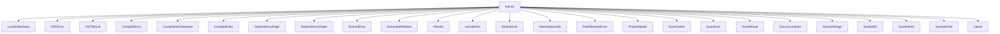

# Namespace `clore::extract`

## Summary

`clore::extract` 是 `clore` 工具集中负责从 C++ 项目提取符号、依赖关系和项目结构信息的核心命名空间。它定义了一整套数据模型和处理管道，涵盖了从编译数据库加载、编译条目规范化与缓存、文件扫描与 AST 符号提取，到依赖图构建和项目模型生成的完整流程。该命名空间通过异步接口（如 `extract_project_async`、`build_dependency_graph_async`）支持并发执行，并提供了丰富的错误类型（如 `CompDbError`、`ScanError`、`ASTError`）以报告各阶段可能出现的异常。

命名空间中显著的声明包括：`CompilationDatabase` 和 `CompileEntry` 用于表示编译命令集合与单个条目；`ProjectModel` 作为提取结果的容器，管理符号、模块单元和文件信息；`SymbolInfo`、`SymbolKind` 枚举和 `SymbolID` 用于描述和索引 C++ 符号；`ScanCache` 提供持久化的扫描缓存以避免重复计算；`DependencyGraph` 记录翻译单元之间的依赖关系；以及 `ModuleUnit` 支持 C++20 模块系统。这些类型与函数共同构成了一个模块化、可扩展的提取框架，调用者通过组合这些组件即可实现对任意规模 C++ 项目的结构化分析与数据获取。

## Diagram


```mermaid
graph TD
    NS["extract"]
    T0["LocalIndexData"]
    NS --> T0
    T1["ASTError"]
    NS --> T1
    T2["ASTResult"]
    NS --> T2
    T3["CompDbError"]
    NS --> T3
    T4["CompilationDatabase"]
    NS --> T4
    T5["CompileEntry"]
    NS --> T5
    T6["DependencyEdge"]
    NS --> T6
    T7["DependencyGraph"]
    NS --> T7
    T8["ExtractError"]
    NS --> T8
    T9["ExtractedRelation"]
    NS --> T9
    T10["FileInfo"]
    NS --> T10
    T11["IncludeInfo"]
    NS --> T11
    T12["ModuleUnit"]
    NS --> T12
    T13["NamespaceInfo"]
    NS --> T13
    T14["PathResolveError"]
    NS --> T14
    T15["ProjectModel"]
    NS --> T15
    T16["ScanCache"]
    NS --> T16
    T17["ScanError"]
    NS --> T17
    T18["ScanResult"]
    NS --> T18
    T19["SourceLocation"]
    NS --> T19
    T20["SourceRange"]
    NS --> T20
    T21["SymbolID"]
    NS --> T21
    T22["SymbolInfo"]
    NS --> T22
    T23["SymbolKind"]
    NS --> T23
    NSC0["cache"]
    NS --> NSC0
```

## Subnamespaces

- [`clore::extract::cache`](cache/index.md)

## Types

### `clore::extract::ASTError`

Declaration: `src/extract/ast.cppm:49`

Definition: `src/extract/ast.cppm:49`

Implementation: [`Module extract:ast`](../../../modules/extract/ast.md)

Insufficient evidence to summarize; provide more EVIDENCE.

#### Invariants

- `message` 字段应包含描述性错误文本，但无格式或内容限制

#### Key Members

- `std::string message`：错误描述文本

#### Usage Patterns

- 作为错误信息载体，由 `clore::extract` 中的函数可能返回或填充
- 调用者可通过读取 `message` 获取错误详情

### `clore::extract::ASTResult`

Declaration: `src/extract/ast.cppm:60`

Definition: `src/extract/ast.cppm:60`

Implementation: [`Module extract:ast`](../../../modules/extract/ast.md)

Insufficient evidence to summarize; provide more EVIDENCE.

#### Invariants

- Each `std::vector` member may be empty.
- No ordering guarantees are implied for any of the vectors.
- The struct is intended to be used as a value type.

#### Key Members

- `symbols`: extracted symbol information
- `relations`: relationships between symbols
- `dependencies`: file dependency strings

#### Usage Patterns

- Returned from extraction functions.
- Consumed to populate a project's symbol and relation database.
- Iterated to access extracted elements.

### `clore::extract::CompDbError`

Declaration: `src/extract/compiler.cppm:54`

Definition: `src/extract/compiler.cppm:54`

Implementation: [`Module extract:compiler`](../../../modules/extract/compiler.md)

Insufficient evidence to summarize; provide more EVIDENCE.

#### Invariants

- 成员 `message` 可以包含任意字符串，没有约束

#### Key Members

- `message`：存储错误描述信息的字符串

#### Usage Patterns

- 在 `clore::extract` 命名空间中作为错误类型返回或抛出的值
- 外部代码通过构造 `CompDbError` 实例并设置 `message` 来表示特定错误

### `clore::extract::CompilationDatabase`

Declaration: `src/extract/compiler.cppm:47`

Definition: `src/extract/compiler.cppm:47`

Implementation: [`Module extract:compiler`](../../../modules/extract/compiler.md)

Insufficient evidence to summarize; provide more EVIDENCE.

#### Invariants

- `entries` may be empty if no compile entries have been loaded.
- `toolchain_cache` may be empty; `has_cached_toolchain()` returns `false` in that case.
- The `toolchain_cache` map stores arbitrary string keys and value vectors without further documented constraints.

#### Key Members

- `entries` — holds the list of `CompileEntry` objects.
- `toolchain_cache` — caches resolved toolchain data per key.
- `has_cached_toolchain()` — method to check if any toolchain data is cached.

#### Usage Patterns

- Populated by a parser or reader that extracts compile commands from a JSON file or build system.
- Used by analysis passes that iterate over `entries` and may consult `toolchain_cache` to avoid redundant toolchain detection.
- The cache is likely written to and read from during a session to speed up repeated lookups of the same toolchain.

#### Member Functions

##### `clore::extract::CompilationDatabase::has_cached_toolchain`

Declaration: `src/extract/compiler.cppm:51`

Definition: `src/extract/compiler.cppm:245`

Implementation: [`Module extract:compiler`](../../../modules/extract/compiler.md)

###### Declaration

```cpp
auto () const -> bool;
```

### `clore::extract::CompileEntry`

Declaration: `src/extract/compiler.cppm:37`

Definition: `src/extract/compiler.cppm:37`

Implementation: [`Module extract:compiler`](../../../modules/extract/compiler.md)

Insufficient evidence to summarize; provide more EVIDENCE.

#### Invariants

- `file` and `directory` are filesystem paths used to locate the source
- `arguments` contains the compiler command-line tokens
- `compile_signature` uniquely identifies a compilation command for caching
- `source_hash` is nullopt when not computed or unavailable

#### Key Members

- `file`
- `directory`
- `arguments`
- `normalized_file`
- `compile_signature`
- `source_hash`
- `cache_key`

#### Usage Patterns

- Created when parsing compilation database entries
- Compared or hashed via `compile_signature` for deduplication
- Passed to caching or replay systems that rely on `file`, `directory`, and `arguments`
- `source_hash` indicates content-level caching when present

### `clore::extract::DependencyEdge`

Declaration: `src/extract/scan.cppm:69`

Definition: `src/extract/scan.cppm:69`

Implementation: [`Module extract:scan`](../../../modules/extract/scan.md)

Insufficient evidence to summarize; provide more EVIDENCE.

#### Invariants

- `from` 和 `to` 没有非空约束，可以是任意字符串；
- 该结构体不保证 `from` 和 `to` 的语义对称性。

#### Key Members

- `from`：依赖边的起始节点标识；
- `to`：依赖边的终止节点标识。

#### Usage Patterns

- 用于表示代码依赖图中节点之间的有向边；
- 在依赖分析过程中由扫描器创建，并被后续的图处理逻辑使用。

### `clore::extract::DependencyGraph`

Declaration: `src/extract/scan.cppm:74`

Definition: `src/extract/scan.cppm:74`

Implementation: [`Module extract:scan`](../../../modules/extract/scan.md)

Insufficient evidence to summarize; provide more EVIDENCE.

#### Invariants

- No invariants are documented or inferable from the evidence.

#### Key Members

- `files`
- `edges`

#### Usage Patterns

- The struct is likely populated by a scan or extraction process and consumed by other parts of the `clore::extract` module.

### `clore::extract::ExtractError`

Declaration: `src/extract/extract.cppm:43`

Definition: `src/extract/extract.cppm:43`

Implementation: [`Module extract`](../../../modules/extract/index.md)

Insufficient evidence to summarize; provide more EVIDENCE.

#### Invariants

- The `message` string should contain a meaningful error description.

#### Key Members

- `message` (public data member of type `std::string`)

#### Usage Patterns

- Likely used as the exception type or error result in extraction functions where a descriptive string is sufficient.
- Other code can construct an `ExtractError` by providing a `std::string` argument to `message`.

### `clore::extract::ExtractedRelation`

Declaration: `src/extract/ast.cppm:53`

Definition: `src/extract/ast.cppm:53`

Implementation: [`Module extract:ast`](../../../modules/extract/ast.md)

Insufficient evidence to summarize; provide more EVIDENCE.

#### Invariants

- `from` 和 `to` 应指向已注册的 `SymbolID`
- `is_call` 和 `is_inheritance` 默认均为 `false`，表示无特定关系类型
- 当 `is_inheritance` 为 `true` 时，`from` 表示派生类，`to` 表示基类

#### Key Members

- `from`
- `to`
- `is_call`
- `is_inheritance`

#### Usage Patterns

- 其他模块可以创建 `ExtractedRelation` 实例并填充其字段，用于记录调用关系或继承关系
- 关系图构建或分析代码可能读取这些标志来区分边的类型

### `clore::extract::FileInfo`

Declaration: `src/extract/model.cppm:139`

Definition: `src/extract/model.cppm:139`

Implementation: [`Module extract:model`](../../../modules/extract/model.md)

Insufficient evidence to summarize; provide more EVIDENCE.

### `clore::extract::IncludeInfo`

Declaration: `src/extract/scan.cppm:42`

Definition: `src/extract/scan.cppm:42`

Implementation: [`Module extract:scan`](../../../modules/extract/scan.md)

Insufficient evidence to summarize; provide more EVIDENCE.

#### Invariants

- `path` is not validated for existence or format
- `is_angled` distinguishes between angled and quoted includes
- default initialization: `path` empty, `is_angled` false

#### Key Members

- `path`
- `is_angled`

#### Usage Patterns

- Used as a plain data container within the extraction pipeline to represent include directives

### `clore::extract::ModuleUnit`

Declaration: `src/extract/model.cppm:152`

Definition: `src/extract/model.cppm:152`

Implementation: [`Module extract:model`](../../../modules/extract/model.md)

`clore::extract::ModuleUnit` 表示单个 C++20 模块单元，可以是接口单元或分区单元。该结构体用于封装模块单元的元数据，是项目模型中对模块系统进行建模的基础数据类型之一。

#### Invariants

- `name` 表示完整的模块标识符
- `is_interface` 为 `true` 时该单元为接口单元
- `source_file` 是经过规范化的文件路径
- `imports` 列出本单元直接导入的所有模块
- `symbols` 包含本单元内声明的符号 ID

#### Key Members

- `name`
- `is_interface`
- `source_file`
- `imports`
- `symbols`

#### Usage Patterns

- 此结构体由模块提取器填充，用于封装解析后的单个模块单元信息
- 其他组件可通过 `name` 和 `imports` 分析模块间的依赖关系
- `symbols` 用于关联模块单元与其内部声明的符号定义
- `source_file` 可用于定位或索引原始源文件

### `clore::extract::NamespaceInfo`

Declaration: `src/extract/model.cppm:145`

Definition: `src/extract/model.cppm:145`

Implementation: [`Module extract:model`](../../../modules/extract/model.md)

Insufficient evidence to summarize; provide more EVIDENCE.

#### Invariants

- `name` 成员用于标识命名空间的唯一名称
- `symbols` 和 `children` 成员可以为空，表示没有符号或子命名空间

#### Key Members

- `name`：命名空间名称
- `symbols`：命名空间内符号的标识符列表
- `children`：子命名空间名称列表

#### Usage Patterns

- 外部代码通过访问 `name`、`symbols` 和 `children` 来获取命名空间的层级结构
- 通常被其他提取逻辑填充并用于构建命名空间树或符号索引

### `clore::extract::PathResolveError`

Declaration: `src/extract/filter.cppm:17`

Definition: `src/extract/filter.cppm:17`

Implementation: [`Module extract:filter`](../../../modules/extract/filter.md)

Insufficient evidence to summarize; provide more EVIDENCE.

#### Invariants

- `message` 成员始终包含有效的字符串，可能为空但不应为未初始化状态

#### Key Members

- `message`（`std::string`）：存储路径解析错误的描述信息

#### Usage Patterns

- 被用作路径解析函数的错误返回类型或异常包装
- 其他代码通过检查 `message` 内容来获取错误详情

### `clore::extract::ProjectModel`

Declaration: `src/extract/model.cppm:160`

Definition: `src/extract/model.cppm:160`

Implementation: [`Module extract:model`](../../../modules/extract/model.md)

Insufficient evidence to summarize; provide more EVIDENCE.

#### Invariants

- `file_order` 按解析顺序存储文件路径，保证遍历顺序稳定
- `symbol_ids_by_qualified_name` 中的值向量至少包含一个元素，且可能包含多个表示重载
- `module_name_to_sources` 中的值向量可能包含多个源文件路径（当模块跨文件分区时）
- `uses_modules` 为 `true` 当且仅当至少一个模块单元存在

#### Key Members

- `symbols`
- `files`
- `namespaces`
- `file_order`
- `modules`
- `symbol_ids_by_qualified_name`
- `module_name_to_sources`
- `uses_modules`

#### Usage Patterns

- 用于文档生成阶段遍历所有符号和文件
- 通过 `symbol_ids_by_qualified_name` 实现精确的限定名查找，以处理链接和引用
- 通过 `module_name_to_sources` 将模块名映射到源文件，用于跨模块的交叉引用
- 通过 `file_order` 确定文件的处理顺序
- `uses_modules` 被其他组件用来调整生成策略（例如是否启用模块相关格式）

### `clore::extract::ScanCache`

Declaration: `src/extract/scan.cppm:58`

Definition: `src/extract/scan.cppm:58`

Implementation: [`Module extract:scan`](../../../modules/extract/scan.md)

`clore::extract::ScanCache` 是一个持久性缓存，用于在连续多次依赖扫描之间共享数据，避免重复计算。当编译数据库或文件系统状态发生变化时，调用者必须主动清空或丢弃整个缓存，以确保扫描结果的正确性。

#### Invariants

- Entries in `scan_results` remain valid as long as the compilation database and file system state are unchanged
- The cache must be cleared or discarded by callers when external state (compilation DB or file system) changes
- The key type `std::string` serves as a unique identifier for a scan result

#### Key Members

- `scan_results` (`std::unordered_map<std::string, ScanResult>`)

#### Usage Patterns

- Other code accesses or populates `scan_results` to avoid redundant scanning across successive dependency scans
- Callers are expected to check or clear the cache when the compilation database or file system is modified

### `clore::extract::ScanError`

Declaration: `src/extract/scan.cppm:38`

Definition: `src/extract/scan.cppm:38`

Implementation: [`Module extract:scan`](../../../modules/extract/scan.md)

Insufficient evidence to summarize; provide more EVIDENCE.

### `clore::extract::ScanResult`

Declaration: `src/extract/scan.cppm:47`

Definition: `src/extract/scan.cppm:47`

Implementation: [`Module extract:scan`](../../../modules/extract/scan.md)

Insufficient evidence to summarize; provide more EVIDENCE.

#### Invariants

- Fields are default-constructed to empty/null states
- `is_interface_unit` is `false` unless explicitly set
- No relationships between members are enforced beyond aggregate initialization

#### Key Members

- `module_name`
- `is_interface_unit`
- `includes`
- `module_imports`

#### Usage Patterns

- Returned by scanning functions to represent a parsed module
- Consumed by extraction pipeline to build further representations
- Members are accessed directly as a plain aggregate

### `clore::extract::SourceLocation`

Declaration: `src/extract/model.cppm:81`

Definition: `src/extract/model.cppm:81`

Implementation: [`Module extract:model`](../../../modules/extract/model.md)

Insufficient evidence to summarize; provide more EVIDENCE.

#### Invariants

- `line == 0` 表示位置未知，有效行号从 1 开始

#### Key Members

- `file`
- `line`
- `column`
- `is_known`

#### Usage Patterns

- 在 `clore::extract` 命名空间内作为源代码位置的载体
- 通过 `is_known` 方法判断位置是否已确定，以便进行后续处理

#### Member Functions

##### `clore::extract::SourceLocation::is_known`

Declaration: `src/extract/model.cppm:87`

Definition: `src/extract/model.cppm:87`

Implementation: [`Module extract:model`](../../../modules/extract/model.md)

###### Declaration

```cpp
bool () const noexcept;
```

### `clore::extract::SourceRange`

Declaration: `src/extract/model.cppm:92`

Definition: `src/extract/model.cppm:92`

Implementation: [`Module extract:model`](../../../modules/extract/model.md)

Insufficient evidence to summarize; provide more EVIDENCE.

#### Invariants

- `begin` 和 `end` 通常用于表示一个连续的范围
- 范围语义上期望 `begin` 不晚于 `end`（但未强制检查）

#### Key Members

- `begin`：范围的起始位置
- `end`：范围的结束位置

#### Usage Patterns

- 其他代码通过访问 `begin` 和 `end` 来获取范围边界
- 可能用于传递或存储源代码片段的定位信息

### `clore::extract::SymbolID`

Declaration: `src/extract/model.cppm:45`

Definition: `src/extract/model.cppm:45`

Implementation: [`Module extract:model`](../../../modules/extract/model.md)

Insufficient evidence to summarize; provide more EVIDENCE.

#### Invariants

- A valid `SymbolID` has a non-zero `hash`.
- The `hash` field is zero for the invalid/null sentinel.
- Both `hash` and `signature` are derived from the same USR source.

#### Key Members

- `hash` field
- `signature` field
- `is_valid()` method
- `operator==`
- `operator<=>`

#### Usage Patterns

- Serves as the primary identifier for symbols in the extraction pipeline.
- Used as a key or value in containers that support default comparison and ordering.
- Returned by functions that need to refer to a symbol without exposing its full name.

#### Member Functions

##### `clore::extract::SymbolID::is_valid`

Declaration: `src/extract/model.cppm:52`

Definition: `src/extract/model.cppm:52`

Implementation: [`Module extract:model`](../../../modules/extract/model.md)

###### Declaration

```cpp
bool () const noexcept;
```

##### `clore::extract::SymbolID::operator<=>`

Declaration: `src/extract/model.cppm:57`

Definition: `src/extract/model.cppm:57`

Implementation: [`Module extract:model`](../../../modules/extract/model.md)

###### Declaration

```cpp
std::strong_ordering (const SymbolID &) const;
```

##### `clore::extract::SymbolID::operator==`

Declaration: `src/extract/model.cppm:56`

Definition: `src/extract/model.cppm:56`

Implementation: [`Module extract:model`](../../../modules/extract/model.md)

###### Declaration

```cpp
bool (const SymbolID &) const;
```

### `clore::extract::SymbolInfo`

Declaration: `src/extract/model.cppm:97`

Definition: `src/extract/model.cppm:97`

Implementation: [`Module extract:model`](../../../modules/extract/model.md)

Insufficient evidence to summarize; provide more EVIDENCE.

#### Invariants

- `id` is unique per symbol within an extraction session.
- `kind` must be a valid `SymbolKind` enumerator.
- `source_snippet_hash` is computed from the snippet content when `source_snippet` is non-empty.
- `parent` is `std::nullopt` if the symbol has no parent in the extracted hierarchy.
- `children` excludes the symbol itself; relationships are directed.
- `bases` and `derived` are non-empty only for class/struct types.
- `calls` and `called_by` capture call graph edges; symmetry is not guaranteed.
- `references` and `referenced_by` capture use relations; symmetry not guaranteed.

#### Key Members

- `id`
- `kind`
- `name`
- `qualified_name`
- `declaration_location`
- `definition_location`
- `parent`
- `children`
- `bases`
- `derived`
- `calls`
- `called_by`
- `references`
- `referenced_by`
- `source_snippet`
- `doc_comment`
- `access`
- `is_template`
- `template_params`

#### Usage Patterns

- Returned by extraction functions to represent a single symbol.
- Consumed by documentation generators to produce symbol documentation pages.
- Populated by tools that walk the AST and fill in fields like `id`, `kind`, `parent`, and `children`.
- Used to build relationship graphs via `bases`/`derived`, `calls`/`called_by`, and `references`/`referenced_by`.
- On-demand snippet resolution when `source_snippet` is empty: consumers read `source_snippet_offset` and siblings to load from file.

### `clore::extract::SymbolKind`

Declaration: `src/extract/model.cppm:25`

Definition: `src/extract/model.cppm:25`

Implementation: [`Module extract:model`](../../../modules/extract/model.md)

Insufficient evidence to summarize; provide more EVIDENCE.

#### Invariants

- Each symbol has exactly one `SymbolKind` value
- Enum values are mutually exclusive and uniquely identify a symbol's category
- The `Unknown` value serves as a default or error sentinel
- Underlying type is `std::uint8_t` for fixed-width storage

#### Key Members

- `Namespace`
- `Class`
- `Function`
- `Method`
- `Variable`
- `Unknown`

#### Usage Patterns

- Used to tag extracted symbol nodes with their semantic category
- Code switches on `SymbolKind` to dispatch handling logic
- Symbol filtering and grouping operations depend on this enumeration
- Probably compared or serialized in diagnostics and reports

#### Member Variables

##### `clore::extract::SymbolKind::Class`

Declaration: `src/extract/model.cppm:27`

Implementation: [`Module extract:model`](../../../modules/extract/model.md)

###### Declaration

```cpp
Class
```

##### `clore::extract::SymbolKind::Concept`

Declaration: `src/extract/model.cppm:39`

Implementation: [`Module extract:model`](../../../modules/extract/model.md)

###### Declaration

```cpp
Concept
```

##### `clore::extract::SymbolKind::Enum`

Declaration: `src/extract/model.cppm:30`

Implementation: [`Module extract:model`](../../../modules/extract/model.md)

###### Declaration

```cpp
Enum
```

##### `clore::extract::SymbolKind::EnumMember`

Declaration: `src/extract/model.cppm:31`

Implementation: [`Module extract:model`](../../../modules/extract/model.md)

###### Declaration

```cpp
EnumMember
```

##### `clore::extract::SymbolKind::Field`

Declaration: `src/extract/model.cppm:35`

Implementation: [`Module extract:model`](../../../modules/extract/model.md)

###### Declaration

```cpp
Field
```

##### `clore::extract::SymbolKind::Function`

Declaration: `src/extract/model.cppm:32`

Implementation: [`Module extract:model`](../../../modules/extract/model.md)

###### Declaration

```cpp
Function
```

##### `clore::extract::SymbolKind::Macro`

Declaration: `src/extract/model.cppm:37`

Implementation: [`Module extract:model`](../../../modules/extract/model.md)

###### Declaration

```cpp
Macro
```

##### `clore::extract::SymbolKind::Method`

Declaration: `src/extract/model.cppm:33`

Implementation: [`Module extract:model`](../../../modules/extract/model.md)

###### Declaration

```cpp
Method
```

##### `clore::extract::SymbolKind::Namespace`

Declaration: `src/extract/model.cppm:26`

Implementation: [`Module extract:model`](../../../modules/extract/model.md)

###### Declaration

```cpp
Namespace
```

##### `clore::extract::SymbolKind::Struct`

Declaration: `src/extract/model.cppm:28`

Implementation: [`Module extract:model`](../../../modules/extract/model.md)

###### Declaration

```cpp
Struct
```

##### `clore::extract::SymbolKind::Template`

Declaration: `src/extract/model.cppm:38`

Implementation: [`Module extract:model`](../../../modules/extract/model.md)

###### Declaration

```cpp
Template
```

##### `clore::extract::SymbolKind::TypeAlias`

Declaration: `src/extract/model.cppm:36`

Implementation: [`Module extract:model`](../../../modules/extract/model.md)

###### Declaration

```cpp
TypeAlias
```

##### `clore::extract::SymbolKind::Union`

Declaration: `src/extract/model.cppm:29`

Implementation: [`Module extract:model`](../../../modules/extract/model.md)

###### Declaration

```cpp
Union
```

##### `clore::extract::SymbolKind::Unknown`

Declaration: `src/extract/model.cppm:40`

Implementation: [`Module extract:model`](../../../modules/extract/model.md)

###### Declaration

```cpp
Unknown
```

##### `clore::extract::SymbolKind::Variable`

Declaration: `src/extract/model.cppm:34`

Implementation: [`Module extract:model`](../../../modules/extract/model.md)

###### Declaration

```cpp
Variable
```

## Functions

### `clore::extract::append_unique`

Declaration: `src/extract/merge.cppm:26`

Definition: `src/extract/merge.cppm:26`

Implementation: [`Module extract:merge`](../../../modules/extract/merge.md)

`clore::extract::append_unique` 是一个模板函数，它接受一个 `int &` 引用和一个 `const T &` 值，并将该值追加到由第一个参数所代表的目标集合中，但仅当该值尚未存在时才执行追加。该函数确保目标集合中的元素始终保持唯一性。

#### Usage Patterns

- Used to maintain a unique set of elements in a vector
- Called in contexts where duplicate entries should be avoided when collecting items sequentially

### `clore::extract::append_unique_range`

Declaration: `src/extract/merge.cppm:33`

Definition: `src/extract/merge.cppm:33`

Implementation: [`Module extract:merge`](../../../modules/extract/merge.md)

函数 `clore::extract::append_unique_range` 是一个模板函数，用于将一个范围内的所有元素追加到目标容器中，但只追加那些尚未存在于目标容器中的元素。第一个参数是一个可修改的容器引用（表现为 `int &`，实际应为支持 `push_back` 和查找的容器），第二个参数是一个常量源范围引用（表现为 `const int &`，实际应为可迭代的范围）。该函数保证目标容器中元素的唯一性：对于源范围中的每个元素，如果目标容器中尚无相等的元素，则将其追加到末尾。调用者需确保目标容器的元素类型与源范围的元素类型具有可比性（通常通过 `operator==`），且目标容器具备在末尾添加新元素的能力。

#### Usage Patterns

- Deduplicated merge of one collection into another
- Building a unique set of elements from multiple ranges
- Used in merge or deduplicate operations within the `clore::extract` namespace

### `clore::extract::build_compile_signature`

Declaration: `src/extract/compiler.cppm:74`

Definition: `src/extract/compiler.cppm:126`

Implementation: [`Module extract:compiler`](../../../modules/extract/compiler.md)

函数 `clore::extract::build_compile_signature` 接受一个 `const CompileEntry &` 作为输入，返回一个 `std::uint64_t` 值。该值作为一个编译条目的紧凑签名，用于唯一标识该条目的编译配置。调用者可以依赖此签名来比较或分组编译条目，常用于缓存编译结果或去除重复编译操作。签名生成时已考虑输入文件、编译选项等关键属性，保证相同配置的条目产生相同签名，不同配置的条目签名大概率不同。

#### Usage Patterns

- Called to obtain a uniquely identifying hash for a compilation entry, with caching when the signature is already computed.

### `clore::extract::build_dependency_graph_async`

Declaration: `src/extract/scan.cppm:79`

Definition: `src/extract/scan.cppm:388`

Implementation: [`Module extract:scan`](../../../modules/extract/scan.md)

声明 `clore::extract::build_dependency_graph_async` 用于异步构造项目的依赖关系图。调用者提供对一个整数标识符（例如项目索引或句柄）的常量引用、一个用于接收输出图的 `DependencyGraph` 引用、一个可选的 `ScanCache` 指针，以及一个驱动异步操作的 `kota::event_loop` 引用。返回的 `int` 值表示启动状态（通常 0 表示成功，非零表示调用时发生的错误）；依赖图的实际填充发生在 `kota::event_loop` 后续的事件处理过程中。

调用者必须确保在依赖图构建完成之前，所有参数（尤其是 `DependencyGraph` 和 `ScanCache` 所引用的内存以及 `kota::event_loop` 本身）保持有效。函数不会阻塞等待结果；调用者应通过事件循环机制（例如定期检查或回调）获知图构建的完成或失败。

#### Usage Patterns

- called to build a dependency graph for a project's compilation database
- used in conjunction with an event loop for async concurrency
- integrated into higher-level extraction pipelines

### `clore::extract::canonical_graph_path`

Declaration: `src/extract/filter.cppm:30`

Definition: `src/extract/filter.cppm:112`

Implementation: [`Module extract:filter`](../../../modules/extract/filter.md)

Declaration: [Declaration](functions/canonical-graph-path.md)

将给定的文件系统路径转换为一个规范化（canonical）的字符串，该字符串适合在图结构中作为唯一标识符使用。返回的 `std::string` 是绝对且已解析符号链接等冗余的路径表示，用于 `clore::extract::matches_filter` 等依赖它的函数进行高效匹配与过滤。调用者应确保传入的 `std::filesystem::path` 是有效的，且结果字符串可用于跨平台一致地与 `config::FilterRule` 中的模式进行比较。

#### Usage Patterns

- called by `matches_filter` to obtain a consistent path for filtering

### `clore::extract::create_compiler_instance`

Declaration: `src/extract/compiler.cppm:81`

Definition: `src/extract/compiler.cppm:313`

Implementation: [`Module extract:compiler`](../../../modules/extract/compiler.md)

`clore::extract::create_compiler_instance` 根据传入的 `CompileEntry` 创建并初始化一个编译器实例。调用者必须提供有效的编译条目；函数返回一个非负整数作为该实例的句柄，可用于后续提取步骤。若创建失败，则返回负值。返回的句柄在调用者的上下文中有效，其生命周期由调用方自行管理。

#### Usage Patterns

- Called to obtain a configured Clang compiler instance for a given compilation entry
- Used in the extraction pipeline to prepare for further compilation or analysis

### `clore::extract::deduplicate`

Declaration: `src/extract/merge.cppm:63`

Definition: `src/extract/merge.cppm:63`

Implementation: [`Module extract:merge`](../../../modules/extract/merge.md)

`clore::extract::deduplicate` 是一个模板函数，它对通过整数引用传入的集合句柄所标识的容器进行原地去重。调用方需提供一个有效的 `int &` 参数，该句柄必须指向一个可修改的集合（例如在 `clore::extract` 内部容器类型）。函数会移除其中的重复条目，调用后集合中的每个元素将唯一出现。该函数不返回任何值，调用方应确保传入的句柄在函数生命周期内有效，且集合已就绪。模板参数 `typename T` 推导自容器内元素类型。

#### Usage Patterns

- Used to deduplicate a vector before further processing that requires unique elements
- Commonly called with a vector of symbols, `IDs`, or other comparable types

### `clore::extract::ensure_cache_key`

Declaration: `src/extract/compiler.cppm:76`

Definition: `src/extract/compiler.cppm:241`

Implementation: [`Module extract:compiler`](../../../modules/extract/compiler.md)

Declaration: [Declaration](functions/ensure-cache-key.md)

`clore::extract::ensure_cache_key` 保证给定的 `CompileEntry` 对象包含一个可用于后续缓存查询的唯一键。调用该函数后，条目可以通过该键在 `query_toolchain_cached` 等例程中查找对应的缓存数据。该函数会就地修改传入的 `CompileEntry`，其行为依赖于该条目已有的编译参数；调用者应确保传入的条目处于可被赋键的状态。

#### Usage Patterns

- Called prior to `query_toolchain_cached`.

### `clore::extract::ensure_cache_key_impl`

Declaration: `src/extract/compiler.cppm:135`

Definition: `src/extract/compiler.cppm:135`

Implementation: [`Module extract:compiler`](../../../modules/extract/compiler.md)

Declaration: [Declaration](functions/ensure-cache-key-impl.md)

`clore::extract::ensure_cache_key_impl` 负责在给定的 `CompileEntry` 上设置一个缓存键，以供调用者后续使用。该函数是一个内部实现细节，通常由 `clore::extract::ensure_cache_key` 代为调用；直接调用者应预期 `CompileEntry` 会被修改以包含一个唯一的缓存标识符。

#### Usage Patterns

- called by `ensure_cache_key` to populate cache‑related fields on a `CompileEntry`

### `clore::extract::extract_project_async`

Declaration: `src/extract/extract.cppm:47`

Definition: `src/extract/extract.cppm:561`

Implementation: [`Module extract`](../../../modules/extract/index.md)

`clore::extract::extract_project_async` 启动一个异步项目提取。调用方需提供一个代表已初始化的项目上下文的整数句柄（例如通过其他加载函数获得）以及一个 `kota::event_loop` 实例。该函数立即返回一个整数结果码，实际提取工作将在事件循环中被调度并异步执行。提取完成后，所得的项目数据可通过 `clore::extract` 命名空间中的同步查询函数（如 `find_symbol`、`lookup_symbol` 等）进行访问。

#### Usage Patterns

- Called as the main entry point for project extraction from a compilation database
- Invoked with application configuration and event loop for asynchronous execution
- Used in conjunction with cache management to optimize incremental extractions
- Part of the `clore::extract` module for building project models in a code analysis tool

### `clore::extract::extract_symbols`

Declaration: `src/extract/ast.cppm:66`

Definition: `src/extract/ast.cppm:692`

Implementation: [`Module extract:ast`](../../../modules/extract/ast.md)

函数 `clore::extract::extract_symbols` 接受一个 `const int &` 作为输入，该整数表示待提取符号的源实体（通常为编译条目或项目索引），并返回一个 `std::expected<ASTResult, ASTError>`。调用者应根据返回值判断操作是否成功：若包含有效 `ASTResult`，则提取成功且结果包含相关符号信息；若包含 `ASTError`，则操作失败且错误描述了失败原因。

调用者必须保证传入的 `int` 引用在函数执行期间保持有效，且所指向的整数已正确初始化（例如通过 `load_compdb` 或 `extract_project_async` 等函数获得）。函数自身不修改该整数，仅读取其值以定位提取目标。提取过程中可能因源不可访问、语法分析失败或符号结构异常而导致 `ASTError`，调用者应适当处理此类错误。

#### Usage Patterns

- used to extract symbol information from a single compilation entry
- called as part of the symbol extraction pipeline

### `clore::extract::filter_root_path`

Declaration: `src/extract/filter.cppm:36`

Definition: `src/extract/filter.cppm:170`

Implementation: [`Module extract:filter`](../../../modules/extract/filter.md)

给定一个标识符（以 `const int &` 形式传入），`clore::extract::filter_root_path` 返回经过过滤后的根文件系统路径。该函数负责将传入的整数参数（通常代表编译条目或其他内部索引）映射到一个规范化且经过筛选的目录路径，调用方应使用该返回值作为后续路径比较或过滤操作的基准。

调用方必须确保传入的引用在整个调用期间保持有效且指向正确的上下文。函数不转移所有权，返回的路径副本可在调用方自由使用。预期该路径是唯一的、经过整理的根路径，可用于匹配或排除其它文件路径。

#### Usage Patterns

- derive canonical root for path filtering
- obtain normalized workspace or project root

### `clore::extract::find_module_by_name`

Declaration: `src/extract/model.cppm:205`

Definition: `src/extract/model.cppm:433`

Implementation: [`Module extract:model`](../../../modules/extract/model.md)

函数 `clore::extract::find_module_by_name` 在给定的 `ProjectModel` 中按名称查找一个模块单元。它接受一个 `std::string_view` 类型的模块名称，并返回一个指向常量 `ModuleUnit` 的指针，如果未找到匹配项则返回 `nullptr`。调用者需确保提供的名称格式正确，且 `ProjectModel` 对象在返回指针的生命周期内保持有效，因为该指针指向模型内部数据。

#### Usage Patterns

- Resolve a module name to a unique module unit during extraction or analysis
- Handle module name lookup with disambiguation and logging

### `clore::extract::find_module_by_source`

Declaration: `src/extract/model.cppm:211`

Definition: `src/extract/model.cppm:466`

Implementation: [`Module extract:model`](../../../modules/extract/model.md)

在给定的 `ProjectModel` 中，根据源文件的标识符（通常为路径或规范名称）定位并返回对应的模块单元。如果找不到匹配的模块单元，则返回 `nullptr`。调用者需保证传入的 `ProjectModel` 对象在调用期间保持有效，且 `std::string_view` 指向的字符串生命周期不短于本次调用。返回值指向的 `ModuleUnit` 对象的生命周期由 `ProjectModel` 管理，调用者不应修改或单独删除该对象。

#### Usage Patterns

- Used to obtain a module unit given a source file path during project model queries
- Expected to be called when resolving modules by source location

### `clore::extract::find_modules_by_name`

Declaration: `src/extract/model.cppm:208`

Definition: `src/extract/model.cppm:412`

Implementation: [`Module extract:model`](../../../modules/extract/model.md)

函数 `clore::extract::find_modules_by_name` 在给定的 `const ProjectModel &` 中，根据提供的名称字符串查找匹配的模块单元，并返回一个 `int` 作为结果。该返回的整数值可能是一个句柄或标识符，用于在后续操作中索引或引用所找到的模块，或者指示查找结果的状态（例如成功或失败）。调用者应当假定返回的 `int` 有效性和含义取决于调用上下文，并且仅用于与同一项目模型相关联的提取流程中。

调用者需提供一个有效的 `const ProjectModel &` 引用和一个非空的 `std::string_view` 作为模块名称。函数不会修改输入的项目模型。如果查找成功，返回的整数可用于进一步获取模块信息；如果未找到匹配的模块，返回值将表示失败状态（例如零或负值）。该函数的契约不保证返回的标识符在跨模型或跨调用中保持稳定。

#### Usage Patterns

- Used to retrieve all module units sharing a name.
- Typically called when resolving named modules in a project model.

### `clore::extract::find_symbol`

Declaration: `src/extract/model.cppm:198`

Definition: `src/extract/model.cppm:396`

Implementation: [`Module extract:model`](../../../modules/extract/model.md)

Declaration: [Declaration](functions/find-symbol.md)

`clore::extract::find_symbol` 接受一个 `ProjectModel` 引用和两个 `std::string_view` 参数，返回指向 `SymbolInfo` 的常量指针。该函数在给定的项目模型中执行符号查找，调用者应提供足够的信息以唯一确定目标符号。当找到对应符号时，返回其信息的指针；否则返回 `nullptr`。具体业务含义和参数作用取决于调用上下文。

#### Usage Patterns

- look up a symbol by qualified name only
- look up a symbol by qualified name and signature
- exact symbol resolution with optional signature matching

### `clore::extract::find_symbol`

Declaration: `src/extract/model.cppm:196`

Definition: `src/extract/model.cppm:388`

Implementation: [`Module extract:model`](../../../modules/extract/model.md)

Declaration: [Declaration](functions/find-symbol.md)

函数 `clore::extract::find_symbol` 在给定的 `ProjectModel` 中查找并返回一个指向 `SymbolInfo` 的指针，该指针表示与指定限定名称 `std::string_view` 匹配的符号。如果提供了可选的 `std::string_view` 签名参数，则函数会进一步筛选，返回第一个签名完全匹配的符号；若签名参数为空，则行为与只接受限定名称的重载相同，即返回任意一个匹配该名称的符号。未找到匹配符号时返回 `nullptr`。

#### Usage Patterns

- Used as a convenience wrapper to retrieve a uniquely matching symbol by qualified name
- Called by the overload `clore::extract::find_symbol` that takes an additional `std::string_view` parameter

### `clore::extract::find_symbols`

Declaration: `src/extract/model.cppm:202`

Definition: `src/extract/model.cppm:371`

Implementation: [`Module extract:model`](../../../modules/extract/model.md)

函数 `clore::extract::find_symbols` 在给定的 `ProjectModel` 中查找所有与指定 `std::string_view` 名称匹配的符号。它返回 `int` 值，调用者可通过该值获得查找结果的相关信息——根据上下文，该结果可能表示找到的符号数量、输出句柄或状态码，具体含义需查阅配套文档。

调用者负责提供有效的 `ProjectModel` 引用和待查找的名称。函数不修改模型本身，其返回值反映查找操作的结果，而非指向单个符号的指针（与单符号查找函数 `clore::extract::find_symbol` 区分）。

#### Usage Patterns

- retrieve all symbols with a given qualified name
- find symbols for a qualified name in the project model

### `clore::extract::join_qualified_name_parts`

Declaration: `src/extract/model.cppm:76`

Definition: `src/extract/model.cppm:345`

Implementation: [`Module extract:model`](../../../modules/extract/model.md)

函数 `clore::extract::join_qualified_name_parts` 将一组名称部分重组为完整的限定名称字符串。调用者需提供一个标识名称部分序列的整数引用（`const int &`）以及要连接的部分数量（`std::size_t`）。该函数假定部分序列已按正确顺序排列，并返回以双冒号分隔的限定名。若指定数量超出序列实际长度，行为未定义。函数不验证参数的有效性，调用者有义务保证序列在调用期间保持有效且大小匹配。

#### Usage Patterns

- Used to reconstruct qualified names from tokenized parts
- Often called when building fully qualified symbol names or paths from a sequence of identifiers

### `clore::extract::load_compdb`

Declaration: `src/extract/compiler.cppm:58`

Definition: `src/extract/compiler.cppm:143`

Implementation: [`Module extract:compiler`](../../../modules/extract/compiler.md)

`clore::extract::load_compdb` 接受一个 `std::string_view` 参数（通常指向编译数据库文件的路径），并返回 `std::expected<CompilationDatabase, CompDbError>`。调用方应通过该函数将持久化的编译数据库加载到内存中，成功时获得一个 `CompilationDatabase` 对象，失败时得到一个描述错误的 `CompDbError`。函数不负责解析或验证参数的有效性，调用方需确保传入合法的路径，且函数假定路径指向一个格式正确的编译数据库。

#### Usage Patterns

- Used to load a compilation database from a JSON file path.
- Typically called at the start of project analysis to obtain a list of `CompileEntry` objects.
- The returned `CompilationDatabase` is later used by other functions like `query_toolchain_cached` or to iterate compile commands.

### `clore::extract::lookup`

Declaration: `src/extract/compiler.cppm:60`

Definition: `src/extract/compiler.cppm:180`

Implementation: [`Module extract:compiler`](../../../modules/extract/compiler.md)

函数 `clore::extract::lookup` 接受一个 `CompilationDatabase` 引用和一个 `std::string_view` 标识符，并返回一个 `int` 值。调用者应提供有效的数据库对象以及一个用于识别特定编译条目或资源的字符串（例如文件路径或目标名称）。该函数负责在数据库中执行查找操作，并返回一个不透明的整数句柄或索引，该句柄可在后续的提取或处理步骤中使用。调用者应确保标识符与数据库中的某个条目匹配，且返回的 `int` 值仅在数据库生命周期内有效。

#### Usage Patterns

- lookup compile entries for a source file
- find matching compilation records by filename

### `clore::extract::lookup_symbol`

Declaration: `src/extract/model.cppm:194`

Definition: `src/extract/model.cppm:366`

Implementation: [`Module extract:model`](../../../modules/extract/model.md)

通过 `clore::extract::lookup_symbol` 可依据一个已有的 `SymbolID` 在给定的 `ProjectModel` 中高效查找对应的符号信息。调用方必须提供有效的 `SymbolID`（通常来自先前通过名称查找或其他模型操作获得的标识符）。如果该标识符在模型中存在，函数返回指向相应 `const SymbolInfo` 的指针；否则返回 `nullptr`。此函数不修改模型，适用于需要快速、直接定位已关联符号的场景。

#### Usage Patterns

- resolving symbol by identifier
- fetching symbol details after obtaining ID
- null-safe symbol access

### `clore::extract::matches_filter`

Declaration: `src/extract/filter.cppm:32`

Definition: `src/extract/filter.cppm:133`

Implementation: [`Module extract:filter`](../../../modules/extract/filter.md)

函数 `clore::extract::matches_filter` 测试给定的字符串、整数引用和文件系统路径这三个参数是否与当前过滤器条件匹配，并返回 `true` 表示匹配，`false` 表示不匹配。该过滤条件由实现内部定义，调用者无需了解其具体规则，只需传递要测试的参数并检查返回的布尔结果。

#### Usage Patterns

- called to decide whether a compilation entry's source file should be processed based on include/exclude rules
- used during extraction to filter files that match a given filter rule

### `clore::extract::merge_symbol_info`

Declaration: `src/extract/merge.cppm:68`

Definition: `src/extract/merge.cppm:225`

Implementation: [`Module extract:merge`](../../../modules/extract/merge.md)

函数 `clore::extract::merge_symbol_info` 负责将源中的符号信息合并到目标中。它接受一个可变的 `int &` 作为目标，以及一个 `int &&` 作为源，合并后目标将包含源中的信息。调用者应确保目标已有效初始化，源可以是临时对象或通过 `std::move` 传递的左值，该函数会利用右值引用高效地转移或合并信息。

#### Usage Patterns

- called to merge symbol info during extraction or deduplication
- used when consolidating symbol information from multiple sources into a canonical representation

### `clore::extract::merge_symbol_info`

Declaration: `src/extract/merge.cppm:69`

Definition: `src/extract/merge.cppm:229`

Implementation: [`Module extract:merge`](../../../modules/extract/merge.md)

将源符号信息合并到目标符号信息中。函数接受一个 `int &` 类型的目标引用和一个 `const int &` 类型的源引用；目标被更新以包含源的信息，而源保持不变。调用方负责提供有效的目标对象，并确保源中的数据在调用期间保持稳定。

#### Usage Patterns

- merging symbol information from multiple sources
- updating existing symbol with new data
- deduplication

### `clore::extract::namespace_prefix_from_qualified_name`

Declaration: `src/extract/model.cppm:79`

Definition: `src/extract/model.cppm:358`

Implementation: [`Module extract:model`](../../../modules/extract/model.md)

函数 `clore::extract::namespace_prefix_from_qualified_name` 接受一个限定名称字符串（如 `std::vector`），并返回其命名空间前缀部分（如 `std`）。调用者应提供一个有效的、可能以命名空间或全局作用域修饰的限定名；返回值是一个 `std::string`，若输入不含命名空间则可能为空。该函数不修改输入字符串，且假定输入格式遵循 C++ 限定名称的常规分隔符（例如 `::`）。

#### Usage Patterns

- Extract namespace from a qualified name for semantic analysis
- Prepare namespace context for symbol lookup or display

### `clore::extract::normalize_argument_path`

Declaration: `src/extract/compiler.cppm:65`

Definition: `src/extract/compiler.cppm:204`

Implementation: [`Module extract:compiler`](../../../modules/extract/compiler.md)

Declaration: [Declaration](functions/normalize-argument-path.md)

`clore::extract::normalize_argument_path` 接受两个 `std::string_view` 参数，返回一个 `std::filesystem::path`。调用者应提供原始路径字符串及上下文（如基目录或工作目录），函数返回该路径的规范化形式，例如解析相对路径、去除冗余分隔符或统一格式。该函数被 `clore::extract::sanitize_driver_arguments` 用于处理编译参数中的路径，确保后续路径比较和匹配的一致性。

#### Usage Patterns

- Used by `clore::extract::sanitize_driver_arguments` to normalize path arguments from compilation entries.

### `clore::extract::normalize_entry_file`

Declaration: `src/extract/compiler.cppm:72`

Definition: `src/extract/compiler.cppm:107`

Implementation: [`Module extract:compiler`](../../../modules/extract/compiler.md)

Declaration: [Declaration](functions/normalize-entry-file.md)

将给定的编译条目中的文件路径规范化为一个字符串，作为后续编译签名计算或缓存键推导的标准化输入。调用方应提供合法的 `clore::extract::CompileEntry` 对象，函数返回规范化后的文件路径字符串，该字符串在相同语义的文件名上具有确定性。

#### Usage Patterns

- Called by `clore::extract::build_compile_signature` to produce a normalized file string for hashing
- Called by `clore::extract::ensure_cache_key_impl` to normalize the entry file path before caching

### `clore::extract::path_prefix_matches`

Declaration: `src/extract/filter.cppm:21`

Definition: `src/extract/filter.cppm:42`

Implementation: [`Module extract:filter`](../../../modules/extract/filter.md)

检查给定的路径字符串是否与指定的前缀字符串在路径语义上匹配。该函数将两个参数均视为路径字符串，并判断第一个路径是否以第二个路径作为目录前缀，即前缀的每个路径段必须完全匹配，且路径中紧跟前缀之后的位置应为路径分隔符或字符串结尾。常用于过滤集合或验证文件是否位于某个基目录之下。调用者应确保两个字符串均使用一致的路径分隔符格式（建议规范化后的正斜杠）。

#### Usage Patterns

- Filtering relative file paths against a directory or component prefix
- Path matching in `matches_filter` or similar predicate functions

### `clore::extract::project_relative_path`

Declaration: `src/extract/filter.cppm:23`

Definition: `src/extract/filter.cppm:73`

Implementation: [`Module extract:filter`](../../../modules/extract/filter.md)

`clore::extract::project_relative_path` 计算从第一个参数（视为项目根目录）到第二个参数（目标路径）的相对路径。返回 `std::optional<std::filesystem::path>`：当目标路径无法相对于根目录表述时（例如，目标不在根目录下，或路径位于不同驱动器），返回 `std::nullopt`；否则返回规范化的相对路径。

调用者应确保两个参数是有效的文件系统路径（函数不检查存在性），第一个参数应指向目录。返回的相对路径使用系统原生格式，不包含末尾分隔符。

#### Usage Patterns

- Convert absolute paths to project-relative paths for consistent representation
- Ensure a file path does not escape a given project root directory

### `clore::extract::query_toolchain_cached`

Declaration: `src/extract/compiler.cppm:78`

Definition: `src/extract/compiler.cppm:249`

Implementation: [`Module extract:compiler`](../../../modules/extract/compiler.md)

`clore::extract::query_toolchain_cached` 为给定的 `CompileEntry` 从 `CompilationDatabase` 中获取或创建缓存的工具链。它返回一个 `int` 类型的标识符，调用方可将该标识符传递给后续操作（如 `clore::extract::scan_file` 或 `clore::extract::create_compiler_instance`）以使用该工具链。该函数可能会修改传入的 `CompileEntry`，以确保缓存键被正确记录。

调用方有责任保证 `CompilationDatabase` 引用有效且处于可用状态，同时提供的 `CompileEntry` 应包含完整的编译命令和路径信息。该函数不报告错误；返回值应被视为一个不透明的句柄。调用方可通过 `CompilationDatabase::has_cached_toolchain` 检查某个条目是否已有缓存，但应假定此函数始终成功返回一个可用标识符。

#### Usage Patterns

- cached retrieval of toolchain arguments
- used to avoid repeated sanitization of compilation arguments

### `clore::extract::rebuild_lookup_maps`

Declaration: `src/extract/merge.cppm:73`

Definition: `src/extract/merge.cppm:442`

Implementation: [`Module extract:merge`](../../../modules/extract/merge.md)

函数 `clore::extract::rebuild_lookup_maps` 确保与某个上下文关联的查找映射与当前的提取数据状态保持一致。调用者在执行修改符号或模块索引的操作（例如合并、去重或符号提取）之后，必须调用此函数，以使后续的查找操作（如 `lookup_symbol`、`find_symbol` 或 `lookup`）能够返回正确的结果。其唯一的参数 `int &` 标识需要重建映射的特定上下文或索引，函数会就地修改该参数所引用的值。

#### Usage Patterns

- called after the model is fully populated to ensure lookup maps are consistent
- prepares the model for efficient lookups by qualified name or module name
- typically invoked once before performing multiple queries on the model

### `clore::extract::rebuild_model_indexes`

Declaration: `src/extract/merge.cppm:71`

Definition: `src/extract/merge.cppm:233`

Implementation: [`Module extract:merge`](../../../modules/extract/merge.md)

函数 `clore::extract::rebuild_model_indexes` 根据第一个 `const int &` 参数所引用的模型状态，重新构建第二个 `int &` 参数所代表的索引。调用者需保证第一个参数引用一个有效的模型句柄，且第二个参数在被调用前处于有效可写状态。函数通过直接修改第二个参数来重建索引，不返回任何值。

#### Usage Patterns

- 在符号提取或合并流程之后调用，以重建索引
- 作为 `clore::extract` 模块中核心模型维护操作的一部分
- 通常每个项目模型只调用一次，用于确保后续查询的准确性

### `clore::extract::resolve_path_under_directory`

Declaration: `src/extract/filter.cppm:27`

Definition: `src/extract/filter.cppm:88`

Implementation: [`Module extract:filter`](../../../modules/extract/filter.md)

函数 `clore::extract::resolve_path_under_directory` 接受两个字符串参数，分别表示一个基目录和一个待解析路径，返回 `std::expected<std::filesystem::path, PathResolveError>`。调用者应提供有效的基目录路径和待解析路径；函数会尝试将待解析路径解析为基目录下的规范绝对路径，如果解析失败（例如路径超出基目录范围、基目录不存在或发生访问错误），则返回 `PathResolveError`。该函数的设计目的是安全地限制路径访问范围，调用者需确保基目录参数是可访问的真实路径，并准备好处理可能的错误结果。

#### Usage Patterns

- resolving file paths from compilation database entries
- combining a relative path with a base directory
- validating and normalizing path inputs before further processing

### `clore::extract::resolve_source_snippet`

Declaration: `src/extract/model.cppm:217`

Definition: `src/extract/model.cppm:472`

Implementation: [`Module extract:model`](../../../modules/extract/model.md)

尝试通过磁盘上文件中的偏移量和长度记录来填充给定 `SymbolInfo` 的 `source_snippet` 字段。该函数使用 `SymbolInfo` 的 `source_snippet_offset` 和 `source_snippet_length` 属性定位并读取源文件的相应字节范围。

返回 `true` 表示片段已成功解析或已在缓存中可用；返回 `false` 表示解析失败（例如，文件缺失、偏移量无效或读取错误）。调用方应确保传入的 `SymbolInfo` 对象已正确记录了偏移量和长度数据。

#### Usage Patterns

- Resolve source snippet for a symbol after extraction
- Lazy loading of source text for a symbol
- Called during symbol resolution or lookup

### `clore::extract::sanitize_driver_arguments`

Declaration: `src/extract/compiler.cppm:68`

Definition: `src/extract/compiler.cppm:223`

Implementation: [`Module extract:compiler`](../../../modules/extract/compiler.md)

The function `clore::extract::sanitize_driver_arguments` takes a `const CompileEntry &` and returns an `int`. Its caller-facing responsibility is to normalize and validate the driver–specific command-line arguments stored in the compile entry, ensuring that all file paths are resolved consistently and any potentially problematic arguments are either corrected or rejected. The result is a uniform, safe representation suitable for downstream processing.

Callers must supply a complete `CompileEntry` whose driver arguments are to be sanitized. A return value of `0` indicates that the cleanup succeeded and the entry’s arguments are now in a canonical form. A non‑zero return signals that the arguments could not be fully sanitized (e.g., because of an invalid path or an unsupported flag), and the caller should treat the compile entry as unreliable. The function does not modify the original entry; instead, sanitized data may be stored elsewhere or the return status alone is used for error propagation.

#### Usage Patterns

- used when sanitizing compile entries before toolchain query
- called to avoid redundant source file compilation

### `clore::extract::sanitize_tool_arguments`

Declaration: `src/extract/compiler.cppm:70`

Definition: `src/extract/compiler.cppm:237`

Implementation: [`Module extract:compiler`](../../../modules/extract/compiler.md)

`clore::extract::sanitize_tool_arguments` 负责规范化与净化给定编译条目 (`const CompileEntry &`) 中与编译器工具相关的参数。它确保工具路径、标志和参数处于一致、可预测的状态，从而为后续的编译分析或提取步骤提供可靠基础。函数返回一个整数值，指示操作是否成功；调用者应检查该返回值以确定是否能够继续处理该编译条目。

#### Usage Patterns

- Used in compilation database processing to clean argument lists
- Part of the argument sanitization pipeline

### `clore::extract::scan_file`

Declaration: `src/extract/scan.cppm:62`

Definition: `src/extract/scan.cppm:256`

Implementation: [`Module extract:scan`](../../../modules/extract/scan.md)

`clore::extract::scan_file` 接受一个表示待扫描文件或编译条目的整数引用（`const int &`），并返回一个 `std::expected<ScanResult, ScanError>`。该函数是 `clore::extract` 命名空间中扫描管道的一部分，负责对给定的条目执行语法和结构分析，以产生结构化的扫描结果或报告失败原因。

调用者必须提供指向有效已加载条目的引用（例如来自 `clore::extract::load_compdb` 的结果）。成功时，`ScanResult` 包含符号声明、依赖关系等提取信息；失败时，`ScanError` 提供具体的错误分类，便于诊断文件基础结构错误或解析异常。

#### Usage Patterns

- Called to scan a single source file for symbols as part of the extraction pipeline
- Typically invoked with entries from a compilation database returned by `load_compdb`
- May be used alongside other extraction functions like `extract_symbols`

### `clore::extract::scan_module_decl`

Declaration: `src/extract/scan.cppm:67`

Definition: `src/extract/scan.cppm:159`

Implementation: [`Module extract:scan`](../../../modules/extract/scan.md)

Declaration: [Declaration](functions/scan-module-decl.md)

`clore::extract::scan_module_decl` 对 C++ 模块声明执行快速扫描，利用 Clang 的依赖指令扫描器来提取模块信息，而无需运行完整的预处理器。调用者必须提供一个 `std::string_view` 形式的待扫描源文本（例如模块单元的源代码片段）以及一个可写入的 `ScanResult &` 输出对象。该函数会填充 `ScanResult` 中的 `module_name`、`is_interface_unit` 和 `module_imports` 字段；如果输入不包含合法的模块声明，这些字段将保持其默认状态或为空，函数本身不会报告错误。调用者应根据填充后的 `ScanResult` 内容判断扫描结果是否有意义。

#### Usage Patterns

- Called by `clore::extract::scan_file` to quickly extract module-level declarations without full preprocessing.
- Designed for scanning source files to determine module name, interface status, and imported modules.

### `clore::extract::split_top_level_qualified_name`

Declaration: `src/extract/model.cppm:74`

Definition: `src/extract/model.cppm:282`

Implementation: [`Module extract:model`](../../../modules/extract/model.md)

函数 `clore::extract::split_top_level_qualified_name` 接受一个 `std::string_view` 作为待分析的限定名称，并返回一个 `int` 表示该名称中顶层限定组件的数量。例如，它可用于判断限定名称的嵌套层级或校验名称格式。调用方传入的字符串应合法且符合 C++ 限定名称的惯例（否则行为未定义）。该函数不修改输入，仅执行一次只读分析，不涉及缓存或副作用。

#### Usage Patterns

- Used to decompose qualified names into their top-level components for further processing like symbol lookup or name resolution.

### `clore::extract::strip_compiler_path`

Declaration: `src/extract/compiler.cppm:63`

Definition: `src/extract/compiler.cppm:197`

Implementation: [`Module extract:compiler`](../../../modules/extract/compiler.md)

`clore::extract::strip_compiler_path` 接受一个代表编译条目的 `const int &` 引用，并返回一个 `int`。调用者应保证传入的整数标识了一个有效的已构建编译条目。该函数负责从该条目关联的编译器路径中移除工具链安装前缀，返回一个整数值以表示剥离后的结果或操作状态。参数本身不会被修改。

#### Usage Patterns

- used to isolate compiler flags from the compiler executable in compilation command lines
- called when sanitizing or normalizing compile entries

### `clore::extract::symbol_kind_name`

Declaration: `src/extract/model.cppm:43`

Definition: `src/extract/model.cppm:261`

Implementation: [`Module extract:model`](../../../modules/extract/model.md)

函数 `clore::extract::symbol_kind_name` 接受一个 `SymbolKind` 枚举值，并返回一个表示该符号种类名称的 `std::string_view`。调用者使用此函数获取可读的符号种类标识，例如用于日志记录或用户界面显示。返回的字符串视图指向内部静态存储，调用者无需负责释放，且该视图在程序生命周期内始终有效。

#### Usage Patterns

- Converting `SymbolKind` values to human-readable strings for display or serialization

### `clore::extract::topological_order`

Declaration: `src/extract/scan.cppm:84`

Definition: `src/extract/scan.cppm:513`

Implementation: [`Module extract:scan`](../../../modules/extract/scan.md)

计算给定依赖图的拓扑顺序，并返回一个状态码指示操作结果。如果依赖图中存在环，则返回非零错误码；否则返回 0 表示成功。调用者应通过检查返回值来确认图是否可拓扑排序。该函数不会修改传入的 `DependencyGraph`。

#### Usage Patterns

- Called during the extraction phase to determine processing order of source files
- Used to detect circular dependencies in the project include graph

## Related Pages

- [Namespace clore](../index.md)
- [Namespace clore::extract::cache](cache/index.md)

