# Namespace `clore::generate`

## Summary

`clore::generate` 命名空间是文档生成管线的核心，负责将代码分析结果转换为最终的文档页面。它定义了页面构建（如`build_page_root`、`build_namespace_page_root`）、提示生成（如`build_prompt`、`build_symbol_analysis_prompt`）、证据收集（如`build_evidence_for_*`系列函数）、Markdown渲染（如`render_page_markdown`、`render_markdown`）以及链接解析（`LinkResolver`）等关键子系统。该命名空间还提供了多种类型（如`PagePlanSet`、`SymbolAnalysisStore`、`MarkdownDocument`等）和枚举（如`PageType`、`PromptKind`、`SemanticKind`）来组织生成流程。总体而言，`clore::generate` 封装了从分析数据到最终可发布的文档页面的全部逻辑，承担着决定页面结构、汇总分析信息并驱动LLM提示生成内容的架构角色。

## Diagram

```mermaid
graph TD
    NS["generate"]
    T0["SymbolSection"]
    NS --> T0
    T1["TextSection"]
    NS --> T1
    T2["BlockQuote"]
    NS --> T2
    T3["BulletList"]
    NS --> T3
    T4["CodeFence"]
    NS --> T4
    T5["CodeFragment"]
    NS --> T5
    T6["EvidencePack"]
    NS --> T6
    T7["Frontmatter"]
    NS --> T7
    T8["FunctionAnalysis"]
    NS --> T8
    T9["GenerateError"]
    NS --> T9
    T10["GeneratedPage"]
    NS --> T10
    T11["GenerationSummary"]
    NS --> T11
    T12["InlineFragment"]
    NS --> T12
    T13["LinkFragment"]
    NS --> T13
    T14["LinkResolver"]
    NS --> T14
    T15["LinkTarget"]
    NS --> T15
    T16["ListItem"]
    NS --> T16
    T17["MarkdownDocument"]
    NS --> T17
    T18["MarkdownFragmentResponse"]
    NS --> T18
    T19["MarkdownNode"]
    NS --> T19
    T20["MermaidDiagram"]
    NS --> T20
    T21["PageDocLayout"]
    NS --> T21
    T22["PageIdentity"]
    NS --> T22
    T23["PagePlan"]
    NS --> T23
    T24["PagePlanSet"]
    NS --> T24
    T25["PageType"]
    NS --> T25
    T26["Paragraph"]
    NS --> T26
    T27["PathError"]
    NS --> T27
    T28["PlanError"]
    NS --> T28
    T29["PromptError"]
    NS --> T29
    T30["PromptKind"]
    NS --> T30
    T31["PromptRequest"]
    NS --> T31
    T32["RawMarkdown"]
    NS --> T32
    T33["RenderError"]
    NS --> T33
    T34["SemanticKind"]
    NS --> T34
    T35["SemanticSection"]
    NS --> T35
    T36["SemanticSectionPtr"]
    NS --> T36
    T37["SymbolAnalysisStore"]
    NS --> T37
    T38["SymbolDocPlan"]
    NS --> T38
    T39["SymbolDocView"]
    NS --> T39
    T40["SymbolFact"]
    NS --> T40
    T41["SymbolTargetKeyView"]
    NS --> T41
    T42["TextFragment"]
    NS --> T42
    T43["TypeAnalysis"]
    NS --> T43
    T44["VariableAnalysis"]
    NS --> T44
    NSC0["__detail"]
    NS --> NSC0
    NSC1["cache"]
    NS --> NSC1
```



## Subnamespaces

- [`clore::generate::cache`](cache/index.md)

## Types

### `clore::generate::BlockQuote`

Declaration: `src/generate/markdown.cppm:73`

Definition: `src/generate/markdown.cppm:73`

Implementation: [`Module generate:markdown`](../../../modules/generate/markdown.md)

Insufficient evidence to summarize; provide more EVIDENCE.

#### Invariants

- `fragments` 中的元素按文档顺序排列
- 每个元素为有效的 `InlineFragment`

#### Key Members

- `fragments`：内联片段向量

#### Usage Patterns

- 构造 `BlockQuote` 对象时填充 `fragments`
- 在生成 Markdown 输出时遍历 `fragments` 以渲染块引用内容

### `clore::generate::BulletList`

Declaration: `src/generate/markdown.cppm:60`

Definition: `src/generate/markdown.cppm:60`

Implementation: [`Module generate:markdown`](../../../modules/generate/markdown.md)

Insufficient evidence to summarize; provide more EVIDENCE.

#### Invariants

- `items` 可以包含零个或多个 `ListItem` 对象。
- 列表项的顺序由 `items` 中元素的顺序决定。

#### Key Members

- `items`：存储所有列表项的 `std::vector<ListItem>` 容器。

#### Usage Patterns

- 在生成 Markdown 时，作为子弹列表的中间表示。
- 可以通过 `items` 直接添加或遍历 `ListItem` 元素。

### `clore::generate::CodeFence`

Declaration: `src/generate/markdown.cppm:64`

Definition: `src/generate/markdown.cppm:64`

Implementation: [`Module generate:markdown`](../../../modules/generate/markdown.md)

`clore::generate::CodeFence` 表示一个 Markdown 代码围栏节点，用于在生成的文档中包含一个代码块。它通常作为 `clore::generate::MarkdownNode` 的一种变体，在文档生成流水线中由 `clore::generate::EvidencePack` 等上游结构填充，并最终被渲染为 Markdown 输出。此结构封装了围栏语言标识符和代码内容，以便工具链正确处理语法高亮与格式约束。

#### Invariants

- No explicit invariants; both fields are freely assignable `std::string` values.
- Typically `language` is expected to be a valid language identifier when used in Markdown rendering.

#### Key Members

- `language` – the language label for syntax highlighting
- `code` – the code content between the fences

#### Usage Patterns

- Used as a data carrier between parsing and rendering phases in Markdown generation.
- May be constructed directly or filled by a parser that recognizes fenced code blocks.
- Accessed by code that serializes the struct back into Markdown fence syntax.

### `clore::generate::CodeFragment`

Declaration: `src/generate/markdown.cppm:40`

Definition: `src/generate/markdown.cppm:40`

Implementation: [`Module generate:markdown`](../../../modules/generate/markdown.md)

Insufficient evidence to summarize; provide more EVIDENCE.

#### Invariants

- `code` 可以是任意字符串，包括空字符串
- 结构体无额外约束或不变量

#### Key Members

- `clore::generate::CodeFragment::code`

#### Usage Patterns

- 其他代码通过赋值或移动字符串来设置 `code`
- 作为 `std::vector<CodeFragment>` 的一部分被收集
- 生成器函数返回 `CodeFragment` 或将其添加到容器中

### `clore::generate::EvidencePack`

Declaration: `src/generate/evidence.cppm:34`

Definition: `src/generate/evidence.cppm:34`

Implementation: [`Module generate:evidence`](../../../modules/generate/evidence.md)

Insufficient evidence to summarize; provide more EVIDENCE.

#### Invariants

- All vector fields are default-constructible and may be empty.
- `page_id` and `prompt_kind` are expected to be non-empty when used for generation.
- `subject_name` and `subject_kind` identify the symbol under analysis.

#### Key Members

- `clore::generate::EvidencePack::page_id`
- `clore::generate::EvidencePack::prompt_kind`
- `clore::generate::EvidencePack::subject_name`
- `clore::generate::EvidencePack::subject_kind`
- `clore::generate::EvidencePack::target_facts`
- `clore::generate::EvidencePack::local_context`
- `clore::generate::EvidencePack::dependency_context`
- `clore::generate::EvidencePack::reverse_usage_context`
- `clore::generate::EvidencePack::related_page_summaries`
- `clore::generate::EvidencePack::source_snippets`

#### Usage Patterns

- Filled by evidence collection code before invoking a generation prompt.
- Passed as a single argument to generation functions to provide all necessary symbol context.
- Vector fields are iterated over to format prompt entries.

### `clore::generate::Frontmatter`

Declaration: `src/generate/markdown.cppm:29`

Definition: `src/generate/markdown.cppm:29`

Implementation: [`Module generate:markdown`](../../../modules/generate/markdown.md)

Insufficient evidence to summarize; provide more EVIDENCE.

#### Invariants

- Fields are of type `std::string` with no additional constraints
- `layout` and `page_template` default to `"doc"`

#### Key Members

- `title`
- `description`
- `layout`
- `page_template`

#### Usage Patterns

- Set fields before writing frontmatter to generated markdown files
- Used as a component in larger generation contexts where YAML frontmatter is emitted

### `clore::generate::FunctionAnalysis`

Declaration: `src/generate/model.cppm:97`

Definition: `src/generate/model.cppm:97`

Implementation: [`Module generate:model`](../../../modules/generate/model.md)

Insufficient evidence to summarize; provide more EVIDENCE.

#### Invariants

- `has_side_effects` defaults to `false` unless explicitly set.
- All vector fields default to empty.
- The struct is a plain aggregate; no implicit constraints between fields are enforced by the type itself.

#### Key Members

- `overview_markdown`
- `details_markdown`
- `has_side_effects`
- `side_effects`
- `reads_from`
- `writes_to`
- `usage_patterns`

#### Usage Patterns

- Cached and reused across namespace, module, file, and symbol documentation pages.
- Populated by analysis passes that inspect function behavior.
- Read by documentation generation templates to render sections.

### `clore::generate::GenerateError`

Declaration: `src/generate/model.cppm:85`

Definition: `src/generate/model.cppm:85`

Implementation: [`Module generate:model`](../../../modules/generate/model.md)

Insufficient evidence to summarize; provide more EVIDENCE.

#### Invariants

- No documented invariants; the struct is an aggregate with a single `std::string` member.

#### Key Members

- `message`

#### Usage Patterns

- No usage patterns are documented in the provided evidence.

### `clore::generate::GeneratedPage`

Declaration: `src/generate/model.cppm:71`

Definition: `src/generate/model.cppm:71`

Implementation: [`Module generate:model`](../../../modules/generate/model.md)

Insufficient evidence to summarize; provide more EVIDENCE.

#### Invariants

- No invariants are specified or implied by the evidence.

#### Key Members

- `title`
- `relative_path`
- `content`

#### Usage Patterns

- Constructed with brace initialization or default values.
- Used as a return type or output element in page generation pipelines.

### `clore::generate::GenerationSummary`

Declaration: `src/generate/model.cppm:77`

Definition: `src/generate/model.cppm:77`

Implementation: [`Module generate:model`](../../../modules/generate/model.md)

Insufficient evidence to summarize; provide more EVIDENCE.

#### Invariants

- All fields are initialized to zero by default
- Counters are expected to be non‑negative (using `std::size_t`)
- The sum of cache hits and misses for each cache type can be compared to total operations

#### Key Members

- `written_output_count`
- `symbol_analysis_cache_hits`
- `symbol_analysis_cache_misses`
- `page_prompt_cache_hits`
- `page_prompt_cache_misses`

#### Usage Patterns

- Accumulated during generation by incrementing individual fields
- Passed as a mutable reference to functions that populate the counters
- Read after generation to report or log summary statistics

### `clore::generate::InlineFragment`

Declaration: `src/generate/markdown.cppm:50`

Implementation: [`Module generate:markdown`](../../../modules/generate/markdown.md)

Insufficient evidence to summarize; provide more EVIDENCE.

#### Invariants

- 始终持有且仅持有 `TextFragment`、`CodeFragment` 或 `LinkFragment` 之一的实例
- 遵循 `std::variant` 的常规保证（非空、可默认构造为第一个类型等）

#### Key Members

- `TextFragment`
- `CodeFragment`
- `LinkFragment`

#### Usage Patterns

- 使用 `std::visit` 处理不同类型的分支逻辑
- 通过 `std::get` 或 `std::get_if` 访问特定类型的片段

### `clore::generate::LinkFragment`

Declaration: `src/generate/markdown.cppm:44`

Definition: `src/generate/markdown.cppm:44`

Implementation: [`Module generate:markdown`](../../../modules/generate/markdown.md)

Insufficient evidence to summarize; provide more EVIDENCE.

### `clore::generate::LinkResolver`

Declaration: `src/generate/model.cppm:190`

Definition: `src/generate/model.cppm:190`

Implementation: [`Module generate:model`](../../../modules/generate/model.md)

`clore::generate::LinkResolver` 是一个映射结构，将实体名称（包括限定类型名称、命名空间名称、模块名称及文件路径）关联到它们在输出目录中对应页面的相对路径。该结构主要用于在生成文档时解析并创建 Markdown 交叉引用链接，确保跨页面引用能够正确指向目标位置。

#### Member Functions

##### `clore::generate::LinkResolver::resolve`

Declaration: `src/generate/model.cppm:196`

Definition: `src/generate/model.cppm:196`

Implementation: [`Module generate:model`](../../../modules/generate/model.md)

###### Declaration

```cpp
auto (const std::string &) const -> const std::string *;
```

##### `clore::generate::LinkResolver::resolve_module`

Declaration: `src/generate/model.cppm:206`

Definition: `src/generate/model.cppm:206`

Implementation: [`Module generate:model`](../../../modules/generate/model.md)

###### Declaration

```cpp
auto (const std::string &) const -> const std::string *;
```

##### `clore::generate::LinkResolver::resolve_namespace`

Declaration: `src/generate/model.cppm:201`

Definition: `src/generate/model.cppm:201`

Implementation: [`Module generate:model`](../../../modules/generate/model.md)

###### Declaration

```cpp
auto (const std::string &) const -> const std::string *;
```

##### `clore::generate::LinkResolver::resolve_page_title`

Declaration: `src/generate/model.cppm:211`

Definition: `src/generate/model.cppm:211`

Implementation: [`Module generate:model`](../../../modules/generate/model.md)

###### Declaration

```cpp
auto (const std::string &) const -> const std::string *;
```

### `clore::generate::LinkTarget`

Declaration: `src/generate/render/common.cppm:22`

Definition: `src/generate/render/common.cppm:22`

Implementation: [`Module generate:common`](../../../modules/generate/common.md)

Insufficient evidence to summarize; provide more EVIDENCE.

#### Invariants

- `label` and `target` are valid `std::string` objects
- `code_style` is a boolean, defaulting to `false`

#### Key Members

- `clore::generate::LinkTarget::label`
- `clore::generate::LinkTarget::target`
- `clore::generate::LinkTarget::code_style`

#### Usage Patterns

- Used as a data container for link information in code generation
- Likely constructed and passed during rendering of links

### `clore::generate::ListItem`

Declaration: `src/generate/markdown.cppm:56`

Definition: `src/generate/markdown.cppm:56`

Implementation: [`Module generate:markdown`](../../../modules/generate/markdown.md)

Insufficient evidence to summarize; provide more EVIDENCE.

#### Invariants

- fragments 中的 `InlineFragment` 实例按文档顺序排列

#### Key Members

- fragments

#### Usage Patterns

- 作为列表生成过程中的数据单元，由上层生成逻辑填充并传递给渲染函数

### `clore::generate::MarkdownDocument`

Declaration: `src/generate/markdown.cppm:105`

Definition: `src/generate/markdown.cppm:105`

Implementation: [`Module generate:markdown`](../../../modules/generate/markdown.md)

Insufficient evidence to summarize; provide more EVIDENCE.

#### Invariants

- `frontmatter` may be absent (`std::nullopt`)
- `children` is a possibly empty sequence of `MarkdownNode` elements

#### Key Members

- `frontmatter`
- `children`

#### Usage Patterns

- Created to hold the structured representation of a parsed markdown document
- Consumed by code that generates or transforms markdown content

### `clore::generate::MarkdownFragmentResponse`

Declaration: `src/generate/model.cppm:93`

Definition: `src/generate/model.cppm:93`

Implementation: [`Module generate:model`](../../../modules/generate/model.md)

Insufficient evidence to summarize; provide more EVIDENCE.

#### Invariants

- `markdown` 成员可以存储任意合法的字符串，没有格式或内容的约束
- 对象仅由该字符串组成，不维护其他状态

#### Key Members

- `markdown`

#### Usage Patterns

- 作为生成结果从生成器函数返回
- 作为响应数据类型在生成流程中传递

### `clore::generate::MarkdownNode`

Declaration: `src/generate/markdown.cppm:84`

Definition: `src/generate/markdown.cppm:84`

Implementation: [`Module generate:markdown`](../../../modules/generate/markdown.md)

Insufficient evidence to summarize; provide more EVIDENCE.

### `clore::generate::MermaidDiagram`

Declaration: `src/generate/markdown.cppm:69`

Definition: `src/generate/markdown.cppm:69`

Implementation: [`Module generate:markdown`](../../../modules/generate/markdown.md)

Insufficient evidence to summarize; provide more EVIDENCE.

#### Invariants

- `code` 成员包含 Mermaid 图表源代码

#### Key Members

- `code`：存储 Mermaid 图表定义的字符串

#### Usage Patterns

- 其他代码创建 `MermaidDiagram` 对象并设置 `code` 来定义图表
- 可被传递或复制以在生成流程中使用

### `clore::generate::PageDocLayout`

Declaration: `src/generate/render/symbol.cppm:37`

Definition: `src/generate/render/symbol.cppm:37`

Implementation: [`Module generate:symbol`](../../../modules/generate/symbol.md)

Insufficient evidence to summarize; provide more EVIDENCE.

#### Invariants

- 每个向量可包含零个或多个 `SymbolDocPlan` 对象
- `index_paths` 的键和值均为字符串类型

#### Key Members

- `type_docs`
- `variable_docs`
- `function_docs`
- `index_paths`

#### Usage Patterns

- 在文档生成流水线中各模块填充这些字段
- 其他代码读取这些字段以渲染最终页面布局

### `clore::generate::PageIdentity`

Declaration: `src/generate/model.cppm:223`

Definition: `src/generate/model.cppm:223`

Implementation: [`Module generate:model`](../../../modules/generate/model.md)

Insufficient evidence to summarize; provide more EVIDENCE.

### `clore::generate::PagePlan`

Declaration: `src/generate/model.cppm:55`

Definition: `src/generate/model.cppm:55`

Implementation: [`Module generate:model`](../../../modules/generate/model.md)

Insufficient evidence to summarize; provide more EVIDENCE.

### `clore::generate::PagePlanSet`

Declaration: `src/generate/model.cppm:66`

Definition: `src/generate/model.cppm:66`

Implementation: [`Module generate:model`](../../../modules/generate/model.md)

Insufficient evidence to summarize; provide more EVIDENCE.

#### Invariants

- 无显式不变量，两个成员都是独立的标准容器
- 成员均为公有且可直接修改

#### Key Members

- `plans`
- `generation_order`

#### Usage Patterns

- 由生成逻辑填充 `plans` 和 `generation_order`
- 可能作为输出参数传递给其他组件或通过结构化绑定访问

### `clore::generate::PageType`

Declaration: `src/generate/model.cppm:25`

Definition: `src/generate/model.cppm:25`

Implementation: [`Module generate:model`](../../../modules/generate/model.md)

Insufficient evidence to summarize; provide more EVIDENCE.

#### Invariants

- The set of enumerators is fixed and not extended at runtime.
- Each enumerator maps to a unique integral value of type `std::uint8_t`.

#### Key Members

- `clore::generate::PageType::Index`
- `clore::generate::PageType::Module`
- `clore::generate::PageType::Namespace`
- `clore::generate::PageType::File`

#### Usage Patterns

- Used as a discriminator to select or configure page generation logic.
- Referenced in switch statements or dispatch to handle different page types.

#### Member Variables

##### `clore::generate::PageType::File`

Declaration: `src/generate/model.cppm:29`

Implementation: [`Module generate:model`](../../../modules/generate/model.md)

###### Declaration

```cpp
File
```

##### `clore::generate::PageType::Index`

Declaration: `src/generate/model.cppm:26`

Implementation: [`Module generate:model`](../../../modules/generate/model.md)

###### Declaration

```cpp
Index
```

##### `clore::generate::PageType::Module`

Declaration: `src/generate/model.cppm:27`

Implementation: [`Module generate:model`](../../../modules/generate/model.md)

###### Declaration

```cpp
Module
```

##### `clore::generate::PageType::Namespace`

Declaration: `src/generate/model.cppm:28`

Implementation: [`Module generate:model`](../../../modules/generate/model.md)

###### Declaration

```cpp
Namespace
```

### `clore::generate::Paragraph`

Declaration: `src/generate/markdown.cppm:52`

Definition: `src/generate/markdown.cppm:52`

Implementation: [`Module generate:markdown`](../../../modules/generate/markdown.md)

Insufficient evidence to summarize; provide more EVIDENCE.

#### Invariants

- `fragments` is the only data member of `Paragraph`.

#### Key Members

- fragments

#### Usage Patterns

- Code constructs `Paragraph` objects and populates `fragments` with `InlineFragment` instances.
- Functions that process document structure iterate over `fragments` to emit or transform the paragraph content.

### `clore::generate::PathError`

Declaration: `src/generate/model.cppm:219`

Definition: `src/generate/model.cppm:219`

Implementation: [`Module generate:model`](../../../modules/generate/model.md)

Insufficient evidence to summarize; provide more EVIDENCE.

#### Invariants

- `message` is a valid `std::string` object
- No additional invariants are implied by the evidence

#### Key Members

- `std::string message`

#### Usage Patterns

- Used as an error type in functions that may fail during path generation
- Likely returned or thrown to convey error information via its `message` field

### `clore::generate::PlanError`

Declaration: `src/generate/planner.cppm:28`

Definition: `src/generate/planner.cppm:28`

Implementation: [`Module generate:planner`](../../../modules/generate/planner.md)

Insufficient evidence to summarize; provide more EVIDENCE.

#### Invariants

- `message` 成员始终包含有效的字符串内容（可空）。

#### Key Members

- `std::string message`：错误描述信息。

#### Usage Patterns

- 可能由 `clore::generate` 命名空间中的其他函数作为错误结果返回或设置。
- 在需要报告计划阶段错误时作为错误类型使用。

### `clore::generate::PromptError`

Declaration: `src/generate/evidence.cppm:102`

Definition: `src/generate/evidence.cppm:102`

Implementation: [`Module generate:evidence`](../../../modules/generate/evidence.md)

Insufficient evidence to summarize; provide more EVIDENCE.

#### Invariants

- `message` 成员存储任意字符串，无格式或长度约束
- 结构体本身不提供任何错误分类或代码机制

#### Key Members

- `std::string message`：存储错误详细描述的字符串成员

#### Usage Patterns

- 其他代码可能返回或抛出 `PromptError` 对象以传递生成错误
- 使用方通过访问 `.message` 获取具体错误文本

### `clore::generate::PromptKind`

Declaration: `src/generate/model.cppm:34`

Definition: `src/generate/model.cppm:34`

Implementation: [`Module generate:model`](../../../modules/generate/model.md)

Insufficient evidence to summarize; provide more EVIDENCE.

#### Invariants

- Each enumerator is a distinct prompt kind.
- The underlying type is `std::uint8_t`.
- The enum is scoped to avoid name collisions.

#### Key Members

- `NamespaceSummary`
- `ModuleSummary`
- `ModuleArchitecture`
- `IndexOverview`
- `FunctionAnalysis`
- `TypeAnalysis`
- `VariableAnalysis`
- `FunctionDeclarationSummary`
- `FunctionImplementationSummary`
- `TypeDeclarationSummary`
- `TypeImplementationSummary`

#### Usage Patterns

- Used to select the appropriate prompt template for generating documentation or analysis for code elements.

#### Member Variables

##### `clore::generate::PromptKind::FunctionAnalysis`

Declaration: `src/generate/model.cppm:39`

Implementation: [`Module generate:model`](../../../modules/generate/model.md)

###### Declaration

```cpp
FunctionAnalysis
```

##### `clore::generate::PromptKind::FunctionDeclarationSummary`

Declaration: `src/generate/model.cppm:42`

Implementation: [`Module generate:model`](../../../modules/generate/model.md)

###### Declaration

```cpp
FunctionDeclarationSummary
```

##### `clore::generate::PromptKind::FunctionImplementationSummary`

Declaration: `src/generate/model.cppm:43`

Implementation: [`Module generate:model`](../../../modules/generate/model.md)

###### Declaration

```cpp
FunctionImplementationSummary
```

##### `clore::generate::PromptKind::IndexOverview`

Declaration: `src/generate/model.cppm:38`

Implementation: [`Module generate:model`](../../../modules/generate/model.md)

###### Declaration

```cpp
IndexOverview
```

##### `clore::generate::PromptKind::ModuleArchitecture`

Declaration: `src/generate/model.cppm:37`

Implementation: [`Module generate:model`](../../../modules/generate/model.md)

###### Declaration

```cpp
ModuleArchitecture
```

##### `clore::generate::PromptKind::ModuleSummary`

Declaration: `src/generate/model.cppm:36`

Implementation: [`Module generate:model`](../../../modules/generate/model.md)

###### Declaration

```cpp
ModuleSummary
```

##### `clore::generate::PromptKind::NamespaceSummary`

Declaration: `src/generate/model.cppm:35`

Implementation: [`Module generate:model`](../../../modules/generate/model.md)

###### Declaration

```cpp
NamespaceSummary
```

##### `clore::generate::PromptKind::TypeAnalysis`

Declaration: `src/generate/model.cppm:40`

Implementation: [`Module generate:model`](../../../modules/generate/model.md)

###### Declaration

```cpp
TypeAnalysis
```

##### `clore::generate::PromptKind::TypeDeclarationSummary`

Declaration: `src/generate/model.cppm:44`

Implementation: [`Module generate:model`](../../../modules/generate/model.md)

###### Declaration

```cpp
TypeDeclarationSummary
```

##### `clore::generate::PromptKind::TypeImplementationSummary`

Declaration: `src/generate/model.cppm:45`

Implementation: [`Module generate:model`](../../../modules/generate/model.md)

###### Declaration

```cpp
TypeImplementationSummary
```

##### `clore::generate::PromptKind::VariableAnalysis`

Declaration: `src/generate/model.cppm:41`

Implementation: [`Module generate:model`](../../../modules/generate/model.md)

###### Declaration

```cpp
VariableAnalysis
```

### `clore::generate::PromptRequest`

Declaration: `src/generate/model.cppm:50`

Definition: `src/generate/model.cppm:50`

Implementation: [`Module generate:model`](../../../modules/generate/model.md)

Insufficient evidence to summarize; provide more EVIDENCE.

#### Invariants

- `kind` 的默认值为 `PromptKind::NamespaceSummary`
- `target_key` 可为空字符串

#### Key Members

- `kind`
- `target_key`

#### Usage Patterns

- 用于携带提示生成请求的上下文信息
- 可能根据 `kind` 和 `target_key` 生成不同的提示文本

### `clore::generate::RawMarkdown`

Declaration: `src/generate/markdown.cppm:77`

Definition: `src/generate/markdown.cppm:77`

Implementation: [`Module generate:markdown`](../../../modules/generate/markdown.md)

Insufficient evidence to summarize; provide more EVIDENCE.

#### Invariants

- `markdown` 成员始终是一个有效的 `std::string` 实例。

#### Key Members

- `markdown`：存储原始 Markdown 文本的字符串成员。

#### Usage Patterns

- 作为参数传递原始 Markdown 内容给其他生成组件。
- 作为结构化数据的载体，在内部模块间传递 Markdown 字符串。

### `clore::generate::RenderError`

Declaration: `src/generate/model.cppm:89`

Definition: `src/generate/model.cppm:89`

Implementation: [`Module generate:model`](../../../modules/generate/model.md)

Insufficient evidence to summarize; provide more EVIDENCE.

#### Invariants

- The `message` member can hold any string, including an empty string.
- No implicit constraints on the content or format of the error message.

#### Key Members

- `message` - a `std::string` that stores a human-readable error description.

#### Usage Patterns

- Other code constructs an instance of `clore::generate::RenderError` with an error string.
- The `message` field is read to retrieve error details, typically in error-handling paths.

### `clore::generate::SemanticKind`

Declaration: `src/generate/markdown.cppm:18`

Definition: `src/generate/markdown.cppm:18`

Implementation: [`Module generate:markdown`](../../../modules/generate/markdown.md)

Insufficient evidence to summarize; provide more EVIDENCE.

#### Invariants

- Each enumerator represents a distinct semantic kind.
- The underlying type is `std::uint8_t`.

#### Key Members

- `SemanticKind::Index`
- `SemanticKind::Namespace`
- `SemanticKind::Module`
- `SemanticKind::Type`
- `SemanticKind::Function`
- `SemanticKind::Variable`
- `SemanticKind::File`
- `SemanticKind::Section`

#### Usage Patterns

- Used as a parameter or return type to indicate the kind of a documentation entity.
- Switched on in generation logic to apply kind-specific formatting or data retrieval.

#### Member Variables

##### `clore::generate::SemanticKind::File`

Declaration: `src/generate/markdown.cppm:25`

Implementation: [`Module generate:markdown`](../../../modules/generate/markdown.md)

###### Declaration

```cpp
File
```

##### `clore::generate::SemanticKind::Function`

Declaration: `src/generate/markdown.cppm:23`

Implementation: [`Module generate:markdown`](../../../modules/generate/markdown.md)

###### Declaration

```cpp
Function
```

##### `clore::generate::SemanticKind::Index`

Declaration: `src/generate/markdown.cppm:19`

Implementation: [`Module generate:markdown`](../../../modules/generate/markdown.md)

###### Declaration

```cpp
Index
```

##### `clore::generate::SemanticKind::Module`

Declaration: `src/generate/markdown.cppm:21`

Implementation: [`Module generate:markdown`](../../../modules/generate/markdown.md)

###### Declaration

```cpp
Module
```

##### `clore::generate::SemanticKind::Namespace`

Declaration: `src/generate/markdown.cppm:20`

Implementation: [`Module generate:markdown`](../../../modules/generate/markdown.md)

###### Declaration

```cpp
Namespace
```

##### `clore::generate::SemanticKind::Section`

Declaration: `src/generate/markdown.cppm:26`

Implementation: [`Module generate:markdown`](../../../modules/generate/markdown.md)

###### Declaration

```cpp
Section
```

##### `clore::generate::SemanticKind::Type`

Declaration: `src/generate/markdown.cppm:22`

Implementation: [`Module generate:markdown`](../../../modules/generate/markdown.md)

###### Declaration

```cpp
Type
```

##### `clore::generate::SemanticKind::Variable`

Declaration: `src/generate/markdown.cppm:24`

Implementation: [`Module generate:markdown`](../../../modules/generate/markdown.md)

###### Declaration

```cpp
Variable
```

### `clore::generate::SemanticSection`

Declaration: `src/generate/markdown.cppm:81`

Definition: `src/generate/markdown.cppm:95`

Implementation: [`Module generate:markdown`](../../../modules/generate/markdown.md)

Insufficient evidence to summarize; provide more EVIDENCE.

#### Invariants

- 默认 `level` 为 2
- 默认 `omit_if_empty` 为 true
- 默认 `code_style_heading` 为 false
- 默认 `kind` 为 `SemanticKind::Section`
- `children` 为 `MarkdownNode` 向量

#### Key Members

- `kind` 字段
- `subject_key` 字段
- `heading` 字段
- `level` 字段
- `omit_if_empty` 字段
- `code_style_heading` 字段
- `children` 字段

#### Usage Patterns

- 用于构建文档章节树
- 在生成 Markdown 时填充章节内容
- 支持嵌套子节点以形成层次结构

### `clore::generate::SemanticSectionPtr`

Declaration: `src/generate/markdown.cppm:82`

Implementation: [`Module generate:markdown`](../../../modules/generate/markdown.md)

Insufficient evidence to summarize; provide more EVIDENCE.

#### Invariants

- Each `SemanticSectionPtr` uniquely owns one `SemanticSection` object
- The pointer is non-null when it has ownership
- Ownership can be transferred via move operations only
- No copy assignment or construction is allowed

#### Key Members

- `get()` to access the underlying raw pointer
- `reset()` to release and optionally replace ownership
- `operator->` and `operator*` for member access and dereference
- Implicit conversion to bool for null checks

#### Usage Patterns

- Used as a return type or parameter to transfer ownership of a `SemanticSection` without copying
- Likely employed in factory methods or resource management within the generation pipeline

### `clore::generate::SymbolAnalysisStore`

Declaration: `src/generate/model.cppm:141`

Definition: `src/generate/model.cppm:141`

Implementation: [`Module generate:model`](../../../modules/generate/model.md)

Insufficient evidence to summarize; provide more EVIDENCE.

#### Invariants

- 每个成员独立管理对应符号类别的分析缓存
- 缓存内容在填充后保持不变直至被显式更新或失效

#### Key Members

- `functions`
- `types`
- `variables`

#### Usage Patterns

- 分析和文档生成过程会填充这些缓存以供后续查询
- 其他组件通过读取这些缓存来获取已分析的符号信息

### `clore::generate::SymbolDocPlan`

Declaration: `src/generate/render/symbol.cppm:31`

Definition: `src/generate/render/symbol.cppm:31`

Implementation: [`Module generate:symbol`](../../../modules/generate/symbol.md)

Insufficient evidence to summarize; provide more EVIDENCE.

#### Invariants

- `symbol` 可能为 `nullptr`
- `children` 可能为空向量
- 每个 `children` 元素自身是一个有效的 `SymbolDocPlan`

#### Key Members

- `symbol`
- `index_path`
- `children`

#### Usage Patterns

- 用于文档生成流水线中表示符号及其子符号的计划
- 通过递归遍历 `children` 构建嵌套的文档结构
- 由上层模块填充 `symbol` 和 `index_path` 后传递给渲染阶段

### `clore::generate::SymbolDocView`

Declaration: `src/generate/render/common.cppm:28`

Definition: `src/generate/render/common.cppm:28`

Implementation: [`Module generate:common`](../../../modules/generate/common.md)

Insufficient evidence to summarize; provide more EVIDENCE.

#### Invariants

- 每个枚举成员代表一个互斥的视图选项
- 枚举值范围仅限于声明的三个成员

#### Key Members

- `clore::generate::SymbolDocView::Declaration`
- `clore::generate::SymbolDocView::Implementation`
- `clore::generate::SymbolDocView::Details`

#### Member Variables

##### `clore::generate::SymbolDocView::Declaration`

Declaration: `src/generate/render/common.cppm:29`

Implementation: [`Module generate:common`](../../../modules/generate/common.md)

###### Declaration

```cpp
Declaration
```

##### `clore::generate::SymbolDocView::Details`

Declaration: `src/generate/render/common.cppm:31`

Implementation: [`Module generate:common`](../../../modules/generate/common.md)

###### Declaration

```cpp
Details
```

##### `clore::generate::SymbolDocView::Implementation`

Declaration: `src/generate/render/common.cppm:30`

Implementation: [`Module generate:common`](../../../modules/generate/common.md)

###### Declaration

```cpp
Implementation
```

### `clore::generate::SymbolFact`

Declaration: `src/generate/evidence.cppm:21`

Definition: `src/generate/evidence.cppm:21`

Implementation: [`Module generate:evidence`](../../../modules/generate/evidence.md)

Insufficient evidence to summarize; provide more EVIDENCE.

#### Invariants

- `is_template` 的默认值为 `false`
- `declaration_line` 的默认值为 `0`

#### Key Members

- `id`
- `qualified_name`
- `signature`
- `kind_label`
- `access`
- `is_template`
- `template_params`
- `declaration_file`
- `declaration_line`
- `doc_comment`

#### Usage Patterns

- 在代码生成管线中作为数据传输对象，将符号信息从提取阶段传递到生成阶段

### `clore::generate::SymbolTargetKeyView`

Declaration: `src/generate/model.cppm:152`

Definition: `src/generate/model.cppm:152`

Implementation: [`Module generate:model`](../../../modules/generate/model.md)

Insufficient evidence to summarize; provide more EVIDENCE.

#### Invariants

- `qualified_name` 必须指向有效的、在视图生命周期内不变的字符串数据
- `signature` 必须指向有效的、在视图生命周期内不变的字符串数据
- 成员通过聚合初始化直接赋值，不进行所有权转移或复制

#### Key Members

- `clore::generate::SymbolTargetKeyView::qualified_name`
- `clore::generate::SymbolTargetKeyView::signature`

#### Usage Patterns

- 作为符号目标键的轻量表示，在需要比较或查找符号时传递视图而非拷贝字符串
- 可能用于哈希或映射结构（如 `std::unordered_map`）的键类型，前提是提供了适当的哈希和相等比较器
- 由生成器或解析器创建，用于传递符号标识信息而不复制底层数据

### `clore::generate::TextFragment`

Declaration: `src/generate/markdown.cppm:36`

Definition: `src/generate/markdown.cppm:36`

Implementation: [`Module generate:markdown`](../../../modules/generate/markdown.md)

Insufficient evidence to summarize; provide more EVIDENCE.

#### Invariants

- The `text` member holds the complete content of the fragment.

#### Key Members

- `text`: the stored text content.

#### Usage Patterns

- Used to encapsulate generated text output or input for text‑processing steps.
- Expected to be passed or stored as a value during fragment collection or composition.

### `clore::generate::TypeAnalysis`

Declaration: `src/generate/model.cppm:107`

Definition: `src/generate/model.cppm:107`

Implementation: [`Module generate:model`](../../../modules/generate/model.md)

Insufficient evidence to summarize; provide more EVIDENCE.

#### Invariants

- 字段类型与声明一致
- 各字段内容由外部分析过程填充，结构体本身不施加额外约束

#### Key Members

- `overview_markdown`
- `details_markdown`
- `invariants`
- `key_members`
- `usage_patterns`

#### Usage Patterns

- 由类型分析过程生成并填充各字段
- 在生成文档页面时读取字段内容并嵌入到相应上下文中
- 支持缓存以避免重复分析

### `clore::generate::VariableAnalysis`

Declaration: `src/generate/model.cppm:115`

Definition: `src/generate/model.cppm:115`

Implementation: [`Module generate:model`](../../../modules/generate/model.md)

Insufficient evidence to summarize; provide more EVIDENCE.

#### Invariants

- `is_mutated` 默认初始化为 `false`
- `mutation_sources` 和 `usage_patterns` 默认初始化为空向量

#### Key Members

- `overview_markdown`
- `details_markdown`
- `is_mutated`
- `mutation_sources`
- `usage_patterns`

#### Usage Patterns

- 该结构体作为聚合容器，用于记录变量分析的文本描述和突变相关标志
- 其他代码可以通过直接成员赋值来填充分析结果

## Functions

### `clore::generate::add_prompt_output`

Declaration: `src/generate/render/common.cppm:153`

Definition: `src/generate/render/common.cppm:153`

Implementation: [`Module generate:common`](../../../modules/generate/common.md)

函数 `clore::generate::add_prompt_output` 负责将生成的提示输出内容累积到由第一个参数 `int &` 引用的输出集合中。第二个参数 `const std::string *` 指向要添加的输出文本；若指针为 `nullptr`，则表示无输出，调用方应保证此时不执行添加操作。调用方需确保提供的引用在函数执行期间有效并指向合适的累加结构。

#### Usage Patterns

- Called during construction of markdown content for prompt sections
- Used to conditionally include raw markdown output in a list of nodes

### `clore::generate::add_symbol_analysis_detail_sections`

Declaration: `src/generate/render/common.cppm:181`

Definition: `src/generate/render/common.cppm:196`

Implementation: [`Module generate:common`](../../../modules/generate/common.md)

该函数将符号分析的详细小节追加到给定的文档上下文中。调用者需提供与待分析符号关联的索引及配置参数，以确定所生成的细节内容的范围与格式。该函数不负责创建或初始化文档结构，而是向已存在的文档对象中插入分析结果段。

#### Usage Patterns

- Called during page rendering to populate analysis detail sections for a symbol.
- Used in conjunction with `add_symbol_analysis_sections` or similar page builders.
- Expected to be invoked after overall section structure is established.

### `clore::generate::add_symbol_analysis_sections`

Declaration: `src/generate/render/common.cppm:187`

Definition: `src/generate/render/common.cppm:187`

Implementation: [`Module generate:common`](../../../modules/generate/common.md)

函数 `clore::generate::add_symbol_analysis_sections` 负责向正在构建的文档节点（由第一个 `int&` 参数标识）中追加一组符号分析章节。这些章节通常包含针对特定符号在声明、类型或实现层面的分析摘要，其内容和结构由紧随的 `const int &` 参数（分别表示符号分析存储、目标符号标识及页面布局上下文）以及最后的 `std::uint8_t` 参数（控制章节层级或输出子集）共同决定。

调用方需确保所有传入的引用参数在本次调用期间保持有效，且符号分析存储中已包含目标符号对应的分析数据。该函数会直接修改第一个参数所代表的文档结构，但不会改变其他参数所引用的原始数据。调用完成后，文档节点中会嵌入符合页面语义层次的符号分析章节，这些章节可由后续渲染环节正确解析为 Markdown 内容。

#### Usage Patterns

- Called during page generation to insert symbol analysis sections into the document tree.

### `clore::generate::add_symbol_doc_links`

Declaration: `src/generate/render/symbol.cppm:61`

Definition: `src/generate/render/symbol.cppm:828`

Implementation: [`Module generate:symbol`](../../../modules/generate/symbol.md)

`clore::generate::add_symbol_doc_links` 负责将超链接插入到当前正在组装的文档页面中，这些链接指向给定符号的文档目标。调用者需要提供一个可变的页面构建器对象（`int &`）作为输出上下文，一个标识符号名称的 `std::string_view`，一个包含页面布局信息的 `const PageDocLayout &`，一个代表符号唯一标识符的 `const int &`，以及一个控制链接放置或样式的 `int` 参数。函数会根据符号名称和布局解析链接目标，并将其追加到页面构建器上，从而为阅读者提供导航到符号声明或分析页面的途径。调用者必须在已经构建好页面布局且符号已注册的情况下调用此函数，以确保链接有效。

#### Usage Patterns

- called during documentation generation to add cross-reference links for symbols
- inserts a link to the symbol's documentation index page from other pages

### `clore::generate::analysis_details_markdown`

Declaration: `src/generate/model.cppm:173`

Definition: `src/generate/model.cppm:389`

Implementation: [`Module generate:model`](../../../modules/generate/model.md)

函数 `clore::generate::analysis_details_markdown` 接受一个 `const SymbolAnalysisStore &` 和一个 `const int &` 作为输入，并返回一个指向 `const std::string` 的指针。它为调用者提供特定符号分析的详细 Markdown 格式文档。返回的指针可能为空（表示无可用分析），调用者应在此之前检查是否为空。该函数专注于生成符号分析的细节部分，通常用于填充文档页面中更深层的分析内容。

#### Usage Patterns

- Called by documentation generation utilities to obtain the detailed analysis text for a symbol.
- Used in page rendering to populate the `details_markdown` section of symbol documentation.

### `clore::generate::analysis_markdown`

Declaration: `src/generate/model.cppm:358`

Definition: `src/generate/model.cppm:358`

Implementation: [`Module generate:model`](../../../modules/generate/model.md)

生成并返回给定符号分析的 Markdown 表示。该函数接受一个 `SymbolAnalysisStore`、一个表示分析目标的标识符（`const int &`），以及一个用于访问特定分析字段的 `FieldAccessor` 可调用对象。返回的 `const std::string *` 指向包含完整 Markdown 文档的字符串，如果无法构建表示则可能为 `nullptr`。调用方负责确保 `FieldAccessor` 能够访问所需的字段，并且分析存储中的标识符是有效的。

#### Usage Patterns

- 用于获取函数分析的概述或详情字段
- 用于类型分析的概述或详情字段
- 用于变量分析的概述或详情字段

### `clore::generate::analysis_overview_markdown`

Declaration: `src/generate/model.cppm:170`

Definition: `src/generate/model.cppm:382`

Implementation: [`Module generate:model`](../../../modules/generate/model.md)

生成给定 `SymbolAnalysisStore` 中单个分析条目的概览 Markdown 文本。该文本通常用于页面顶部或索引部分，提供符号分析结果的高层次摘要。

接受一个 `const SymbolAnalysisStore &` 和一个表示待查询条目的 `const int &`（通常为符号标识符或索引）。返回指向 `const std::string` 的指针；若概览可用则返回有效字符串，否则返回 `nullptr`。调用者不得释放或修改所指向的字符串，其生命周期由调用方根据存储模型的内部管理。

#### Usage Patterns

- Used in documentation generation to obtain the overview markdown for a symbol's analysis result
- Employed as a thin wrapper over `clore::generate::analysis_markdown` to select a specific field

### `clore::generate::analysis_prompt_kind_for_symbol`

Declaration: `src/generate/analysis.cppm:43`

Definition: `src/generate/analysis.cppm:302`

Implementation: [`Module generate:analysis`](../../../modules/generate/analysis.md)

函数 `clore::generate::analysis_prompt_kind_for_symbol` 接受一个表示符号的 `const int &` 参数，并返回一个 `int` 值，该值可解释为 `PromptKind` 枚举。调用者使用此函数来确定为给定符号生成分析提示时应使用哪种提示类别（例如，声明摘要、实现概述或完整分析）。返回值可以直接与 `prompt_kind_name` 或 `is_symbol_analysis_prompt` 等工具配合使用，以指导后续的提示构造流程。

此函数是为符号生成分析内容的基础构建块，用于根据符号的类别（如函数、类型或变量）或其在文档中的上下文选择合适的分析提示种类。其结果是类型安全的，并支持在 `clore::generate` 命名空间中的其他提示调度和构建函数中进行模式匹配。

#### Usage Patterns

- used to select the analysis prompt kind for a symbol
- called during symbol documentation generation to determine the prompt type

### `clore::generate::append_symbol_doc_pages`

Declaration: `src/generate/render/symbol.cppm:78`

Definition: `src/generate/render/symbol.cppm:975`

Implementation: [`Module generate:symbol`](../../../modules/generate/symbol.md)

`clore::generate::append_symbol_doc_pages` 是文档生成流水线中的一个函数，负责为提供的符号标识符集合创建并追加符号文档页面。它接受一个可变的 `int &` 输出参数（可能用于累加页面数量或写入句柄）、七个 `const int &` 参数（每个代表一个符号标识符或上下文值）以及一个 `const PageDocLayout &` 布局描述，返回一个 `int` 表示操作结果（例如生成的页面数量或状态码）。

调用者应确保所有整数参数均已正确初始化且代表有效的符号或上下文数据，同时必须提供已正确配置的 `PageDocLayout` 实例。该函数假定输出参数指向一个可写的目标，并且会在调用后更新该目标。返回值的含义取决于具体上下文，调用者应检查其以判断操作是否成功或获取页面计数。该函数应在页面生成流程的适当阶段被调用，并且不保证线程安全。

#### Usage Patterns

- Recursive traversal of symbol document plans
- Called during page generation to build symbol documentation pages
- Used in `generate_pages` or similar page-building functions

### `clore::generate::append_type_member_sections`

Declaration: `src/generate/render/symbol.cppm:67`

Definition: `src/generate/render/symbol.cppm:842`

Implementation: [`Module generate:symbol`](../../../modules/generate/symbol.md)

`clore::generate::append_type_member_sections` 将类型成员的文档章节追加到正在构建的文档页面中。调用者负责提供页面构建状态（作为多个 `int` 引用句柄）、`PageDocLayout` 页面布局上下文、表示章节标题的 `std::string_view` 以及指示标题层级的 `std::uint8_t` 值。该函数不返回任何值，而是通过副作用修改传入的页面构建状态。

#### Usage Patterns

- Called during page generation for a type symbol to add subsections listing its members
- Used by higher‑level generation functions such as `append_symbol_doc_pages`
- Invoked once per type symbol in documentation rendering

### `clore::generate::apply_symbol_analysis_response`

Declaration: `src/generate/analysis.cppm:55`

Definition: `src/generate/analysis.cppm:364`

Implementation: [`Module generate:analysis`](../../../modules/generate/analysis.md)

`clore::generate::apply_symbol_analysis_response` 接受一个可变的整数引用、两个常量整数引用、一个整数以及一个 `std::string_view` 作为输入。它处理给定的符号分析响应，并根据处理结果更新内部状态，最终返回一个整数值以指示操作结果（例如成功或需要进一步处理的代码）。调用者必须确保所有引用参数在调用期间保持有效，且 `std::string_view` 指向的响应数据在函数返回前保持完整。

#### Usage Patterns

- 处理 AI 分析响应并更新符号分析存储
- 作为生成管线的一部分被调用

### `clore::generate::build_dry_run_page_summary_texts`

Declaration: `src/generate/dryrun.cppm:27`

Definition: `src/generate/dryrun.cppm:332`

Implementation: [`Module generate:dryrun`](../../../modules/generate/dryrun.md)

The function `clore::generate::build_dry_run_page_summary_texts` produces the summary text content that would appear on each page during a dry-run generation. It accepts two `const int &` parameters that together identify the page plan set and the relevant generation context, and returns an `int` result that signals success or an error condition to the caller.

#### Usage Patterns

- 用于 dry run 阶段收集每个请求的页面摘要文本
- 被 `generate_dry_run` 或其他生成流程调用以预取摘要数据

### `clore::generate::build_evidence_for_function_analysis`

Declaration: `src/generate/evidence.cppm:52`

Definition: `src/generate/evidence_builder.cppm:61`

Implementation: [`Module generate:evidence_builder`](../../../modules/generate/index.md) | [`Module generate:evidence`](../../../modules/generate/evidence.md)

`clore::generate::build_evidence_for_function_analysis` 生成用于函数分析阶段的证据包。调用方需提供两个整数引用（分别标识目标函数的所属域和具体函数）以及一个 `std::string_view`（通常指定分析名称或上下文标识）。返回一个整数，表示操作结果：成功时通常为零或正数，失败时为负数。调用方应确保传入的标识符对应已在分析存储中注册的函数，并检查返回值以确认证据构建成功。

#### Usage Patterns

- Called during documentation generation to build evidence for a function analysis
- Used in combination with other evidence-building functions to assemble a complete `EvidencePack`

### `clore::generate::build_evidence_for_function_declaration_summary`

Declaration: `src/generate/evidence.cppm:79`

Definition: `src/generate/evidence_builder.cppm:246`

Implementation: [`Module generate:evidence_builder`](../../../modules/generate/index.md) | [`Module generate:evidence`](../../../modules/generate/evidence.md)

`clore::generate::build_evidence_for_function_declaration_summary` 负责构建用于生成函数声明摘要所需的证据数据。调用者应提供与目标函数声明关联的符号标识符、页面标识符和分析标识符（均为 `const int &`），以及函数的限定名称（`std::string_view`）。该函数将这些输入组装为内部证据包，供后续摘要生成步骤使用。

调用此函数的前提是所提供的标识符和名称对应于一个已解析且可访问的函数声明。返回值类型为 `int`，通常表示操作的成功或失败状态（例如 `0` 表示成功，非零值表示错误），具体语义由调用者基于实现约定解释。

### `clore::generate::build_evidence_for_function_implementation_summary`

Declaration: `src/generate/evidence.cppm:84`

Definition: `src/generate/evidence_builder.cppm:276`

Implementation: [`Module generate:evidence_builder`](../../../modules/generate/index.md) | [`Module generate:evidence`](../../../modules/generate/evidence.md)

构建针对函数实现摘要所需的证据数据。调用方应提供目标函数的标识符、调用上下文标识符以及一个 `std::string_view`（例如函数名称或其完全限定名）。函数负责收集并整理相应的分析记录，返回一个 `int` 指示证据生成结果（可能为成功状态或证据数量）。调用方应当使用该结果来组合或呈现最终摘要内容。

#### Usage Patterns

- called when generating implementation-specific evidence for functions
- used within the documentation generation pipeline after analysis is complete

### `clore::generate::build_evidence_for_index_overview`

Declaration: `src/generate/evidence.cppm:76`

Definition: `src/generate/evidence_builder.cppm:212`

Implementation: [`Module generate:evidence_builder`](../../../modules/generate/index.md) | [`Module generate:evidence`](../../../modules/generate/evidence.md)

函数 `clore::generate::build_evidence_for_index_overview` 负责为索引概览页面生成所需的证据数据。调用者需提供两个整数引用参数，分别表示页面上下文或标识信息，函数会据此构建证据并返回一个整数作为操作结果的状态码或标识符。该函数是索引页面生成流程中的关键步骤，确保概览内容获得与其对应的结构化证据。

### `clore::generate::build_evidence_for_module_architecture`

Declaration: `src/generate/evidence.cppm:70`

Definition: `src/generate/evidence_builder.cppm:181`

Implementation: [`Module generate:evidence_builder`](../../../modules/generate/index.md) | [`Module generate:evidence`](../../../modules/generate/evidence.md)

`clore::generate::build_evidence_for_module_architecture` 接受四个整数引用参数（通常表示模块、命名空间、文件及另一相关上下文的标识）和一个 `std::string_view`（例如目标模块的名称或路径），并返回一个整数句柄。该句柄代表生成的证据包，可被传递给其他证据处理函数（如 `clore::generate::format_evidence_text`）以进行后续格式化或输出。调用方必须确保传入的标识符有效且对应的模块架构数据已在分析阶段就绪；函数不检查标识符的有效性，依赖调用方提供正确的上下文。返回的整数句柄在本次生成会话中有效，调用方不应持久化或跨会话使用。

#### Usage Patterns

- Called during the generation of documentation evidence for module architecture pages

### `clore::generate::build_evidence_for_module_summary`

Declaration: `src/generate/evidence.cppm:64`

Definition: `src/generate/evidence_builder.cppm:150`

Implementation: [`Module generate:evidence_builder`](../../../modules/generate/index.md) | [`Module generate:evidence`](../../../modules/generate/evidence.md)

函数 `clore::generate::build_evidence_for_module_summary` 为模块摘要页面构造证据包。它接受四个 `const int &` 标识符（分别代表生成上下文、页面计划、符号分析存储等具体实例）以及一个 `std::string_view`（通常为模块名称或路径），并返回一个 `int` 句柄，该句柄指向已构建的证据包。

调用者必须确保所有传入的标识符与当前生成过程中已初始化且有效的对象对应，且 `std::string_view` 指向正确的模块标识。该句柄后续可传递给其他证据处理函数（如 `clore::generate::format_evidence_text`）以生成最终文本。

#### Usage Patterns

- called during module summary page generation
- used as part of evidence building for prompts
- likely invoked from `clore::generate::build_page_plan_set` or similar higher-level generators

### `clore::generate::build_evidence_for_namespace_summary`

Declaration: `src/generate/evidence.cppm:47`

Definition: `src/generate/evidence_builder.cppm:29`

Implementation: [`Module generate:evidence_builder`](../../../modules/generate/index.md) | [`Module generate:evidence`](../../../modules/generate/evidence.md)

该函数负责为给定的命名空间构建摘要所需的证据数据，用于后续的页面生成或提示构建流程。调用方应传入三个不透明句柄（分别标识命名空间、相关分析存储及当前页面计划）和一个表示命名空间名称的字符串视图。返回的整数指示操作结果（成功或错误代码）。调用方必须确保传入的句柄指向有效的内部状态，且命名空间名称存在于当前分析上下文中。

#### Usage Patterns

- 在命名空间摘要页面生成时被调用
- 作为证据构建管线的一部分使用

### `clore::generate::build_evidence_for_type_analysis`

Declaration: `src/generate/evidence.cppm:56`

Definition: `src/generate/evidence_builder.cppm:90`

Implementation: [`Module generate:evidence_builder`](../../../modules/generate/index.md) | [`Module generate:evidence`](../../../modules/generate/evidence.md)

该函数为调用者构建一个证据包，专门用于后续对类型执行符号分析。它接受目标类型的标识符、所属分析上下文的标识符以及类型的完全限定名称（以 `std::string_view` 形式传入），并返回一个整数句柄，该句柄标识了可供 `build_prompt` 等函数使用的 `EvidencePack`。调用者必须确保提供的类型名称在给定的分析上下文中是可解析的；函数不负责验证名称的有效性。

#### Usage Patterns

- Invoked during page generation for type documentation
- Part of the `build_evidence_for_*` family for symbols
- Used to supply evidence data to higher-level rendering functions

### `clore::generate::build_evidence_for_type_declaration_summary`

Declaration: `src/generate/evidence.cppm:89`

Definition: `src/generate/evidence_builder.cppm:310`

Implementation: [`Module generate:evidence_builder`](../../../modules/generate/index.md) | [`Module generate:evidence`](../../../modules/generate/evidence.md)

`clore::generate::build_evidence_for_type_declaration_summary` 负责为给定类型声明构建摘要证据，以支持页面上该类型的声明概述。调用者提供三个 `const int &` 上下文句柄和一个 `std::string_view`（通常代表类型的限定名称），函数返回一个 `int` 指示操作结果（成功或错误码）。调用者须确保传入的上下文和类型名称对应于一个已分析的类型声明；生成的证据将用于后续的摘要展示。

#### Usage Patterns

- likely invoked during evidence generation for type declaration summaries

### `clore::generate::build_evidence_for_type_implementation_summary`

Declaration: `src/generate/evidence.cppm:94`

Definition: `src/generate/evidence_builder.cppm:342`

Implementation: [`Module generate:evidence_builder`](../../../modules/generate/index.md) | [`Module generate:evidence`](../../../modules/generate/evidence.md)

函数 `clore::generate::build_evidence_for_type_implementation_summary` 负责收集与类型实现相关的证据，用于生成类型实现摘要页面。调用者需提供类型标识（第一个 `const int &` 参数）、实现范围标识（第二个 `const int &` 参数）以及关联的模块或命名空间名称（`std::string_view` 参数）。该函数返回一个整数，通常指示操作是否成功（0 表示成功，非零表示错误），是证据生成管道的一部分，由页面生成流程调用以获取结构化的证据内容。

#### Usage Patterns

- Likely called during documentation generation for type implementation summaries
- Could be invoked by functions like `build_evidence_for_type_analysis` or similar evidence builders

### `clore::generate::build_evidence_for_variable_analysis`

Declaration: `src/generate/evidence.cppm:60`

Definition: `src/generate/evidence_builder.cppm:121`

Implementation: [`Module generate:evidence_builder`](../../../modules/generate/index.md) | [`Module generate:evidence`](../../../modules/generate/evidence.md)

该函数构建用于变量分析的证据数据。调用者需传入一个表示分析存储上下文的整数引用、一个标识目标变量的整数引用，以及一个代表变量名称的 `std::string_view`。函数返回一个整数，表示生成的证据集的标识符或操作结果。

#### Usage Patterns

- 用于构建变量分析的证据，作为文档生成流水线的一部分
- 通常由更高层的生成函数调用，例如 `build_page_plan_set` 或 `generate_pages`

### `clore::generate::build_file_page_root`

Declaration: `src/generate/render/page.cppm:364`

Definition: `src/generate/render/page.cppm:364`

Implementation: [`Module generate:page`](../../../modules/generate/page.md)

The function `clore::generate::build_file_page_root` assembles the top‑level content of a documentation page dedicated to a source file. It accepts six opaque handles (each of type `const int &`) that represent the identifiers required to retrieve the file’s analysis data, its page plan, and other generation context. The return value is an `int` status code that signals success or an error condition to the caller. Callers should ensure that all provided handles refer to valid, consistent state before invoking this function.

#### Usage Patterns

- Called to generate the root semantic section for a file documentation page
- Used in the file page rendering pipeline
- Invoked after page plan and analysis data are prepared

### `clore::generate::build_index_page_root`

Declaration: `src/generate/render/page.cppm:466`

Definition: `src/generate/render/page.cppm:466`

Implementation: [`Module generate:page`](../../../modules/generate/page.md)

`clore::generate::build_index_page_root` 负责构造一个索引页面的根结构，该页面用于汇总和链接相关文档或符号条目。调用方需要提供五个整数参数，它们共同指定要索引的上下文范围（例如会话、文档集或模块标识）。函数返回一个状态码（成功或错误值），调用方应检查该返回值以确认索引根节点是否成功构建。

#### Usage Patterns

- Constructing the top-level index page structure in documentation generation
- Called from page building pipeline to create index root section

### `clore::generate::build_link_resolver`

Declaration: `src/generate/model.cppm:217`

Definition: `src/generate/model.cppm:487`

Implementation: [`Module generate:model`](../../../modules/generate/model.md)

`clore::generate::build_link_resolver` 接受一个 `const PagePlanSet &` 并返回一个 `LinkResolver` 对象。该函数负责根据给定的页面计划集构建一个链接解析器，该解析器可用于查询与页面计划对应的链接目标。调用方随后可通过返回的 `LinkResolver` 来解析模块、命名空间或页面标题等相关链接，从而在不同文档页面之间建立导航关系。

#### Usage Patterns

- Constructed from `PagePlanSet` to enable symbol-to-page resolution
- Used as a prerequisite for page generation functions like `build_page_root`

### `clore::generate::build_list_section`

Declaration: `src/generate/render/common.cppm:144`

Definition: `src/generate/render/common.cppm:144`

Implementation: [`Module generate:common`](../../../modules/generate/common.md)

`clore::generate::build_list_section` 负责构造一个列表风格的文档部分，并将其集成到当前页面生成流程中。调用者需提供标识该部分内容的标题字符串、表示缩进层级或深度的 `std::uint8_t` 值，以及一个用于控制列表行为或索引的 `int` 参数。函数返回一个 `int` 码，指示操作是否成功或在内部结构中引用该部分的标识。该函数通常配合其他 `build_*_section` 函数使用，共同组装页面的结构化内容。

#### Usage Patterns

- Creates a documentation section containing a bullet list
- Used by page generation functions to add list-based content

### `clore::generate::build_llms_page`

Declaration: `src/generate/dryrun.cppm:35`

Definition: `src/generate/dryrun.cppm:349`

Implementation: [`Module generate:dryrun`](../../../modules/generate/dryrun.md)

`clore::generate::build_llms_page` 负责构造一个专门用于 LLM（大语言模型）交互的页面。调用者通过传递两个 `const int &` 参数（通常代表生成上下文中的句柄或索引）和一个 `std::string_view`（可能标识页面标题或相关键）来触发页面构建。该函数返回一个 `int`，表示操作的结果状态（成功或错误码）。

该函数是文档生成管线中专门处理 LLM 页面生成的一环，与 `clore::generate::build_page_root`、`clore::generate::build_page_plan_set` 等构建函数协作，共同完成整个页面集的创建。调用者应确保所提供的参数在对应上下文中有效，且返回码需按约定进行错误处理。

#### Usage Patterns

- Called to generate the `llms.txt` page
- Used in the page generation pipeline

### `clore::generate::build_module_page_root`

Declaration: `src/generate/render/page.cppm:274`

Definition: `src/generate/render/page.cppm:274`

Implementation: [`Module generate:page`](../../../modules/generate/page.md)

`clore::generate::build_module_page_root` 负责为模块文档页面构建根内容结构。调用者必须提供七个引用到整数的参数，这些参数共同标识目标模块及其在生成管线中的上下文（例如模块标识符、关联的页面计划、符号分析存储等）。函数返回一个整数值，表示操作的成功状态或所构建页面根节点的标识符。

#### Usage Patterns

- Used to build the root content for a module page in documentation generation
- Called by higher-level page rendering functions to assemble the page structure

### `clore::generate::build_namespace_page_root`

Declaration: `src/generate/render/page.cppm:184`

Definition: `src/generate/render/page.cppm:184`

Implementation: [`Module generate:page`](../../../modules/generate/page.md)

函数 `clore::generate::build_namespace_page_root` 负责构建命名空间文档页面的根内容。调用方需提供七个 `const int &` 参数，这些参数代表页面生成所需的上下文（如页面计划、符号分析存储、文档布局等）。函数返回一个 `int` 值，表示操作结果（例如成功码或错误码）。该函数是页面构建工具集中的专用函数，用于满足命名空间页面的生成需求，与 `clore::generate::build_page_root` 等通用函数共同实现完整的页面生成流程。

#### Usage Patterns

- Used during page generation to construct the top-level section of a namespace page.

### `clore::generate::build_page_doc_layout`

Declaration: `src/generate/render/symbol.cppm:55`

Definition: `src/generate/render/symbol.cppm:915`

Implementation: [`Module generate:symbol`](../../../modules/generate/symbol.md)

给定两个整数引用（通常代表符号标识符与页面标识符），`clore::generate::build_page_doc_layout` 构造并返回一个 `PageDocLayout`，该对象描述了一个文档页面上符号文档的层次结构、分组和排列顺序。调用者负责提供有效的标识符；返回的布局是后续遍历（通过 `clore::generate::for_each_symbol_doc_group`）以及添加超链接（通过 `clore::generate::add_symbol_doc_links`）或查找索引路径（通过 `clore::generate::find_doc_index_path`）的依据。

#### Usage Patterns

- 在页面生成流程中用于构建符号文档布局
- 根据页面类型和模型收集子符号并生成文档方案

### `clore::generate::build_page_plan_set`

Declaration: `src/generate/planner.cppm:32`

Definition: `src/generate/planner.cppm:386`

Implementation: [`Module generate:planner`](../../../modules/generate/planner.md)

函数 `clore::generate::build_page_plan_set` 接受两个 `const int &` 参数（通常代表页面或符号的标识符），并返回一个 `int` 句柄。该句柄封装了由这两个输入所确定的页面计划集（`PagePlanSet`），供下游的页面生成与链接解析步骤使用。调用者需确保传入的整数标识符在当前的生成上下文中具有合法意义；返回的 `int` 句柄应被视作对内部 `PagePlanSet` 实例的不透明引用，并遵循整个生成管线中对此类句柄的约定（例如生命周期由调用者管理，或通过后续函数释放资源）。

#### Usage Patterns

- Called during documentation generation pipeline
- Used to plan generation order
- Called before page generation begins

### `clore::generate::build_page_root`

Declaration: `src/generate/render/page.cppm:565`

Definition: `src/generate/render/page.cppm:565`

Implementation: [`Module generate:page`](../../../modules/generate/page.md)

`clore::generate::build_page_root` 构建一个文档页面的根内容，作为整个页面生成流程的入口步骤。调用方必须提供一组整数标识符（通常为文件、模块、命名空间或符号的键），这些标识符共同定义页面的上下文与类型；函数的实现根据这些参数决定页面结构并生成相应的根节点。返回值 `int` 表示操作状态（成功或错误码），调用方应检查该值以确认页面根是否成功构建。

#### Usage Patterns

- Called as the entry point for building the root of a page's semantic structure.
- Used in conjunction with `build_index_page_root`, `build_namespace_page_root`, `build_module_page_root`, and `build_file_page_root` for specific page types.

### `clore::generate::build_prompt`

Declaration: `src/generate/evidence.cppm:106`

Definition: `src/generate/evidence.cppm:663`

Implementation: [`Module generate:evidence`](../../../modules/generate/evidence.md)

`clore::generate::build_prompt` 根据提示标识符和提供的证据包构造一个表示提示的 `std::string`。调用者需提供表示提示类型的整数和一个 `EvidencePack` 引用。成功时返回生成的字符串；若构建失败（例如证据格式异常），则返回 `std::expected` 的错误变体，携带 `PromptError` 原因。该函数仅负责提示内容的组装，不发起任何外部调用。

#### Usage Patterns

- Called by higher-level prompt builders such as `build_symbol_analysis_prompt` and `build_page_summary_prompt` to generate LLM input strings
- Used in the prompt caching and generation pipeline within `clore::generate`

### `clore::generate::build_prompt_section`

Declaration: `src/generate/render/common.cppm:135`

Definition: `src/generate/render/common.cppm:135`

Implementation: [`Module generate:common`](../../../modules/generate/common.md)

`clore::generate::build_prompt_section` 接受一个 `std::string` 参数作为待构建的提示内容、一个 `std::uint8_t` 参数作为提示部分的标识或层级，以及一个可选的 `const std::string *` 参数提供额外附加上下文（允许为 `nullptr`）。该函数返回一个 `int` 表示操作结果：0 表示成功，非零值表示发生的错误类型。调用者必须保证第一个字符串参数非空，且若第三个参数非空则指向一个有效的 `std::string` 对象。

在构建过程中，`clore::generate::build_prompt_section` 可能调用 `clore::generate::trim_ascii` 来规范化输入字符串。调用者应当准备好处理返回的错误码，并根据具体语义解释非零值（例如，通过模块内的错误枚举）。该函数不持有或修改任何全局状态，所有副作用仅通过返回值反映。

#### Usage Patterns

- Constructing a prompt section with a heading and optional output content for documentation generation.
- Used in building structured sections within prompt assembly for analysis or summary generation.

### `clore::generate::build_related_page_targets`

Declaration: `src/generate/render/common.cppm:515`

Definition: `src/generate/render/common.cppm:515`

Implementation: [`Module generate:common`](../../../modules/generate/common.md)

The function `clore::generate::build_related_page_targets` accepts two `const int &` arguments and a `std::string_view` argument, and returns an `int` result. It is called during page generation to construct the set of link targets for pages that are related to a given context (for example, cross‑references or navigation links). Callers supply the appropriate page and symbol identifiers along with a descriptive name, and the function populates the target list; the return value indicates success or failure of the operation.

#### Usage Patterns

- Called during page generation to gather cross-reference links
- Used to build a list of related pages for navigation or inclusion in rendered output

### `clore::generate::build_request_estimate_page`

Declaration: `src/generate/dryrun.cppm:31`

Definition: `src/generate/dryrun.cppm:246`

Implementation: [`Module generate:dryrun`](../../../modules/generate/dryrun.md)

函数 `clore::generate::build_request_estimate_page` 接受三个 `const int &` 参数，并返回一个 `int`。它的职责是根据提供的整数标识符构建一个与请求估计（request estimate）相关的页面。调用者需要传入有效的上下文标识（例如符号、文件或模块索引），函数据此完成页面组装，返回值通常表示操作结果或所生成页面的句柄。该函数假定所有参数已经过适当初始化，并且处于可用的生成阶段。

#### Usage Patterns

- Used in dry-run code generation to produce a summary page of estimated prompt tasks
- Typically called during the generation phase of a documentation pipeline

### `clore::generate::build_string_list`

Declaration: `src/generate/render/common.cppm:159`

Definition: `src/generate/render/common.cppm:159`

Implementation: [`Module generate:common`](../../../modules/generate/common.md)

`clore::generate::build_string_list` 接受一个 `const int &` 参数（可能表示一个源标识符或索引）并返回一个 `int`，代表新构建的字符串列表的句柄或结果代号。调用方应确保传入的引用有效且非悬垂，函数返回的 `int` 值可用于后续以该列表为输入的调用（如附加或查询操作）。

#### Usage Patterns

- Used within the generation pipeline to construct bullet lists from collections of strings for documentation output

### `clore::generate::build_symbol_analysis_prompt`

Declaration: `src/generate/analysis.cppm:62`

Definition: `src/generate/analysis.cppm:445`

Implementation: [`Module generate:analysis`](../../../modules/generate/analysis.md)

函数 `clore::generate::build_symbol_analysis_prompt` 根据调用者提供的参数构造一个用于符号深度分析的提示。调用者负责传入与目标符号相关的标识符及配置值，函数返回一个整数结果以指示操作的成功或失败。该提示旨在由后续的 LLM 或分析引擎使用，以生成结构化的符号分析内容。调用者应在确保必要数据可用后调用此函数，并处理返回值以确定提示构建是否成功。

#### Usage Patterns

- called from documentation generation pipeline to create prompts for symbol analysis
- used where a prompt string for a specific symbol and analysis kind is needed

### `clore::generate::build_symbol_link_list`

Declaration: `src/generate/render/common.cppm:371`

Definition: `src/generate/render/common.cppm:371`

Implementation: [`Module generate:common`](../../../modules/generate/common.md)

`clore::generate::build_symbol_link_list` 是文档生成管线的一部分，负责构造符号之间的链接列表，通常用于在生成的页面间建立交叉引用。函数接受四个参数：一个 `const int &` 符号标识、一个 `std::string_view` 上下文名称、另一个 `const int &` 相关符号标识，以及一个 `bool` 控制标志。返回值是一个 `int`，表示生成的链接数量或操作状态码。调用者应确保传入的标识在当前符号分析上下文中有效，并依据返回值判断执行是否成功。

#### Usage Patterns

- building navigation links for symbol lists in documentation pages
- creating link lists for symbol overview sections
- generating page indexes with links to symbols

### `clore::generate::build_symbol_source_locations`

Declaration: `src/generate/render/common.cppm:423`

Definition: `src/generate/render/common.cppm:423`

Implementation: [`Module generate:common`](../../../modules/generate/common.md)

函数 `clore::generate::build_symbol_source_locations` 为给定的符号构造一组源位置数据。调用者需传入三个 `const int &` 参数（用以标识目标符号）和一个 `std::string_view`（通常表示与位置关联的源文件路径或上下文名称）。返回值 `int` 表明构建是否成功——若返回非零值则视为成功，零值表示失败；调用者应当检查该返回值以确认操作状态。该函数不修改传入的引用参数，且不维护内部状态跨调用。

#### Usage Patterns

- Building source location sections in symbol documentation pages
- Called during page generation to add declaration and definition links

### `clore::generate::code_spanned_fragments`

Declaration: `src/generate/markdown.cppm:135`

Definition: `src/generate/markdown.cppm:704`

Implementation: [`Module generate:markdown`](../../../modules/generate/markdown.md)

Declaration: [Declaration](functions/code-spanned-fragments.md)

`clore::generate::code_spanned_fragments` 接受一个 `std::string_view`，并将内容解析为一系列 `InlineFragment` 对象，每个对象表示代码跨度中的一个逻辑元素（例如标记、分隔符或纯文本）。调用者负责提供格式正确的代码字符串；函数会划分片段以支持后续的语义渲染或链接处理。

该函数是渲染管道的一部分，为外部客户端或内部渲染过程（如 `append_rendered_text`）提供结构化的代码表示，但不修改输入字符串本身。

#### Usage Patterns

- Called by `append_rendered_text` to convert text into inline fragments during rendering
- Used to produce a sequence of `InlineFragment` objects from plain markdown text for further processing

### `clore::generate::code_spanned_markdown`

Declaration: `src/generate/markdown.cppm:137`

Definition: `src/generate/markdown.cppm:710`

Implementation: [`Module generate:markdown`](../../../modules/generate/markdown.md)

`clore::generate::code_spanned_markdown` 接受一个 `std::string_view` 输入，返回一个 `std::string`。调用者提供一个包含代码片段的原始文本；该函数将其转换为 Markdown 字符串，其中所有代码片段都被正确地包裹为行内代码（例如使用反引号）。返回的字符串可直接嵌入到生成的文档中，确保代码元素在渲染时呈现等宽样式且不会被错误解析为 Markdown 语法。调用者无需关心代码片段的识别或转义细节，只需传递原始文本即可获得符合规范的 Markdown 输出。

#### Usage Patterns

- used to transform markdown content by adding inline code spans
- called during documentation generation to process markdown fragments

### `clore::generate::collect_implementation_symbols`

Declaration: `src/generate/render/common.cppm:325`

Definition: `src/generate/render/common.cppm:325`

Implementation: [`Module generate:common`](../../../modules/generate/common.md)

`clore::generate::collect_implementation_symbols` 是一个模板函数，调用方通过提供 `Predicate` 来筛选需要纳入实现文档的符号。该函数接受两个 `const int &` 类型的参数，代表符号集合或范围的标识，并返回一个整数（通常表示收集到的符号数量或结果句柄）。`Predicate` 必须是一个可调用对象，能够接受与符号对应的输入并返回一个可转换为 `bool` 的值，用于控制哪些实现符号被选中。此函数不负责生成文档内容本身，仅负责收集符合谓词的符号以供后续处理。

#### Usage Patterns

- 用于收集实现页面所需的符号，可能被 `clore::generate::build_evidence_for_function_implementation_summary` 等函数调用
- 与 `clore::generate::collect_namespace_symbols` 类似，但专门针对实现符号

### `clore::generate::collect_namespace_symbols`

Declaration: `src/generate/render/common.cppm:300`

Definition: `src/generate/render/common.cppm:300`

Implementation: [`Module generate:common`](../../../modules/generate/common.md)

`clore::generate::collect_namespace_symbols` 是一个模板函数，接受一个整数引用（表示符号存储或上下文句柄）、一个 `std::string_view` 指定目标命名空间，以及一个可调用对象 `Predicate`。它在该命名空间范围内收集满足谓词的符号，并将结果以整数形式返回（可能代表收集到的符号数量或操作状态）。调用者需确保传入有效的上下文引用、正确的命名空间路径，以及一个接收符号并返回可转换为 `bool` 的谓词。

#### Usage Patterns

- 用于构建命名空间页面的符号列表
- 被 `build_namespace_page_root` 等页面构建函数调用
- 典型地配合 `is_page_level_symbol` 和自定义谓词过滤符号

### `clore::generate::compute_page_path`

Declaration: `src/generate/model.cppm:230`

Definition: `src/generate/model.cppm:592`

Implementation: [`Module generate:model`](../../../modules/generate/model.md)

`clore::generate::compute_page_path` 根据给定的 `PageIdentity` 计算该页面的输出路径。调用者应传入一个表示页面身份的标识，函数返回一个 `std::expected<std::string, PathError>`：成功时包含可写入的路径字符串；失败时包含一个 `PathError`，指示未能生成有效路径的原因。

此函数是路径计算的核心契约，其结果是文件系统中该页面的目标路径。调用者应准备好处理失败情况，并根据 `PathError` 的内容采取适当措施（例如回退或报告错误）。

#### Usage Patterns

- Used during page generation to derive output file paths
- Called by `clore::generate::validate_no_path_conflicts` to check paths
- Likely called by `clore::generate::build_page_root` and related page builders

### `clore::generate::doc_label`

Declaration: `src/generate/render/common.cppm:290`

Definition: `src/generate/render/common.cppm:290`

Implementation: [`Module generate:common`](../../../modules/generate/common.md)

函数 `clore::generate::doc_label` 接受一个 `SymbolDocView` 对象并返回一个 `std::string_view`，该视图表示该符号文档的标准化标签。调用者应确保所提供的 `SymbolDocView` 在调用期间有效，且返回的字符串视图在底层符号文档数据保持存活时持续有效。此标签通常用于文档页面中的标题、链接或标识符引用，作为符号的简洁人类可读名称。

#### Usage Patterns

- used to produce section labels for symbol documentation views

### `clore::generate::escape_mermaid_label`

Declaration: `src/generate/render/diagram.cppm:27`

Definition: `src/generate/render/diagram.cppm:123`

Implementation: [`Module generate:diagram`](../../../modules/generate/diagram.md)

Declaration: [Declaration](functions/escape-mermaid-label.md)

`clore::generate::escape_mermaid_label` 接受一个 `std::string_view` 输入，返回一个 `std::string`。该函数负责将任意字符串转义为在 Mermaid 图（如节点标签）中安全使用的形式。调用方应使用此函数准备所有可能包含 Mermaid 语法特殊字符的标签文本，确保生成的图能够正确渲染且不会因未转义的字符而断裂。

#### Usage Patterns

- Called by `clore::generate::render_namespace_diagram_code` to escape Mermaid node labels

### `clore::generate::find_declaration_page`

Declaration: `src/generate/render/common.cppm:484`

Definition: `src/generate/render/common.cppm:484`

Implementation: [`Module generate:common`](../../../modules/generate/common.md)

该函数尝试查找与指定标识符对应的声明页面，并返回指向该页面的链接目标。它接受两个不透明上下文引用和一个查询字符串；如果找到对应的声明页面，则返回一个包含有效 `LinkTarget` 的 `std::optional`，否则返回 `std::nullopt`。调用者依赖此函数在文档生成过程中将符号名称或标识符解析为可导航的页面引用。

#### Usage Patterns

- Used to generate a link to a declaration page or namespace page for a symbol during page rendering.
- Called by page-building functions such as `render_page_markdown` when constructing symbol references.

### `clore::generate::find_doc_index_path`

Declaration: `src/generate/render/symbol.cppm:58`

Definition: `src/generate/render/symbol.cppm:822`

Implementation: [`Module generate:symbol`](../../../modules/generate/symbol.md)

`clore::generate::find_doc_index_path` 根据给定的 `PageDocLayout` 和符号标识符（`std::string_view`）查找该符号在文档索引中的路径。它返回一个指向常量 `std::string` 的指针：若找到对应路径则返回该路径的指针，否则返回 `nullptr`。调用者需保证 `PageDocLayout` 引用在整个查找期间有效，且提供的标识符能够在该布局范围内正确解析。

#### Usage Patterns

- lookup doc index path for a qualified name
- used during page rendering to map symbols to their index paths

### `clore::generate::find_function_analysis`

Declaration: `src/generate/model.cppm:161`

Definition: `src/generate/model.cppm:339`

Implementation: [`Module generate:model`](../../../modules/generate/model.md)

`clore::generate::find_function_analysis` 在给定的 `SymbolAnalysisStore` 中，根据传入的 `std::string_view` 标识符查找对应的 `FunctionAnalysis` 对象。返回一个指向该对象的指针，若未找到匹配项则返回 `nullptr`。调用者需保证传入的分析存储有效，且标识符与已分析的函数名称一致。

#### Usage Patterns

- Used as a lookup helper for function symbolic analysis within the generation pipeline
- Called during documentation generation to find a cached analysis for a function

### `clore::generate::find_implementation_pages`

Declaration: `src/generate/render/common.cppm:444`

Definition: `src/generate/render/common.cppm:444`

Implementation: [`Module generate:common`](../../../modules/generate/common.md)

函数 `clore::generate::find_implementation_pages` 接受三个整数句柄（分别代表操作的有效分析存储、页面计划集及页面根上下文）、一个标识目标实体的 `std::string_view` 名称，以及一个用于限定搜索范围的 `std::string` 额外标识。它定位并返回与给定实体直接对应的实现页面标识符；若未找到匹配页面，则返回一个表明缺失的特定整数值。调用方需要保证传入的句柄引用了已正确填充的分析与布局结构，且实体名称在当前上下文中是可解析的。返回的整数可用于后续页面渲染或链接生成操作。

#### Usage Patterns

- called during documentation generation to collect implementation page links for a symbol
- used to populate links to module or source file pages in symbol documentation

### `clore::generate::find_module_for_file`

Declaration: `src/generate/render/common.cppm:507`

Definition: `src/generate/render/common.cppm:507`

Implementation: [`Module generate:common`](../../../modules/generate/common.md)

调用方提供一个表示文件上下文的整数句柄和一个文件路径（`std::string_view`），函数尝试查找该文件所归属的模块名称。返回值 `std::optional<std::string>` 在成功时包含模块名称，否则为 `std::nullopt`。该函数用于在代码生成管线中将源文件解析到其逻辑模块映射。

#### Usage Patterns

- Look up the module name for a source file path

### `clore::generate::find_type_analysis`

Declaration: `src/generate/model.cppm:164`

Definition: `src/generate/model.cppm:345`

Implementation: [`Module generate:model`](../../../modules/generate/model.md)

`clore::generate::find_type_analysis` 在给定的 `SymbolAnalysisStore` 中按名称查找类型分析结果。调用者提供一个存储引用和一个表示类型名称的 `std::string_view`；如果找到匹配的类型，函数返回指向对应 `TypeAnalysis` 对象的常量指针，否则返回空指针。该函数不修改存储，也不负责生命周期管理；返回的指针在存储的生命周期内有效。

#### Usage Patterns

- lookup type analysis by symbol key
- used by evidence-building routines
- supports page generation for type symbols

### `clore::generate::find_variable_analysis`

Declaration: `src/generate/model.cppm:167`

Definition: `src/generate/model.cppm:351`

Implementation: [`Module generate:model`](../../../modules/generate/model.md)

`clore::generate::find_variable_analysis` 用于在给定的 `SymbolAnalysisStore` 中按变量名称查找对应的分析结果。它接受一个 `SymbolAnalysisStore` 引用和一个 `std::string_view` 形式的变量名称，返回指向 `const VariableAnalysis` 的指针；若未找到匹配变量，则返回 `nullptr`。调用者不应释放返回的指针，且该指针在传入的 `SymbolAnalysisStore` 对象生命周期内保持有效。调用前无须其他前置条件，但应检查返回值是否为空以确认变量是否存在。

#### Usage Patterns

- 从 `SymbolAnalysisStore` 中获取指定变量的分析结果
- 被需要变量分析的其他生成函数（如 `build_evidence_for_variable_analysis`）调用

### `clore::generate::for_each_symbol_doc_group`

Declaration: `src/generate/render/symbol.cppm:45`

Definition: `src/generate/render/symbol.cppm:45`

Implementation: [`Module generate:symbol`](../../../modules/generate/symbol.md)

函数模板 `clore::generate::for_each_symbol_doc_group` 接受一个常量引用 `PageDocLayout` 和一个转发引用 `Visitor`，返回 `void`。它遍历由 `PageDocLayout` 描述的所有符号文档组，并对每个分组调用所提供的访问者。

调用者负责提供一个满足调用签名的访问者对象（可以是函数、lambda 或任何可调用对象）。该访问者将在每次迭代中被调用，传入代表当前符号文档组的参数。函数保证按顺序处理所有分组，且不会修改 `PageDocLayout`。

#### Usage Patterns

- Iterate over symbol doc groups in a page layout
- Apply a visitor to each doc group
- Process type, variable, and function documentation groups

### `clore::generate::format_evidence_text`

Declaration: `src/generate/evidence.cppm:98`

Definition: `src/generate/evidence.cppm:592`

Implementation: [`Module generate:evidence`](../../../modules/generate/evidence.md)

Declaration: [Declaration](functions/format-evidence-text.md)

The function `clore::generate::format_evidence_text` accepts a `const EvidencePack &` and returns a `std::string` containing a formatted textual representation of the evidence. Its caller, such as `clore::generate::build_prompt`, relies on this function to produce a consistent, human‑readable string that can be substituted into a prompt template. The caller is expected to provide a valid `EvidencePack`; the function guarantees that the returned string is suitable for downstream prompt construction, without any additional constraints on the structure of the evidence.

#### Usage Patterns

- Used by `build_prompt` to format evidence for prompts

### `clore::generate::format_evidence_text_bounded`

Declaration: `src/generate/evidence.cppm:100`

Definition: `src/generate/evidence.cppm:596`

Implementation: [`Module generate:evidence`](../../../modules/generate/evidence.md)

Declaration: [Declaration](functions/format-evidence-text-bounded.md)

`clore::generate::format_evidence_text_bounded` 接受一个 `const EvidencePack &` 和一个 `std::size_t` 参数，返回一个 `std::string`。该函数将提供的证据包格式化为一段文本，同时保证输出字符串的长度不超过传入的 `std::size_t` 界限。如果格式化后的证据超出该界限，函数会将其截断，确保结果始终满足长度约束。调用者应负责传递一个合法的证据包引用，并指定一个期望的最大字符数；返回值可直接用于后续的提示构建或文本展示，无需调用者自行处理截断逻辑。

#### Usage Patterns

- Called by `clore::generate::format_evidence_text`

### `clore::generate::generate_dry_run`

Declaration: `src/generate/generate.cppm:42`

Definition: `src/generate/scheduler.cppm:1957`

Implementation: [`Module generate:scheduler`](../../../modules/generate/scheduler.md) | [`Module generate`](../../../modules/generate/index.md)

调用 `clore::generate::generate_dry_run` 来执行生成流程的干运行，用于在完全生成之前验证输入或配置的有效性，而不会产生任何实际输出。它接受两个 `const int &` 参数（通常表示生成上下文的标识符或配置句柄），并返回一个 `int` 状态码——调用者应检查此返回值以确定干运行是否成功，并根据结果决定是否继续完整生成。

### `clore::generate::generate_pages`

Declaration: `src/generate/generate.cppm:45`

Definition: `src/generate/scheduler.cppm:2016`

Implementation: [`Module generate:scheduler`](../../../modules/generate/scheduler.md) | [`Module generate`](../../../modules/generate/index.md)

`clore::generate::generate_pages` 是文档页面生成的主入口函数。调用者提供两个代表某种内部标识的整数引用、一个指定输出路径的 `std::string_view`、一个控制并发生成任务数的 `std::uint32_t` 值，以及一个额外的 `std::string_view` 参数（可能用于配置或格式化选项）。函数返回一个 `int`，通常零表示成功，非零值表示失败或错误代码。调用者负责确保传入的参数有效且输出路径可写，并在调用前完成所有必要的初始化。

### `clore::generate::generate_pages_async`

Declaration: `src/generate/generate.cppm:54`

Definition: `src/generate/scheduler.cppm:1994`

Implementation: [`Module generate:scheduler`](../../../modules/generate/scheduler.md) | [`Module generate`](../../../modules/generate/index.md)

函数 `clore::generate::generate_pages_async` 在给定的 `kota::event_loop` 上异步执行页面生成过程。调用方必须将返回的任务（其类型为 `int`，表示异步操作的结果）调度到该事件循环上并运行它；未正确调度任务将导致生成操作不会实际执行。函数接受多个参数，包括 `const int &`、`std::string_view` 和 `std::uint32_t` 等，用于指定生成的范围和配置。

#### Usage Patterns

- Callers schedule the returned task on the event loop and run it
- Used to initiate asynchronous page generation without blocking

### `clore::generate::is_base_symbol_analysis_prompt`

Declaration: `src/generate/analysis.cppm:47`

Definition: `src/generate/analysis.cppm:341`

Implementation: [`Module generate:analysis`](../../../modules/generate/analysis.md)

函数 `clore::generate::is_base_symbol_analysis_prompt` 用于判断给定的整数值是否对应一个“基础符号分析提示”（base symbol analysis prompt）。调用方传入一个表示提示类型的整数（通常源于 `PromptKind` 枚举的底层值），函数返回 `true` 当且仅当该提示类型属于基础符号分析范畴。该函数常用于在不同提示类型间进行筛选或分类，以便在生成阶段决定是否为符号触发专门的符号分析提示。

#### Usage Patterns

- classifying prompt kinds in generation logic
- branching on symbol analysis prompt type

### `clore::generate::is_declaration_summary_prompt`

Declaration: `src/generate/analysis.cppm:49`

Definition: `src/generate/analysis.cppm:346`

Implementation: [`Module generate:analysis`](../../../modules/generate/analysis.md)

`clore::generate::is_declaration_summary_prompt` 用于判断给定的 `PromptKind` 是否属于“声明摘要”类别。它接受一个整数参数（通常来自 `PromptKind` 枚举值），并返回 `bool` 指示该参数是否表示一个声明摘要提示。调用者利用此函数可以在构建提示流程中根据提示类型执行分支逻辑，例如决定是否需要对某个声明生成摘要文本。该函数不验证传入参数的有效性，调用者应确保参数是有效的 `PromptKind` 值。

#### Usage Patterns

- used to classify prompt kinds for routing or conditional logic
- called when building evidence sections for declaration summaries

### `clore::generate::is_function_kind`

Declaration: `src/generate/model.cppm:178`

Definition: `src/generate/model.cppm:409`

Implementation: [`Module generate:model`](../../../modules/generate/model.md)

`clore::generate::is_function_kind` 是一个谓词函数，用于判断给定的整数标识符是否代表一个函数种类的符号。调用者应传入一个表示符号类别的整数（通常是从内部枚举或符号分析中获取的值）；函数返回 `true` 当且仅当该类别对应函数，否则返回 `false`。

此函数属于 `clore::generate` 命名空间中一组类似的种类检查函数（如 `is_type_kind` 和 `is_variable_kind`），用于在文档生成流水线中对不同符号类型进行分支处理。调用者依赖其返回结果来决定后续生成逻辑，例如选择特定的证据构建路径或页面布局。

#### Usage Patterns

- filtering symbol kinds to identify functions or methods
- used in conjunction with similar predicates like `is_type_kind` and `is_variable_kind`
- likely employed during symbol traversal or documentation generation logic

### `clore::generate::is_page_level_symbol`

Declaration: `src/generate/model.cppm:182`

Definition: `src/generate/model.cppm:421`

Implementation: [`Module generate:model`](../../../modules/generate/model.md)

确定指定符号在给定上下文中是否应被视为页面级别的符号。该函数是生成页面计划过程中的一道关键判断，它决定了符号在最终文档输出中是否拥有独立的页面，还是作为其他页面的一部分嵌入。返回值直接影响后续页面构建和布局决策。

#### Usage Patterns

- Used as a filter predicate in page generation logic
- Called when building page plans for symbols
- Checked before assigning a dedicated page to a symbol

### `clore::generate::is_page_summary_prompt`

Declaration: `src/generate/model.cppm:149`

Definition: `src/generate/model.cppm:313`

Implementation: [`Module generate:model`](../../../modules/generate/model.md)

函数 `clore::generate::is_page_summary_prompt` 接受一个 `PromptKind` 值并返回 `bool`，用于判定给定的提示种类是否对应页面摘要类型的生成请求。调用者可以利用该函数在 `PromptKind` 的上下文中区分页摘要与其他提示类别（例如声明摘要或符号分析），从而决定是否触发相应的摘要构建流程。该函数的行为是确定性的：对等价的 `PromptKind` 输入始终返回一致的结果，且不产生副作用。

#### Usage Patterns

- Classifying prompt kinds to select page summary generation
- Branching logic in page building or caching code

### `clore::generate::is_symbol_analysis_prompt`

Declaration: `src/generate/model.cppm:150`

Definition: `src/generate/model.cppm:317`

Implementation: [`Module generate:model`](../../../modules/generate/model.md)

函数 `clore::generate::is_symbol_analysis_prompt` 接受一个 `PromptKind` 值，并返回 `bool`。它用于判断给定的提示类型是否属于符号分析提示，即是否应触发对代码符号（如类型、函数、变量）的详细分析生成。调用方可以通过此函数在提示派发逻辑中区分符号分析相关的提示与其他类别的提示，从而选择正确的处理流程。

#### Usage Patterns

- Classify prompt kinds as symbol analysis prompts
- Used in conditional logic to dispatch symbol-specific processing

### `clore::generate::is_type_kind`

Declaration: `src/generate/model.cppm:176`

Definition: `src/generate/model.cppm:396`

Implementation: [`Module generate:model`](../../../modules/generate/model.md)

`clore::generate::is_type_kind` 接受一个表示符号分类的整数值，并返回 `true` 当且仅当该分类对应于一个类型种类（如类、结构体、枚举或别名），否则返回 `false`。调用者应确保传入的整数来自有效的符号分类枚举，该函数常被用于基于分类定向处理逻辑的上下文中。

#### Usage Patterns

- classifying symbol kinds during page generation
- filtering type symbols in analysis code

### `clore::generate::is_variable_kind`

Declaration: `src/generate/model.cppm:180`

Definition: `src/generate/model.cppm:417`

Implementation: [`Module generate:model`](../../../modules/generate/model.md)

确定给定的符号种类标识是否对应一个变量。调用者可以利用此函数在符号分类、筛选或遍历时快速判断当前符号是否为变量实体。当需要仅处理变量符号时，可直接使用 `clore::generate::is_variable_kind` 作为过滤谓词。

#### Usage Patterns

- used to predicate symbol kinds in symbol analysis and page generation functions

### `clore::generate::make_blockquote`

Declaration: `src/generate/markdown.cppm:124`

Definition: `src/generate/markdown.cppm:180`

Implementation: [`Module generate:markdown`](../../../modules/generate/markdown.md)

`clore::generate::make_blockquote` 接受一个 `std::string` 类型的输入，返回一个 `MarkdownNode` 实例，用于在生成的 Markdown 文档中创建块引用元素。调用者应当提供块引用内部的内容字符串——该字符串可以包含嵌套的 Markdown 格式，但最终将作为一个整体被包裹在块引用结构中。

该函数是 Markdown 节点工厂集合中的一员，与 `clore::generate::make_paragraph`、`clore::generate::make_raw_markdown` 和 `clore::generate::make_code_fence` 等类似，共同为构建文档树提供便捷接口。调用方无需关心底层渲染细节，只需确保传入的字符串内容在语义上适合作为引用文本。

#### Usage Patterns

- Used to generate blockquote elements in markdown rendering.

### `clore::generate::make_code`

Declaration: `src/generate/markdown.cppm:112`

Definition: `src/generate/markdown.cppm:147`

Implementation: [`Module generate:markdown`](../../../modules/generate/markdown.md)

Declaration: [Declaration](functions/make-code.md)

函数 `clore::generate::make_code` 接受一个 `std::string` 类型的代码文本，并返回一个 `InlineFragment`。它负责将原始代码字符串封装为一个专门表示内联代码片段的文档节点，供页面的行内内容构建流程使用。调用者应当提供一个合法的代码字符串，该函数返回的 `InlineFragment` 可以直接注入到文档片段序列中，无需额外处理。

#### Usage Patterns

- used to wrap raw code strings as `InlineFragment` objects
- called by `append_existing_code_span` and `append_code_aware_text` to produce code spans

### `clore::generate::make_code_fence`

Declaration: `src/generate/markdown.cppm:120`

Definition: `src/generate/markdown.cppm:167`

Implementation: [`Module generate:markdown`](../../../modules/generate/markdown.md)

函数 `clore::generate::make_code_fence` 接受一个表示代码内容的 `std::string` 和一个表示围栏语言的 `std::string`，并返回一个 `MarkdownNode`，该节点在渲染时生成一个符合规范的 Markdown 代码围栏块。调用者负责提供有效的代码文本以及期望的围栏语言标识符（如 `"cpp"`、`"python"` 等），返回值可以作为一个结构化元素直接插入到 Markdown 文档树中。该函数不验证语言标识符的合法性；围栏语言仅作用于渲染格式，调用者应保证其正确性。

#### Usage Patterns

- create a fenced code block node for markdown rendering
- used by higher-level page generation functions

### `clore::generate::make_link`

Declaration: `src/generate/markdown.cppm:114`

Definition: `src/generate/markdown.cppm:151`

Implementation: [`Module generate:markdown`](../../../modules/generate/markdown.md)

`clore::generate::make_link` 构造一个表示超链接的 `InlineFragment`。它接受链接文本、目标标识符（通常是 URL 或符号名称）以及一个控制链接行为的布尔值（例如是否标记为外部链接）。调用者负责提供非空的链接文本和有效的目标；函数按值接受参数，不持有引用。返回的片段可直接用于构造段落、代码块等富文本结构。

#### Usage Patterns

- Creates a `LinkFragment` from label, target, and `code_style` flag
- Used in markdown rendering functions to construct link inline fragments

### `clore::generate::make_link_target`

Declaration: `src/generate/render/common.cppm:92`

Definition: `src/generate/render/common.cppm:92`

Implementation: [`Module generate:common`](../../../modules/generate/common.md)

函数 `clore::generate::make_link_target` 接受一个目标标识符（`std::string_view`）、一个显示文本（`std::string`）、一个上下文路径（`std::string_view`）以及一个布尔值，并返回一个 `LinkTarget` 值。调用者必须提供有效的字符串参数，并利用布尔标志控制链接的生成方式（例如，是否解析为相对路径）。该函数主要用于在文档生成的各环节中构造指向其他页面或资源的链接目标，其结果可传递给诸如 `push_location_paragraph` 或 `push_optional_link_paragraph` 等函数使用。调用者应确保目标标识符和上下文路径在文档路由中具有明确的含义，否则生成的 `LinkTarget` 可能无法正确解析。

#### Usage Patterns

- Constructs link targets for cross‑references during documentation page generation
- Called by higher‑level rendering functions to prepare relative links between pages

### `clore::generate::make_mermaid`

Declaration: `src/generate/markdown.cppm:122`

Definition: `src/generate/markdown.cppm:176`

Implementation: [`Module generate:markdown`](../../../modules/generate/markdown.md)

接受一个 `std::string` 参数，该参数应为有效的 Mermaid 图表代码，并返回一个 `MarkdownNode` 对象。调用者负责提供格式正确的 Mermaid 代码字符串；返回的 `MarkdownNode` 可被直接插入到 Markdown 文档中，并在后续渲染时生成对应的 Mermaid 图表。该函数不验证输入字符串的正确性，也不处理任何内部格式化逻辑——它仅将提供的字符串包装为特定的 Markdown 节点类型。

#### Usage Patterns

- creating Mermaid diagram nodes for inclusion in Markdown documents within the code generation pipeline

### `clore::generate::make_paragraph`

Declaration: `src/generate/markdown.cppm:116`

Definition: `src/generate/markdown.cppm:159`

Implementation: [`Module generate:markdown`](../../../modules/generate/markdown.md)

函数 `clore::generate::make_paragraph` 接受一个纯文本字符串，将其包装并返回一个表示 Markdown 段落的 `MarkdownNode`。调用方应传入不含换行符的段落文本，该节点用于在文档生成树中作为独立的段落元素，可与其他节点组合形成完整的页面结构。

#### Usage Patterns

- construct paragraph from plain text
- helper for markdown generation

### `clore::generate::make_raw_markdown`

Declaration: `src/generate/markdown.cppm:118`

Definition: `src/generate/markdown.cppm:163`

Implementation: [`Module generate:markdown`](../../../modules/generate/markdown.md)

接受一个 `std::string` 参数，并返回一个 `MarkdownNode`。调用者负责提供有效的 Markdown 文本内容；该函数将原始文本直接包装成 `MarkdownNode` 节点，不进行语法解析或验证。生成的节点适用于之后被组合到更大的 `MarkdownDocument` 结构中。此函数是构造文档树的基础构建块，用于插入任意未处理的 Markdown 片段。

### `clore::generate::make_relative_link_target`

Declaration: `src/generate/render/common.cppm:68`

Definition: `src/generate/render/common.cppm:68`

Implementation: [`Module generate:common`](../../../modules/generate/common.md)

Declaration: [Declaration](functions/make-relative-link-target.md)

函数 `clore::generate::make_relative_link_target` 接受两个 `std::string_view` 参数，分别代表当前页面的路径和目标页面的路径，并返回一个 `std::string`，表示从当前页定位到目标页的相对链接路径。调用者应确保传入的路径是规范化后的、可比较的字符串；该函数仅计算两者之间的相对关系，不校验路径有效性或存在性。返回值可直接用于构建 `LinkTarget` 对象，例如在 `clore::generate::make_link_target` 内部被调用来生成实际链接。

#### Usage Patterns

- Called by `clore::generate::make_link_target` to compute a relative path for a link target.

### `clore::generate::make_section`

Declaration: `src/generate/markdown.cppm:126`

Definition: `src/generate/markdown.cppm:184`

Implementation: [`Module generate:markdown`](../../../modules/generate/markdown.md)

该函数构造一个 `SemanticSectionPtr`，表示文档中的一个语义节。调用者必须提供 `SemanticKind`（节的语义类别）、两个 `std::string`（分别代表节的标题和正文）、一个 `std::uint8_t`（指定节的层级深度）以及两个 `bool` 标志（控制节的行为，例如是否可折叠或是否在目录中可见）。返回的智能指针拥有一个完整的节对象，可用于后续的文档结构组装。调用者负责确保提供的字符串有效，且层级数在合理的范围内。

#### Usage Patterns

- Called to build individual sections that will be assembled into page markdown, e.g., within `add_symbol_analysis_sections`, `append_type_member_sections`, or `build_list_section`.
- Used wherever a structured heading/content block is needed with a known heading level and semantic kind.

### `clore::generate::make_source_link_target`

Declaration: `src/generate/render/common.cppm:394`

Definition: `src/generate/render/common.cppm:394`

Implementation: [`Module generate:common`](../../../modules/generate/common.md)

`clore::generate::make_source_link_target` 根据给定的源代码位置信息生成一个 `LinkTarget` 对象。调用者需提供三个整数参数（通常分别代表行号、列号和某种文件标识符）以及一个 `std::string_view` 参数（通常表示文件路径或引用）。返回的 `LinkTarget` 封装了指向该源代码位置的目标，可用于在文档中构建导航链接。调用者必须确保提供的整数和字符串参数对应一个有效的源代码位置；否则，生成的 `LinkTarget` 可能无法正确解析。

#### Usage Patterns

- Creating link targets for source locations during page generation
- Building inline code references to source files with optional page links
- Used in `push_location_paragraph` to add source location links

### `clore::generate::make_source_relative`

Declaration: `src/generate/model.cppm:185`

Definition: `src/generate/model.cppm:448`

Implementation: [`Module generate:model`](../../../modules/generate/model.md)

函数 `clore::generate::make_source_relative` 接受两个 `const std::string &` 参数，通常代表源文件路径（第一个参数）与某个基准路径（第二个参数），并返回一个 `std::string`，表示从基准路径到源路径的相对表示。该函数用于在生成文档时计算源文件之间的相对链接，帮助构建正确的页面间引用关系。

调用者应确保传入的两个字符串是有效的文件系统路径，且第二个参数应充当规范基准目录；返回值提供可直接嵌入链接或引用的相对路径。对于相同参数的重复调用，该函数可能会利用内部类型为 `SourceRelativeCache` 的缓存来提升性能，但这一行为对调用者透明。

#### Usage Patterns

- used to convert absolute file paths to relative paths for documentation output
- called when building page roots or symbol source locations
- likely employed in `build_symbol_source_locations` or similar functions to produce relative paths

### `clore::generate::make_symbol_target_key`

Declaration: `src/generate/model.cppm:157`

Definition: `src/generate/model.cppm:322`

Implementation: [`Module generate:model`](../../../modules/generate/model.md)

`clore::generate::make_symbol_target_key` 接受一个用于标识符号的 `const int &` 参数，并返回一个 `std::string` 类型的键值。调用者使用此函数为符号生成一个可唯一标识的目标键，该键通常用于在页面之间构造链接或作为符号引用的映射依据。返回的字符串应能被对应的解析函数 `clore::generate::parse_symbol_target_key` 反向转换回原始符号标识，从而保证在不同生成流程中键的稳定性和可逆性。

#### Usage Patterns

- generating unique symbol keys for caching
- indexing symbol analysis results
- creating lookup keys for symbol targets

### `clore::generate::make_text`

Declaration: `src/generate/markdown.cppm:110`

Definition: `src/generate/markdown.cppm:143`

Implementation: [`Module generate:markdown`](../../../modules/generate/markdown.md)

Declaration: [Declaration](functions/make-text.md)

`clore::generate::make_text` 接受一个 `std::string` 并返回一个 `InlineFragment`。它创建一个表示纯文本内容的内联片段，不添加任何格式或标记。调用者提供要嵌入的文本字符串，返回的 `InlineFragment` 可以直接用于构造更复杂的文档节点，如 `clore::generate::make_paragraph` 或 `clore::generate::make_blockquote` 所演示的那样。该函数是构建内联内容的基础构建块，用于在文档树中表示无样式文本。

#### Usage Patterns

- building text fragments for markdown nodes
- creating inline fragments from plain strings

### `clore::generate::namespace_of`

Declaration: `src/generate/render/common.cppm:64`

Definition: `src/generate/render/common.cppm:64`

Implementation: [`Module generate:common`](../../../modules/generate/common.md)

函数 `clore::generate::namespace_of` 接受一个 `std::string_view` 参数，返回 `std::string`。调用方应提供表示符号完整限定名称的字符串，该函数提取并返回对应的命名空间（即名称空间作用域）。返回的字符串通常表示该符号的命名空间名称，用于后续生成或解析操作。调用方不应假定输入格式的细节，但可使用此函数从全限定名称中可靠地获取命名空间部分。

#### Usage Patterns

- used to obtain the namespace prefix for code generation or symbol analysis

### `clore::generate::normalize_frontmatter_title`

Declaration: `src/generate/render/symbol.cppm:51`

Definition: `src/generate/render/symbol.cppm:903`

Implementation: [`Module generate:symbol`](../../../modules/generate/symbol.md)

Declaration: [Declaration](functions/normalize-frontmatter-title.md)

`clore::generate::normalize_frontmatter_title` 接受一个原始标题字符串（`std::string_view`）并返回一个规范化后的 `std::string`，该返回值适合嵌入到页面的 frontmatter 中。调用者应确保输入的字符串是预期的标题文本；函数会执行必要的清理与标准化转换（例如去除多余空白、调整大小写或处理特殊字符），以确保生成的标题一致且可安全用于文档结构的元数据中。

#### Usage Patterns

- used by `build_symbol_frontmatter` to produce a plain title for frontmatter

### `clore::generate::normalize_markdown_fragment`

Declaration: `src/generate/analysis.cppm:37`

Definition: `src/generate/analysis.cppm:283`

Implementation: [`Module generate:analysis`](../../../modules/generate/analysis.md)

`clore::generate::normalize_markdown_fragment` 接受两个 `std::string_view` 参数：第一个参数代表待处理的 Markdown 片段，第二个参数可能指定标准化规则或上下文（例如允许的内联结构）。该函数对输入的 Markdown 片段执行标准化操作，调整其格式以确保符合生成流程所需的单一、一致的表现形式。

返回的 `int` 值指示操作结果：成功时返回零，若遇到不可恢复的格式错误或违反约定则返回非零错误码。调用者应检查此返回值以确认输出片段可以安全地用于后续的 Markdown 渲染或文档拼接。

#### Usage Patterns

- Used by other generation functions to clean and validate markdown fragments before embedding them in larger documents
- Called with a raw fragment and a descriptive context string for error reporting

### `clore::generate::page_summary_cache_key_for_request`

Declaration: `src/generate/dryrun.cppm:39`

Definition: `src/generate/dryrun.cppm:309`

Implementation: [`Module generate:dryrun`](../../../modules/generate/dryrun.md)

`clore::generate::page_summary_cache_key_for_request` 接受两个 `const int &` 参数，返回一个 `std::optional<std::string>`。该函数生成一个用于标识特定页面摘要缓存条目的键，调用方需要提供足以唯一确定某个请求或页面上下文的两个整数标识符。如果给定的参数组合可以对应一个有效的缓存键，则返回非空字符串；否则返回 `std::nullopt`，表示无需缓存或不支持该请求。调用方应检查返回值并仅在非空时将其用作缓存查找的键。

#### Usage Patterns

- Used to compute a cache key for page summaries when the request is for namespace or module summary.

### `clore::generate::page_supports_symbol_subpages`

Declaration: `src/generate/render/symbol.cppm:53`

Definition: `src/generate/render/symbol.cppm:911`

Implementation: [`Module generate:symbol`](../../../modules/generate/symbol.md)

函数 `clore::generate::page_supports_symbol_subpages` 接受一个表示页面标识符的 `const int &` 参数，并返回 `bool` 值，指示该页面是否支持符号子页面。此函数用于在生成过程中决定是否为该页面构建子页面索引、导航链接或其他与子页面相关的结构。

#### Usage Patterns

- Check if a page plan is for a namespace or module to enable symbol subpages

### `clore::generate::page_type_name`

Declaration: `src/generate/model.cppm:32`

Definition: `src/generate/model.cppm:279`

Implementation: [`Module generate:model`](../../../modules/generate/model.md)

函数 `clore::generate::page_type_name` 接受一个 `PageType` 枚举值，并返回对应的规范名称作为 `std::string_view`。调用方应保证提供的 `PageType` 是有效枚举值；函数始终返回一个非空、以空字符结尾的字符串视图，该视图在生成的文档页面中用于标识页面类型（例如生成页面标题或分类标签）。该名称是编译期已知的常量字符串，其生命周期与程序运行期一致，调用方无需承担所有权或管理内存的责任。

#### Usage Patterns

- used to derive page file names or directory components
- called during page path construction and label generation
- provides a human-readable name for page type in diagnostics or logs

### `clore::generate::parse_markdown_prompt_output`

Declaration: `src/generate/analysis.cppm:40`

Definition: `src/generate/analysis.cppm:297`

Implementation: [`Module generate:analysis`](../../../modules/generate/analysis.md)

`clore::generate::parse_markdown_prompt_output` 负责解析从 LLM 提示请求返回的 Markdown 格式输出。它接受两个 `std::string_view` 参数——第一个为待解析的 Markdown 内容，第二个可能为源上下文或标识符（例如相关符号名或路径）——并返回一个 `int` 表示解析成功与否的状态码或结果标识符。调用者提供的字符串视图在调用期间必须保持有效且不被修改。该函数是生成管道中处理结构化提示响应的一部分，用于从原始文本中提取预期信息。

#### Usage Patterns

- processing raw LLM prompt responses
- normalizing markdown output from analysis generation
- converting unformatted prompt results into structured markdown fragments

### `clore::generate::parse_structured_response`

Declaration: `src/generate/analysis.cppm:34`

Definition: `src/generate/analysis.cppm:268`

Implementation: [`Module generate:analysis`](../../../modules/generate/analysis.md)

函数 `clore::generate::parse_structured_response` 是一个模板函数，其职责是解析从大型语言模型返回的结构化响应。调用方将原始响应文本和描述预期响应结构的模式字符串（均以 `std::string_view` 形式）传递给函数。函数返回一个 `int`，表示解析的状态——成功时通常返回零或正值，失败时返回负值。模板参数 `T` 指定了响应应被解析成的结构类型，从而控制内部解析策略，但解析后的结果可能通过其他方式（如全局缓存或输出参数）供调用方使用。调用方应确保提供的响应与模板参数所预期的结构兼容，并且模式字符串准确描述了该结构；否则，函数将返回错误代码指示解析失败。

#### Usage Patterns

- Parsing JSON responses from language model outputs
- Deserializing structured data and normalizing it for further analysis in the generation pipeline

### `clore::generate::parse_symbol_target_key`

Declaration: `src/generate/model.cppm:159`

Definition: `src/generate/model.cppm:328`

Implementation: [`Module generate:model`](../../../modules/generate/model.md)

函数 `clore::generate::parse_symbol_target_key` 接受一个 `std::string_view` 参数，并将其解析为一个 `SymbolTargetKeyView` 对象，用于识别符号目标。调用者应确保传入的字符串视图在返回的 `SymbolTargetKeyView` 的生命周期内保持有效，因为后者可能直接引用该字符串数据，而不进行拷贝。该函数常用于生成流水线中需要从字符串形式提取符号目标键的场景。

#### Usage Patterns

- Parse a symbol target key string into its components
- Fallback to whole string as qualified name when prefix format fails

### `clore::generate::prompt_kind_name`

Declaration: `src/generate/model.cppm:48`

Definition: `src/generate/model.cppm:289`

Implementation: [`Module generate:model`](../../../modules/generate/model.md)

Declaration: [Declaration](functions/prompt-kind-name.md)

`clore::generate::prompt_kind_name` 接受一个 `PromptKind` 枚举值，并返回一个指向内部静态存储的字符串视图。该函数将枚举常量映射为对应的人可读名称，主要用于需要将 prompt 种类转换为文本标识的场景，例如在 `clore::generate::prompt_request_key` 中组合生成唯一请求键。调用者应确保传入有效的枚举值，返回的 `std::string_view` 在整个程序生命周期内保持有效。

#### Usage Patterns

- called by `clore::generate::prompt_request_key` to produce a string-based key for a prompt request

### `clore::generate::prompt_output_of`

Declaration: `src/generate/render/common.cppm:82`

Definition: `src/generate/render/common.cppm:82`

Implementation: [`Module generate:common`](../../../modules/generate/common.md)

函数 `clore::generate::prompt_output_of` 根据调用者提供的上下文引用、整数标识和字符串视图，检索并返回对应提示的输出内容。返回值为指向常量字符串的指针，若指定提示没有可用的输出，则返回空指针。调用者应确保返回的指针在引用期间合法，但不负责释放内存。

#### Usage Patterns

- Retrieve a specific prompt output by kind and target key
- Access cached prompt results in a map

### `clore::generate::prompt_request_key`

Declaration: `src/generate/model.cppm:147`

Definition: `src/generate/model.cppm:306`

Implementation: [`Module generate:model`](../../../modules/generate/model.md)

函数 `clore::generate::prompt_request_key` 接受一个 `const PromptRequest &` 参数，并返回一个 `std::string`。调用者通过此函数为给定的提示请求生成一个唯一的字符串键，该键可用于缓存、标识或映射请求内容。返回的键在请求对象内容不变时保证稳定且可重现。

#### Usage Patterns

- used to generate a cache or lookup key for a prompt request
- called to produce a string identifier for a prompt based on its kind and optional target

### `clore::generate::push_link_paragraph`

Declaration: `src/generate/render/common.cppm:103`

Definition: `src/generate/render/common.cppm:103`

Implementation: [`Module generate:common`](../../../modules/generate/common.md)

函数 `clore::generate::push_link_paragraph` 用于在正在构建的文档中追加一个由超链接构成的段落。调用者通过参数指定链接的显示文字和链接目标，该函数将生成对应的 Markdown 段落节点并写入文档状态对象（类型为 `int &` 的底层句柄）中。

调用者负责提供有效的 `std::string` 文字作为链接显示文本，以及一个有效的 `const int &` 链接目标标识符，该标识符必须对应一个已解析的页面、符号或外部资源。该函数假定目标标识符已经在当前上下文中可解析，并且不会执行链接有效性验证。与 `clore::generate::push_location_paragraph` 类似，但本函数面向抽象链接而非具体文件位置。

#### Usage Patterns

- building link paragraphs for navigation or cross-references
- adding a 'See also' section to a Markdown document

### `clore::generate::push_location_paragraph`

Declaration: `src/generate/render/common.cppm:410`

Definition: `src/generate/render/common.cppm:410`

Implementation: [`Module generate:common`](../../../modules/generate/common.md)

`clore::generate::push_location_paragraph` 向正在构建的 Markdown 输出追加一个段落，该段落包含一个指向指定位置的链接。调用者提供一个可变的构建器引用 (`int &`)，段落的显示文本 (`std::string`)，以及一个 `LinkTarget` 描述链接的目标。该函数不返回任何值 (`void`)，但会修改构建器状态以包含新段落。

#### Usage Patterns

- Used to render location references for symbols, files, or modules.
- Called during page building to insert a location paragraph into a list of markdown nodes.
- Companion to `push_link_paragraph` and `push_optional_link_paragraph`.

### `clore::generate::push_optional_link_paragraph`

Declaration: `src/generate/render/common.cppm:122`

Definition: `src/generate/render/common.cppm:122`

Implementation: [`Module generate:common`](../../../modules/generate/common.md)

`clore::generate::push_optional_link_paragraph` 向底层文档结构追加一个段落节点，该段落由指定的文本内容（`std::string`）构成。如果提供了可选的 `LinkTarget`，则该段落将渲染为指向该目标的超链接；否则段落以纯文本形式输出。函数通过其第一个参数（`int &`）引用文档构建上下文，并在该上下文中修改状态。

调用方负责提供有效的文档构建上下文引用，以及包含适当 Markdown 内联元素的文本字符串（例如，已转义的代码片断或普通文本）。当提供 `LinkTarget` 时，该目标必须对应于解析后有效的文档内位置或外部资源；若目标不存在或无效，函数的行为由实现定义。调用方不应对文本中的链接结构做额外假设——函数将根据可选目标的呈现与否自行决定是否包装为链接。

#### Usage Patterns

- Used to conditionally add a link paragraph to a markdown node list.
- Similar to `push_location_paragraph` but for optional links.

### `clore::generate::render_file_dependency_diagram_code`

Declaration: `src/generate/render/diagram.cppm:34`

Definition: `src/generate/render/diagram.cppm:236`

Implementation: [`Module generate:diagram`](../../../modules/generate/diagram.md)

调用 `clore::generate::render_file_dependency_diagram_code` 以生成表示文件之间依赖关系的图代码。该函数接受三个整数引用（通常为文件、模块或容器标识符），并返回一个字符串，其中包含适合嵌入文档页面中的渲染格式代码（例如 Mermaid 图）。调用者负责提供正确的实体标识符，这些标识符应当对应于当前文档生成上下文中已存在并被识别的外部依赖关系；返回的字符串可直接作为文档的图块使用，无需额外转换。

#### Usage Patterns

- Called to generate Mermaid code for file dependency diagrams in page rendering.
- Likely used in rendering pipelines to produce diagram content for documentation pages.

### `clore::generate::render_import_diagram_code`

Declaration: `src/generate/render/diagram.cppm:29`

Definition: `src/generate/render/diagram.cppm:138`

Implementation: [`Module generate:diagram`](../../../modules/generate/diagram.md)

`clore::generate::render_import_diagram_code` 接受一个代表目标实体（如模块、文件或符号）的整数引用，并返回一个字符串。该字符串包含该实体的导入图表的 Markdown 兼容代码（通常是 Mermaid 语法）。调用者负责提供有效的实体标识符；函数假定该标识符已被验证且存在于当前上下文中。

返回的字符串可以直接嵌入到文档页面中，用于可视化展示该实体的导入依赖关系。函数不修改传入的参数，也不对输入有效性进行运行时检查——调用者必须确保传入的标识符正确且对应已解析的实体。

#### Usage Patterns

- used when generating Mermaid diagrams for module import dependencies in documentation pages

### `clore::generate::render_markdown`

Declaration: `src/generate/markdown.cppm:133`

Definition: `src/generate/markdown.cppm:741`

Implementation: [`Module generate:markdown`](../../../modules/generate/markdown.md)

接受一个 `const MarkdownDocument &` 参数，将其整个渲染为 Markdown 格式的完整输出，并以 `std::string` 的形式返回。调用者应提供已构造好的文档对象，返回的字符串可直接用于写入文件或供其他流程消费。

函数保证返回的字符串是格式良好的 Markdown，但不会验证输入文档的语义正确性。调用者需确保传入的 `MarkdownDocument` 在其生命周期内保持不变。

#### Usage Patterns

- Used as a pure transformation from `MarkdownDocument` to `std::string` for generating markdown output.
- Likely called by page rendering or code generation functions within the `clore::generate` namespace.

### `clore::generate::render_module_dependency_diagram_code`

Declaration: `src/generate/render/diagram.cppm:38`

Definition: `src/generate/render/diagram.cppm:303`

Implementation: [`Module generate:diagram`](../../../modules/generate/diagram.md)

`clore::generate::render_module_dependency_diagram_code` 生成表示模块间依赖关系的图代码。该函数接受一个模块标识符（`const int &`），返回一个 `std::string`，其中包含可用于文档中可视化的图代码（例如 Mermaid 语法）。

调用者负责提供有效的模块标识符，该标识符必须引用代码库中已分析的具体模块。返回的字符串可直接嵌入到页面中，用于展示模块依赖的结构。该函数不处理输入验证或错误报告；调用者应确保传入的标识符有效。

#### Usage Patterns

- Called during documentation generation to produce a Mermaid dependency diagram for page content
- Likely invoked from rendering functions such as `render_page_markdown` or page bundle builders
- Used when a module dependency overview is required

### `clore::generate::render_namespace_diagram_code`

Declaration: `src/generate/render/diagram.cppm:31`

Definition: `src/generate/render/diagram.cppm:182`

Implementation: [`Module generate:diagram`](../../../modules/generate/diagram.md)

函数 `clore::generate::render_namespace_diagram_code` 接受一个命名空间序号标识（`const int &`）和一个描述性标签（`std::string_view`）作为输入，并返回一个 `std::string`，该字符串是表示该命名空间中符号之间关系的文本图表代码（通常是 Mermaid 语法）。调用者应确保提供的标识符有效且标签非空；返回的字符串可直接嵌入到文档页面中，作为命名空间结构的可视化表示。

此函数的契约是生成的图表代码与当前页面的命名空间上下文一致，并将命名空间内部的子命名空间、类型、函数等元素及其关联以图形方式总结。调用者无需关心底层图表格式的具体构造细节，只需将结果放入页面内容即可。

#### Usage Patterns

- Called when rendering a namespace page to include a visual diagram of contained types and sub-namespaces
- Used in documentation generation pipeline to produce Mermaid code for namespace overviews

### `clore::generate::render_page_bundle`

Declaration: `src/generate/render/page.cppm:592`

Definition: `src/generate/render/page.cppm:592`

Implementation: [`Module generate:page`](../../../modules/generate/page.md)

`clore::generate::render_page_bundle` 使用一组上下文标识符渲染一个页面包。调用者需传入五个 `const int &` 参数，这些参数共同描述待渲染包的源数据、布局或计划；函数返回一个 `int` 指示操作结果（通常表示成功状态或错误码）。

#### Usage Patterns

- Convenient entry point when no symbol analysis store is needed
- Replaces explicit construction of an empty `SymbolAnalysisStore` by callers

### `clore::generate::render_page_bundle`

Declaration: `src/generate/render/page.cppm:584`

Definition: `src/generate/render/page.cppm:629`

Implementation: [`Module generate:page`](../../../modules/generate/page.md)

`clore::generate::render_page_bundle` 负责将一组相关的文档页面渲染为聚合输出。调用者需提供五个常量整数引用作为参数，这些参数通常表示符号、页面或内部上下文的标识符。该函数将根据这些标识符生成对应的页面内容，并返回一个整数状态码以指示操作是否成功。

#### Usage Patterns

- Called to generate the set of pages for a given page plan, including the main document and any symbol subpages.

### `clore::generate::render_page_markdown`

Declaration: `src/generate/render/page.cppm:601`

Definition: `src/generate/render/page.cppm:601`

Implementation: [`Module generate:page`](../../../modules/generate/page.md)

`clore::generate::render_page_markdown` 接收六个 `const int &` 参数，这些参数共同描述待渲染页面的内部标识符与相关上下文，并返回一个 `int` 表示操作结果。调用者通过该函数获取页面的完整 Markdown 内容，返回值约定为成功或错误状态码（具体含义由调用方与实现协定）。函数本身不直接处理文件写入，仅完成从结构标识符到 Markdown 文本的转换职责。

#### Usage Patterns

- Callers that need the markdown content of a single page from a rendered bundle, typically after planning or during final output generation.

### `clore::generate::render_page_markdown`

Declaration: `src/generate/render/page.cppm:621`

Definition: `src/generate/render/page.cppm:621`

Implementation: [`Module generate:page`](../../../modules/generate/page.md)

函数 `clore::generate::render_page_markdown` 负责生成单个页面的完整 Markdown 表示。调用者提供一组整数引用参数，这些参数共同标识目标页面及其在生成流程中的上下文。函数将渲染后的 Markdown 内容写入内部状态，并返回一个整数状态码以指示操作结果。

调用者必须确保传入的参数引用均指向有效的、已初始化且处于一致状态的对象。返回值为零表示成功，非零值反映特定的故障类别。此函数与同名的六参数重载不同，后者可能针对不同的页面类型或需要额外的上下文信息。

#### Usage Patterns

- Convenience overload when no symbol analysis store is needed
- Delegates to the primary implementation

### `clore::generate::short_name_of`

Declaration: `src/generate/render/common.cppm:56`

Definition: `src/generate/render/common.cppm:56`

Implementation: [`Module generate:common`](../../../modules/generate/common.md)

`clore::generate::short_name_of` 接受一个表示原始名称的字符串视图（例如完全限定名或带装饰的名称），并返回该名称的缩短版本，专为文档中的紧凑显示而设计。调用者可以期待输出的字符串通常比输入更短，适用于链接文本、标题或空间受限的上下文中。函数保证返回一个非空字符串，但具体的缩写规则（如移除命名空间前缀、省略模板参数或截断尾部）是内部实现细节，不对外公开。调用者不应依赖特定的缩短策略，而应将输出视为输入名称的可读、精简的等价表示。

#### Usage Patterns

- Obtaining the unqualified name from a fully qualified name
- Used to extract the short name for display or linking purposes

### `clore::generate::should_emit_mermaid`

Declaration: `src/generate/render/diagram.cppm:25`

Definition: `src/generate/render/diagram.cppm:119`

Implementation: [`Module generate:diagram`](../../../modules/generate/diagram.md)

函数 `clore::generate::should_emit_mermaid` 接受两个 `std::size_t` 参数并返回 `bool`。它判断当前上下文是否应当生成 Mermaid 图。调用者负责提供两个计数或长度值（例如元素数量或字符串长度），函数根据这些值决定是否签发对应的图代码。

#### Usage Patterns

- Called by diagram rendering functions to decide if a Mermaid diagram should be included
- Used to suppress small or negligible diagrams in output
- Evaluated before calling functions like `render_namespace_diagram_code` or `render_file_dependency_diagram_code`

### `clore::generate::store_fallback_analysis`

Declaration: `src/generate/analysis.cppm:51`

Definition: `src/generate/analysis.cppm:351`

Implementation: [`Module generate:analysis`](../../../modules/generate/analysis.md)

通过调用 `clore::generate::store_fallback_analysis`，可以将一次回退分析的结果记录到给定的存储中。该函数接收一个 `int &` 作为可修改的存储目标，以及两个 `const int &` 参数，用于标识与回退分析关联的符号及其上下文。调用者需要确保提供的这些标识符有效且与现有分析状态一致；函数会更新存储目标，使得后续的生成步骤能够引用这次回退分析的信息。

#### Usage Patterns

- Called when a symbol lacks a previously computed analysis, to populate a fallback default analysis
- Used during generation of analysis for symbols without explicit analysis

### `clore::generate::strip_inline_markdown`

Declaration: `src/generate/render/common.cppm:44`

Definition: `src/generate/render/common.cppm:44`

Implementation: [`Module generate:common`](../../../modules/generate/common.md)

接受一个字符串视图，移除其中内联 Markdown 标记（如粗体、斜体、行内代码等），并返回清理后的纯文本字符串。该函数不处理块级 Markdown 结构，仅针对内联格式；调用者应确保输入是有效（或待清理）的内联 Markdown 文本。

#### Usage Patterns

- removing inline markdown formatting from text
- extracting plain text from markdown fragments

### `clore::generate::symbol_analysis_markdown_for`

Declaration: `src/generate/render/common.cppm:172`

Definition: `src/generate/render/common.cppm:172`

Implementation: [`Module generate:common`](../../../modules/generate/common.md)

返回一个指向常字符串的指针，其中包含根据给定的三个整数引用参数（隐式标识符号、分析存储以及其他上下文）生成的 Markdown 格式的符号分析摘要。调用方负责确保传入的参数有效，且返回的指针在相关资源生命周期内保持有效；若分析不可用或参数无效，返回空指针。

#### Usage Patterns

- Invoked by page rendering logic to fetch precomputed analysis markdown for a symbol
- Used in namespace, module, file, and symbol documentation pages
- Delegates to either `analysis_overview_markdown` or `analysis_details_markdown` based on page type

### `clore::generate::symbol_doc_view_for`

Declaration: `src/generate/render/common.cppm:280`

Definition: `src/generate/render/common.cppm:280`

Implementation: [`Module generate:common`](../../../modules/generate/common.md)

函数 `clore::generate::symbol_doc_view_for` 接受两个 `const int &` 参数，返回一个 `SymbolDocView`。它根据传入的标识符或索引查找并返回对应符号的文档视图。调用方可以依赖返回的 `SymbolDocView` 来获取符号的文档内容或链接信息，而无需直接操作底层数据。此函数是文档生成管线的一部分，用于将符号的内部表示转换为适合嵌入页面或进一步处理的视图对象。

#### Usage Patterns

- Called during page rendering to select the appropriate symbol documentation view

### `clore::generate::symbol_prompt_kinds_for_symbol`

Declaration: `src/generate/analysis.cppm:45`

Definition: `src/generate/analysis.cppm:315`

Implementation: [`Module generate:analysis`](../../../modules/generate/analysis.md)

`clore::generate::symbol_prompt_kinds_for_symbol` 接受一个对符号标识的 `const int &`，返回一个 `int`，表示该符号应包含的提示（prompt）种类。调用者可以使用此信息来决定在生成文档页面时需要为符号添加哪些提示部分。返回值的每位代表一种提示种类，由调用者通过 `PromptKind` 枚举或类似机制解释。

#### Usage Patterns

- called to determine which prompts to generate for a given symbol during page building
- used within the generation pipeline to select appropriate prompt kinds for analysis

### `clore::generate::trim_ascii`

Declaration: `src/generate/render/common.cppm:34`

Definition: `src/generate/render/common.cppm:34`

Implementation: [`Module generate:common`](../../../modules/generate/common.md)

Declaration: [Declaration](functions/trim-ascii.md)

`clore::generate::trim_ascii` 接受一个 `std::string_view` 并返回该视图的修剪副本，去除前导和尾随的 ASCII 空白字符。调用者可以依赖返回值是一个指向原始字符串有效子范围的视图，该子范围不包含任何开头或结尾的空白字符。返回的视图在其底层字符数组的生命周期内保持有效。

#### Usage Patterns

- Used by `build_prompt_section`, `strip_inline_markdown`, `add_prompt_output` to trim whitespace from string views

### `clore::generate::validate_no_path_conflicts`

Declaration: `src/generate/model.cppm:232`

Definition: `src/generate/model.cppm:660`

Implementation: [`Module generate:model`](../../../modules/generate/model.md)

`clore::generate::validate_no_path_conflicts` 验证由给定标识符（类型为 `const int &`）所标识的实体是否与已注册的路径产生冲突。若发现冲突，函数返回一个 `std::expected<void, PathError>` 的错误，否则返回空的成功值。调用者应以此结果确保后续生成步骤中路径的唯一性。

#### Usage Patterns

- Called during path computation to detect duplicate paths before generating pages
- Used by functions like `compute_page_path` to validate path uniqueness

### `clore::generate::write_page`

Declaration: `src/generate/render/page.cppm:685`

Definition: `src/generate/render/page.cppm:685`

Implementation: [`Module generate:page`](../../../modules/generate/page.md)

`clore::generate::write_page` 接受一个页面标识符（`int` 引用）和一个页面内容字符串（`std::string_view`），负责将最终渲染的页面写入到与该标识符对应的输出目标。调用者应确保提供的内容已经过适当的格式化和完整构造；函数会处理具体的写入操作，并返回一个 `int` 状态码以表示操作的成功或失败。该函数是页面生成流水线的最后一步，调用后即完成单个页面的持久化。

#### Usage Patterns

- Called during page generation to persist rendered pages
- Used by higher-level generation functions like `write_pages`

### `clore::generate::write_pages`

Declaration: `src/generate/generate.cppm:61`

Definition: `src/generate/scheduler.cppm:2035`

Implementation: [`Module generate:scheduler`](../../../modules/generate/scheduler.md) | [`Module generate`](../../../modules/generate/index.md)

函数 `clore::generate::write_pages` 负责将已生成的页面集合写入持久化存储。调用者必须提供一个标识页面源或上下文状态的 `const int &` 参数，以及一个指定输出目标的 `std::string_view`（例如目录路径）。该函数返回一个 `int` 值，通常以零表示成功，非零值表示失败或错误代码。调用者应确保在调用前已完成必要的页面构建与渲染，且输出位置具有适当写入权限。

#### Usage Patterns

- called as a top-level generation entry point
- used after page plans are built
- paired with `generate_pages` or `generate_pages_async`

## Related Pages

- [Namespace clore](../index.md)
- [Namespace clore::generate::cache](cache/index.md)

