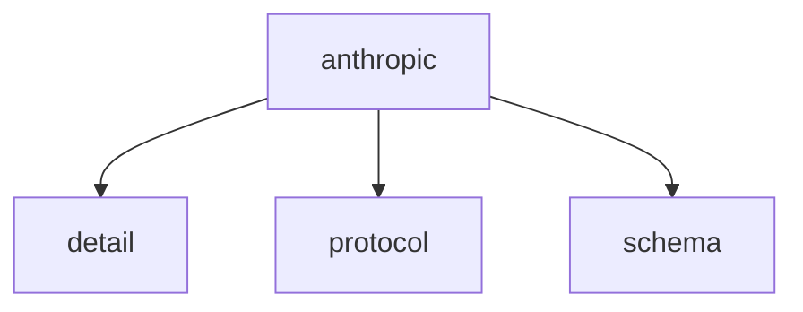

# Namespace `clore::net::anthropic`

## Summary

命名空间 `clore::net::anthropic` 封装了与 Anthropic API 进行异步交互的核心客户端函数。它提供了多个重载的 `call_llm_async`，分别接收字符串视图或整数参数来指定模型、提示、系统提示或最大 token 数，以及一个 `kota::event_loop` 引用；还提供 `call_completion_async` 用于基于整数句柄的完成操作，以及 `call_structured_async` 用于期望结构化响应的调用。所有函数均返回一个 `int` 句柄，调用方可通过该句柄与事件循环配合管理后续取消、结果获取或状态检查。该命名空间在整个 `clore::net` 层级中承担与 Anthropic 模型通信的职责，以非阻塞方式驱动请求与回调，调用方需确保事件循环在异步操作期间保持活跃。

## Diagram

## Subnamespaces

- [`clore::net::anthropic::detail`](detail/index.md)
- [`clore::net::anthropic::protocol`](protocol/index.md)
- [`clore::net::anthropic::schema`](schema/index.md)

## Functions

### `clore::net::anthropic::call_completion_async`

Declaration: `network/anthropic.cppm:729`

Definition: `network/anthropic.cppm:771`

Implementation: [`Module anthropic`](../../../../modules/anthropic/index.md)

调用 `clore::net::anthropic::call_completion_async` 时，需要传入一个整数参数和一个 `kota::event_loop &` 引用，并返回一个整数。该函数负责启动或协调某个基于整数标识的完成操作，调用者应确保所传递的循环正在运行以处理异步回调。返回的整数可能用于跟踪请求的状态或标识后续结果，具体语义由调用方根据使用场景解释。

#### Usage Patterns

- Used to perform asynchronous completion requests to the Anthropic API
- Typically awaited by callers in a coroutine context

### `clore::net::anthropic::call_llm_async`

Declaration: `network/anthropic.cppm:739`

Definition: `network/anthropic.cppm:789`

Implementation: [`Module anthropic`](../../../../modules/anthropic/index.md)

`clore::net::anthropic::call_llm_async` 发起一次对 Anthropic 大语言模型的异步调用。调用方需提供三个`std::string_view`参数（它们共同构成请求的凭据与载荷）以及一个`kota::event_loop &`——该事件循环必须在整个异步操作期间保持运行，因为完成通知与结果会通过它派发。函数返回一个`int`，作为本次调用的标识符，可用于后续取消或关联结果等操作。调用方不应依赖同步行为；操作的执行与回调完全由事件循环驱动。

#### Usage Patterns

- called by higher-level Anthropic wrappers to interact with the model
- used when asynchronous LLM completion with a system prompt is needed

### `clore::net::anthropic::call_llm_async`

Declaration: `network/anthropic.cppm:733`

Definition: `network/anthropic.cppm:778`

Implementation: [`Module anthropic`](../../../../modules/anthropic/index.md)

函数 `clore::net::anthropic::call_llm_async` 异步发起一次对 Anthropic LLM 的调用。调用者需提供请求的模型标识符（第一个 `std::string_view` 参数）、提示文本（第二个 `std::string_view` 参数）以及最大输出 token 数（`int` 参数），并传入一个 `kota::event_loop` 引用用于调度异步完成回调。函数立即返回一个整数句柄，可用于在后续调用 `clore::net::anthropic::call_completion_async` 时检查或等待本次调用结果。调用者负责确保所给 `event_loop` 在回调触发前保持活跃。

#### Usage Patterns

- 作为异步 LLM 调用的入口点
- 被需要非阻塞大语言模型交互的协程或任务驱动代码调用
- 常与 `kota::event_loop` 结合使用实现并发

### `clore::net::anthropic::call_structured_async`

Declaration: `network/anthropic.cppm:746`

Definition: `network/anthropic.cppm:801`

Implementation: [`Module anthropic`](../../../../modules/anthropic/index.md)

发起对 Anthropic API 的异步调用，并期望响应能够按照指定模板类型 `T` 的结构化模式进行解析。调用者需提供三个字符串视图参数（通常对应模型标识、系统提示和用户提示）以及一个 `kota::event_loop` 引用，用于管理异步事件。函数返回一个 `int` 句柄，该句柄可用于后续操作（如取消或检查完成状态），具体语义由调用方与 `event_loop` 的交互约定决定。

#### Usage Patterns

- used to make a structured call to the Anthropic API
- called when a typed response is required instead of raw text
- integrated into coroutine-based asynchronous workflows

## Related Pages

- [Namespace clore::net](../index.md)
- [Namespace clore::net::anthropic::detail](detail/index.md)
- [Namespace clore::net::anthropic::protocol](protocol/index.md)
- [Namespace clore::net::anthropic::schema](schema/index.md)

