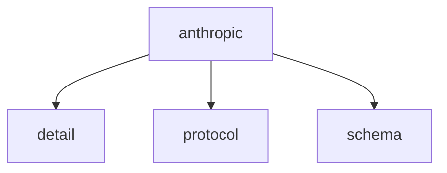

# Namespace `clore::net::anthropic`

## Summary

`clore::net::anthropic` 命名空间封装了与 Anthropic 语言模型 API 的异步交互，提供了一组非阻塞的调用入口。其核心函数包括 `call_llm_async`（接受模型标识、提示文本和事件循环等参数）、`call_completion_async` 用于轮询/等待异步结果，以及 `call_structured_async` 用于期望结构化响应的请求。所有函数均返回一个整数句柄，调用者可通过该句柄在后续查询或取消操作；它们依赖外部的 `kota::event_loop` 驱动异步执行，调用者需确保事件循环保持活跃。该命名空间在 clore 网络库中承担针对 Anthropic 服务的专用通信层角色。

## Diagram

## Subnamespaces

- [`clore::net::anthropic::detail`](detail/index.md)
- [`clore::net::anthropic::protocol`](protocol/index.md)
- [`clore::net::anthropic::schema`](schema/index.md)

## Functions

### `clore::net::anthropic::call_completion_async`

Declaration: `network/anthropic.cppm:722`

Definition: `network/anthropic.cppm:764`

Implementation: [`Module anthropic`](../../../../modules/anthropic/index.md)

该函数发起一个对 Anthropic 的 completion API 的异步调用，并返回一个整数标识符（可能是请求 ID 或任务句柄）。调用者需提供一个整数参数（应代表预定义的配置或模型选择）和一个 `kota::event_loop` 引用以驱动异步执行；函数返回的整数可用于后续跟踪或取消操作，具体由事件循环调度。调用者负责确保事件循环保持活动状态直到回调完成。

#### Usage Patterns

- Used as a building block for higher-level Anthropic interaction functions in the `clore::net::anthropic` namespace

### `clore::net::anthropic::call_llm_async`

Declaration: `network/anthropic.cppm:732`

Definition: `network/anthropic.cppm:782`

Implementation: [`Module anthropic`](../../../../modules/anthropic/index.md)

该函数启动一次对 Anthropic LLM 的异步调用。调用者需提供三个字符串视图参数（含义由上下文约定，通常分别对应 API 密钥、模型标识和提示文本）以及一个 `kota::event_loop` 引用用于调度异步事件。函数返回一个整数，该整数代表此次异步请求的标识符或执行状态，调用者可据此后续查询或取消操作。

#### Usage Patterns

- Async LLM completion call from coroutine context
- Wrapper that delegates to protocol-specific implementation
- Used in combination with `.or_fail()` to convert errors

### `clore::net::anthropic::call_llm_async`

Declaration: `network/anthropic.cppm:726`

Definition: `network/anthropic.cppm:771`

Implementation: [`Module anthropic`](../../../../modules/anthropic/index.md)

发起对 Anthropic 语言模型的异步调用。函数接受三个 `std::string_view` 参数（分别表示模型标识、系统提示与用户消息）、一个 `int` 参数（超时或最大 token 数）以及一个 `kota::event_loop` 引用用于驱动异步操作。返回一个 `int` 句柄，调用者可随后使用 `call_completion_async` 轮询或等待结果。调用者须确保提供的 `kota::event_loop` 在调用期间保持活动状态。

#### Usage Patterns

- Used to send prompts to Anthropic and await responses asynchronously
- Called from other async functions within the `clore::net::anthropic` namespace

### `clore::net::anthropic::call_structured_async`

Declaration: `network/anthropic.cppm:739`

Definition: `network/anthropic.cppm:794`

Implementation: [`Module anthropic`](../../../../modules/anthropic/index.md)

`clore::net::anthropic::call_structured_async` 是一个异步函数模板，调用者通过它向 Anthropic 的 LLM 发起请求，并期望获得一个由模板参数 `T` 描述的结构化响应。调用者需提供三个 `std::string_view` 参数（通常分别为模型标识、提示内容及其他配置信息）和一个 `kota::event_loop` 引用，函数返回一个 `int` 句柄。该句柄可用于后续通过 `clore::net::anthropic::call_completion_async` 等接口查询异步操作的状态或取得最终结果。调用者必须确保提供的 `kota::event_loop` 处于活跃运行状态，否则异步调用无法正常完成。

#### Usage Patterns

- Used to make structured asynchronous calls to the Anthropic API
- Called with model identifier, system prompt, user prompt, and an event loop

## Related Pages

- [Namespace clore::net](../index.md)
- [Namespace clore::net::anthropic::detail](detail/index.md)
- [Namespace clore::net::anthropic::protocol](protocol/index.md)
- [Namespace clore::net::anthropic::schema](schema/index.md)

