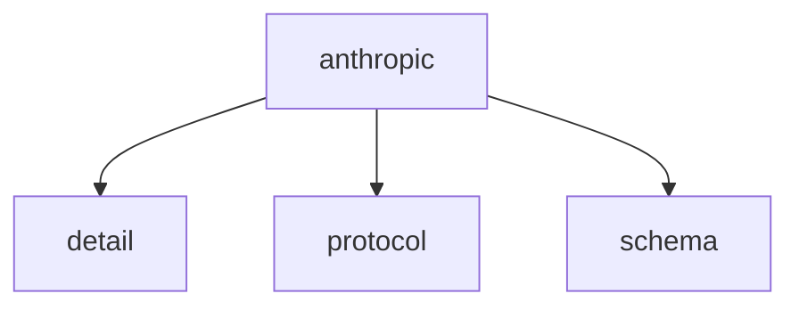

# Namespace `clore::net::anthropic`

## Summary

命名空间 `clore::net::anthropic` 封装了与 Anthropic API 异步交互的核心能力。其主要职责是提供一组基于 `kota::event_loop` 的异步函数（如 `call_llm_async`、`call_structured_async` 和 `call_completion_async`），用于向 Anthropic 发送 LLM 请求、获取结构化回复或完成补全。函数均接受模型标识、提示、系统提示等字符串参数，并返回一个 `int` 句柄，调用方可借助该句柄追踪请求状态或取消操作。

在架构上，该命名空间充当 `clore::net` 网络层中的一个专项模块，专门对接 Anthropic 服务。它通过事件循环驱动异步回调，要求调用方确保传入的字符串视图和事件循环在请求完成前保持有效，从而提供了非阻塞、可取消的 LLM 调用接口。所有异步操作的结果通过回调或句柄传递，与上层业务逻辑解耦。

## Diagram

```mermaid
graph TD
    NS["anthropic"]
    NSC0["detail"]
    NS --> NSC0
    NSC1["protocol"]
    NS --> NSC1
    NSC2["schema"]
    NS --> NSC2
```

## Subnamespaces

- [`clore::net::anthropic::detail`](detail/index.md)
- [`clore::net::anthropic::protocol`](protocol/index.md)
- [`clore::net::anthropic::schema`](schema/index.md)

## Functions

### `clore::net::anthropic::call_completion_async`

Declaration: `src/network/anthropic.cppm:738`

Definition: `src/network/anthropic.cppm:780`

Implementation: [`Module anthropic`](../../../../modules/anthropic/index.md)

函数 `clore::net::anthropic::call_completion_async` 发起一个异步的 completion 请求。调用者需传入一个 `int` 类型的参数（可能表示请求标识或配置索引）以及一个 `kota::event_loop&` 引用，用于驱动异步回调。函数返回一个 `int` 值，代表本次异步操作的结果或句柄。调用者负责在事件循环上调度执行，并依据返回值判断操作的启动状态。

#### Usage Patterns

- Called as a coroutine to perform an asynchronous completion request to the Anthropic API
- Used in conjunction with `kota::event_loop` for async execution
- Serves as a high-level entry point for Anthropic completion interactions

### `clore::net::anthropic::call_llm_async`

Declaration: `src/network/anthropic.cppm:742`

Definition: `src/network/anthropic.cppm:787`

Implementation: [`Module anthropic`](../../../../modules/anthropic/index.md)

函数 `clore::net::anthropic::call_llm_async` 发起一个异步请求，调用 Anthropic 的 LLM API。调用方需提供模型标识符（第一个 `std::string_view`）、提示文本（第二个 `std::string_view`）、最大输出令牌数（`int`）以及一个 `kota::event_loop` 引用。函数立即返回一个 `int` 句柄，用于标识该异步操作，调用方可利用该句柄追踪请求状态或取消操作。调用方必须保证所传入的 `event_loop` 在请求完成前保持有效。

#### Usage Patterns

- called to send a prompt to the Anthropic LLM asynchronously within an event-loop-driven application
- typically awaited by higher-level coroutines

### `clore::net::anthropic::call_llm_async`

Declaration: `src/network/anthropic.cppm:748`

Definition: `src/network/anthropic.cppm:798`

Implementation: [`Module anthropic`](../../../../modules/anthropic/index.md)

`clore::net::anthropic::call_llm_async` 发起一个异步调用，代表调用方向 Anthropic API 发送 LLM 请求。调用方必须提供三个 `std::string_view` 参数——通常分别是认证令牌、模型标识符和用户提示——以及一个 `kota::event_loop &` 引用，事件循环将调度并执行异步操作。

该函数返回一个 `int` 值，可用于后续跟踪或取消此次请求。调用方应确保提供的字符串视图在异步操作完成前保持有效，并负责在事件循环运行后处理返回的结果或错误。

#### Usage Patterns

- 作为高层入口点调用 Anthropic LLM
- 可能被 `call_structured_async` 等函数包装

### `clore::net::anthropic::call_structured_async`

Declaration: `src/network/anthropic.cppm:755`

Definition: `src/network/anthropic.cppm:810`

Implementation: [`Module anthropic`](../../../../modules/anthropic/index.md)

异步发起一次结构化的 LLM 调用，要求服务器按照模板参数 `T` 所指定的类型返回结构化的响应。调用者提供三条字符串参数（通常依次为模型标识、系统提示和用户消息）以及一个 `kota::event_loop` 引用。返回一个 `int` 标识本次请求的句柄，用于后续查询结果或取消操作。调用方负责确保 `T` 可被反序列化，并在事件循环的上下文中完成回调处理。

#### Usage Patterns

- 用于发起异步结构化 LLM 调用并获取类型化结果

## Related Pages

- [Namespace clore::net](../index.md)
- [Namespace clore::net::anthropic::detail](detail/index.md)
- [Namespace clore::net::anthropic::protocol](protocol/index.md)
- [Namespace clore::net::anthropic::schema](schema/index.md)

