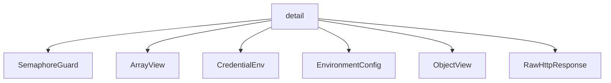

# Namespace `clore::net::detail`

## Summary

该命名空间是 `clore::net` 网络库的底层实现细节，封装了与 LLM API 交互所需的 HTTP 通信、JSON 数据校验与克隆、环境配置与凭证读取、请求并发控制等内部机制。它包含了用于解析和验证 JSON 结构的一系列“期望”函数（如 `expect_array`、`expect_object`、`expect_string`）、异步与同步 HTTP 请求封装（如 `perform_http_request`、`perform_http_request_async`）、以及用于任务同步、超时管理（如 `kHttpRequestTimeout`、`kHttpConnectTimeoutMs`）、请求计数器（`g_llm_request_counter`）和信号量（`g_llm_semaphore`）等全局状态。此外还提供了 `ArrayView`、`ObjectView`、`CredentialEnv`、`EnvironmentConfig`、`RawHttpResponse` 等内部类型，用于在模块内部高效安全地传递和操作 JSON 与 HTTP 响应数据。

在 `clore::net` 的架构中，`detail` 命名空间承担了所有与外部服务通信、数据序列化/反序列化、以及输入校验的底层工作，向上层 `clore::net` 的公开接口提供可靠但非公开的基础设施。它通过标准化的错误包装（如 `unexpected_json_error`、`to_llm_unexpected`）和结果解包（`unwrap_caught_result`）机制，将底层错误统一转化为库内部可处理的整数状态码。该命名空间的设计意图是隐藏实现复杂性，确保上层只通过清晰定义的接口访问 LLM 服务，而将所有与协议、格式、连接管理相关的细节隔离在此内部层中。

## Diagram



## Types

### `clore::net::detail::ArrayView`

Declaration: `network/protocol.cppm:174`

Definition: `network/protocol.cppm:174`

Implementation: [`Module protocol`](../../../../modules/protocol/index.md)

Insufficient evidence to summarize; provide more EVIDENCE.

#### Invariants

- `value` must point to a valid, non-null `kota::codec::json::Array`
- the underlying array must outlive the view
- the view provides read-only access only

#### Key Members

- `value` field
- `operator[]`
- `begin` / `end`
- `size`
- `empty`

#### Usage Patterns

- passing a reference to a JSON array without copying
- iterating over array elements using range-for loops
- returning a non-owning view from functions to avoid lifetime issues

#### Member Functions

##### `clore::net::detail::ArrayView::begin`

Declaration: `network/protocol.cppm:185`

Definition: `network/protocol.cppm:185`

Implementation: [`Module protocol`](../../../../modules/protocol/index.md)

###### Declaration

```cpp
const_iterator () const noexcept;
```

##### `clore::net::detail::ArrayView::empty`

Declaration: `network/protocol.cppm:177`

Definition: `network/protocol.cppm:177`

Implementation: [`Module protocol`](../../../../modules/protocol/index.md)

###### Declaration

```cpp
auto () const noexcept -> bool;
```

##### `clore::net::detail::ArrayView::end`

Declaration: `network/protocol.cppm:189`

Definition: `network/protocol.cppm:189`

Implementation: [`Module protocol`](../../../../modules/protocol/index.md)

###### Declaration

```cpp
const_iterator () const noexcept;
```

##### `clore::net::detail::ArrayView::operator*`

Declaration: `network/protocol.cppm:201`

Definition: `network/protocol.cppm:201`

Implementation: [`Module protocol`](../../../../modules/protocol/index.md)

###### Declaration

```cpp
auto () const noexcept -> const kota::codec::json::Array &;
```

##### `clore::net::detail::ArrayView::operator->`

Declaration: `network/protocol.cppm:197`

Definition: `network/protocol.cppm:197`

Implementation: [`Module protocol`](../../../../modules/protocol/index.md)

###### Declaration

```cpp
auto () const noexcept -> const kota::codec::json::Array *;
```

##### `clore::net::detail::ArrayView::operator[]`

Declaration: `network/protocol.cppm:193`

Definition: `network/protocol.cppm:193`

Implementation: [`Module protocol`](../../../../modules/protocol/index.md)

###### Declaration

```cpp
auto (std::size_t) const -> const kota::codec::json::Value &;
```

##### `clore::net::detail::ArrayView::size`

Declaration: `network/protocol.cppm:181`

Definition: `network/protocol.cppm:181`

Implementation: [`Module protocol`](../../../../modules/protocol/index.md)

###### Declaration

```cpp
auto () const noexcept -> std::size_t;
```

### `clore::net::detail::CredentialEnv`

Declaration: `network/provider.cppm:14`

Definition: `network/provider.cppm:14`

Implementation: [`Module provider`](../../../../modules/provider/index.md)

Insufficient evidence to summarize; provide more EVIDENCE.

#### Invariants

- `base_url_env` and `api_key_env` should point to valid, immutable string views
- No invariants are enforced by the struct; callers are responsible for ensuring the string views remain valid

#### Key Members

- `base_url_env`
- `api_key_env`

#### Usage Patterns

- Used to pass environment variable names to credential retrieval logic
- Likely instantiated in higher-level credential handling code

### `clore::net::detail::EnvironmentConfig`

Declaration: `network/http.cppm:37`

Definition: `network/http.cppm:37`

Implementation: [`Module http`](../../../../modules/http/index.md)

Insufficient evidence to summarize; provide more EVIDENCE.

#### Invariants

- None documented.

#### Key Members

- `api_base`
- `api_key`

#### Usage Patterns

- Used as a parameter or member in HTTP client configuration within the `clore::net::detail` namespace.

### `clore::net::detail::ObjectView`

Declaration: `network/protocol.cppm:152`

Definition: `network/protocol.cppm:152`

Implementation: [`Module protocol`](../../../../modules/protocol/index.md)

Insufficient evidence to summarize; provide more EVIDENCE.

#### Invariants

- `value` must point to a valid `kota::codec::json::Object` when accessing its members
- The underlying object is not owned by `ObjectView` and must outlive the view

#### Key Members

- `value`: pointer to the underlying JSON object
- `get(std::string_view)`: retrieves cursor for a key
- `begin()` / `end()`: iteration over object entries
- `operator->()` / `operator*()`: direct access to the underlying object

#### Usage Patterns

- Used to pass a JSON object by reference with a consistent interface
- Provides safe key-based access via `get()` without exposing the raw pointer
- Can be iterated using range-based for loops

#### Member Functions

##### `clore::net::detail::ObjectView::begin`

Declaration: `network/protocol.cppm:157`

Definition: `network/protocol.cppm:157`

Implementation: [`Module protocol`](../../../../modules/protocol/index.md)

###### Declaration

```cpp
const_iterator () const noexcept;
```

##### `clore::net::detail::ObjectView::end`

Declaration: `network/protocol.cppm:161`

Definition: `network/protocol.cppm:161`

Implementation: [`Module protocol`](../../../../modules/protocol/index.md)

###### Declaration

```cpp
const_iterator () const noexcept;
```

##### `clore::net::detail::ObjectView::get`

Declaration: `network/protocol.cppm:155`

Definition: `network/protocol.cppm:276`

Implementation: [`Module protocol`](../../../../modules/protocol/index.md)

###### Declaration

```cpp
auto (std::string_view) const -> std::optional<json::Cursor>;
```

##### `clore::net::detail::ObjectView::operator*`

Declaration: `network/protocol.cppm:169`

Definition: `network/protocol.cppm:169`

Implementation: [`Module protocol`](../../../../modules/protocol/index.md)

###### Declaration

```cpp
auto () const noexcept -> const kota::codec::json::Object &;
```

##### `clore::net::detail::ObjectView::operator->`

Declaration: `network/protocol.cppm:165`

Definition: `network/protocol.cppm:165`

Implementation: [`Module protocol`](../../../../modules/protocol/index.md)

###### Declaration

```cpp
auto () const noexcept -> const kota::codec::json::Object *;
```

### `clore::net::detail::RawHttpResponse`

Declaration: `network/http.cppm:42`

Definition: `network/http.cppm:42`

Implementation: [`Module http`](../../../../modules/http/index.md)

Insufficient evidence to summarize; provide more EVIDENCE.

#### Invariants

- `http_status` is set to a valid HTTP status code after a response is received
- `body` contains the full response body as received from the server

#### Key Members

- `http_status`
- `body`

#### Usage Patterns

- Used internally by the HTTP client to hold raw response data before parsing
- Constructed by the network layer and then used to build a higher-level response object

## Variables

### `clore::net::detail::g_llm_request_counter`

Declaration: `network/http.cppm:94`

Implementation: [`Module http`](../../../../modules/http/index.md)

An atomic counter initialized to 0, used to assign unique request numbers to LLM HTTP requests.

#### Usage Patterns

- assigned to local request number variables
- accessed in HTTP request context

### `clore::net::detail::g_llm_semaphore`

Declaration: `network/http.cppm:47`

Implementation: [`Module http`](../../../../modules/http/index.md)

`clore::net::detail::g_llm_semaphore` is a global variable of type `std::unique_ptr<kota::semaphore>`, declared `extern` in `network/http.cppm:47`. It represents a semaphore used for rate limiting LLM (large language model) HTTP requests.

#### Usage Patterns

- acquired/released in `perform_http_request_async` for rate limiting
- passed to initialization and shutdown functions

### `clore::net::detail::kHttpConnectTimeoutMs`

Declaration: `network/http.cppm:96`

Implementation: [`Module http`](../../../../modules/http/index.md)

A compile-time constant of type `long` set to `5'000` milliseconds. It resides in `clore::net::detail` and is intended for internal use.

#### Usage Patterns

- passed to HTTP request configuration in `configure_request`

### `clore::net::detail::kHttpRequestTimeout`

Declaration: `network/http.cppm:97`

Implementation: [`Module http`](../../../../modules/http/index.md)

A compile-time constant of type `std::chrono::milliseconds` initialized to `120'000` (120 seconds), intended as the default timeout duration for HTTP requests.

#### Usage Patterns

- used as timeout argument in HTTP request functions

## Functions

### `clore::net::detail::append_url_path`

Declaration: `network/provider.cppm:21`

Definition: `network/provider.cppm:43`

Implementation: [`Module provider`](../../../../modules/provider/index.md)

`clore::net::detail::append_url_path` 接受两个 `std::string_view` 参数，返回一个 `std::string`。调用者应提供基础 URL 或路径前缀作为第一个参数，要追加的路径段作为第二个参数；函数会负责处理分隔符（例如 `/`）的规范化，并返回合并后的完整路径字符串。该函数不修改输入参数，也不抛出与格式无效相关的异常。

#### Usage Patterns

- building HTTP request `URLs`
- URL path normalization

### `clore::net::detail::clone_array`

Declaration: `network/protocol.cppm:264`

Definition: `network/protocol.cppm:438`

Implementation: [`Module protocol`](../../../../modules/protocol/index.md)

函数 `clore::net::detail::clone_array` 负责对给定的 JSON 数组进行验证和克隆操作。它接受一个 `ArrayView` 参数作为待处理的数组，以及一个 `std::string_view` 参数作为上下文标识（通常用于错误消息的生成），并返回一个 `int` 类型的状态码。调用方应保证传入的 `ArrayView` 指向一个有效的、可访问的 JSON 数组；函数的返回值指示操作是否成功，其中非零值通常表示成功（或特定成功状态），零或负值表示失败，具体约定与同一命名空间下的其他验证函数（如 `clone_object`、`expect_array` 等）保持一致。此函数不负责管理传入数组的生命周期，调用方需确保其有效性直至调用返回。

#### Usage Patterns

- deep copy of array data from an `ArrayView`
- cloning an array for further processing or modification

### `clore::net::detail::clone_object`

Declaration: `network/protocol.cppm:261`

Definition: `network/protocol.cppm:447`

Implementation: [`Module protocol`](../../../../modules/protocol/index.md)

函数 `clone_object` 接受一个 `ObjectView` 及一个用于错误上下文的 `std::string_view`，生成前者所引用 JSON 对象的深拷贝。调用者负责确保传入的 `ObjectView` 有效、指向一个有效的 JSON 对象，并且该对象的内容可安全复制。返回 `int` 状态码：成功时为零，失败时返回非零值，调用者应据此检查操作结果。

#### Usage Patterns

- Clone a JSON object for mutation or independent ownership.
- Used when a separate copy of an object view is needed.

### `clore::net::detail::clone_object`

Declaration: `network/protocol.cppm:258`

Definition: `network/protocol.cppm:442`

Implementation: [`Module protocol`](../../../../modules/protocol/index.md)

克隆 `clore::net::detail::ObjectView` 所引用的 JSON 对象。该函数接受一个源对象视图和一个用于错误报告的上下文标签，并返回一个 `int` 状态码，通常为 0 表示成功，非零值表示失败。调用者应确保提供的 `ObjectView` 有效且合法，并在调用后检查返回的状态。

#### Usage Patterns

- Called when a mutable or independently owned copy of an object is required
- Used in contexts where the original object must remain unchanged after modification of the copy

### `clore::net::detail::clone_value`

Declaration: `network/protocol.cppm:267`

Definition: `network/protocol.cppm:451`

Implementation: [`Module protocol`](../../../../modules/protocol/index.md)

调用者提供一个要克隆的 `const json::Value &` 及一个用于诊断错误的 `std::string_view` 上下文描述。`clore::net::detail::clone_value` 负责生成该 JSON 值的一个独立深层副本，返回 `int` 结果以指示操作是否成功，失败时使用提供的上下文辅助错误报告。调用者应在需要复制 JSON 内容以确保后续修改不干扰原始值时使用此函数。

#### Usage Patterns

- duplicate a JSON value for safe mutation
- clone a JSON value before validation to avoid modifying the original

### `clore::net::detail::configure_request`

Declaration: `network/http.cppm:126`

Definition: `network/http.cppm:126`

Implementation: [`Module http`](../../../../modules/http/index.md)

函数 `clore::net::detail::configure_request` 负责对一个给定的 `kota::http::request` 对象进行配置，使其能够用于后续的 HTTP 请求操作。调用者需传入一个可修改的请求引用、一个整型参数（通常用于指定超时或标识）以及一个字符串参数（常用于指定路径、令牌或请求体内容）。该函数会修改请求对象的状态，设置必要的请求属性（如目标 URL、超时值或请求头），并假定所有参数已经过验证。若配置失败，函数行为未定义，但通常期望在配置过程中不抛出异常。由于该函数属于 `detail` 命名空间，它仅供库内部使用，不应被外部代码直接调用。

#### Usage Patterns

- Called before performing an HTTP request to set up headers and body.
- Used to apply curl options for timeout and keepalive.

### `clore::net::detail::excerpt_for_error`

Declaration: `network/protocol.cppm:219`

Definition: `network/protocol.cppm:312`

Implementation: [`Module protocol`](../../../../modules/protocol/index.md)

`clore::net::detail::excerpt_for_error` 接受一个 `std::string_view` 参数并返回一个 `std::string`。它从输入的字符串中提取一个适合整合到错误消息或诊断输出中的片段。调用者应当提供一个代表可能冗长或结构化的错误上下文的原始字符串，该函数会将其精炼为一个更紧凑、对人类更友好的表示形式。

#### Usage Patterns

- Used to create safe excerpts of response bodies for error messages

### `clore::net::detail::expect_array`

Declaration: `network/protocol.cppm:246`

Definition: `network/protocol.cppm:402`

Implementation: [`Module protocol`](../../../../modules/protocol/index.md)

`clore::net::detail::expect_array` 验证给定的 JSON 值是否为一个 JSON 数组。如果该值不是数组，则返回一个非零错误码；否则返回 `0` 表示成功。第一个参数可以是 `const json::Value &` 或 `json::Cursor`，代表待检查的 JSON 值；第二个参数 `std::string_view` 是一个人类可读的上下文描述（例如字段名或路径），用于在失败时生成有意义的错误报告。调用者应确保提供的 JSON 值是有效的，并负责在返回非零值时进行错误处理。

#### Usage Patterns

- Used to safely extract a JSON array from a value before processing its elements.
- Called by functions that expect an array in a specific context, similar to `expect_object` or `expect_string`.
- Often used in combination with `ArrayView` methods like `begin`, `end`, `size`, and `operator[]`.

### `clore::net::detail::expect_array`

Declaration: `network/protocol.cppm:249`

Definition: `network/protocol.cppm:411`

Implementation: [`Module protocol`](../../../../modules/protocol/index.md)

`clore::net::detail::expect_array` 断言一个 JSON 值必须是一个数组。调用者提供要检查的 `json::Cursor` 或 `const json::Value &` 以及一个描述性字符串（通常来自调用点，用于错误报告），函数在值不是数组时返回一个负整数错误码；如果值是合法的数组则返回 `0`。

该函数是 `clore::net::detail` 中解析和验证协议输入的一组“期望”工具之一。调用者应先使用此函数确认值类型，再安全地访问数组内容；错误的类型将触发一个带上下文标签的错误返回，而不会崩溃或不一致。

#### Usage Patterns

- validating JSON cursors as arrays before further processing
- converting a JSON cursor to an `ArrayView` for iteration or indexing

### `clore::net::detail::expect_object`

Declaration: `network/protocol.cppm:240`

Definition: `network/protocol.cppm:384`

Implementation: [`Module protocol`](../../../../modules/protocol/index.md)

调用 `clore::net::detail::expect_object` 用于断言给定的 JSON 值（`const json::Value &`）必须是一个 JSON 对象。此函数是 JSON 结构校验链中的一环，专用于期望一个对象类型。调用者需提供上下文描述字符串（`std::string_view`），该字符串会在校验失败时用于生成错误报告。如果传入的 JSON 值确实是一个对象，函数返回表明成功的整数；否则返回一个表示错误的整数。

#### Usage Patterns

- Used to extract a JSON object from a Value with error reporting
- Called by validation functions to ensure a value is an object

### `clore::net::detail::expect_object`

Declaration: `network/protocol.cppm:243`

Definition: `network/protocol.cppm:393`

Implementation: [`Module protocol`](../../../../modules/protocol/index.md)

函数 `clore::net::detail::expect_object` 验证当前指向的 JSON 值是否为一个对象。它接受一个 `json::Cursor`（或 `const json::Value &`）和一个 `std::string_view` 作为上下文描述（通常为字段名或路径）。当值不是对象时，它生成错误并返回一个表示失败的非零整数；成功时返回零。调用者应当在解析已知应包含 JSON 对象的字段时使用此函数来强制执行类型契约。

#### Usage Patterns

- Used to validate that a JSON value is an object, returning an `ObjectView` for further field access
- Commonly called from higher-level parsing functions that require a JSON object at a given path

### `clore::net::detail::expect_string`

Declaration: `network/protocol.cppm:255`

Definition: `network/protocol.cppm:429`

Implementation: [`Module protocol`](../../../../modules/protocol/index.md)

函数 `clore::net::detail::expect_string` 验证给定的 JSON 值或游标是否代表一个字符串。它有两个重载：接受 `const json::Value &` 和 `std::string_view`，或接受 `json::Cursor` 和 `std::string_view`。第二个参数 `std::string_view` 用于提供上下文描述（例如字段路径或名称），以便在验证失败时生成有意义的错误信息。成功时返回零，失败时返回非零错误码。调用方负责提供有效的 JSON 值或游标，并给出一个清晰的上下文字符串，以帮助在解析错误时快速定位问题。

#### Usage Patterns

- Used when a JSON value must be a string, e.g., extracting fields from JSON objects or arrays
- Called by validation functions like `validate_completion_request`

### `clore::net::detail::expect_string`

Declaration: `network/protocol.cppm:252`

Definition: `network/protocol.cppm:420`

Implementation: [`Module protocol`](../../../../modules/protocol/index.md)

`clore::net::detail::expect_string` 验证给定的 JSON 值是否为字符串。调用者提供一个 `json::Value` 引用以及一个描述操作上下文的 `std::string_view`（通常用于错误消息中的标识符）。如果该值不是字符串，函数返回一个非零整数表示失败；否则返回零。该函数是 JSON 模式验证工具集的一部分，用于在解析和序列化过程中确保字段类型正确。

#### Usage Patterns

- Validate that a JSON value is a string before processing
- Extract a string view from a JSON value with error handling

### `clore::net::detail::infer_output_contract`

Declaration: `network/protocol.cppm:627`

Definition: `network/protocol.cppm:644`

Implementation: [`Module protocol`](../../../../modules/protocol/index.md)

从给定的 `PromptRequest` 推断出应施加于 LLM 输出的输出合约类型。该函数解析请求内的结构参数，并返回一个整型合约标识符，该标识符对应于 `clore::net` 输出验证子系统所识别的某个预定义输出合约变体。

调用者应使用此返回值来配置下游处理管线，特别是当需要根据请求内容动态选择输出格式或约束条件时。返回的整数可传递给如 `validate_prompt_output` 或 `validate_response_format` 等函数，以将输出约束施加于后续请求结果。

#### Usage Patterns

- Called to determine the output contract before sending a prompt request
- Used to validate consistency between `response_format` and `output_contract`

### `clore::net::detail::insert_string_field`

Declaration: `network/protocol.cppm:211`

Definition: `network/protocol.cppm:299`

Implementation: [`Module protocol`](../../../../modules/protocol/index.md)

将指定的字符串键和对应的值插入到一个 `json::Object` 中，并返回一个整数指示操作结果。调用者提供目标可变对象 `json::Object &`，以及三个 `std::string_view` 参数 —— 通常第一个代表字段名称，第二个代表字段值，第三个可能用作错误上下文或路径信息。返回值为 `0` 表示成功，非零表示发生了预期错误（如字段已存在或类型不匹配）。该函数是协议构建设施的一部分，确保字符串字段能被安全且一致地写入 JSON 结构中。

#### Usage Patterns

- adding a simple string field to a JSON object
- building JSON request bodies

### `clore::net::detail::make_empty_array`

Declaration: `network/protocol.cppm:227`

Definition: `network/protocol.cppm:344`

Implementation: [`Module protocol`](../../../../modules/protocol/index.md)

`make_empty_array` 是 `clore::net::detail` 命名空间中的一个工具函数，用于创建一个空的 JSON 数组。调用方需要提供一个 `std::string_view` 参数，该参数作为此操作的上下文描述，在发生错误时用于生成详细的诊断信息。函数返回一个 `int` 类型的状态码，成功时为零，失败时为指示错误类型的非零值。此函数常用于需要从零开始构建 JSON 数组的场景，例如在序列化或协议处理流程中初始化一个空的数组容器。

#### Usage Patterns

- Obtain an empty JSON array for a response or data structure
- Safely produce an initialized empty array

### `clore::net::detail::make_empty_object`

Declaration: `network/protocol.cppm:224`

Definition: `network/protocol.cppm:336`

Implementation: [`Module protocol`](../../../../modules/protocol/index.md)

`clore::net::detail::make_empty_object` 接受一个 `std::string_view` 参数作为调用上下文标签（通常用于错误报告），并返回一个 `int` 值表示操作结果：零表示成功创建了一个空对象，非零表示失败。调用者提供的字符串视图必须在函数调用期间保持有效。

#### Usage Patterns

- create an empty JSON object for initialization
- used in net module to produce placeholder objects

### `clore::net::detail::normalize_utf8`

Declaration: `network/protocol.cppm:209`

Definition: `network/protocol.cppm:289`

Implementation: [`Module protocol`](../../../../modules/protocol/index.md)

函数 `clore::net::detail::normalize_utf8` 接受两个 `std::string_view` 参数并返回一个 `std::string`。该函数负责对提供的 UTF-8 字符串进行标准化处理，调用者应确保传入的字符串是合法的 UTF-8 序列，并且理解标准化行为由两个参数的组合决定。函数不会修改传入的输入，返回一个新的、标准化后的字符串。

#### Usage Patterns

- Standardizing user-supplied or LLM-generated text before JSON serialization
- Ensuring UTF-8 validity in network request/response processing

### `clore::net::detail::parse_json_object`

Declaration: `network/provider.cppm:27`

Definition: `network/provider.cppm:148`

Implementation: [`Module provider`](../../../../modules/provider/index.md)

调用 `clore::net::detail::parse_json_object` 解析一个以 `std::string_view` 形式提供的 JSON 文本，期望其顶层值为一个 JSON 对象。第一个参数是待解析的 JSON 文本；第二个参数是一个描述性标签（通常为调用处的标识符或文件名），用于在解析失败时生成有意义的错误消息。该函数不抛出异常，而是通过返回值报告结果。

返回值 `int` 表示操作状态：成功时返回 `0`，失败时返回一个非零错误码。调用方必须检查返回值，并可通过 `clore::net::detail::unexpected_json_error` 等辅助函数将错误码转换为更详细的诊断信息。

#### Usage Patterns

- parsing JSON objects from raw strings with error context

### `clore::net::detail::parse_json_value`

Declaration: `network/protocol.cppm:234`

Definition: `network/protocol.cppm:364`

Implementation: [`Module protocol`](../../../../modules/protocol/index.md)

函数 `clore::net::detail::parse_json_value` 是一个模板函数，用于将给定的 `const json::Value &` 解析为指定的类型 `T`。它接受一个 `std::string_view` 作为上下文描述，用于在发生错误时生成有意义的诊断信息。

调用者负责提供有效的 JSON 值和一个描述解析场景的上下文字符串。函数返回一个 `int`，通常为 0 表示成功，非零值表示解析失败或类型不匹配。具体的错误语义由实现定义，但调用者应检查返回值并据此处理错误。

#### Usage Patterns

- Wraps the string parsing overload to accept a `json::Value`
- Used where a JSON value needs to be parsed into a specific type

### `clore::net::detail::parse_json_value`

Declaration: `network/protocol.cppm:231`

Definition: `network/protocol.cppm:353`

Implementation: [`Module protocol`](../../../../modules/protocol/index.md)

`clore::net::detail::parse_json_value` 解析给定的 JSON 文本字符串视图并返回一个整数状态码。第一个参数是待解析的 JSON 内容，第二个参数是一个描述性的上下文标签，用于生成错误消息。模板参数 `T` 指示解析后期望的 JSON 值类型，但函数始终以 `int` 形式返回解析结果。调用者必须检查返回码：通常 `0` 表示成功，非零值表示解析失败，失败信息可通过上下文标签追溯。

#### Usage Patterns

- Deserialize JSON configuration or response into a typed struct or value
- Used in error-handling paths that need contextual failure messages

### `clore::net::detail::perform_http_request`

Declaration: `network/http.cppm:52`

Definition: `network/http.cppm:139`

Implementation: [`Module http`](../../../../modules/http/index.md)

`clore::net::detail::perform_http_request` 发起一次 HTTP 请求并返回结果。调用方需提供请求 URL（`const std::string &`）、一个整数配置参数（如超时或重试限制）以及一个字符串视图载荷（`std::string_view`）。函数返回 `std::expected<RawHttpResponse, LLMError>`：请求成功时包含 `RawHttpResponse`，失败时包含 `LLMError`。

调用方必须检查这个 `std::expected` 值，以确定操作是否成功，并相应处理响应或错误。此函数是同步的，会阻塞直到请求完成或出错，因此应确保在合适的执行上下文中调用它。

#### Usage Patterns

- Callers use this function to perform a blocking HTTP request
- Used to synchronously invoke asynchronous HTTP operations
- Typically called from non-async contexts where a blocking interface is required

### `clore::net::detail::perform_http_request_async`

Declaration: `network/http.cppm:57`

Definition: `network/http.cppm:165`

Implementation: [`Module http`](../../../../modules/http/index.md)

此函数发起一次异步HTTP请求。调用者需提供目标地址（`std::string`）、端口号（`int`）、请求内容（`std::string`）以及一个活跃的 `async::event_loop &` 引用。函数返回一个 `int`，该值通常用于标识请求或表示操作状态。调用者必须确保事件循环在请求整个生命周期内保持可运行，并在该事件循环中安排结果处理；该函数本身不阻塞也不提供同步等待机制，所有完成事件及响应数据均通过事件循环派发。

#### Usage Patterns

- 作为 LLM API 异步调用的核心实现
- 被高层请求调度函数调用
- 处理并发限流和错误恢复

### `clore::net::detail::read_credentials`

Declaration: `network/provider.cppm:19`

Definition: `network/provider.cppm:39`

Implementation: [`Module provider`](../../../../modules/provider/index.md)

`clore::net::detail::read_credentials` 从给定的 `CredentialEnv` 中解析并读取凭证。调用者负责提供一个有效的 `CredentialEnv` 参数；函数返回一个整数值以指示成功或失败，返回 `0` 通常表示成功，非零值表示出错。此函数是网络模块内部凭据处理的底层工具，不直接供外部使用。

#### Usage Patterns

- Used to obtain base URL and API key from environment variables for network requests.
- Called by higher-level functions that require `EnvironmentConfig` initialization.

### `clore::net::detail::read_environment`

Declaration: `network/http.cppm:49`

Definition: `network/http.cppm:108`

Implementation: [`Module http`](../../../../modules/http/index.md)

函数 `clore::net::detail::read_environment` 接受两个 `std::string_view` 参数，并返回 `std::expected<EnvironmentConfig, LLMError>`。调用方负责提供标识环境配置作用域或键的两个字符串；成功时，函数生成一个完整的 `EnvironmentConfig` 对象，其中包含从当前环境解析出的配置信息。如果读取或解析过程中发生错误，则返回一个 `LLMError` 表示失败原因。调用方必须根据返回的 `expected` 检查成功或失败状态，并确保传递的字符串在调用期间保持有效。

#### Usage Patterns

- obtaining LLM API endpoint configuration from environment
- initializing `EnvironmentConfig` for network requests

### `clore::net::detail::read_required_env`

Declaration: `network/http.cppm:99`

Definition: `network/http.cppm:99`

Implementation: [`Module http`](../../../../modules/http/index.md)

`clore::net::detail::read_required_env` 读取一个必需的环境变量。调用者提供环境变量名称（`std::string_view`），函数返回该变量的值（`std::expected<std::string, LLMError>`）。如果环境变量未定义、为空或读取失败，则返回一个 `LLMError` 错误。此函数不提供默认值；环境变量必须存在且有效，否则调用将失败。

#### Usage Patterns

- 作为配置初始化的一部分，用于读取必需的环境变量
- 被 `read_environment` 等其他函数调用

### `clore::net::detail::request_text_once_async`

Declaration: `network/protocol.cppm:634`

Definition: `network/protocol.cppm:676`

Implementation: [`Module protocol`](../../../../modules/protocol/index.md)

`clore::net::detail::request_text_once_async` 是一个模板函数，用于异步发起一次文本生成请求。它接受一个 `CompletionRequester` 类型的可调用对象、两个 `std::string_view` 参数（分别表示基址和资源路径）、一个 `PromptRequest` 对象描述请求内容，以及一个 `kota::event_loop` 引用用于调度异步操作。函数返回一个 `int` 值，该值通常表示请求的标识符或操作状态码。调用者必须确保 `CompletionRequester` 在其生命周期内有效，并使事件循环保持运行以完成异步回调。

#### Usage Patterns

- Used to initiate an async text completion request to an LLM endpoint
- Typically used within an async context with `co_await`
- Relies on a `CompletionRequester` to encapsulate the HTTP interaction and response parsing

### `clore::net::detail::run_task_sync`

Declaration: `network/protocol.cppm:222`

Definition: `network/protocol.cppm:318`

Implementation: [`Module protocol`](../../../../modules/protocol/index.md)

`clore::net::detail::run_task_sync` 是一个同步执行任务的工具函数。它接受一个转发引用参数，通常是一个可调用对象 `make_task`，该对象生成一个待执行的任务。调用者负责提供一个满足模板约束的 `make_task`，该任务会被立即同步运行。函数返回一个 `int`，表示执行结果（通常为 0 表示成功，非零表示错误）。此函数位于 `clore::net::detail` 命名空间，用于实现内部同步化包装。

#### Usage Patterns

- Used to execute an asynchronous task synchronously in a temporary event loop.
- Often used with `make_task` lambdas that encapsulate a sequence of async calls.
- Suitable for test environments or simple synchronous callers.

### `clore::net::detail::select_event_loop`

Declaration: `network/client.cppm:45`

Definition: `network/client.cppm:45`

Implementation: [`Module client`](../../../../modules/client/index.md)

Declaration: [Declaration](functions/select-event-loop.md)

`clore::net::detail::select_event_loop` 接收一个指向 `kota::event_loop` 的可选指针，并返回该事件循环的引用。如果指针非空，函数直接返回其指向的循环；如果指针为空，则返回一个实现定义的默认事件循环（通常是当前线程关联的默认实例）。调用者应确保在异步操作完成之前，所使用的 `kota::event_loop` 对象保持存活，无论是由调用者提供还是由默认实例提供。该函数主要用于将可选的 `kota::event_loop*` 参数转换为一个确定的引用，以便内部逻辑无需处理空指针。

#### Usage Patterns

- Used by `call_completion_async` and `call_llm_async` to obtain a valid event loop reference from an optional pointer
- Invoked with a potentially null `kota::event_loop*` to default to the current loop

### `clore::net::detail::serialize_tool_arguments`

Declaration: `network/provider.cppm:30`

Definition: `network/provider.cppm:158`

Implementation: [`Module provider`](../../../../modules/provider/index.md)

该函数接收一个表示工具参数的 JSON 值和一个上下文标识符（用于生成错误消息），并将该值序列化为字符串格式。调用方必须确保传入的 `json::Value` 是有效的工具参数结构；返回值 `int` 指示操作是否成功，其中零表示成功，非零表示某种错误。

如果序列化过程中遇到任何问题（如无效的 JSON 类型或缺失必要字段），它会通过上下文标识符产生错误信息。该函数通常用于在构建请求时将工具参数转换为可发送的表示形式。

#### Usage Patterns

- Used to normalize a JSON value by ensuring it can be serialized and deserialized without loss
- Provides both string and structured representations for downstream processing
- Called when preparing tool arguments for serialization in network requests

### `clore::net::detail::serialize_value_to_string`

Declaration: `network/protocol.cppm:237`

Definition: `network/protocol.cppm:374`

Implementation: [`Module protocol`](../../../../modules/protocol/index.md)

`clore::net::detail::serialize_value_to_string` 将传入的 `json::Value` 序列化为其对应的字符串表示形式。第二个参数 `std::string_view` 充当描述性上下文标签，供调用方在需要生成错误报告时标识当前序列化操作。函数返回一个 `int` 状态码，通常零值表示成功，非零值指示失败；调用者应当检查该返回值以确保序列化过程正确完成。

#### Usage Patterns

- serialize JSON for network requests
- convert JSON to string with error context

### `clore::net::detail::to_llm_unexpected`

Declaration: `network/protocol.cppm:217`

Definition: `network/protocol.cppm:308`

Implementation: [`Module protocol`](../../../../modules/protocol/index.md)

函数模板 `clore::net::detail::to_llm_unexpected` 将给定的 `Status` 值与一个描述性字符串结合，生成一个整数结果，用于在 LLM 交互的失败路径中表示意外状况。调用者应提供一个表示错误或意外状态的 `Status` 对象，以及一个提供人类可读上下文的 `std::string_view`。返回的整数可以被下游错误处理代码使用，作为转换后的错误指示符，其具体含义由实现定义。此函数不抛出异常。

#### Usage Patterns

- Returning unexpected `LLMError` from functions that fail with a Status error

### `clore::net::detail::unexpected_json_error`

Declaration: `network/protocol.cppm:206`

Definition: `network/protocol.cppm:284`

Implementation: [`Module protocol`](../../../../modules/protocol/index.md)

函数 `clore::net::detail::unexpected_json_error` 接受一个上下文描述字符串和一个 `json::error` 对象，返回一个整型错误码。调用者应在解析 JSON 过程中捕获意外错误时调用此函数，其职责是根据提供的错误信息生成统一的失败响应或记录。返回的整数值表示该调用在调用链中传播的后续状态，通常指示操作失败。

#### Usage Patterns

- converting json errors to `LLMError`
- returning unexpected results from JSON parsing

### `clore::net::detail::unwrap_caught_result`

Declaration: `network/http.cppm:63`

Definition: `network/http.cppm:63`

Implementation: [`Module http`](../../../../modules/http/index.md)

函数 `clore::net::detail::unwrap_caught_result` 负责解包一个被捕获的结果对象（类型 `R`），并将其转换为一个整数状态码。调用者需传入结果对象和一个上下文描述的字符串视图，函数提取结果中的失败或成功信息，返回相应的整数码，通常 0 表示成功，非零表示失败。该函数常用于处理异步或异常路径中产生的结果，使调用者能够以统一的状态码方式处理错误。模板参数 `R` 代表任意可被解包的结果类型，字符串视图提供额外错误上下文。

#### Usage Patterns

- Used to handle results from async operations that may be cancelled or contain errors, converting them into a coroutine task that either yields the value or fails with `LLMError`.

### `clore::net::detail::validate_completion_request`

Declaration: `network/provider.cppm:23`

Definition: `network/provider.cppm:61`

Implementation: [`Module provider`](../../../../modules/provider/index.md)

函数 `clore::net::detail::validate_completion_request` 是公开的验证工具，调用者应在构造或接收一个 completion 请求时首先调用它，以确保该请求符合模块内部定义的结构和语义约束。它接受一个 `const int &` 类型的标识（通常为请求 ID 或索引）以及两个 `bool` 标志（可能控制验证的严格模式或可选的拓扑检查），并返回一个 `int` 表示验证结果：成功时返回 `0`，非零值对应特定的错误码。此函数不涉及实际请求的发送或解析，仅执行合约检查，因此所有外部代码在发起 completion 流程前都应履行此验证步骤，以避免后续操作因无效输入而失败。

#### Usage Patterns

- Called before sending a completion request to ensure validity
- Used in request preparation pipeline

### `clore::net::detail::validate_prompt_output`

Declaration: `network/protocol.cppm:630`

Definition: `network/protocol.cppm:662`

Implementation: [`Module protocol`](../../../../modules/protocol/index.md)

`clore::net::detail::validate_prompt_output` 负责检查给定的字符串视图是否符合由 `PromptOutputContract` 指定的输出契约。调用者需要提供待验证的原始输出字符串以及一个描述预期格式或约束的契约对象。函数通过返回值指示验证是否通过：通常返回 `0` 表示成功，非零值对应特定的验证失败原因。该函数不修改两个参数，且不产生副作用。

#### Usage Patterns

- validates prompt output format
- ensures output matches contract type

### `clore::net::detail::validate_response_format`

Declaration: `network/schema.cppm:527`

Definition: `network/schema.cppm:535`

Implementation: [`Module schema`](../../../../modules/schema/index.md)

函数 `clore::net::detail::validate_response_format` 负责检验某个以 `const int &` 形式给定的响应对象是否符合预期的格式规范。调用者需提供有效且已初始化的响应标识符，函数会检查其结构完整性并返回一个 `int` 状态值：通常零表示格式通过验证，非零值表示格式不合法或存在错误。该函数面向内部实现，用于在后续处理前确保响应数据具备正确的 shape 和约束。

#### Usage Patterns

- validate response format before making API requests
- check `response_format``.name` and schema

### `clore::net::detail::validate_tool_definition`

Declaration: `network/schema.cppm:529`

Definition: `network/schema.cppm:545`

Implementation: [`Module schema`](../../../../modules/schema/index.md)

`clore::net::detail::validate_tool_definition` 用于验证一个工具定义是否合法且符合预期契约。调用方需传入一个代表工具定义标识符的 `const int &` 引用，函数返回一个指示验证结果的整数：零表示定义有效，非零表示验证失败。调用方应确保所提供标识符对应一个已正确注册或可访问的工具定义，并且该定义在调用期间保持稳定。

#### Usage Patterns

- validate tool definition before API call
- ensure tool name and description are provided

## Related Pages

- [Namespace clore::net](../index.md)

