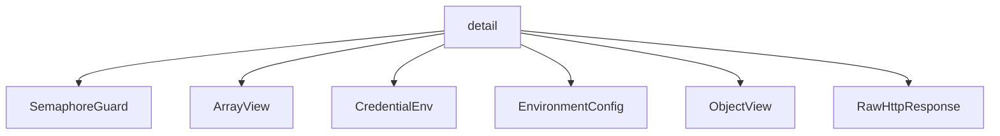

# Namespace `clore::net::detail`

## Summary

`clore::net::detail` 是 `clore::net` 模块的内部实现命名空间，封装了与 LLM API 交互所需的核心基础设施。其职责包括：管理异步 HTTP 请求的发起与同步执行（如 `perform_http_request`、`perform_http_request_async`），处理 JSON 值的类型断言、克隆与序列化（如 `expect_array`、`clone_value`、`serialize_value_to_string`），从环境变量中读取配置与凭据（如 `read_environment`、`read_required_env`），以及通过信号量和原子计数器（`g_llm_semaphore`、`g_llm_request_counter`）控制并发请求的速率。此外，还定义了一系列网络超时常量（如 `kHttpRequestTimeout`、`kTcpKeepIntvlSec`）和内部辅助类型（如 `ArrayView`、`ObjectView`、`RawHttpResponse`、`CredentialEnv`），为上层模块提供统一的底层操作原语。这些细节不对外公开，旨在支持 `clore::net` 命名空间中的高阶接口。

## Diagram



## Types

### `clore::net::detail::ArrayView`

Declaration: `network/protocol.cppm:178`

Definition: `network/protocol.cppm:178`

Implementation: [`Module protocol`](../../../../modules/protocol/index.md)

Insufficient evidence to summarize; provide more EVIDENCE.

#### Invariants

- The `value` pointer is expected to point to a valid `kota::codec::json::Array` instance before any member function is called.
- `ArrayView` does not own the pointed-to array; it is the caller's responsibility to ensure the array outlives the view.

#### Key Members

- `value` field: the underlying pointer to `kota::codec::json::Array`
- `operator[]`: element access by index
- `operator*` and `operator->`: dereference to underlying array
- `begin`/`end`: iterator access
- `size`/`empty`: query container size

#### Usage Patterns

- Used as an internal helper in `clore::net` namespace to provide a familiar array interface over a `kota::codec::json::Array`.
- Typically constructed by initializing the `value` pointer with the address of an existing array, then calling its member functions to inspect elements.

#### Member Functions

##### `clore::net::detail::ArrayView::begin`

Declaration: `network/protocol.cppm:189`

Definition: `network/protocol.cppm:189`

Implementation: [`Module protocol`](../../../../modules/protocol/index.md)

###### Declaration

```cpp
const_iterator () const noexcept;
```

##### `clore::net::detail::ArrayView::empty`

Declaration: `network/protocol.cppm:181`

Definition: `network/protocol.cppm:181`

Implementation: [`Module protocol`](../../../../modules/protocol/index.md)

###### Declaration

```cpp
auto () const noexcept -> bool;
```

##### `clore::net::detail::ArrayView::end`

Declaration: `network/protocol.cppm:193`

Definition: `network/protocol.cppm:193`

Implementation: [`Module protocol`](../../../../modules/protocol/index.md)

###### Declaration

```cpp
const_iterator () const noexcept;
```

##### `clore::net::detail::ArrayView::operator*`

Declaration: `network/protocol.cppm:205`

Definition: `network/protocol.cppm:205`

Implementation: [`Module protocol`](../../../../modules/protocol/index.md)

###### Declaration

```cpp
auto () const noexcept -> const kota::codec::json::Array &;
```

##### `clore::net::detail::ArrayView::operator->`

Declaration: `network/protocol.cppm:201`

Definition: `network/protocol.cppm:201`

Implementation: [`Module protocol`](../../../../modules/protocol/index.md)

###### Declaration

```cpp
auto () const noexcept -> const kota::codec::json::Array *;
```

##### `clore::net::detail::ArrayView::operator[]`

Declaration: `network/protocol.cppm:197`

Definition: `network/protocol.cppm:197`

Implementation: [`Module protocol`](../../../../modules/protocol/index.md)

###### Declaration

```cpp
auto (std::size_t) const -> const kota::codec::json::Value &;
```

##### `clore::net::detail::ArrayView::size`

Declaration: `network/protocol.cppm:185`

Definition: `network/protocol.cppm:185`

Implementation: [`Module protocol`](../../../../modules/protocol/index.md)

###### Declaration

```cpp
auto () const noexcept -> std::size_t;
```

### `clore::net::detail::CredentialEnv`

Declaration: `network/provider.cppm:14`

Definition: `network/provider.cppm:14`

Implementation: [`Module provider`](../../../../modules/provider/index.md)

Insufficient evidence to summarize; provide more EVIDENCE.

#### Invariants

- Fields are `std::string_view` values naming environment variable identifiers.
- No explicit constraints on the content or validity of the environment variable names are enforced.

#### Key Members

- `base_url_env`
- `api_key_env`

#### Usage Patterns

- Instances are typically initialized with string literals (e.g., `{"MY_BASE_URL", "MY_API_KEY"}`) and passed to credential resolution logic.
- The struct is used within `clore::net::detail` to decouple environment variable name configuration from the rest of the credential lookup implementation.

### `clore::net::detail::EnvironmentConfig`

Declaration: `network/http.cppm:37`

Definition: `network/http.cppm:37`

Implementation: [`Module http`](../../../../modules/http/index.md)

Insufficient evidence to summarize; provide more EVIDENCE.

### `clore::net::detail::ObjectView`

Declaration: `network/protocol.cppm:156`

Definition: `network/protocol.cppm:156`

Implementation: [`Module protocol`](../../../../modules/protocol/index.md)

Insufficient evidence to summarize; provide more EVIDENCE.

#### Invariants

- `value` 指向的 `Object` 必须在 `ObjectView` 使用期间保持有效
- `value` 可以为 `nullptr`，此时调用 `begin`/`end`/`operator->`/`operator*` 是未定义行为
- `get` 返回的 `optional` 在键不存在时为空

#### Key Members

- `value` 指针成员
- `get` 键查找方法
- `begin` / `end` 迭代器方法
- `operator->` / `operator*` 解引用运算符

#### Usage Patterns

- 作为函数参数或返回值以非拥有方式传递 JSON 对象视图
- 代替 `const kota::codec::json::Object&` 以支持可空性
- 与 `std::optional<kota::codec::json::Cursor>` 结合使用以安全访问嵌套字段
- 在协议解析代码中用作临时对象以避免不必要的拷贝

#### Member Functions

##### `clore::net::detail::ObjectView::begin`

Declaration: `network/protocol.cppm:161`

Definition: `network/protocol.cppm:161`

Implementation: [`Module protocol`](../../../../modules/protocol/index.md)

###### Declaration

```cpp
const_iterator () const noexcept;
```

##### `clore::net::detail::ObjectView::end`

Declaration: `network/protocol.cppm:165`

Definition: `network/protocol.cppm:165`

Implementation: [`Module protocol`](../../../../modules/protocol/index.md)

###### Declaration

```cpp
const_iterator () const noexcept;
```

##### `clore::net::detail::ObjectView::get`

Declaration: `network/protocol.cppm:159`

Definition: `network/protocol.cppm:280`

Implementation: [`Module protocol`](../../../../modules/protocol/index.md)

###### Declaration

```cpp
auto (std::string_view) const -> std::optional<json::Cursor>;
```

##### `clore::net::detail::ObjectView::operator*`

Declaration: `network/protocol.cppm:173`

Definition: `network/protocol.cppm:173`

Implementation: [`Module protocol`](../../../../modules/protocol/index.md)

###### Declaration

```cpp
auto () const noexcept -> const kota::codec::json::Object &;
```

##### `clore::net::detail::ObjectView::operator->`

Declaration: `network/protocol.cppm:169`

Definition: `network/protocol.cppm:169`

Implementation: [`Module protocol`](../../../../modules/protocol/index.md)

###### Declaration

```cpp
auto () const noexcept -> const kota::codec::json::Object *;
```

### `clore::net::detail::RawHttpResponse`

Declaration: `network/http.cppm:42`

Definition: `network/http.cppm:42`

Implementation: [`Module http`](../../../../modules/http/index.md)

Insufficient evidence to summarize; provide more EVIDENCE.

#### Invariants

- `http_status` is an arbitrary `long` value; no validation that it corresponds to a valid HTTP status code
- `body` is an arbitrary `std::string`; no encoding or length constraints

#### Key Members

- `http_status`
- `body`

#### Usage Patterns

- Serves as a straightforward container for a parsed HTTP response before further processing
- Likely populated by lower‑level network code and consumed by higher‑level request/response abstractions

## Variables

### `clore::net::detail::g_llm_request_counter`

Declaration: `network/http.cppm:97`

Implementation: [`Module http`](../../../../modules/http/index.md)

An atomic counter of type `std::atomic<std::uint64_t>`, initialized to `0`, declared in the `clore::net::detail` namespace. It provides a globally unique, monotonically increasing identifier for each LLM HTTP request.

#### Usage Patterns

- read to obtain a unique request number
- assigned to the local variable `request_number`

### `clore::net::detail::g_llm_semaphore`

Declaration: `network/http.cppm:48`

Implementation: [`Module http`](../../../../modules/http/index.md)

`clore::net::detail::g_llm_semaphore` is a global `std::shared_ptr<kota::semaphore>` declared in `network/http.cppm:48`. It is used to enforce a rate limit on concurrent LLM API requests across the networking layer.

#### Usage Patterns

- acquired before LLM request to enforce concurrency limit
- released after LLM request completes

### `clore::net::detail::g_llm_semaphore_mutex`

Declaration: `network/http.cppm:47`

Implementation: [`Module http`](../../../../modules/http/index.md)

The variable `clore::net::detail::g_llm_semaphore_mutex` is declared as `extern std::mutex` in the `clore::net::detail` namespace at `network/http.cppm:47`. It is an external global mutex intended to synchronize access to shared resources in the LLM rate-limiting subsystem.

#### Usage Patterns

- locked in `initialize_llm_rate_limit` to set up the semaphore
- locked in `current_llm_semaphore` to safely retrieve the shared semaphore pointer
- locked in `shutdown_llm_rate_limit` to destroy the semaphore

### `clore::net::detail::kConnMaxAgeSec`

Declaration: `network/http.cppm:102`

Implementation: [`Module http`](../../../../modules/http/index.md)

The variable `clore::net::detail::kConnMaxAgeSec` is a `constexpr long` constant declared with value 300.

#### Usage Patterns

- Read in `clore::net::detail::configure_request`

### `clore::net::detail::kDnsCacheTimeoutSec`

Declaration: `network/http.cppm:101`

Implementation: [`Module http`](../../../../modules/http/index.md)

The variable `clore::net::detail::kDnsCacheTimeoutSec` is a `constexpr long` constant with value `300`, declared in `network/http.cppm:101`. It resides in the `clore::net::detail` namespace and serves as a configuration parameter for DNS cache timeout duration.

#### Usage Patterns

- Read by `clore::net::detail::configure_request` to configure DNS cache timeout on HTTP requests

### `clore::net::detail::kHttpConnectTimeoutMs`

Declaration: `network/http.cppm:99`

Implementation: [`Module http`](../../../../modules/http/index.md)

`clore::net::detail::kHttpConnectTimeoutMs` is a compile-time constant of type `long` that defines the default timeout, in milliseconds, for establishing an HTTP connection.

#### Usage Patterns

- used in `configure_request`

### `clore::net::detail::kHttpRequestTimeout`

Declaration: `network/http.cppm:100`

Implementation: [`Module http`](../../../../modules/http/index.md)

`clore::net::detail::kHttpRequestTimeout` is a `constexpr` variable of type `std::chrono::milliseconds` initialized to 120'000 milliseconds (120 seconds). It defines the maximum duration allowed for an HTTP request to complete before timing out.

#### Usage Patterns

- used as a timeout value for HTTP request operations
- read in request processing logic to enforce a deadline

### `clore::net::detail::kTcpKeepIdleSec`

Declaration: `network/http.cppm:103`

Implementation: [`Module http`](../../../../modules/http/index.md)

Constant defining the TCP keep-alive idle timeout in seconds, set to 60.

#### Usage Patterns

- Referenced in `configure_request` for socket option configuration

### `clore::net::detail::kTcpKeepIntvlSec`

Declaration: `network/http.cppm:104`

Implementation: [`Module http`](../../../../modules/http/index.md)

`clore::net::detail::kTcpKeepIntvlSec` is a `constexpr long` constant defined at `network/http.cppm:104` with the value `10`, representing the TCP keepalive interval in seconds.

#### Usage Patterns

- used in `clore::net::detail::configure_request` to configure TCP keepalive

## Functions

### `clore::net::detail::append_url_path`

Declaration: `network/provider.cppm:21`

Definition: `network/provider.cppm:43`

Implementation: [`Module provider`](../../../../modules/provider/index.md)

函数 `clore::net::detail::append_url_path` 接受两个 `std::string_view` 参数，返回一个 `std::string`。它将第二个参数表示的路径段追加到第一个参数表示的基础 URL 路径末尾，处理必要的斜杠分隔并返回拼接后的完整路径。调用者应确保第一个参数是一个有效的 URL 路径前缀（不含查询或片段），第二个参数是合法的路径段；函数不验证输入的整体 URL 合法性。

#### Usage Patterns

- Used to construct a valid HTTP request URL by normalizing the base and path components.

### `clore::net::detail::clone_array`

Declaration: `network/protocol.cppm:268`

Definition: `network/protocol.cppm:442`

Implementation: [`Module protocol`](../../../../modules/protocol/index.md)

函数 `clore::net::detail::clone_array` 接受一个 `ArrayView` 和一个 `std::string_view`，返回 `int`。调用者需提供一个有效的 `ArrayView`（例如指向 JSON 数组的视图）以及一个描述性上下文字符串，通常用于在出错时标识操作来源。函数负责创建该数组的一个副本（深层克隆），并通过返回整数指示操作结果：零表示成功，非零表示发生错误。契约要求调用者传入的 `ArrayView` 必须指向一个有效的非空数组，且上下文字符串不应为空或混淆，以确保错误信息有意义。该函数不修改传入的视图本身。

#### Usage Patterns

- 为后续独立操作克隆一个 JSON 数组
- 在序列化或验证流程中创建数组的独立副本

### `clore::net::detail::clone_object`

Declaration: `network/protocol.cppm:265`

Definition: `network/protocol.cppm:451`

Implementation: [`Module protocol`](../../../../modules/protocol/index.md)

`clore::net::detail::clone_object` 创建给定 JSON 对象的深层副本。它接受一个待复制的对象（可以是 `ObjectView` 或 `const json::Object &`）以及一个用于错误报告和日志的上下文字符串。返回一个整数结果码：成功时返回 `0`，失败时返回非零错误码。调用者必须确保提供的对象引用有效，上下文字符串应清晰标识调用位置，以便在出现错误时定位问题。

#### Usage Patterns

- Cloning a JSON object to obtain an independent mutable copy
- Creating a deep copy of an `ObjectView`'s content for storage or modification

### `clore::net::detail::clone_object`

Declaration: `network/protocol.cppm:262`

Definition: `network/protocol.cppm:446`

Implementation: [`Module protocol`](../../../../modules/protocol/index.md)

`clore::net::detail::clone_object` 接受一个 `ObjectView` 和一个用作错误上下文的 `std::string_view`，对该 JSON 对象执行深度克隆，并返回一个 `int` 指示操作结果。调用者应保证提供的 `ObjectView` 有效；返回值为零表示成功，非零值表示失败，对应的上下文字符串用于诊断错误原因。该函数是 JSON 值系列克隆函数（如 `clone_value`、`clone_array`）的一部分。

#### Usage Patterns

- deep copy a JSON object
- prepare object for serialization or manipulation

### `clore::net::detail::clone_value`

Declaration: `network/protocol.cppm:271`

Definition: `network/protocol.cppm:455`

Implementation: [`Module protocol`](../../../../modules/protocol/index.md)

`clore::net::detail::clone_value` 创建一个给定 JSON 值的独立副本。它接受一个输入值及一个用于错误报告的上下文字符串，并返回一个整型指示操作成功（零）或失败（非零错误码）。调用者应确保传入的 `json::Value` 处于有效状态；若克隆成功，调用方可依赖返回的副本而无需关心原值的生命周期。这是底层序列化基础设施中的稳定组件。

#### Usage Patterns

- Used when a caller needs an independent copy of a JSON value, for example before modification or to avoid aliasing.

### `clore::net::detail::configure_request`

Declaration: `network/http.cppm:150`

Definition: `network/http.cppm:150`

Implementation: [`Module http`](../../../../modules/http/index.md)

将给定的 `kota::http::request` 原地配置为后续网络请求使用。`int` 参数指定连接或响应的超时（单位由实现定义），`std::string` 参数提供要追加的请求路径或资源标识符。函数不返回值，所有副作用直接应用于传入的 `request` 对象。

调用者必须确保 `request` 对象处于有效且可修改的状态。传递的字符串应包含合法的路径成分，整数值应为非负整数。此函数不进行输入校验；非法或越界的参数可能导致未定义行为。该函数是 `clore::net::detail` 命名空间的内部实现，不建议外部代码直接调用。

#### Usage Patterns

- Called in HTTP request construction pipelines before dispatching the request
- Used internally by `clore::net::detail::perform_http_request` or related async variants

### `clore::net::detail::excerpt_for_error`

Declaration: `network/protocol.cppm:223`

Definition: `network/protocol.cppm:316`

Implementation: [`Module protocol`](../../../../modules/protocol/index.md)

`clore::net::detail::excerpt_for_error` 接受一个 `std::string_view`，它通常是原始的错误消息或上下文文本，并返回一个 `std::string`，即该文本的一个简短、适合错误报告的摘录片段。调用者负责提供内容有意义且长度适当的字符串视图，摘录的长度和边界由内部算法决定，不保证保留原文本的完整语义。该函数专为错误处理使用而设计，应仅由同一命名空间内的其他错误处理函数调用。

#### Usage Patterns

- used to create a safe excerpt of a server response for inclusion in error diagnostics
- called when constructing error messages that need a portion of the body

### `clore::net::detail::expect_array`

Declaration: `network/protocol.cppm:250`

Definition: `network/protocol.cppm:406`

Implementation: [`Module protocol`](../../../../modules/protocol/index.md)

函数 `clore::net::detail::expect_array` 验证给定的 `json::Value` 是否表示一个 JSON 数组。调用方提供一个值和一个用于错误诊断的上下文字符串（`std::string_view`）；若该值符合预期类型，函数返回一个成功指示符，否则生成一个适当的错误返回。此函数是 `clore::net` 内部的 JSON 类型检查工具，常用于在解析或处理过程中断言某个 JSON 节点的结构，并在不匹配时向调用方报告错误上下文。

#### Usage Patterns

- extracting a JSON array with error handling
- validating JSON structure in networking code
- wrapping an array pointer into an `ArrayView`

### `clore::net::detail::expect_array`

Declaration: `network/protocol.cppm:253`

Definition: `network/protocol.cppm:415`

Implementation: [`Module protocol`](../../../../modules/protocol/index.md)

`clore::net::detail::expect_array` 断言给定的 JSON 节点必须是一个数组。该函数提供两个重载，分别接受 `json::Cursor` 和 `const json::Value &`，以及一个 `std::string_view` 作为错误描述的上下文。返回值 `int` 在成功时表示可用的数组标识（可用于后续操作），若节点类型不匹配则表示错误。调用者应确保在此之前已确定节点预期为数组，本函数作为运行时契约验证使用。

#### Usage Patterns

- Used to validate JSON arrays during parsing or deserialization
- Provides an `ArrayView` for indexed or range access
- Often called with a meaningful context string to aid error reporting

### `clore::net::detail::expect_object`

Declaration: `network/protocol.cppm:244`

Definition: `network/protocol.cppm:388`

Implementation: [`Module protocol`](../../../../modules/protocol/index.md)

`clore::net::detail::expect_object` 验证给定的 JSON 值是否为一个对象。调用者必须提供一个 JSON 值（无论是通过 `const json::Value &` 还是通过 `json::Cursor`）以及一个描述上下文的字符串。如果该值是一个 JSON 对象，函数返回一个表示成功的整数；否则，返回一个错误指示，通常基于提供的上下文字符串构造错误信息。

函数的两个重载允许调用者通过直接引用 JSON 值或通过一个 `json::Cursor`（可能来自对 `ObjectView::get` 的调用）来传递要检验的值。调用者应根据需要选择最合适的重载，并确保提供的上下文字符串对诊断问题有意义。

#### Usage Patterns

- used to validate that a JSON value is an object before further processing
- works alongside `expect_string`, `expect_array` for type-safe JSON extraction

### `clore::net::detail::expect_object`

Declaration: `network/protocol.cppm:247`

Definition: `network/protocol.cppm:397`

Implementation: [`Module protocol`](../../../../modules/protocol/index.md)

`clore::net::detail::expect_object` 要求调用者提供一个有效的 `json::Cursor` 或 `const json::Value &`，以及一个描述性的 `std::string_view`（通常用于错误消息中的上下文标识）。该函数会检查当前游标所指向的 JSON 值是否为一个对象；若不是，则返回一个非零整数以指示失败，并可能通过异常或日志报告错误。调用者应确保传入的游标合法且在有效范围内，函数本身不消耗游标。成功时返回零，表示当前值符合对象格式。该函数不执行深层验证，仅检查 JSON 值的类型是否为对象。

#### Usage Patterns

- Used to extract an `ObjectView` from a `json::Cursor` while validating that the cursor holds an object
- Called when parsing JSON responses that must contain a top-level object

### `clore::net::detail::expect_string`

Declaration: `network/protocol.cppm:259`

Definition: `network/protocol.cppm:433`

Implementation: [`Module protocol`](../../../../modules/protocol/index.md)

`clore::net::detail::expect_string` 验证给定的 `json::Value` 是否为一个 JSON 字符串。若值为字符串，则返回表示成功的整数；否则返回表示错误码的整数。第二个 `std::string_view` 参数用于提供上下文标识（例如字段名或键名），便于在验证失败时生成诊断信息。

调用者应检查返回值以确定操作是否成功。该函数仅执行类型断言，不提取或修改字符串值。

#### Usage Patterns

- extracting a string from a JSON cursor
- validating JSON string values
- error propagation for non-string JSON values

### `clore::net::detail::expect_string`

Declaration: `network/protocol.cppm:256`

Definition: `network/protocol.cppm:424`

Implementation: [`Module protocol`](../../../../modules/protocol/index.md)

函数 `clore::net::detail::expect_string` 断言给定的 JSON 值必须是一个字符串。它接受一个 `const json::Value &`（或 `json::Cursor`）以及一个 `std::string_view`（通常用于描述调用上下文，如字段名或操作位置）。如果值不是字符串类型，函数会返回一个非零的错误码；成功时返回零。调用者应确保传入的 JSON 值有效，并提供有意义的上下文描述以辅助错误诊断。

#### Usage Patterns

- Validating that a JSON value is a string
- Extracting string content from JSON during parsing
- Used in conjunction with other `expect_*` functions like `expect_array` and `expect_object`

### `clore::net::detail::infer_output_contract`

Declaration: `network/protocol.cppm:631`

Definition: `network/protocol.cppm:648`

Implementation: [`Module protocol`](../../../../modules/protocol/index.md)

函数 `clore::net::detail::infer_output_contract` 从给定的 `PromptRequest` 中推断并返回一个整数形式的输出合约标识。调用者可以利用该结果决定如何验证或处理模型输出，例如指定输出是纯文本、结构化数据或特定格式。返回值约定为调用者所依赖的合约类型，具体含义由库内其他组件解释。

#### Usage Patterns

- Called to infer or validate the output contract before constructing or processing a completion request.
- Used to ensure that `response_format` and `output_contract` are consistent.

### `clore::net::detail::insert_string_field`

Declaration: `network/protocol.cppm:215`

Definition: `network/protocol.cppm:303`

Implementation: [`Module protocol`](../../../../modules/protocol/index.md)

将字符串字段插入到指定的 `json::Object` 中。第一个参数为目标 JSON 对象，第二个参数为字段名，第三个参数为字段值，第四个参数用作错误报告时的上下文标识（通常为调用位置或操作名称）。

调用者须确保传入的对象是可变的且未处于只读状态，字段名与值均非空。函数返回一个 `int` 状态码，成功时指示正常完成，失败时返回错误码；调用者应检查返回值以判断操作是否成功。

#### Usage Patterns

- Used to add a string field to a JSON object when constructing request payloads.

### `clore::net::detail::make_empty_array`

Declaration: `network/protocol.cppm:231`

Definition: `network/protocol.cppm:348`

Implementation: [`Module protocol`](../../../../modules/protocol/index.md)

`clore::net::detail::make_empty_array` 创建一个空的 JSON 数组值，并告知调用者操作是否成功。调用者必须传入一个 `std::string_view` 作为错误报告的上下文标识（通常为调用点的文件名或位置），并检查返回的 `int`：成功时返回 `0`，非零值表示失败。该函数是 `detail` 命名空间中用于底层 JSON 构造的辅助接口，调用者在需要生成空数组值时应使用它，并正确处理返回值以传播错误。

#### Usage Patterns

- creating an empty JSON array as a default or placeholder
- initializing arrays in JSON construction routines

### `clore::net::detail::make_empty_object`

Declaration: `network/protocol.cppm:228`

Definition: `network/protocol.cppm:340`

Implementation: [`Module protocol`](../../../../modules/protocol/index.md)

`clore::net::detail::make_empty_object` 创建一个空的 JSON 对象，并返回一个 `int` 状态码，用于指示成功或失败。调用者必须提供一个 `std::string_view` 作为上下文标签，该标签在出现错误时用于生成描述性的诊断消息。返回零表示成功；非零值表示发生了错误，调用者应停止后续对该空对象的使用。

#### Usage Patterns

- used to obtain a guaranteed-valid empty JSON object
- likely called when a default object is needed
- serves as a helper for initializing empty containers

### `clore::net::detail::normalize_utf8`

Declaration: `network/protocol.cppm:213`

Definition: `network/protocol.cppm:293`

Implementation: [`Module protocol`](../../../../modules/protocol/index.md)

`clore::net::detail::normalize_utf8` 执行两个 UTF-8 字符串视图的规范化处理，并返回一个 `std::string`。调用者应提供有效的 UTF-8 编码输入，并理解此函数仅用于内部实现的一致性要求。第一个参数通常为待规范化的原始数据，第二个参数可能携带附加上下文（如错误诊断标签或来源标识），具体约定由实现定义。本函数不修改输入，返回新创建的规范化字符串。

#### Usage Patterns

- Sanitize UTF-8 input before JSON serialization
- Log warnings for invalid UTF-8 sequences with a descriptive field name

### `clore::net::detail::parse_json_object`

Declaration: `network/provider.cppm:27`

Definition: `network/provider.cppm:148`

Implementation: [`Module provider`](../../../../modules/provider/index.md)

函数 `clore::net::detail::parse_json_object` 负责解析第一个参数所指定的 JSON 对象字符串，并将解析结果（或其副作用，如错误报告）返回给调用者。第二个参数是一个用于标识调用上下文的字符串，当解析失败时，该上下文会被用于生成有意义的错误消息。返回值为 `int` 类型，成功时为零，失败时为一个非零的错误代码。调用者需确保提供的字符串是合法的 JSON 对象格式，否则函数将返回相应的错误指示。

#### Usage Patterns

- 解析网络响应中的 JSON 对象
- 在解析失败时提供上下文描述以辅助调试

### `clore::net::detail::parse_json_value`

Declaration: `network/protocol.cppm:238`

Definition: `network/protocol.cppm:368`

Implementation: [`Module protocol`](../../../../modules/protocol/index.md)

模板函数 `clore::net::detail::parse_json_value` 尝试将给定的 `json::Value` 解析为类型 `T`，返回一个 `int` 表示操作结果。该函数用于从已解析的 JSON 节点中提取特定类型的数据，并在失败时返回非零错误码。第二个参数 `std::string_view` 通常用作上下文标签（如字段名或路径），用于在错误消息中标识被解析的 JSON 位置，方便调试。

调用者负责确保 `T` 与 JSON 值的实际类型兼容，并提供一个有意义的名称作为上下文。成功时返回 `0`，失败时返回负值或特定错误码，具体错误细节可通过关联的错误处理设施（如 `clore::net::detail::unexpected_json_error`）获得。

#### Usage Patterns

- 从已解析的 JSON 对象中提取字段并直接解析为类型 T
- 将 JSON 值序列化为字符串以进行后续语法解析
- 在需要同时处理 JSON 值与上下文错误的场景中简化调用

### `clore::net::detail::parse_json_value`

Declaration: `network/protocol.cppm:235`

Definition: `network/protocol.cppm:357`

Implementation: [`Module protocol`](../../../../modules/protocol/index.md)

尝试将给定的 JSON 字符串解析为内部 JSON 值，并将结果存储在可供后续操作（如 `clore::net::detail::expect_object` 或 `clore::net::detail::expect_array`）使用的隐式上下文中。第一个参数是要解析的原始 JSON 文本，第二个参数是用于错误诊断的描述性标签（通常为来源文件名或调用位置）。返回一个整数状态码：零表示成功，非零表示解析失败或输入的 JSON 格式无效。调用者负责提供合法的 UTF-8 编码且格式完整的 JSON 输入，并在返回值指示错误时根据标签记录或报告上下文。

#### Usage Patterns

- Used to parse JSON strings into type `T` with a context string for error reporting

### `clore::net::detail::perform_http_request`

Declaration: `network/http.cppm:53`

Definition: `network/http.cppm:167`

Implementation: [`Module http`](../../../../modules/http/index.md)

`clore::net::detail::perform_http_request` 是一个同步 HTTP 请求函数。调用者需提供请求的目标 `std::string`、一个整型配置（通常代表端口或超时等参数）以及请求体 `std::string_view`。该函数负责发送 HTTP 请求并等待响应。

返回值是一个 `std::expected<RawHttpResponse, LLMError>`。调用者必须处理两者的可能性：如果请求成功，则包含完整的 `RawHttpResponse` 对象；如果失败，则包含一个 `LLMError` 实例，描述错误原因。函数不抛出异常，所有错误均通过返回值表达。

#### Usage Patterns

- Used as a synchronous wrapper around the async HTTP request machinery
- Called when a blocking HTTP request is needed in synchronous code paths

### `clore::net::detail::perform_http_request_async`

Declaration: `network/http.cppm:58`

Definition: `network/http.cppm:195`

Implementation: [`Module http`](../../../../modules/http/index.md)

`clore::net::detail::perform_http_request_async` 发起一个异步 HTTP 请求。调用者需要提供一个目标标识（`std::string`）、一个整数参数、一个请求体（`std::string`）以及一个 `async::event_loop` 引用。函数立即返回一个整数，指示请求是否成功调度（0 表示成功，非零表示错误）。调用者必须确保事件循环在请求完成前保持活跃，并保证提供的参数有效。

#### Usage Patterns

- 以异步方式发起受信号量限制的 HTTP POST 请求
- 用于 LLM API 调用（日志中包含 'LLM' 标记）
- 在事件循环上下文中通过 `co_await` 等待完成
- 与 `SemaphoreGuard` 配合确保信号量释放

### `clore::net::detail::read_credentials`

Declaration: `network/provider.cppm:19`

Definition: `network/provider.cppm:39`

Implementation: [`Module provider`](../../../../modules/provider/index.md)

函数 `clore::net::detail::read_credentials` 根据传入的 `CredentialEnv` 对象读取凭据信息。调用者需提供一个有效的 `CredentialEnv` 实例，该实例应包含读取凭据所需的环境配置。函数返回一个 `int` 值，表示操作的状态：成功时返回零，失败时返回非零错误码。调用者应检查返回值以确定凭据是否成功读取。

#### Usage Patterns

- used to retrieve credentials from environment variables for network configuration
- called when initializing network provider with credential environment settings

### `clore::net::detail::read_environment`

Declaration: `network/http.cppm:50`

Definition: `network/http.cppm:132`

Implementation: [`Module http`](../../../../modules/http/index.md)

函数 `clore::net::detail::read_environment` 根据调用者提供的环境变量标识符从进程环境中读取并解析配置。它接受两个 `std::string_view` 参数，并返回一个 `std::expected<EnvironmentConfig, LLMError>` 对象：成功时包含一个 `EnvironmentConfig`，失败时包含一个 `LLMError`，描述读取或解析错误的原因。调用方应通过检查 `std::expected` 的状态来处理结果，并在出现错误时采取相应的恢复或报告措施。

#### Usage Patterns

- Used to fetch environment variables for API base URL and API key configuration

### `clore::net::detail::read_required_env`

Declaration: `network/http.cppm:123`

Definition: `network/http.cppm:123`

Implementation: [`Module http`](../../../../modules/http/index.md)

`clore::net::detail::read_required_env` 接受一个代表环境变量名称的 `std::string_view`，并返回 `std::expected<std::string, LLMError>`。该函数尝试读取指定的环境变量；如果该变量存在且可读取，则成功返回其字符串值；如果该变量未设置或读取过程中发生错误，则返回一个 `LLMError` 表示失败。调用者应假定该环境变量是必需的——函数不会对缺失变量提供默认值，而是直接报告错误。此函数通常用于在配置过程的早期获取关键配置值，以便调用者能够决定是否继续执行。

#### Usage Patterns

- retrieving mandatory configuration values like API keys or endpoints
- fallible environment variable lookup with error handling
- ensuring required environment is present before proceeding

### `clore::net::detail::request_text_once_async`

Declaration: `network/protocol.cppm:638`

Definition: `network/protocol.cppm:680`

Implementation: [`Module protocol`](../../../../modules/protocol/index.md)

`clore::net::detail::request_text_once_async` 是一个异步函数，用于发起一次文本请求（通常是面向 LLM 的完成请求）。调用者必须提供一个 `CompletionRequester` 类型，该类型通常定义如何处理请求的最终结果（成功或失败）。函数接受两个 `std::string_view` 参数（分别表示目标 URL 和凭据，如 API 密钥），一个 `PromptRequest` 结构体（描述请求的提示和参数），以及一个引用传递的 `kota::event_loop`。返回一个 `int` 标识该请求的句柄或状态码。

该函数假定调用者已正确初始化事件循环，并确保其在异步操作期间保持活跃。它封装了 HTTP 请求的发送、响应验证和 JSON 解析，但调用者不直接接触这些中间步骤。返回的整数值可用于跟踪或取消请求（如果底层机制支持）。

#### Usage Patterns

- Used to send a single prompt to a language model and obtain its text response asynchronously
- Often called with a lambda or function object that performs the actual HTTP request
- Used in contexts where only the first completion text is needed (no streaming)

### `clore::net::detail::run_task_sync`

Declaration: `network/protocol.cppm:226`

Definition: `network/protocol.cppm:322`

Implementation: [`Module protocol`](../../../../modules/protocol/index.md)

`clore::net::detail::run_task_sync` 是一个模板函数，用于在当前线程中同步执行由调用方提供的任务。它接受一个以转发引用形式传入的参数（类型由 `T` 推导），以及一个任务工厂 `make_task`，并返回一个整数。调用方应确保传入的 `make_task` 可调用且能够生成符合预期的任务对象；返回值通常表示操作成功或失败的状态码。该函数位于 `detail` 命名空间中，是内部实现助手，调用方应遵循其所在模块的特定契约。

#### Usage Patterns

- Used to wrap asynchronous tasks in a synchronous blocking call
- Common when integrating with synchronous code paths

### `clore::net::detail::select_event_loop`

Declaration: `network/client.cppm:45`

Definition: `network/client.cppm:45`

Implementation: [`Module client`](../../../../modules/client/index.md)

Declaration: [Declaration](functions/select-event-loop.md)

函数 `clore::net::detail::select_event_loop` 接受一个可选的 `kota::event_loop *` 指针，并返回一个 `kota::event_loop &` 引用。如果传入的指针非空，则返回该指针所指向的事件循环；若指针为空，函数会选择一个默认的事件循环并返回其引用。调用者无需关心默认事件循环的具体选择策略，只需保证在需要自定义事件循环时传入有效指针，否则可传入 `nullptr` 以使用默认实例。该函数主要用于内部异步操作的调度环境决策，确保调用方总能获得一个有效的事件循环引用来注册回调或等待完成。

#### Usage Patterns

- 用于将可选的 `event_loop*` 解析为确定的引用
- 被 `call_completion_async`、`call_llm_async` 等高层函数调用以获取事件循环

### `clore::net::detail::serialize_tool_arguments`

Declaration: `network/provider.cppm:30`

Definition: `network/provider.cppm:158`

Implementation: [`Module provider`](../../../../modules/provider/index.md)

函数 `clore::net::detail::serialize_tool_arguments` 接受一个表示工具参数的 `json::Value` 以及一个用于错误诊断的 `std::string_view` 上下文。它负责将这些参数从 JSON 表示序列化为下游可用的字符串形式，同时隐式验证其结构是否与预期模式匹配。返回值 0 表示成功，非零值表示序列化或验证失败，调用者应据此处理错误。

#### Usage Patterns

- round-trip JSON normalization
- validating tool arguments are serializable

### `clore::net::detail::serialize_value_to_string`

Declaration: `network/protocol.cppm:241`

Definition: `network/protocol.cppm:378`

Implementation: [`Module protocol`](../../../../modules/protocol/index.md)

`clore::net::detail::serialize_value_to_string` 是一个内部函数，用于将 `json::Value` 序列化为字符串表示。它接受一个需要处理的 JSON 值和一个 `std::string_view` 作为上下文标识（常用于错误报告或诊断），并返回一个 `int` 状态码。调用方应检查该返回值：通常 `0` 表示成功，非零值指示序列化失败。失败可能源于无效的 JSON 结构、内存分配错误或其他内部问题。注意，该函数不直接返回序列化后的字符串；其结果仅通过状态码传达，而实际字符串可能写入内部缓冲区或用于进一步处理。

#### Usage Patterns

- 用于将 JSON 值序列化为字符串
- 在错误处理中提供上下文信息

### `clore::net::detail::to_llm_unexpected`

Declaration: `network/protocol.cppm:221`

Definition: `network/protocol.cppm:312`

Implementation: [`Module protocol`](../../../../modules/protocol/index.md)

该函数 `clore::net::detail::to_llm_unexpected` 将给定类型的 `Status` 值和一个描述性字符串视图转换为一个整数，用于表示 LLM（Large Language Model）交互中发生的意外结果或状态。调用者负责提供泛型 `Status` 实例以及说明意外情况的文本；返回值应被解释为与该意外情况对应的整数编码，通常用于跨调用者的错误处理或日志记录。

#### Usage Patterns

- Converting error statuses into `std::unexpected` for expected-based error handling
- Used as a utility in functions returning `std::expected` to propagate formatted errors

### `clore::net::detail::unexpected_json_error`

Declaration: `network/protocol.cppm:210`

Definition: `network/protocol.cppm:288`

Implementation: [`Module protocol`](../../../../modules/protocol/index.md)

函数 `clore::net::detail::unexpected_json_error` 由调用者在解析 JSON 内容时，当遇到与预期结构不匹配的意外错误时使用。第一个参数 `std::string_view` 表示当前正在处理的上下文或字段名称，用于错误定位；第二个参数 `const json::error &` 携带底层 JSON 解析器报告的具体错误信息。函数返回一个 `int`，其值指示调用者应如何继续（例如，是否终止当前操作或忽略错误）。调用者必须确保传入的上下文描述具有足够的区分度，以便在错误报告中唯一标识出错的点。

#### Usage Patterns

- Convert JSON error into `LLMError` for error propagation
- Used in functions that parse JSON and need to return a standardized error type

### `clore::net::detail::unwrap_caught_result`

Declaration: `network/http.cppm:64`

Definition: `network/http.cppm:64`

Implementation: [`Module http`](../../../../modules/http/index.md)

函数 `clore::net::detail::unwrap_caught_result` 是一个模板工具，用于将泛型类型 `R` 的结果对象解包为整数状态码。它接受一个表示操作结果的值（类型为 `R`）和一个描述当前上下文的 `std::string_view`，并返回一个 `int`，通常用于指示操作是否成功或携带具体的错误标识。

调用者需要保证传入的 `R` 类型对象可以通过某种内部约定转换为成功/失败语义（例如 `std::expected` 或自定义错误枚举）。返回的 `int` 值应解释为状态码：零通常表示成功，非零值对应错误类型。第二个参数 `std::string_view` 用于在产生错误时提供上下文信息，帮助日志记录或错误传播。此函数不抛出异常，且不拥有底层资源的所有权——它仅对结果进行转换和转发。

#### Usage Patterns

- Unwrapping asynchronous HTTP results with cancellation handling
- Converting a caught result to a task that propagates errors

### `clore::net::detail::validate_completion_request`

Declaration: `network/provider.cppm:23`

Definition: `network/provider.cppm:61`

Implementation: [`Module provider`](../../../../modules/provider/index.md)

`clore::net::detail::validate_completion_request` 验证补全请求的有效性。它接受一个类型为 `const int &` 的参数（可能表示请求的标识或配置引用），以及两个 `bool` 参数（用于控制验证的选项或开关）。函数返回一个 `int` 值，其中零表示请求有效，非零则表示无效或不符合预期格式。调用者应在发起网络请求之前调用此函数，以保证请求符合内部约定，从而避免因无效请求导致运行时错误或不必要的网络开销。此函数只执行检查，不修改传入的状态。

#### Usage Patterns

- Called before sending a completion request to ensure input validity
- Used in the network layer to pre-validate request parameters

### `clore::net::detail::validate_prompt_output`

Declaration: `network/protocol.cppm:634`

Definition: `network/protocol.cppm:666`

Implementation: [`Module protocol`](../../../../modules/protocol/index.md)

`clore::net::detail::validate_prompt_output` 负责检查给定的输出字符串是否满足指定的 `PromptOutputContract` 所定义的格式、类型或其他约束条件。调用者必须提供一个待验证的输出视图和一个描述预期契约的对象；函数返回一个 `int` 状态码，通常零表示验证通过，非零表示发现不符合契约的错误。在将提示输出用于后续处理之前，调用方应调用此函数并检查返回值，以确保输出符合预期并避免因格式不符导致的其他故障。

#### Usage Patterns

- Validate LLM output format against a specified contract

### `clore::net::detail::validate_response_format`

Declaration: `network/schema.cppm:527`

Definition: `network/schema.cppm:535`

Implementation: [`Module schema`](../../../../modules/schema/index.md)

函数 `clore::net::detail::validate_response_format` 验证传入的响应数据是否满足预定义的格式约束。它接受一个对 `const int` 的引用（表示待校验的响应），并返回一个整数状态码：值为 `0` 表示格式有效；非零值表示格式无效，并携带具体的错误类型。调用者应在使用响应内容前调用此函数，并根据返回值决定是否继续后续处理或执行错误恢复。

#### Usage Patterns

- validating a response format before sending a request
- ensuring response format constraints are satisfied

### `clore::net::detail::validate_tool_definition`

Declaration: `network/schema.cppm:529`

Definition: `network/schema.cppm:545`

Implementation: [`Module schema`](../../../../modules/schema/index.md)

`clore::net::detail::validate_tool_definition` 函数验证由 `const int &` 引用传入的工具定义是否符合预期格式与约束。返回一个 `int` 值，指示验证成功或失败的具体状态。该函数是工具定义生命周期中的契约检查点，调用者需确保传入有效的定义引用，并根据返回值决定后续处理流程。

#### Usage Patterns

- Validate tool definitions before registering them
- Used in tool definition processing pipeline

## Related Pages

- [Namespace clore::net](../index.md)

