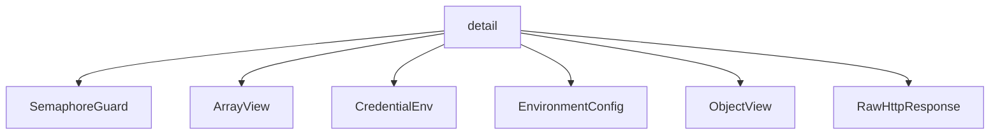

# Namespace `clore::net::detail`

## Summary

命名空间 `clore::net::detail` 封装了网络层内部实现的核心细节，包括 HTTP 请求的同步与异步发起、TCP 连接参数（如保活间隔、连接超时、请求超时）、JSON 解析与验证工具（如 `parse_json_object`、`expect_string`、`expect_array`、`expect_object`、`clone_value`、`clone_object` 等），以及环境配置读取和凭据管理（`read_environment`、`read_required_env`、`read_credentials`）。它还提供了 URL 路径拼接 (`append_url_path`)、输出合同推断与验证 (`infer_output_contract`、`validate_prompt_output`)、信号量限流 (`g_llm_semaphore` 及其互斥锁 `g_llm_semaphore_mutex`) 和请求计数器 (`g_llm_request_counter`) 等全局资源。该命名空间在架构上充当底层工具层，所有函数和类型仅供 `clore::net` 内部使用，不对外暴露公共 API 保证。

## Diagram


```mermaid
graph TD
    NS["detail"]
    T0["SemaphoreGuard"]
    NS --> T0
    T1["ArrayView"]
    NS --> T1
    T2["CredentialEnv"]
    NS --> T2
    T3["EnvironmentConfig"]
    NS --> T3
    T4["ObjectView"]
    NS --> T4
    T5["RawHttpResponse"]
    NS --> T5
```

## Types

### `clore::net::detail::ArrayView`

Declaration: `src/network/protocol.cppm:190`

Definition: `src/network/protocol.cppm:190`

Implementation: [`Module protocol`](../../../../modules/protocol/index.md)

Insufficient evidence to summarize; provide more EVIDENCE.

#### Invariants

- `value` is expected to point to a valid, non-null `kota::codec::json::Array` when any member function is called
- The view does not own the underlying `Array` object; the referenced object must outlive the view

#### Key Members

- `value` (the underlying pointer)
- `begin` / `end` (iteration support)
- `size` / `empty` (size queries)
- `operator[]` (indexed access)
- `operator->` / `operator*` (direct access to the underlying `Array`)

#### Usage Patterns

- Passed by value to functions that need read-only access to a JSON array without copying
- Returned from functions that expose a reference to a JSON array stored elsewhere
- Used to iterate over array elements via range-based for loops

#### Member Functions

##### `clore::net::detail::ArrayView::begin`

Declaration: `src/network/protocol.cppm:201`

Definition: `src/network/protocol.cppm:201`

Implementation: [`Module protocol`](../../../../modules/protocol/index.md)

###### Declaration

```cpp
const_iterator () const noexcept;
```

##### `clore::net::detail::ArrayView::empty`

Declaration: `src/network/protocol.cppm:193`

Definition: `src/network/protocol.cppm:193`

Implementation: [`Module protocol`](../../../../modules/protocol/index.md)

###### Declaration

```cpp
auto () const noexcept -> bool;
```

##### `clore::net::detail::ArrayView::end`

Declaration: `src/network/protocol.cppm:205`

Definition: `src/network/protocol.cppm:205`

Implementation: [`Module protocol`](../../../../modules/protocol/index.md)

###### Declaration

```cpp
const_iterator () const noexcept;
```

##### `clore::net::detail::ArrayView::operator*`

Declaration: `src/network/protocol.cppm:217`

Definition: `src/network/protocol.cppm:217`

Implementation: [`Module protocol`](../../../../modules/protocol/index.md)

###### Declaration

```cpp
auto () const noexcept -> const kota::codec::json::Array &;
```

##### `clore::net::detail::ArrayView::operator->`

Declaration: `src/network/protocol.cppm:213`

Definition: `src/network/protocol.cppm:213`

Implementation: [`Module protocol`](../../../../modules/protocol/index.md)

###### Declaration

```cpp
auto () const noexcept -> const kota::codec::json::Array *;
```

##### `clore::net::detail::ArrayView::operator[]`

Declaration: `src/network/protocol.cppm:209`

Definition: `src/network/protocol.cppm:209`

Implementation: [`Module protocol`](../../../../modules/protocol/index.md)

###### Declaration

```cpp
auto (std::size_t) const -> const kota::codec::json::Value &;
```

##### `clore::net::detail::ArrayView::size`

Declaration: `src/network/protocol.cppm:197`

Definition: `src/network/protocol.cppm:197`

Implementation: [`Module protocol`](../../../../modules/protocol/index.md)

###### Declaration

```cpp
auto () const noexcept -> std::size_t;
```

### `clore::net::detail::CredentialEnv`

Declaration: `src/network/provider.cppm:21`

Definition: `src/network/provider.cppm:21`

Implementation: [`Module provider`](../../../../modules/provider/index.md)

Insufficient evidence to summarize; provide more EVIDENCE.

#### Invariants

- The string views must remain valid for the lifetime of the struct
- The referenced strings are expected to be null-terminated environment variable names

#### Key Members

- `base_url_env`
- `api_key_env`

#### Usage Patterns

- Used as a configuration input to credential lookup functions, specifying which environment variables to read for the base URL and API key

### `clore::net::detail::EnvironmentConfig`

Declaration: `src/network/http.cppm:51`

Definition: `src/network/http.cppm:51`

Implementation: [`Module http`](../../../../modules/http/index.md)

Insufficient evidence to summarize; provide more EVIDENCE.

#### Key Members

- `api_base`
- `api_key`

### `clore::net::detail::ObjectView`

Declaration: `src/network/protocol.cppm:168`

Definition: `src/network/protocol.cppm:168`

Implementation: [`Module protocol`](../../../../modules/protocol/index.md)

Insufficient evidence to summarize; provide more EVIDENCE.

#### Invariants

- The pointer `value` may be null.
- If `value` is not null, it points to a valid, fully constructed JSON object.
- The view does not own or extend the lifetime of the pointed-to object.

#### Key Members

- `value` field
- `get(std::string_view)` method
- `begin()` / `end()` methods
- `operator->()` and `operator*()`

#### Usage Patterns

- Passed by value as a safe, non-owning handle to a JSON object.
- Used to iterate over JSON object members without copying.
- Employed in network protocol code for parsing and inspecting JSON data.

#### Member Functions

##### `clore::net::detail::ObjectView::begin`

Declaration: `src/network/protocol.cppm:173`

Definition: `src/network/protocol.cppm:173`

Implementation: [`Module protocol`](../../../../modules/protocol/index.md)

###### Declaration

```cpp
const_iterator () const noexcept;
```

##### `clore::net::detail::ObjectView::end`

Declaration: `src/network/protocol.cppm:177`

Definition: `src/network/protocol.cppm:177`

Implementation: [`Module protocol`](../../../../modules/protocol/index.md)

###### Declaration

```cpp
const_iterator () const noexcept;
```

##### `clore::net::detail::ObjectView::get`

Declaration: `src/network/protocol.cppm:171`

Definition: `src/network/protocol.cppm:292`

Implementation: [`Module protocol`](../../../../modules/protocol/index.md)

###### Declaration

```cpp
auto (std::string_view) const -> std::optional<json::Cursor>;
```

##### `clore::net::detail::ObjectView::operator*`

Declaration: `src/network/protocol.cppm:185`

Definition: `src/network/protocol.cppm:185`

Implementation: [`Module protocol`](../../../../modules/protocol/index.md)

###### Declaration

```cpp
auto () const noexcept -> const kota::codec::json::Object &;
```

##### `clore::net::detail::ObjectView::operator->`

Declaration: `src/network/protocol.cppm:181`

Definition: `src/network/protocol.cppm:181`

Implementation: [`Module protocol`](../../../../modules/protocol/index.md)

###### Declaration

```cpp
auto () const noexcept -> const kota::codec::json::Object *;
```

### `clore::net::detail::RawHttpResponse`

Declaration: `src/network/http.cppm:56`

Definition: `src/network/http.cppm:56`

Implementation: [`Module http`](../../../../modules/http/index.md)

Insufficient evidence to summarize; provide more EVIDENCE.

#### Invariants

- `http_status` defaults to `0`, which is not a standard HTTP status code and indicates the field may not have been set.
- `body` defaults to an empty string, implying no response body has been assigned.

#### Key Members

- `clore::net::detail::RawHttpResponse::http_status`
- `clore::net::detail::RawHttpResponse::body`

#### Usage Patterns

- Used as a return type or intermediate representation when parsing HTTP responses.
- Other code in the network layer populates the fields after reading raw data.

## Variables

### `clore::net::detail::g_llm_request_counter`

Declaration: `src/network/http.cppm:111`

Implementation: [`Module http`](../../../../modules/http/index.md)

`clore::net::detail::g_llm_request_counter` is an `std::atomic<std::uint64_t>` variable declared at `src/network/http.cppm:111` in the `clore::net::detail` namespace. It serves as a monotonically increasing counter for LLM requests issued by the networking layer.

### `clore::net::detail::g_llm_semaphore`

Declaration: `src/network/http.cppm:62`

Implementation: [`Module http`](../../../../modules/http/index.md)

The variable `clore::net::detail::g_llm_semaphore` is declared as `extern std::shared_ptr<kota::semaphore>` in `src/network/http.cppm:62`. It is a global semaphore intended for rate-limiting LLM network requests within the `clore::net` module.

#### Usage Patterns

- Used with RAII guard objects for acquire/release
- Guarded by `clore::net::detail::g_llm_semaphore_mutex`
- Referenced in network request code paths

### `clore::net::detail::g_llm_semaphore_mutex`

Declaration: `src/network/http.cppm:61`

Implementation: [`Module http`](../../../../modules/http/index.md)

`clore::net::detail::g_llm_semaphore_mutex` is a `std::mutex` declared as `extern` at `src/network/http.cppm:61` within the `clore::net::detail` namespace. It provides synchronization for the global rate-limiting semaphore `clore::net::detail::g_llm_semaphore`.

#### Usage Patterns

- guards access to `clore::net::detail::g_llm_semaphore`
- locked in `clore::net::initialize_llm_rate_limit`
- locked in `clore::net::detail::current_llm_semaphore`
- locked in `clore::net::shutdown_llm_rate_limit`

### `clore::net::detail::kConnMaxAgeSec`

Declaration: `src/network/http.cppm:116`

Implementation: [`Module http`](../../../../modules/http/index.md)

The variable `clore::net::detail::kConnMaxAgeSec` is a compile-time constant of type `long` with value `300`, declared in the `clore::net::detail` namespace. It defines the maximum age in seconds for an HTTP connection.

#### Usage Patterns

- used in `clore::net::detail::configure_request` to configure the maximum connection age

### `clore::net::detail::kDnsCacheTimeoutSec`

Declaration: `src/network/http.cppm:115`

Implementation: [`Module http`](../../../../modules/http/index.md)

An integer constant `clore::net::detail::kDnsCacheTimeoutSec` defined as `constexpr long kDnsCacheTimeoutSec = 300` in the `clore::net::detail` namespace, representing a time-out value for DNS cache entries.

#### Usage Patterns

- passed to `configure_request` as a DNS cache timeout value

### `clore::net::detail::kHttpConnectTimeoutMs`

Declaration: `src/network/http.cppm:113`

Implementation: [`Module http`](../../../../modules/http/index.md)

A `constexpr` constant of type `long` defined as `5'000`, representing the HTTP connect timeout duration in milliseconds for network requests within the `clore::net::detail` namespace.

#### Usage Patterns

- passed as argument to `configure_request`

### `clore::net::detail::kHttpRequestTimeout`

Declaration: `src/network/http.cppm:114`

Implementation: [`Module http`](../../../../modules/http/index.md)

The variable `clore::net::detail::kHttpRequestTimeout` is a compile-time constant of type `std::chrono::milliseconds` with a value of 120,000 milliseconds (2 minutes). It defines the default timeout duration for HTTP requests in the network detail layer.

### `clore::net::detail::kTcpKeepIdleSec`

Declaration: `src/network/http.cppm:117`

Implementation: [`Module http`](../../../../modules/http/index.md)

`clore::net::detail::kTcpKeepIdleSec` is a `constexpr long` constant declared with value 60 in `src/network/http.cppm`, representing the TCP keep-alive idle timeout in seconds.

#### Usage Patterns

- passed to `clore::net::detail::configure_request`
- used as TCP keep-alive idle seconds

### `clore::net::detail::kTcpKeepIntvlSec`

Declaration: `src/network/http.cppm:118`

Implementation: [`Module http`](../../../../modules/http/index.md)

`clore::net::detail::kTcpKeepIntvlSec` is a `constexpr long` constant initialized to 10. It represents the TCP keepalive interval in seconds for socket connections.

#### Usage Patterns

- used as a configuration parameter for TCP keepalive interval

## Functions

### `clore::net::detail::append_url_path`

Declaration: `src/network/provider.cppm:28`

Definition: `src/network/provider.cppm:50`

Implementation: [`Module provider`](../../../../modules/provider/index.md)

`clore::net::detail::append_url_path` 接收两个 `std::string_view` 参数，分别表示基础路径和附加的路径片段，返回一个 `std::string` 表示组合后的完整 URL 路径。该函数负责任何必要的路径分隔符规范化（例如确保两个部分之间恰好有一个斜杠），从而让调用者不必手动处理拼接细节。调用者应保证传入的片段是有效的 URL 路径成分；该函数不会执行 URL 编码或解码。返回的字符串可直接用于 HTTP 请求的路径部分。

#### Usage Patterns

- Construct URL from base and path
- Sanitize slashes when joining URL segments

### `clore::net::detail::clone_array`

Declaration: `src/network/protocol.cppm:280`

Definition: `src/network/protocol.cppm:454`

Implementation: [`Module protocol`](../../../../modules/protocol/index.md)

`clore::net::detail::clone_array` 接受一个 `ArrayView` 和一个 `std::string_view`，前者封装了对一个 JSON 数组的只读引用，后者通常作为错误诊断的上下文标签。函数创建一个该数组的深层独立副本，并返回一个 `int` 指示操作结果（零通常表示成功，非零表示失败）。调用者必须保证 `ArrayView` 所引用的数组在调用期间有效，且传入的字符串视图保持指向有效的内存。

#### Usage Patterns

- Cloning JSON arrays during validation or transformation stages.
- Producing independent copies of array data for further processing.

### `clore::net::detail::clone_object`

Declaration: `src/network/protocol.cppm:277`

Definition: `src/network/protocol.cppm:463`

Implementation: [`Module protocol`](../../../../modules/protocol/index.md)

`clore::net::detail::clone_object` 创建指定 JSON 对象的深层副本。调用者需提供要克隆的对象（通过 `ObjectView` 或 `const json::Object &` 传递）以及一个描述当前操作上下文的 `std::string_view`；该上下文字符串用于在克隆失败时生成有意义的错误诊断信息。函数在成功时返回零，失败时返回非零错误码。

#### Usage Patterns

- Used to obtain an independent copy of a JSON object from an `ObjectView`
- Employed in JSON processing functions that require a mutable or owned `json::Object` without aliasing the source

### `clore::net::detail::clone_object`

Declaration: `src/network/protocol.cppm:274`

Definition: `src/network/protocol.cppm:458`

Implementation: [`Module protocol`](../../../../modules/protocol/index.md)

`clore::net::detail::clone_object` 克隆一个 JSON 对象，该对象由一个 `ObjectView` 表示。它接受一个只读的对象视图和一个用于错误诊断的上下文名称（`std::string_view`）。调用者应提供一个有效的 `ObjectView`，该函数返回一个 `int` 值，表示操作是否成功（通常为 0 表示成功，非零表示错误）。此函数用于深度复制 JSON 对象，供内部 JSON 处理流程使用。

#### Usage Patterns

- creating an independent copy of a JSON object to avoid aliasing or shared ownership

### `clore::net::detail::clone_value`

Declaration: `src/network/protocol.cppm:283`

Definition: `src/network/protocol.cppm:467`

Implementation: [`Module protocol`](../../../../modules/protocol/index.md)

`clore::net::detail::clone_value` 接受一个 JSON 值引用（`const json::Value &`）和一个描述性来源（`std::string_view`，通常表示字段名或调用上下文）。它负责验证并深度复制该 JSON 值，确保其结构与调用者所期望的契约一致。如果克隆与验证成功，函数返回整数 `0`；否则返回一个非零错误码，指示失败原因（例如值类型不匹配或值格式无效）。调用者必须检查返回值，并在失败时利用传入的来源字符串来生成有意义的错误信息或日志。

#### Usage Patterns

- Deep-copy a `json::Value` while discarding the context

### `clore::net::detail::configure_request`

Declaration: `src/network/http.cppm:164`

Definition: `src/network/http.cppm:164`

Implementation: [`Module http`](../../../../modules/http/index.md)

`clore::net::detail::configure_request` 接受一个 `kota::http::request` 对象、一个整数参数和一个字符串参数，对其进行配置以作后续发送使用。调用方应提供一个已初始化的请求引用，以及与该请求所需的目标地址或端口对应的整数和字符串值。该函数不返回结果，但会修改传入的请求对象，使其携带由参数指定的配置信息。它仅供库内部通过 `perform_http_request` 等函数使用，调用方需确保传入的参数在语义上与预期的网络请求一致。

#### Usage Patterns

- 在发起 HTTP 请求前调用以配置请求对象
- 用于设置统一超时和 keepalive 策略
- 作为 `perform_http_request` 或 `perform_http_request_async` 的准备工作

### `clore::net::detail::excerpt_for_error`

Declaration: `src/network/protocol.cppm:235`

Definition: `src/network/protocol.cppm:328`

Implementation: [`Module protocol`](../../../../modules/protocol/index.md)

函数 `clore::net::detail::excerpt_for_error` 接受一个 `std::string_view` 并返回一个 `std::string`。它的职责是生成一个安全、简洁的摘要片段，用于包含在错误消息或日志中。调用者应提供一个可能很长的输入字符串（例如 HTTP 响应体、JSON 文本或其他原始数据），该函数会返回其截断或清理后的版本，避免在错误上下文中输出过于冗长或包含不可打印字符的内容。返回的字符串可直接嵌入到异常、日志条目或用户可见的错误报告中，而无需调用者自行处理长度限制或字符过滤。该函数不抛出异常，其行为完全由输入决定。

#### Usage Patterns

- truncating long response bodies for error messages
- used in error-handling code paths to limit output length

### `clore::net::detail::expect_array`

Declaration: `src/network/protocol.cppm:262`

Definition: `src/network/protocol.cppm:418`

Implementation: [`Module protocol`](../../../../modules/protocol/index.md)

函数 `clore::net::detail::expect_array` 验证给定的 JSON 值是否为数组。它接受一个 JSON 值（可以是 `json::Value` 或 `json::Cursor`）以及一个用于错误上下文标识的 `std::string_view`。如果该值不是数组，函数将返回非零错误码；否则返回零表示成功。调用方应确保提供的上下文字符串能帮助定位错误来源（如 JSON 路径或字段名）。

#### Usage Patterns

- Called to safely retrieve a JSON array from a value during parsing or validation
- Used in contexts where a JSON array is expected and an error should be reported otherwise

### `clore::net::detail::expect_array`

Declaration: `src/network/protocol.cppm:265`

Definition: `src/network/protocol.cppm:427`

Implementation: [`Module protocol`](../../../../modules/protocol/index.md)

`clore::net::detail::expect_array` 验证当前 JSON 位置是否指向一个数组。它接收一个 `json::Cursor`（或 `const json::Value &`）和一个用于错误报告的上下文标签（`std::string_view`）。如果当前位置的值不是数组，该函数会返回一个错误指示（通常为负数或非零值）并可能通过异常或错误代码报告问题；如果值确实是数组，则返回成功（通常是零）。调用方应在预期 JSON 数据中某个字段必须为数组时使用此函数，并在返回非成功值时处理或传播错误。

#### Usage Patterns

- Used in parsing JSON arrays from network responses
- Called when validating tool arguments or metadata
- Often combined with `expect_string`, `expect_object`, and `clone_array`

### `clore::net::detail::expect_object`

Declaration: `src/network/protocol.cppm:256`

Definition: `src/network/protocol.cppm:400`

Implementation: [`Module protocol`](../../../../modules/protocol/index.md)

函数 `clore::net::detail::expect_object` 验证给定的 JSON 值（通过 `const json::Value &` 或 `json::Cursor` 传入）是否为一个 JSON 对象。第一个参数是要检查的 JSON 节点，第二个参数 `std::string_view` 用于在错误信息中标识当前上下文（例如字段名或路径）。如果节点不是对象，则记录错误并返回非零值；否则返回 0。调用者应保证传入的 `std::string_view` 在函数执行期间保持有效，并负责在返回非零时处理错误。

#### Usage Patterns

- validating that a JSON value is an object
- extracting an `ObjectView` from a parsed JSON value
- used in serialization and validation pipelines

### `clore::net::detail::expect_object`

Declaration: `src/network/protocol.cppm:259`

Definition: `src/network/protocol.cppm:409`

Implementation: [`Module protocol`](../../../../modules/protocol/index.md)

函数 `clore::net::detail::expect_object` 验证当前 `json::Cursor` 所指向的值是否为一个 JSON 对象，并返回一个指示成功或失败的状态码。调用者提供要检查的游标和一个描述性的上下文名称，该名称会在错误消息中使用，以帮助调试结构化 JSON 解析过程中出现的类型不匹配问题。

调用者必须保证提供的 `json::Cursor` 处于有效状态并指向一个 JSON 值。如果该值实际为对象，函数通常返回成功指示（非负整数）；否则返回错误状态码。此函数不修改游标或底层 JSON 数据，仅执行只读的类型检查与验证。

#### Usage Patterns

- JSON parsing validation
- error reporting with context
- converting Cursor to `ObjectView`

### `clore::net::detail::expect_string`

Declaration: `src/network/protocol.cppm:271`

Definition: `src/network/protocol.cppm:445`

Implementation: [`Module protocol`](../../../../modules/protocol/index.md)

`clore::net::detail::expect_string` 验证当前 `json::Cursor` 所指向的 JSON 值是否为字符串类型。调用方应提供一个描述性上下文（如字段名或预期标签）作为第二个参数，该上下文会在类型不匹配时用于生成错误信息。如果值类型不是字符串，函数会返回一个非零错误指示（通常为 `-1` 或其他错误码），否则返回 `0` 表示成功。此函数是解析 JSON 响应的内部构建块，用于在后续处理前断言某个字段符合字符串期望。

#### Usage Patterns

- validating JSON string fields in responses
- ensuring a JSON value is a string before processing
- providing context for error messages in JSON parsing

### `clore::net::detail::expect_string`

Declaration: `src/network/protocol.cppm:268`

Definition: `src/network/protocol.cppm:436`

Implementation: [`Module protocol`](../../../../modules/protocol/index.md)

`clore::net::detail::expect_string` 是一个验证辅助函数，用于检查给定的 `json::Value` 是否为一个字符串。它接受两个参数：一个指向待检查 JSON 值的常量引用 `const json::Value &`，以及一个 `std::string_view` 参数，该参数通常用于提供描述性上下文（例如字段名或用途说明），以便在验证失败时生成有意义的错误信息。函数返回一个 `int` 值：返回 `0` 表示验证成功（该值确实是一个字符串），返回非零值表示失败，调用者应将此非零值视为错误码并传播或处理。

调用者应确保传入的 `json::Value` 是已解析的有效 JSON 对象的一部分。函数不修改输入值，也不持有任何引用。当返回值非零时，调用者不应假定 `json::Value` 类型，且应信任函数已记录错误信息。此函数通常用在需要提取或验证 JSON 中特定字符串字段的上下文中，作为更复杂的 JSON 解析或模式验证流程的一部分。

#### Usage Patterns

- validating that a JSON value is a string
- extracting string content from a JSON value
- reporting an error with context when the value is not a string

### `clore::net::detail::infer_output_contract`

Declaration: `src/network/protocol.cppm:643`

Definition: `src/network/protocol.cppm:660`

Implementation: [`Module protocol`](../../../../modules/protocol/index.md)

`clore::net::detail::infer_output_contract` 从给定的 `PromptRequest` 中推断出预期的输出合同。它解析请求中与输出格式相关的配置（例如 `response_format` 字段），并返回一个 `int` 类型的值，该值标识推断出的合同类型。调用者可以使用此返回值来指导后续的输出验证（例如通过 `validate_prompt_output`），或根据合同调整数据序列化方式。如果无法从请求中确定有效的合同，函数可能返回表示错误或默认合同的值。该函数是 `clore::net::detail` 命名空间中输出处理管线的前端步骤，旨在封装合同推断逻辑，使调用者无需直接理解底层请求结构。

#### Usage Patterns

- 在验证 `PromptRequest` 时调用以确定输出合同
- 在请求处理流程中用于决策输出格式

### `clore::net::detail::insert_string_field`

Declaration: `src/network/protocol.cppm:227`

Definition: `src/network/protocol.cppm:315`

Implementation: [`Module protocol`](../../../../modules/protocol/index.md)

`clore::net::detail::insert_string_field` 将一个字符串字段插入到传入的 `json::Object` 中。函数接受三个 `std::string_view` 参数，通常分别代表字段的键、字段的值以及一个用于错误上下文的标签（例如源位置或数据用途）。返回值是一个整数，按惯例 0 表示成功，非零值表示错误；调用者应检查此返回值并依据 `clore::net` 的错误处理约定进行响应。此函数是网络协议序列化流程的一部分，调用者仅在需要手动构造或修改 JSON 对象时使用，且必须保证目标对象可变、键有效且值已正确编码。

#### Usage Patterns

- Adding a string field to a JSON object during network message construction
- Inserting string data into request or response JSON payloads

### `clore::net::detail::make_empty_array`

Declaration: `src/network/protocol.cppm:243`

Definition: `src/network/protocol.cppm:360`

Implementation: [`Module protocol`](../../../../modules/protocol/index.md)

构造一个空 JSON 数组。`make_empty_array` 用于生成一个空数组结构，通常作为占位符或序列化的起点。调用者提供一个描述性上下文（`std::string_view`），用于在操作失败时记录诊断信息。返回一个整型状态码，成功时为零，失败时为表示错误的非零值。

#### Usage Patterns

- Creating an empty JSON array as a default or fallback value
- Initializing JSON containers in parsing or serialization utilities

### `clore::net::detail::make_empty_object`

Declaration: `src/network/protocol.cppm:240`

Definition: `src/network/protocol.cppm:352`

Implementation: [`Module protocol`](../../../../modules/protocol/index.md)

Creates an empty JSON object. The caller must provide a `std::string_view` that serves as context for error reporting. Returns an `int` status code indicating success or failure of the operation.

#### Usage Patterns

- create an empty JSON object for default or error-case initialization
- used in conjunction with similar functions like `make_empty_array`

### `clore::net::detail::normalize_utf8`

Declaration: `src/network/protocol.cppm:225`

Definition: `src/network/protocol.cppm:305`

Implementation: [`Module protocol`](../../../../modules/protocol/index.md)

`normalize_utf8` 将输入的 UTF‑8 文本序列转换为标准化的规范形式，并返回一个新的 `std::string` 作为结果。调用者提供两个 `std::string_view` 参数，其中第一个通常表示待规范化的原始字符串，第二个可用于指定规范化规则或上下文（例如期望的 Unicode 归一化形式）。函数保证输出是语法正确且格式一致的 UTF‑8 字符串，便于后续网络协议层或内部处理逻辑使用。

#### Usage Patterns

- Used when preparing strings for JSON serialization to ensure valid UTF-8, with logging for diagnostic purposes

### `clore::net::detail::parse_json_object`

Declaration: `src/network/provider.cppm:34`

Definition: `src/network/provider.cppm:155`

Implementation: [`Module provider`](../../../../modules/provider/index.md)

`clore::net::detail::parse_json_object` 接受两个 `std::string_view` 参数并返回一个 `int`。该函数用于从提供的文本中解析一个 JSON 对象。调用者应传入待解析的 JSON 字符串作为第一个参数，第二个参数通常用作上下文标识，用于错误消息或来源追踪。返回值指示操作结果（例如成功或特定的错误代码）。此函数位于 `clore::net::detail` 命名空间，属于内部实现细节，不应被外部代码直接依赖。

#### Usage Patterns

- called to parse JSON object responses from HTTP requests
- used in functions that validate or extract JSON object data, such as `validate_completion_request`
- called with a context string to provide meaningful error messages on parsing failure

### `clore::net::detail::parse_json_value`

Declaration: `src/network/protocol.cppm:247`

Definition: `src/network/protocol.cppm:369`

Implementation: [`Module protocol`](../../../../modules/protocol/index.md)

函数模板 `clore::net::detail::parse_json_value` 接受两个 `std::string_view` 参数：第一个是要解析的 JSON 文本，第二个是用于错误报告的可读上下文描述符（例如，描述调用方意图的字符串）。该函数将 JSON 文本解析为模板参数 `T` 指定的类型，并返回一个 `int` 表示解析结果（通常 `0` 表示成功，非零表示错误代码）。调用者必须保证 `T` 与 JSON 值结构兼容，并负责提供有效的 UTF‑8 输入字符串；该函数不修改输入，也不持有对输入字符串的引用。

#### Usage Patterns

- Used to deserialize JSON into a typed value
- Called when parsing network response payloads

### `clore::net::detail::parse_json_value`

Declaration: `src/network/protocol.cppm:250`

Definition: `src/network/protocol.cppm:380`

Implementation: [`Module protocol`](../../../../modules/protocol/index.md)

`clore::net::detail::parse_json_value` 是一个模板函数，接受一个 `const json::Value &` 和一个 `std::string_view`，返回 `int`。调用者应提供一个有效的 JSON 值用于解析，以及一个字符串视图（通常用于构建错误消息或标识解析上下文）。返回值表示操作的结果状态（例如成功代码或错误代码），具体含义由该函数的文档或使用约定定义。作为模版函数，其特性由模板参数 `<typename T>` 决定，但该参数未直接出现在参数列表中；调用者应根据库的约定来理解其作用。

#### Usage Patterns

- Called when a `json::Value` must be parsed into a domain type `T`
- Used as a convenience wrapper over the string‑based `parse_json_value`

### `clore::net::detail::perform_http_request`

Declaration: `src/network/http.cppm:67`

Definition: `src/network/http.cppm:181`

Implementation: [`Module http`](../../../../modules/http/index.md)

执行一个同步 HTTP 请求。调用者需提供三个参数：一个表示目标 URL 的 `const std::string &`、一个 `int` 端口号和一个表示请求路径或内容的 `std::string_view`。该函数返回一个 `std::expected<RawHttpResponse, LLMError>`：成功时包含完整的 `RawHttpResponse`；失败时返回描述错误原因的 `LLMError`。此函数是 `clore::net::detail` 内部网络基础设施的一部分，调用者应确保传入的参数有效，并处理可能的错误返回值。

#### Usage Patterns

- Used as a blocking convenience function by callers that want a simple synchronous HTTP request
- Often called when the async infrastructure should be hidden from the caller

### `clore::net::detail::perform_http_request_async`

Declaration: `src/network/http.cppm:72`

Definition: `src/network/http.cppm:209`

Implementation: [`Module http`](../../../../modules/http/index.md)

该函数发起一个异步 HTTP 请求。调用者需提供一个表示请求目标的字符串（例如 URL 或主机名）、一个整数端口号、一个字符串形式的请求有效载荷，以及一个用于编排异步操作的 `async::event_loop` 引用。函数返回一个整数，该整数表示异步操作的标识符或结果状态；调用者可根据该值跟踪请求完成情况或检查错误。此函数不阻塞当前线程，事件循环负责调度和完成回调。

#### Usage Patterns

- called to asynchronously invoke an LLM API endpoint
- used with an event loop for non-blocking I/O
- provides rate limiting through semaphore acquisition
- returns a task that can be awaited in a coroutine context

### `clore::net::detail::read_credentials`

Declaration: `src/network/provider.cppm:26`

Definition: `src/network/provider.cppm:46`

Implementation: [`Module provider`](../../../../modules/provider/index.md)

函数 `clore::net::detail::read_credentials` 从指定的 `CredentialEnv` 源读取网络凭据。它返回一个 `int`，其中 `0` 表示成功，非零值指示具体的错误类型。调用者应提供有效的 `CredentialEnv` 值，并检查返回值以确认凭据是否已成功读取。此函数位于 `clore::net::detail` 命名空间中，仅供内部使用，不构成公共 API 契约。

#### Usage Patterns

- 用于从环境变量中获取 base URL 和 API key 配置
- 常被配置初始化或认证流程调用

### `clore::net::detail::read_environment`

Declaration: `src/network/http.cppm:64`

Definition: `src/network/http.cppm:146`

Implementation: [`Module http`](../../../../modules/http/index.md)

调用 `clore::net::detail::read_environment` 以根据两个标识符读取环境配置。第一个 `std::string_view` 参数通常指定环境变量名称，第二个参数则提供一个可选的默认值。函数成功时返回一个 `EnvironmentConfig` 对象，包含读取到的配置信息；若读取失败（例如变量未定义且未提供有效的默认，或格式无效），则返回一个 `LLMError` 表示错误原因。调用者应确保传入的参数至少有一个能提供有效配置，并检查返回的 `expected` 以处理正常的配置与错误路径。

#### Usage Patterns

- called to obtain `EnvironmentConfig` from environment variable names
- typical invocation: `read_environment("API_BASE", "API_KEY")`

### `clore::net::detail::read_required_env`

Declaration: `src/network/http.cppm:137`

Definition: `src/network/http.cppm:137`

Implementation: [`Module http`](../../../../modules/http/index.md)

读取所需的环境变量值。`clore::net::detail::read_required_env` 接受一个 `std::string_view` 作为环境变量名称，返回 `std::expected<std::string, LLMError>`。如果该环境变量已设置且值有效，则成功携带对应的字符串值；否则，返回一个 `LLMError` 表示缺失或无效的配置。调用者必须确保提供的名称正确，并负责处理可能的失败情形。

#### Usage Patterns

- used to obtain required configuration values from the environment
- likely called by `clore::net::detail::read_environment` or similar initialization functions

### `clore::net::detail::request_text_once_async`

Declaration: `src/network/protocol.cppm:650`

Definition: `src/network/protocol.cppm:692`

Implementation: [`Module protocol`](../../../../modules/protocol/index.md)

`clore::net::detail::request_text_once_async` 是一个模板函数，用于发起一次异步文本请求。调用者需提供模板参数 `CompletionRequester` 的实例，两个 `std::string_view` 参数（分别表示请求目标和负载），一个 `PromptRequest` 对象，以及一个 `kota::event_loop &` 引用。该函数启动异步操作并返回一个 `int` 值，调用者可将此值用于后续跟踪或错误处理。调用者应保证提供的参数在异步操作完成前保持有效，并确保事件循环处于运行状态。

#### Usage Patterns

- Used to perform a single asynchronous text completion with output contract validation
- Integrates with event loop via a provided `CompletionRequester` callable
- Called when a text response from a language model is needed, with built-in error handling for contract and validation failures

### `clore::net::detail::run_task_sync`

Declaration: `src/network/protocol.cppm:238`

Definition: `src/network/protocol.cppm:334`

Implementation: [`Module protocol`](../../../../modules/protocol/index.md)

函数 `clore::net::detail::run_task_sync` 同步执行一个由传入的可调用对象生成的任务。它接受一个通用引用参数，该参数是一个工厂对象（类型满足 `make_task` 概念），负责构造并返回待运行的任务。函数会阻塞当前线程，直到该任务完成执行，并返回一个整数状态码以指示执行结果。调用者可以通过该状态码判断任务是否成功或失败。

此函数适用于需要在同步上下文中运行异步操作或测试的场景。作为 `detail` 命名空间中的内部工具，它不保证对外接口的稳定，但遵循合约：入参必须是一个无副作用的可调用对象，返回的整数遵循调用者定义的状态约定（通常 0 表示成功，非零表示错误）。

#### Usage Patterns

- wrapping an asynchronous operation to run synchronously
- converting an async task into a synchronous expected result
- used to execute network requests or other async tasks in a blocking context

### `clore::net::detail::select_event_loop`

Declaration: `src/network/client.cppm:53`

Definition: `src/network/client.cppm:53`

Implementation: [`Module client`](../../../../modules/client/index.md)

Declaration: [Declaration](functions/select-event-loop.md)

给定一个可选的 `kota::event_loop` 指针，返回一个有效的 `kota::event_loop` 引用。若指针非空，则返回该指针所指向的事件循环；若指针为空，则提供当前线程的默认事件循环。此函数常用于需要为异步操作提供事件循环的调用方，以便统一处理传入的 `nullptr` 与显式指定的循环实例。

#### Usage Patterns

- callers like `clore::net::call_llm_async` and `clore::net::call_completion_async` pass an optional `kota::event_loop*` to obtain a guaranteed valid reference for async operations

### `clore::net::detail::serialize_tool_arguments`

Declaration: `src/network/provider.cppm:37`

Definition: `src/network/provider.cppm:165`

Implementation: [`Module provider`](../../../../modules/provider/index.md)

将给定的 `json::Value` 中的工具（tool）参数序列化为适合在 HTTP 请求中传输的格式。第一个参数包含待序列化的参数数据；第二个参数通常用于在出错时提供问题定位的上下文名称或描述。返回一个整数状态码：成功时为 `0`，失败时为负数错误码。此函数是工具调用处理流程的内部辅助函数，调用者应确保传入的 `json::Value` 符合预期的工具参数结构。

#### Usage Patterns

- validate and round‑trip JSON tool arguments
- prepare tool arguments for HTTP request serialization
- ensure arguments are serializable before further use

### `clore::net::detail::serialize_value_to_string`

Declaration: `src/network/protocol.cppm:253`

Definition: `src/network/protocol.cppm:390`

Implementation: [`Module protocol`](../../../../modules/protocol/index.md)

该函数将给定的 `const json::Value &` 序列化为字符串形式，供后续协议处理使用。参数 `std::string_view` 用作上下文标识（例如字段名或操作描述），在序列化失败时辅助生成错误报告。返回的 `int` 表示操作结果，调用者应检查该值以判断序列化是否成功（通常零表示成功，非零表示错误码）。调用前需保证传入的 JSON 值处于有效状态，且上下文字符串不包含空悬引用。

#### Usage Patterns

- Used to serialize JSON values to strings with proper error handling
- Likely used in scenarios where JSON encoding may fail and the error needs to be reported with a context string

### `clore::net::detail::to_llm_unexpected`

Declaration: `src/network/protocol.cppm:233`

Definition: `src/network/protocol.cppm:324`

Implementation: [`Module protocol`](../../../../modules/protocol/index.md)

此函数将提供的 `Status`（通常是来自某个操作的结果状态）和一个描述性 `std::string_view` 转换为一个表示 LLM 意外错误的整数错误码。调用方负责传入一个合适的 `Status` 对象和一个可读的错误消息；函数返回的整数可以直接用于错误传播或与 LLM 错误处理路径集成。

#### Usage Patterns

- converting an error status to an unexpected `LLMError`
- error propagation in expected-based `APIs`

### `clore::net::detail::unexpected_json_error`

Declaration: `src/network/protocol.cppm:222`

Definition: `src/network/protocol.cppm:300`

Implementation: [`Module protocol`](../../../../modules/protocol/index.md)

`clore::net::detail::unexpected_json_error` 接受一个描述性上下文（`std::string_view`）和一个 `const json::error &`，并返回一个 `int`。调用者负责提供有意义的消息片段和有效的 JSON 错误对象。返回的整数值可用于向上层报告该特定意外 JSON 错误的发生，通常用于错误传播或日志记录。此函数旨在将 JSON 解析或验证过程中出现的非预期错误封装为可由调用链一致处理的数值表示。

#### Usage Patterns

- Convert JSON errors to unexpected `LLMError` results
- Return `LLMError` in JSON parsing or validation failure paths

### `clore::net::detail::unwrap_caught_result`

Declaration: `src/network/http.cppm:78`

Definition: `src/network/http.cppm:78`

Implementation: [`Module http`](../../../../modules/http/index.md)

`clore::net::detail::unwrap_caught_result` 用于将从异步操作或 JSON 处理中得到的“捕获结果”（例如可能携带有内部异常或错误信息的结果对象）转换为一个整型错误码。它接受一个结果 `R` 和一个描述性的 `std::string_view` 标签，返回一个表示成功或失败状态的 `int`。调用者使用此函数以统一的方式在不同的错误表示（如异常、`std::expected` 等）与模块内常见的错误码约定之间进行适配。该标签用于在出错时提供上下文，通常可以是调用该函数的操作名称或位置标识。

#### Usage Patterns

- Used to unwrap a caught result from async operations
- Provides a custom cancellation message
- Converts to a task with `LLMError` error type

### `clore::net::detail::validate_completion_request`

Declaration: `src/network/provider.cppm:30`

Definition: `src/network/provider.cppm:68`

Implementation: [`Module provider`](../../../../modules/provider/index.md)

函数 `clore::net::detail::validate_completion_request` 用于验证一个异步完成请求的有效性。它接受一个请求的整数标识符（ `const int &` ）以及两个布尔参数，并返回一个 `int` 表示验证结果。调用者必须保证传入的标识符对应一个可用的、尚未完成的请求。两个布尔参数分别控制验证的严格程度或检查范围；其具体语义由调用方根据上下文约定。返回值为零表示验证通过，非零值指示特定的验证失败原因。该函数不会修改任何外部状态，也不抛出异常。

#### Usage Patterns

- Called before sending a completion request to ensure all required fields are valid.
- Used with `validate_response_format_schema` and `validate_tool_schemas` flags to optionally enable deeper validation.
- Invoked by higher-level request sending functions like `clore::net::detail::request_text_once_async`.

### `clore::net::detail::validate_prompt_output`

Declaration: `src/network/protocol.cppm:646`

Definition: `src/network/protocol.cppm:678`

Implementation: [`Module protocol`](../../../../modules/protocol/index.md)

调用者应提供待验证的输出字符串和期望的 `PromptOutputContract`。该函数检查输出是否符合该契约（例如格式、结构或类型约束），并返回一个 `int` 值指示验证结果——通常以零表示成功，非零表示特定错误码。调用者需确保传入的 `std::string_view` 在函数执行期间保持有效，并处理返回的整数以判断验证是否通过。

#### Usage Patterns

- Used to validate prompt output before further processing
- Called after receiving a response to ensure compliance with the expected output format

### `clore::net::detail::validate_response_format`

Declaration: `src/network/schema.cppm:537`

Definition: `src/network/schema.cppm:545`

Implementation: [`Module schema`](../../../../modules/schema/index.md)

调用 `clore::net::detail::validate_response_format` 以验证响应格式的合规性。该函数接受一个 `const int &` 参数，表示待验证的响应格式标识符，并返回一个 `int` 作为验证结果的状态码。返回 `0` 通常表示格式有效，非零值指示验证失败或特定错误条件。调用者必须检查返回值以确定响应格式是否被接受并据此进行后续处理。

#### Usage Patterns

- Called during request validation pipeline
- Ensures response format constraints before sending HTTP request

### `clore::net::detail::validate_tool_definition`

Declaration: `src/network/schema.cppm:539`

Definition: `src/network/schema.cppm:555`

Implementation: [`Module schema`](../../../../modules/schema/index.md)

`clore::net::detail::validate_tool_definition` 接受一个 `const int &` 形式的工具定义标识符，返回一个 `int` 类型的结果。调用方应提供有效的工具定义引用；该函数检查定义是否符合预期格式与约束，若验证通过则返回表示成功的整数，否则返回表示具体错误类型的非零值。验证结果可用于后续流程控制，如拒绝无效的工具配置。

#### Usage Patterns

- validation before using tool definitions
- called during configuration or initialization

## Related Pages

- [Namespace clore::net](../index.md)

