# Namespace `clore::net`

## Summary

`clore::net` 命名空间抽象了大语言模型（LLM）的网络通信层，提供异步调用、能力探测、速率限制及工具选择等核心功能。其声明包括 `CompletionRequest`、`PromptRequest`、`ProbedCapabilities` 等数据结构，以及 `call_llm_async`、`call_completion_async`、`call_structured_async` 等非阻塞函数，配合 `kota::event_loop` 实现事件驱动的异步交互。

从架构上看，该命名空间将 LLM 的远程调用封装为统一接口，通过 `sanitize_request_for_capabilities` 适配不同提供者的能力差异，利用 `initialize_llm_rate_limit` / `shutdown_llm_rate_limit` 管理请求节流，并借助 `ToolChoice` 变体（如 `ToolChoiceAuto`、`ToolChoiceRequired`、`ToolChoiceNone`）和 `FunctionToolDefinition` 支持函数调用模式。它是整个系统中与外部 LLM 服务交互的核心桥梁，负责将上层提示转换为网络请求、处理响应并报告错误。

## Diagram

```mermaid
graph TD
    NS["net"]
    T0["AssistantMessage"]
    NS --> T0
    T1["AssistantOutput"]
    NS --> T1
    T2["AssistantToolCallMessage"]
    NS --> T2
    T3["CompletionRequest"]
    NS --> T3
    T4["CompletionResponse"]
    NS --> T4
    T5["ForcedFunctionToolChoice"]
    NS --> T5
    T6["FunctionToolDefinition"]
    NS --> T6
    T7["LLMError"]
    NS --> T7
    T8["Message"]
    NS --> T8
    T9["ProbedCapabilities"]
    NS --> T9
    T10["PromptOutputContract"]
    NS --> T10
    T11["PromptRequest"]
    NS --> T11
    T12["ResponseFormat"]
    NS --> T12
    T13["SystemMessage"]
    NS --> T13
    T14["ToolCall"]
    NS --> T14
    T15["ToolChoice"]
    NS --> T15
    T16["ToolChoiceAuto"]
    NS --> T16
    T17["ToolChoiceNone"]
    NS --> T17
    T18["ToolChoiceRequired"]
    NS --> T18
    T19["ToolOutput"]
    NS --> T19
    T20["ToolResultMessage"]
    NS --> T20
    T21["UserMessage"]
    NS --> T21
    NSC0["anthropic"]
    NS --> NSC0
    NSC1["detail"]
    NS --> NSC1
    NSC2["openai"]
    NS --> NSC2
    NSC3["protocol"]
    NS --> NSC3
    NSC4["schema"]
    NS --> NSC4
```



## Subnamespaces

- [`clore::net::anthropic`](anthropic/index.md)
- [`clore::net::detail`](detail/index.md)
- [`clore::net::openai`](openai/index.md)
- [`clore::net::protocol`](protocol/index.md)
- [`clore::net::schema`](schema/index.md)

## Types

### `clore::net::AssistantMessage`

Declaration: `network/protocol.cppm:31`

Definition: `network/protocol.cppm:31`

Implementation: [`Module protocol`](../../../modules/protocol/index.md)

Insufficient evidence to summarize; provide more EVIDENCE.

#### Invariants

- The struct has no invariants beyond those implied by its members.

#### Key Members

- `clore::net::AssistantMessage::content`

#### Usage Patterns

- Other code creates instances and accesses the `content` member.
- Used as a data carrier in the network protocol.

### `clore::net::AssistantOutput`

Declaration: `network/protocol.cppm:101`

Definition: `network/protocol.cppm:101`

Implementation: [`Module protocol`](../../../modules/protocol/index.md)

Insufficient evidence to summarize; provide more EVIDENCE.

#### Invariants

- None explicitly stated; fields are independent and may be empty or populated per usage.

#### Key Members

- `text` - optional string for plain text output
- `refusal` - optional string for refusal reason
- `tool_calls` - vector of `ToolCall` for tool invocations

#### Usage Patterns

- Assigned by code that processes assistant responses
- Read by consumers to extract textual or tool-based output
- Used as a return type or message field in network-related data transfer

### `clore::net::AssistantToolCallMessage`

Declaration: `network/protocol.cppm:35`

Definition: `network/protocol.cppm:35`

Implementation: [`Module protocol`](../../../modules/protocol/index.md)

Insufficient evidence to summarize; provide more EVIDENCE.

### `clore::net::CompletionRequest`

Declaration: `network/protocol.cppm:77`

Definition: `network/protocol.cppm:77`

Implementation: [`Module protocol`](../../../modules/protocol/index.md)

Insufficient evidence to summarize; provide more EVIDENCE.

#### Invariants

- `model` is default-initialized to empty string
- `messages` may be empty
- optional fields may be absent

#### Key Members

- `model`
- `messages`
- `tools`
- `tool_choice`
- `response_format`
- `parallel_tool_calls`

#### Usage Patterns

- Constructed with a model name and a list of messages
- Optionally configured with tool definitions and tool calling behavior

### `clore::net::CompletionResponse`

Declaration: `network/protocol.cppm:107`

Definition: `network/protocol.cppm:107`

Implementation: [`Module protocol`](../../../modules/protocol/index.md)

Insufficient evidence to summarize; provide more EVIDENCE.

#### Invariants

- All members are default-constructible and may hold empty strings or default-constructed `AssistantOutput`.
- The `message` member is always an `AssistantOutput` instance, regardless of the underlying response content.
- `raw_json` is expected to contain the complete JSON string from which the other fields were derived, but no consistency is enforced.

#### Key Members

- `clore::net::CompletionResponse::id`
- `clore::net::CompletionResponse::model`
- `clore::net::CompletionResponse::message`
- `clore::net::CompletionResponse::raw_json`

#### Usage Patterns

- Constructed via aggregate initialization, typically after deserializing a JSON response from the network layer.
- Read by callers to access the textual assistant reply through `message`, or to retrieve the raw response for logging or error analysis.
- Passed by value or const reference to handlers that process completion results.

### `clore::net::ForcedFunctionToolChoice`

Declaration: `network/protocol.cppm:70`

Definition: `network/protocol.cppm:70`

Implementation: [`Module protocol`](../../../modules/protocol/index.md)

`clore::net::ForcedFunctionToolChoice` 表示一种强制性的工具选择模式，用于在 LLM 请求中明确指定必须调用某个特定的函数工具。与可选或自动选择的工具策略不同，该结构体要求模型直接使用预定义的函数，通常用于需要严格遵循调用逻辑的场景。作为`clore::net::ToolChoice`类型别名可能包含的变体之一，它与其他工具选择结构体（如`ToolChoiceAuto`、`ToolChoiceNone`）共同组成工具调用的控制策略。

#### Invariants

- The `name` member identifies a target tool function

#### Key Members

- `name`

#### Usage Patterns

- Used to pass a forced tool choice in API calls or protocol messages
- Consumed by logic that selects and dispatches to the named tool function

### `clore::net::FunctionToolDefinition`

Declaration: `network/protocol.cppm:57`

Definition: `network/protocol.cppm:57`

Implementation: [`Module protocol`](../../../modules/protocol/index.md)

Insufficient evidence to summarize; provide more EVIDENCE.

### `clore::net::LLMError`

Declaration: `network/http.cppm:23`

Definition: `network/http.cppm:23`

Implementation: [`Module http`](../../../modules/http/index.md)

Insufficient evidence to summarize; provide more EVIDENCE.

#### Member Functions

##### `clore::net::LLMError::LLMError`

Declaration: `network/http.cppm:30`

Definition: `network/http.cppm:30`

Implementation: [`Module http`](../../../modules/http/index.md)

###### Declaration

```cpp
clore::net::LLMError::LLMError(kota::error err);
```

##### `clore::net::LLMError::LLMError`

Declaration: `network/http.cppm:28`

Definition: `network/http.cppm:28`

Implementation: [`Module http`](../../../modules/http/index.md)

###### Declaration

```cpp
clore::net::LLMError::LLMError(std::string msg);
```

##### `clore::net::LLMError::LLMError`

Declaration: `network/http.cppm:26`

Definition: `network/http.cppm:26`

Implementation: [`Module http`](../../../modules/http/index.md)

###### Declaration

```cpp
clore::net::LLMError::LLMError();
```

### `clore::net::Message`

Declaration: `network/protocol.cppm:45`

Implementation: [`Module protocol`](../../../modules/protocol/index.md)

Insufficient evidence to summarize; provide more EVIDENCE.

### `clore::net::ProbedCapabilities`

Declaration: `network/protocol.cppm:119`

Definition: `network/protocol.cppm:119`

Implementation: [`Module protocol`](../../../modules/protocol/index.md)

Insufficient evidence to summarize; provide more EVIDENCE.

#### Invariants

- All capability flags start as `true`.
- Flags are only ever set to `false` after probing; they are never reset to `true`.
- Atomic operations guarantee consistent visibility across threads.

#### Key Members

- `supports_json_schema`
- `supports_tool_choice`
- `supports_parallel_tool_calls`
- `supports_tools`

#### Usage Patterns

- Other code checks these flags before using JSON schema constraints, tool choice options, or parallel tool invocations.
- Probing logic writes to these flags after receiving capability responses from the endpoint.
- The struct is typically accessed concurrently by network and application threads.

### `clore::net::PromptOutputContract`

Declaration: `network/protocol.cppm:86`

Definition: `network/protocol.cppm:86`

Implementation: [`Module protocol`](../../../modules/protocol/index.md)

Insufficient evidence to summarize; provide more EVIDENCE.

#### Invariants

- 每个枚举成员唯一，值从 0 开始连续递增
- 枚举值可作为 `std::uint8_t` 类型使用

#### Key Members

- `clore::net::PromptOutputContract::Unspecified`
- `clore::net::PromptOutputContract::Json`
- `clore::net::PromptOutputContract::Markdown`

#### Usage Patterns

- 作为函数参数或数据结构成员，用于控制输出内容的格式
- 在网络协议中指定客户端期望或服务器返回的输出格式合同

#### Member Variables

##### `clore::net::PromptOutputContract::Json`

Declaration: `network/protocol.cppm:88`

Implementation: [`Module protocol`](../../../modules/protocol/index.md)

###### Declaration

```cpp
Json
```

##### `clore::net::PromptOutputContract::Markdown`

Declaration: `network/protocol.cppm:89`

Implementation: [`Module protocol`](../../../modules/protocol/index.md)

###### Declaration

```cpp
Markdown
```

##### `clore::net::PromptOutputContract::Unspecified`

Declaration: `network/protocol.cppm:87`

Implementation: [`Module protocol`](../../../modules/protocol/index.md)

###### Declaration

```cpp
Unspecified
```

### `clore::net::PromptRequest`

Declaration: `network/protocol.cppm:92`

Definition: `network/protocol.cppm:92`

Implementation: [`Module protocol`](../../../modules/protocol/index.md)

Insufficient evidence to summarize; provide more EVIDENCE.

#### Invariants

- `prompt` is always present as a `std::string`, may be empty but never null
- `response_format` and `tool_choice` may be `std::nullopt` when not specified
- `output_contract` always has a value due to default initializer
- The struct is trivially copyable and movable via defaulted operations

#### Key Members

- `prompt`
- `response_format`
- `tool_choice`
- `output_contract`

#### Usage Patterns

- Used as an input argument to a request-sending function in the `clore::net` namespace
- Callers populate fields before passing the struct to a network call
- Library code inspects the fields to construct a corresponding protocol message

### `clore::net::ResponseFormat`

Declaration: `network/protocol.cppm:51`

Definition: `network/protocol.cppm:51`

Implementation: [`Module protocol`](../../../modules/protocol/index.md)

Insufficient evidence to summarize; provide more EVIDENCE.

#### Invariants

- `name` is always a valid `std::string`
- `schema` is either absent or a valid `kota::codec::json::Object`
- `strict` defaults to `true` when not explicitly set

#### Key Members

- `name`
- `schema`
- `strict`

#### Usage Patterns

- Used to describe expected response schemas in network protocols
- May be passed to API endpoint definitions or validation logic

### `clore::net::SystemMessage`

Declaration: `network/protocol.cppm:16`

Definition: `network/protocol.cppm:16`

Implementation: [`Module protocol`](../../../modules/protocol/index.md)

Insufficient evidence to summarize; provide more EVIDENCE.

#### Invariants

- `content` 可以存放任意字符串，无长度或格式约束

#### Key Members

- `content`：存储消息内容的字符串成员

#### Usage Patterns

- 作为网络协议中的消息体传递数据
- 在发送与接收消息时填充或读取 `content` 字段

### `clore::net::ToolCall`

Declaration: `network/protocol.cppm:24`

Definition: `network/protocol.cppm:24`

Implementation: [`Module protocol`](../../../modules/protocol/index.md)

`clore::net::ToolCall` 表示模型在完成响应中发起的单个工具调用。它通常出现在 `AssistantToolCallMessage` 中，携带调用标识符和函数调用所需的参数，这些参数对应预定义的 `FunctionToolDefinition`。客户端应识别此调用，执行相应的工具函数，并将结果封装在 `ToolResultMessage` 中返回给模型，从而完成工具使用的交互循环。

#### Invariants

- id and name are expected to be non-empty
- `arguments_json` should be valid JSON
- arguments corresponds to the parsed content of `arguments_json`

#### Key Members

- id
- name
- `arguments_json`
- arguments

#### Usage Patterns

- Serialized and deserialized in network protocol messages
- Passed between components to invoke external tool calls

### `clore::net::ToolChoice`

Declaration: `network/protocol.cppm:74`

Implementation: [`Module protocol`](../../../modules/protocol/index.md)

`clore::net::ToolChoice` 是一个类型别名，用于表示在大语言模型调用过程中指定工具（函数）的选择策略。它通常作为 `CompletionRequest` 或 `PromptRequest` 的一部分出现，允许调用者控制模型应如何选择可用的工具。该类型覆盖了多种标准工具选择模式，如自动选择（由模型自主决定）、禁用工具、强制要求调用工具，以及强制调用特定函数。

### `clore::net::ToolChoiceAuto`

Declaration: `network/protocol.cppm:64`

Definition: `network/protocol.cppm:64`

Implementation: [`Module protocol`](../../../modules/protocol/index.md)

`clore::net::ToolChoiceAuto` 是一种标签类型，用于表示自动工具选择策略。在与大型语言模型交互时，该类型指示模型自主决定是否调用可用工具以及调用哪个工具，而不在请求层面施加强制约束。它与 `clore::net::ToolChoiceNone`、`clore::net::ToolChoiceRequired` 和 `clore::net::ForcedFunctionToolChoice` 共同作为 `clore::net::ToolChoice` 的候选变体，通常用于配置 `clore::net::CompletionRequest` 或 `clore::net::PromptRequest` 中的工具行为。

#### Invariants

- Empty struct with no members
- Trivially constructible and destructible
- Used as a type tag

#### Usage Patterns

- Likely used as a template argument for `std::variant` or `std::optional` to indicate an automatic tool selection
- May appear in interfaces that require a type to distinguish between manual and automatic tool choice

### `clore::net::ToolChoiceNone`

Declaration: `network/protocol.cppm:68`

Definition: `network/protocol.cppm:68`

Implementation: [`Module protocol`](../../../modules/protocol/index.md)

表示模型不应使用任何工具的工具选择选项，用于在请求中显式禁用工具调用。它通常作为 `ToolChoice` 类型别名（可能为 `std::variant`）的一个可选择项，与其他工具选择策略（如 `ToolChoiceAuto`、`ToolChoiceRequired` 或 `ForcedFunctionToolChoice`）并列，以便在要求模型仅基于自身知识生成回复时使用。

#### Invariants

- 结构体不包含任何成员，因此无运行时状态
- 所有实例在语义上等价

#### Usage Patterns

- 作为模板参数或函数重载的区分类型
- 用于表示工具选择策略的默认值或禁用状态
- 与其他工具选择类型（如`ToolChoiceAuto`）组成变体或联合体

### `clore::net::ToolChoiceRequired`

Declaration: `network/protocol.cppm:66`

Definition: `network/protocol.cppm:66`

Implementation: [`Module protocol`](../../../modules/protocol/index.md)

`clore::net::ToolChoiceRequired` 表示一种工具选择策略，用于指定语言模型在生成响应时必须调用至少一个工具。该结构体通常作为 `CompletionRequest` 或 `PromptRequest` 中 `ToolChoice` 类型的一部分，配合 `FunctionToolDefinition` 使用，以强制模型返回工具调用而非自然语言回复。

#### Invariants

- No data members exist.
- The type is default-constructible and trivially destructible.

#### Usage Patterns

- No explicit usage is documented; it may be used as a type discriminator or sentinel.

### `clore::net::ToolOutput`

Declaration: `network/protocol.cppm:114`

Definition: `network/protocol.cppm:114`

Implementation: [`Module protocol`](../../../modules/protocol/index.md)

Insufficient evidence to summarize; provide more EVIDENCE.

#### Key Members

- `tool_call_id`: 工具调用的唯一标识符
- `output`: 工具执行后的输出字符串

#### Usage Patterns

- 用于在 `clore::net` 命名空间中传递工具调用的结果
- 通常作为网络协议消息的一部分进行序列化或反序列化

### `clore::net::ToolResultMessage`

Declaration: `network/protocol.cppm:40`

Definition: `network/protocol.cppm:40`

Implementation: [`Module protocol`](../../../modules/protocol/index.md)

Insufficient evidence to summarize; provide more EVIDENCE.

#### Invariants

- Both members are default-constructible and copyable strings

#### Key Members

- `tool_call_id`
- `content`

#### Usage Patterns

- Serialized and deserialized as part of the network protocol
- Likely used in messages exchanged between nodes

### `clore::net::UserMessage`

Declaration: `network/protocol.cppm:20`

Definition: `network/protocol.cppm:20`

Implementation: [`Module protocol`](../../../modules/protocol/index.md)

Insufficient evidence to summarize; provide more EVIDENCE.

#### Invariants

- The `content` member stores the message as a `std::string`
- No invariants beyond standard string usage are documented

#### Key Members

- `content` (`std::string`) – the actual message content

#### Usage Patterns

- Acts as a carrier for user message text in networking operations
- Likely serialized or transmitted over socket connections

## Functions

### `clore::net::call_completion_async`

Declaration: `network/client.cppm:16`

Definition: `network/client.cppm:57`

Implementation: [`Module client`](../../../modules/client/index.md)

启动基于给定协议的异步完成请求，并返回一个标识此次操作的整数句柄。调用者必须传入一个有效的请求描述符（`int`）和一个指向`kota::event_loop`的指针；若指针为空，函数将自动选择一个默认的事件循环。返回的整数可用于跟踪或取消该异步操作。操作结果将通过事件循环的回调机制传递给调用者。

#### Usage Patterns

- 用于构建 LLM 完成请求的异步接口
- 支持能力探测和自动降级功能
- 内部被 `call_llm_async` 或类似函数调用（作为底层实现）

### `clore::net::call_completion_async`

Declaration: `network/network.cppm:24`

Definition: `network/network.cppm:150`

Implementation: [`Module network`](../../../modules/network/index.md)

该函数发起一个异步完成调用，接受一个整数标识符和一个 `kota::event_loop` 对象（通过引用或指针）作为输入，并返回一个整数作为操作结果。调用者负责提供有效的标识符以及一个可运行的事件循环实例；函数将不会阻塞调用线程，而是通过指定的事件循环调度完成操作。

返回的整数通常指示异步操作的最终状态：零表示成功，非零值表示错误码。调用者应检查返回值并据此处理后续逻辑。该函数不保证在返回前已执行完成，调用者需要确保事件循环保持活跃直至操作结束。

#### Usage Patterns

- called with a `CompletionRequest` and an event loop to obtain a task
- awaited to asynchronously retrieve the completion response
- used in higher‑level async completion workflows

### `clore::net::call_llm_async`

Declaration: `network/network.cppm:18`

Definition: `network/network.cppm:126`

Implementation: [`Module network`](../../../modules/network/index.md)

发起异步 LLM 调用。`clore::net::call_llm_async` 接收必要的请求参数（如模型标识符、提示文本和配置整数值）以及一个 `kota::event_loop` 引用或指针，用于驱动异步完成。返回一个 `int` 值，通常表示操作标识符或错误码，调用者应检查该返回值以判断调用是否成功提交。该函数不阻塞当前线程；异步结果通过事件循环回调或关联的完成接口交付。

#### Usage Patterns

- Called to send a prompt to an LLM asynchronously
- Used in higher-level functions that require provider detection and error handling
- Part of the async LLM request pipeline

### `clore::net::call_llm_async`

Declaration: `network/client.cppm:20`

Definition: `network/client.cppm:138`

Implementation: [`Module client`](../../../modules/client/index.md)

`clore::net::call_llm_async` 是一个模板函数，用于异步发起对大语言模型（LLM）的调用。调用者必须通过模板参数 `Protocol` 指定所用协议，并提供两个 `std::string_view` 参数（分别表示模型标识符和请求载荷）、一个 `int` 参数（通常表示请求超时或标识符）以及一个可选的 `kota::event_loop *` 指针。若传入非空事件循环，函数将依赖该循环分发异步结果；否则可能使用默认事件循环。函数返回一个 `int`，代表异步请求的句柄（可能用于取消或查询状态）或错误码。调用者负责在合适的时机处理异步结果，通常通过事件循环的回调或其他完成通知机制。该函数是 `clore::net` 命名空间中 LLM 网络请求抽象的核心入口之一，与 `call_completion_async`、`call_structured_async` 等函数共同构成异步调用体系。

#### Usage Patterns

- Used to asynchronously call an LLM for a text completion
- Often paired with an event loop for coroutine execution
- Provides error handling through `LLMError` and cancellation support

### `clore::net::call_llm_async`

Declaration: `network/client.cppm:27`

Definition: `network/client.cppm:157`

Implementation: [`Module client`](../../../modules/client/index.md)

`clore::net::call_llm_async` 是一个模板函数，接受 `Protocol` 作为模板参数以指定底层通信协议（例如 HTTP 或 `gRPC`）。调用者需提供三个 `std::string_view` 参数，其具体语义由 `Protocol` 决定；通常它们分别代表 LLM 提供商标识、请求载荷（如提示文本）和能力探测键。第四个参数 `kota::event_loop *` 是可选的，若传递 `nullptr`，则使用默认全局事件循环。该函数返回 `int` 值，指示异步调用是否已成功排队；非零值表示错误。

调用者负责在发起调用前确保事件循环已运行，并在完成回调中处理结果。该函数不阻塞，结果会通过事件循环异步传递。`Protocol` 的实例化需提供与 `kota::event_loop` 集成的具体实现。

#### Usage Patterns

- 通过事件循环异步发起LLM文本生成请求
- 与 `clore::net::call_structured_async` 配合使用处理结构化输出
- 在协程中 `co_await` 等待结果

### `clore::net::call_structured_async`

Declaration: `network/client.cppm:34`

Definition: `network/client.cppm:178`

Implementation: [`Module client`](../../../modules/client/index.md)

函数 `clore::net::call_structured_async` 发起一次结构化输出的异步网络调用。调用方通过模板参数 `Protocol` 与 `T` 指定协议和期望的响应数据类型，并传入三个 `std::string_view` 参数（通常分别标识目标端点、请求负载及运行时上下文）以及一个指向 `kota::event_loop` 的指针以绑定事件循环。该函数是事件驱动且非阻塞的，返回一个 `int` 值指示异步操作的提交状态（通常为零表示成功，非零表示错误），但不会直接提供结果；结果将在后续通过事件循环机制传递给已注册的回调。调用方必须确保事件循环在调用期间及之后仍然存活，且传入的字符串视图在操作完成前保持有效。

#### Usage Patterns

- used to call an LLM expecting a structured output of type `T`
- called with a specific protocol and type template arguments

### `clore::net::get_probed_capabilities`

Declaration: `network/protocol.cppm:126`

Definition: `network/protocol.cppm:729`

Implementation: [`Module protocol`](../../../modules/protocol/index.md)

`clore::net::get_probed_capabilities` 返回一个与给定探针标识符关联的 `ProbedCapabilities` 对象的引用。若该标识符尚无对应的探测数据，则创建一个默认初始化的对象。通过返回的引用，调用者可以查询或更新该标识符所对应的能力信息，这些能力随后会被服务使用（例如在 `sanitize_request_for_capabilities` 中）。引用在内部存储的有效期内保持稳定，通常持续到程序关闭。

#### Usage Patterns

- Used to obtain a mutable reference to probed capabilities for a given key
- Provides a lazy initialization pattern for per‑key capability probes
- Likely called by functions that need to adjust or read capabilities for a specific endpoint

### `clore::net::icontains`

Declaration: `network/protocol.cppm:768`

Definition: `network/protocol.cppm:768`

Implementation: [`Module protocol`](../../../modules/protocol/index.md)

Declaration: [Declaration](functions/icontains.md)

检查第一个 `std::string_view` 参数是否包含第二个，比较时忽略字母大小写。该函数返回 `true` 当且仅当在 `haystack` 中找到 `needle` 的匹配（不区分大小写），否则返回 `false`。

此函数主要供内部字符串匹配场景使用，例如 `clore::net::is_feature_rejection_error` 会用它来判断错误消息是否与已知的拒绝模式相匹配。调用方应确保两个字符串均有效，且比较行为对 ASCII 大小写不敏感。

#### Usage Patterns

- Used by `clore::net::is_feature_rejection_error` to perform case-insensitive matching on error messages.

### `clore::net::initialize_llm_rate_limit`

Declaration: `network/http.cppm:19`

Definition: `network/http.cppm:79`

Implementation: [`Module http`](../../../modules/http/index.md)

函数 `clore::net::initialize_llm_rate_limit` 负责为 LLM 请求设置全局速率限制机制。调用者需传入一个 `std::uint32_t` 参数，该参数定义了速率限制的具体配置（例如每秒允许的请求数或并发上限）。此函数必须在任何依赖速率限制的 LLM 操作（如 `clore::net::call_llm_async`）之前调用，以确保限制生效。相应的关闭操作由 `clore::net::shutdown_llm_rate_limit` 提供，调用者应遵循配对使用的契约。

#### Usage Patterns

- Called during initialization to configure LLM concurrency limit
- Called with a non-zero value to enable rate limiting
- Called with zero to disable rate limiting

### `clore::net::is_feature_rejection_error`

Declaration: `network/protocol.cppm:135`

Definition: `network/protocol.cppm:788`

Implementation: [`Module protocol`](../../../modules/protocol/index.md)

`clore::net::is_feature_rejection_error` 接受一个 `std::string_view` 参数，返回一个 `bool` 值。它用于判断给定的错误描述文本是否表示一个“特征拒绝”错误——即由 LLM API 返回的、表明请求的功能（如模型能力或速率限制）被拒绝的错误。调用者可以利用此函数在错误处理流程中快速识别此类错误，以便采取相应的恢复或降级策略（例如，通过 `clore::net::shutdown_llm_rate_limit` 或 `clore::net::parse_rejected_feature_from_error` 进一步处理）。该函数不修改全局状态，仅执行基于内容的文本匹配。

#### Usage Patterns

- used in error handling after LLM API calls to determine feature rejection
- likely called before retrying or adjusting capabilities

### `clore::net::make_capability_probe_key`

Declaration: `network/protocol.cppm:128`

Definition: `network/protocol.cppm:743`

Implementation: [`Module protocol`](../../../modules/protocol/index.md)

`clore::net::make_capability_probe_key` 接受三个 `std::string_view` 参数并返回一个 `std::string`。它将这些参数组合成一个规范键，用于标识一次特定的能力探测配置，通常用于在能力探测缓存（如 `ProbedCapabilities`）中存储或查找结果。调用者应确保传入的字符串视图在调用期间保持有效，并且相同的参数顺序始终产生相同的键。

#### Usage Patterns

- 用于生成能力探测结果的缓存键或标识符
- 与 `get_probed_capabilities` 等函数配合查询已探测的能力

### `clore::net::make_markdown_fragment_request`

Declaration: `network/protocol.cppm:99`

Definition: `network/protocol.cppm:144`

Implementation: [`Module protocol`](../../../modules/protocol/index.md)

`clore::net::make_markdown_fragment_request` 接受一个 `std::string` 作为用户提供的提示文本，并返回一个 `PromptRequest` 对象。调用者使用此函数将自然语言输入转换为一个格式化的请求，该请求指示底层 LLM 将响应生成为一个 Markdown 片段。返回的 `PromptRequest` 可以直接传递给后续的 LLM 调用函数（如 `call_completion_async`）以执行实际的生成请求。

#### Usage Patterns

- Creating a request for Markdown fragment generation
- Constructing a `PromptRequest` with Markdown output contract

### `clore::net::parse_rejected_feature_from_error`

Declaration: `network/protocol.cppm:137`

Definition: `network/protocol.cppm:807`

Implementation: [`Module protocol`](../../../modules/protocol/index.md)

对给定的错误消息字符串执行解析，尝试从中提取被拒绝的功能名称。若成功识别出功能名则返回该名称，否则返回空的 `std::optional<std::string>`。此函数通常与 `is_feature_rejection_error` 配合使用：先通过后者确认错误属于功能拒绝类型，再调用本函数取得具体的被拒绝功能名称，从而支持后续的能力探测与降级处理。输入的 `std::string_view` 应为一个描述了功能拒绝情况的原始错误文本，例如来自 LLM 服务端的错误响应。

#### Usage Patterns

- Parsing error responses from LLM `APIs` to identify which feature was rejected
- Used in conjunction with `clore::net::is_feature_rejection_error` to diagnose capability constraints
- Feeds into error‑handling logic that may adjust subsequent requests (e.g., removing unsupported fields)

### `clore::net::sanitize_request_for_capabilities`

Declaration: `network/protocol.cppm:132`

Definition: `network/protocol.cppm:749`

Implementation: [`Module protocol`](../../../modules/protocol/index.md)

调用者使用 `clore::net::sanitize_request_for_capabilities` 将一个原始的 `CompletionRequest` 与通过 `clore::net::get_probed_capabilities` 获取的 `ProbedCapabilities` 进行适配。函数返回一个新的 `CompletionRequest`，其中已根据所提供的探测能力移除或修改了不被支持的参数，从而确保该请求能安全地发送给目标 LLM 提供者，而不会因能力不匹配导致请求被拒绝或产生未定义行为。调用者有责任确保传入的 `ProbedCapabilities` 与将要处理该请求的提供者一致；函数本身并不验证该对应关系。

#### Usage Patterns

- Callers use this function to strip unsupported features from a completion request before sending it to a provider that may not support them.
- Commonly used with `ProbedCapabilities` obtained from `get_probed_capabilities`.

### `clore::net::shutdown_llm_rate_limit`

Declaration: `network/http.cppm:21`

Definition: `network/http.cppm:263`

Implementation: [`Module http`](../../../modules/http/index.md)

函数 `clore::net::shutdown_llm_rate_limit` 用于终止由 `clore::net::initialize_llm_rate_limit` 初始化的 LLM 速率限制机制。调用者应在不再需要速率限制功能时调用此函数，通常作为全局关闭序列的一部分。该函数不接收参数，不返回任何值，且被声明为 `noexcept`，保证不会抛出异常。调用此函数后，所有与速率限制相关的内部状态将被释放，后续调用 LLM 相关函数的行为可能未定义。

#### Usage Patterns

- Called during shutdown to disable rate limiting
- Used to reinitialize or clear rate limit state

### `clore::net::validate_llm_provider_environment`

Declaration: `network/network.cppm:28`

Definition: `network/network.cppm:118`

Implementation: [`Module network`](../../../modules/network/index.md)

`clore::net::validate_llm_provider_environment` 检查 LLM 提供者所需的运行时环境是否已正确配置且可用。调用方应在发起任何 LLM 请求之前调用此函数，以确保环境处于有效状态。函数返回零表示成功，非零值表示环境存在缺失或配置错误，调用方应根据返回值处理错误，不宜在未通过验证时继续执行后续调用。

#### Usage Patterns

- called before initiating LLM provider interactions to ensure environment is properly set up

## Related Pages

- [Namespace clore](../index.md)
- [Namespace clore::net::anthropic](anthropic/index.md)
- [Namespace clore::net::detail](detail/index.md)
- [Namespace clore::net::openai](openai/index.md)
- [Namespace clore::net::protocol](protocol/index.md)
- [Namespace clore::net::schema](schema/index.md)

