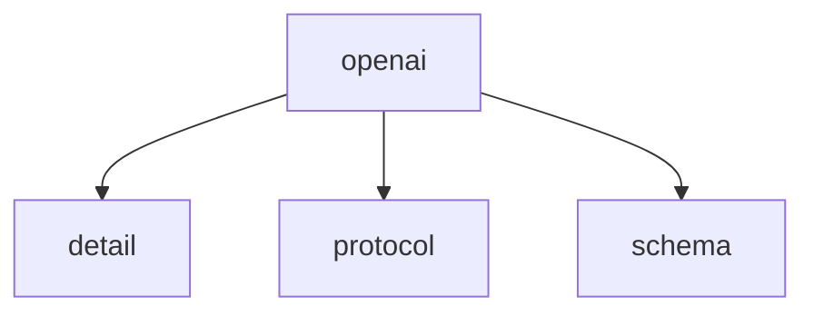

# Namespace `clore::net::openai`

## Summary

`clore::net::openai` 命名空间封装了与 `OpenAI` API 进行异步交互的核心接口。它提供了三个主要函数：`call_completion_async`、`call_llm_async` 和 `call_structured_async`，分别用于启动完成请求、通用语言模型调用和结构化输出请求。每个函数都接受一个 `kota::event_loop` 引用以驱动异步操作，并返回一个整数句柄供调用者跟踪或取消请求。这些函数是非阻塞的，调用者需确保事件循环在操作完成前保持有效。

在架构上，该命名空间位于 `clore::net` 网络层中，作为 `OpenAI` 服务的高层异步适配器。它隐藏了底层 HTTP 请求与 JSON 序列化的细节，并将结果通过事件循环的回调机制传递给应用层。通过模板参数 `T`，`call_structured_async` 支持将 API 返回的 JSON 自动反序列化为用户定义的类型，从而简化了与结构化数据的集成。

## Diagram

## Subnamespaces

- [`clore::net::openai::detail`](detail/index.md)
- [`clore::net::openai::protocol`](protocol/index.md)
- [`clore::net::openai::schema`](schema/index.md)

## Functions

### `clore::net::openai::call_completion_async`

Declaration: `network/openai.cppm:755`

Definition: `network/openai.cppm:782`

Implementation: [`Module openai`](../../../../modules/openai/index.md)

启动一个异步完成请求，接受一个整数标识符（模型或请求类别）以及一个对 `kota::event_loop` 的引用，并在该事件循环上调度操作。函数返回一个整数，代表挂起操作的句柄或状态标识符，调用者可使用该值跟踪请求的进度或结果。必须保证传入的 `kota::event_loop` 在操作完成前保持有效。

#### Usage Patterns

- 用于异步获取 `OpenAI` 补全结果
- 与事件循环集成以避免阻塞
- 通过错误处理机制应对 LLM 请求失败

### `clore::net::openai::call_llm_async`

Declaration: `network/openai.cppm:759`

Definition: `network/openai.cppm:789`

Implementation: [`Module openai`](../../../../modules/openai/index.md)

`clore::net::openai::call_llm_async` 启动一次对语言模型的异步调用。调用者需提供两个字符串视图（通常为模型标识与提示）、一个整数参数（例如最大令牌数或超时值）以及一个 `kota::event_loop` 引用，驱动异步操作。函数返回一个 `int`，代表该次调用的句柄，可用于后续查询结果或取消操作。此调用是非阻塞的，调用者负责在传入的事件循环上调度后续处理。

#### Usage Patterns

- 在需要异步执行 LLM 生成的地方调用，配合 `co_await`
- 与其他异步操作组合，如 `call_completion_async` 或 `call_structured_async`
- 用于事件循环驱动的高层 LLM 客户端

### `clore::net::openai::call_llm_async`

Declaration: `network/openai.cppm:765`

Definition: `network/openai.cppm:800`

Implementation: [`Module openai`](../../../../modules/openai/index.md)

`clore::net::openai::call_llm_async` 发起一次非阻塞的 LLM 请求。调用者提供三个 `std::string_view` 参数（分别代表模型标识符、用户输入和系统指令或上下文）以及一个 `kota::event_loop &`；该事件循环负责调度与此次异步操作关联的回调。函数返回一个 `int` 句柄，可用于跟踪或取消请求。调用者必须确保事件循环在操作完成前保持有效。

存在一个重载版本，以 `int` 参数替代第三个 `std::string_view`，可能用于指定不同的配置或通道。

#### Usage Patterns

- Primary async interface for LLM calls within the `clore::net::openai` namespace
- Called by code that requires non-blocking interaction with an LLM backend
- Wrapped or extended by higher-level functions such as `call_completion_async` and `call_structured_async`

### `clore::net::openai::call_structured_async`

Declaration: `network/openai.cppm:772`

Definition: `network/openai.cppm:812`

Implementation: [`Module openai`](../../../../modules/openai/index.md)

调用 `clore::net::openai::call_structured_async<T>` 发起一次异步调用，请求 `OpenAI` 模型返回一个结构化响应。函数接受三个 `std::string_view` 参数（通常依次为模型标识、系统提示和用户输入）以及一个 `kota::event_loop` 引用。它立即返回一个整数句柄，调用方可用此句柄跟踪或取消该请求。调用方负责驱动传入的事件循环以完成异步操作。模板参数 `T` 指定了期望的结构化输出类型，该类型必须支持从 `OpenAI` API 返回的 JSON 格式反序列化。

#### Usage Patterns

- `co_await clore::net::openai::call_structured_async<MyStruct>("gpt-4", "system", "prompt", loop)`
- 作为 `clore::net::openai::call_completion_async` 或 `call_llm_async` 的结构化版本，直接返回解析后的类型 `T`

## Related Pages

- [Namespace clore::net](../index.md)
- [Namespace clore::net::openai::detail](detail/index.md)
- [Namespace clore::net::openai::protocol](protocol/index.md)
- [Namespace clore::net::openai::schema](schema/index.md)

