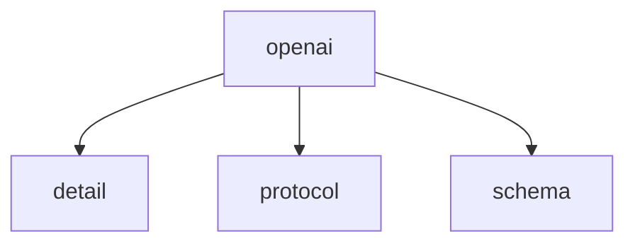

# Namespace `clore::net::openai`

## Summary

命名空间 `clore::net::openai` 封装了与 `OpenAI` 兼容的大语言模型（LLM）进行异步通信的核心能力。它对外暴露三个关键函数：`call_completion_async`、`call_llm_async` 和 `call_structured_async`，分别对应补全请求、通用 LLM 调用和结构化输出请求。所有函数均以非阻塞方式工作，通过接受 `kota::event_loop` 引用来调度异步事件，并在启动后立即返回一个非负整数句柄，用于后续的跟踪、取消或查询。参数设计覆盖了模型标识、用户提示、系统提示、最大生成令牌数以及输出格式描述等典型输入。

在架构上，`clore::net::openai` 位于网络抽象层，负责将高层业务逻辑与底层 HTTP/`WebSocket` 通信解耦。它假定调用方提供一个活跃的事件循环，并依赖其回调机制传递完成信号或错误码，从而避免阻塞调用线程。通过统一返回句柄的设计，该命名空间使得上层代码可以并发管理多个请求，而不必关注具体的网络 I/O 细节，是整个库中异步 LLM 交互的标准入口。

## Diagram

## Subnamespaces

- [`clore::net::openai::detail`](detail/index.md)
- [`clore::net::openai::protocol`](protocol/index.md)
- [`clore::net::openai::schema`](schema/index.md)

## Functions

### `clore::net::openai::call_completion_async`

Declaration: `network/openai.cppm:748`

Definition: `network/openai.cppm:775`

Implementation: [`Module openai`](../../../../modules/openai/index.md)

`clore::net::openai::call_completion_async` 启动一个异步的补全请求。它接受一个 `int` 类型的参数（该参数的含义取决于调用上下文，通常标识要完成的序列或请求）以及一个 `kota::event_loop &` 事件循环引用，异步操作将在该事件循环上调度。该函数返回一个 `int`，用于标记或跟踪已提交的异步操作，调用方可将此值用于后续的取消或结果查询。调用方需确保事件循环在异步操作完成前保持运行状态。

#### Usage Patterns

- called to initiate an async completion request to `OpenAI`
- used with an event loop for lightweight concurrency

### `clore::net::openai::call_llm_async`

Declaration: `network/openai.cppm:752`

Definition: `network/openai.cppm:782`

Implementation: [`Module openai`](../../../../modules/openai/index.md)

函数 `clore::net::openai::call_llm_async` 发起一次对 `OpenAI` 兼容大语言模型（LLM）的异步调用。调用者需要提供模型标识符、输入提示、一个整型参数（通常为最大生成令牌数）以及一个 `kota::event_loop` 引用用于调度异步事件。函数在启动请求后立即返回一个非负整数句柄，该句柄可用来查询或取消本次请求；若返回负值则表示发起失败。调用者不应假设请求完成的顺序，所有完成信号均通过传入的事件循环传递。

#### Usage Patterns

- Called by higher-level `OpenAI` API functions
- Used to perform LLM calls asynchronously in an event-driven context

### `clore::net::openai::call_llm_async`

Declaration: `network/openai.cppm:758`

Definition: `network/openai.cppm:793`

Implementation: [`Module openai`](../../../../modules/openai/index.md)

调用 `clore::net::openai::call_llm_async` 向 `OpenAI` 兼容的 LLM 发起一次异步请求。它接受三个 `std::string_view` 参数，通常分别代表模型标识、用户输入和可选的系统提示，以及一个 `kota::event_loop &` 引用，用于调度异步完成。该函数不会阻塞调用方线程，而是立即返回。

返回的 `int` 值标识此次请求，可用于后续跟踪或取消（例如通过 `call_completion_async`）。调用方必须保证传入的字符串视图在异步操作完成前保持有效，且事件循环必须处于运行状态，否则行为未定义。返回的错误码通过事件循环回调机制传递，不在函数返回值中体现。

#### Usage Patterns

- 使用异步协程进行 LLM 调用
- 与 `kota::event_loop` 集成

### `clore::net::openai::call_structured_async`

Declaration: `network/openai.cppm:765`

Definition: `network/openai.cppm:805`

Implementation: [`Module openai`](../../../../modules/openai/index.md)

发起一个对 `OpenAI` 结构化输出的异步调用。该函数接受三个字符串视图参数（通常对应系统提示、用户提示以及输出格式描述或 JSON Schema）和一个 `kota::event_loop` 引用，返回一个 `int` 表示异步操作的句柄或状态。调用方负责提供有效的提示文本、期望的结构化格式描述以及一个运行中的事件循环；返回值可用于后续查询或取消操作。

#### Usage Patterns

- 用于需要结构化响应的 `OpenAI` LLM 调用
- 与事件循环配合使用以支持异步等待

## Related Pages

- [Namespace clore::net](../index.md)
- [Namespace clore::net::openai::detail](detail/index.md)
- [Namespace clore::net::openai::protocol](protocol/index.md)
- [Namespace clore::net::openai::schema](schema/index.md)

