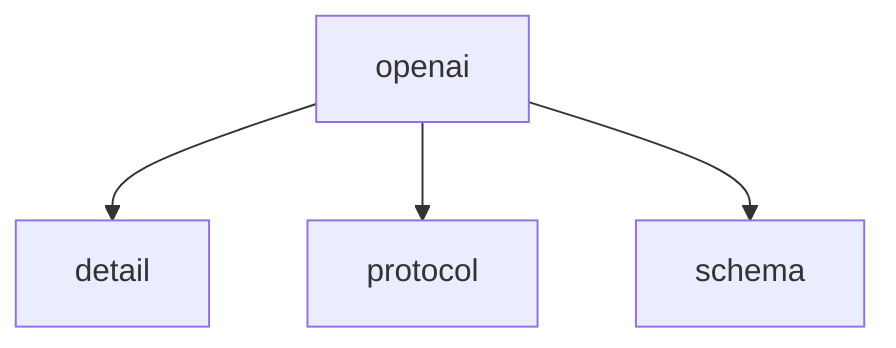

# Namespace `clore::net::openai`

## Summary

`clore::net::openai` 命名空间为与 `OpenAI` 兼容的语言模型交互提供异步调用接口。它封装了三种核心操作：`call_llm_async` 用于发送带有系统提示和用户提示的对话请求，`call_structured_async` 用于请求结构化数据输出，`call_completion_async` 用于传统的文本补全。所有函数均接受 `kota::event_loop` 引用以驱动异步任务，并返回整数句柄供调用方跟踪或取消操作。

该命名空间承担网络层与业务逻辑之间的桥梁角色，通过统一的异步模式隔离了 `OpenAI` REST API 的底层细节。它要求调用者负责字符串视图的生命周期和事件循环的有效性，从而在不阻塞线程的前提下利用 `OpenAI` 模型能力。

## Diagram

```mermaid
graph TD
    NS["openai"]
    NSC0["detail"]
    NS --> NSC0
    NSC1["protocol"]
    NS --> NSC1
    NSC2["schema"]
    NS --> NSC2
```

## Subnamespaces

- [`clore::net::openai::detail`](detail/index.md)
- [`clore::net::openai::protocol`](protocol/index.md)
- [`clore::net::openai::schema`](schema/index.md)

## Functions

### `clore::net::openai::call_completion_async`

Declaration: `src/network/openai.cppm:765`

Definition: `src/network/openai.cppm:792`

Implementation: [`Module openai`](../../../../modules/openai/index.md)

调用 `clore::net::openai::call_completion_async` 以发起一个异步的 `OpenAI` 文本补全请求。该函数接受一个 `int` 参数（通常表示会话或上下文标识符）和一个 `kota::event_loop &` 引用（事件循环，负责驱动异步操作的完成），并返回一个 `int` 作为此操作的唯一标识符。调用者必须确保所提供的事件循环处于运行状态，以便异步操作能够正常调度并最终触发完成回调。

#### Usage Patterns

- Used to perform an `OpenAI` completion call asynchronously
- Wraps the generic completion function with the `OpenAI` protocol

### `clore::net::openai::call_llm_async`

Declaration: `src/network/openai.cppm:769`

Definition: `src/network/openai.cppm:799`

Implementation: [`Module openai`](../../../../modules/openai/index.md)

该函数发起一个对 `OpenAI` 兼容 LLM 的异步调用，并在给定事件循环上调度回调。调用者提供两个字符串视图（分别表示模型标识符和输入提示）、一个整数参数（通常用于控制生成选项，例如最大 token 数或温度参数）以及一个 `kota::event_loop` 引用。函数返回一个 `int`，作为本次异步操作的唯一句柄，可用于后续查询状态或取消操作。调用者负责维护事件循环的活动状态，直到回调被触发或操作完成。

#### Usage Patterns

- Awaited in coroutine contexts to obtain LLM response strings
- Used with `kota::event_loop` to perform non-blocking LLM calls

### `clore::net::openai::call_llm_async`

Declaration: `src/network/openai.cppm:775`

Definition: `src/network/openai.cppm:810`

Implementation: [`Module openai`](../../../../modules/openai/index.md)

`clore::net::openai::call_llm_async` 发起一次对 `OpenAI` 兼容语言模型的异步调用。调用者必须提供三个字符串视图参数——分别对应模型标识符、系统提示和用户提示——以及一个 `kota::event_loop` 引用，用于管理异步任务的生命周期。函数返回一个整数值；该值表示请求的标识符或操作结果状态，可用于后续跟踪或错误处理。调用者有责任确保传入的 `event_loop` 在异步操作完成前保持有效。

#### Usage Patterns

- called with `co_await` in a coroutine context
- standard pattern for streaming or single‑turn LLM completions
- often combined with error handling via the returned `task`

### `clore::net::openai::call_structured_async`

Declaration: `src/network/openai.cppm:782`

Definition: `src/network/openai.cppm:822`

Implementation: [`Module openai`](../../../../modules/openai/index.md)

调用 `clore::net::openai::call_structured_async` 函数，调用方可以异步向 `OpenAI` 聊天接口发送一条结构化请求，并期望返回一个整数句柄以跟踪操作完成状态。该函数是一个模板，由调用方通过模板参数 `T` 指定期望返回的结构化数据类型。它接受三个 `std::string_view` 参数（通常分别对应系统角色消息、用户角色消息和一组结构化描述指令）以及一个 `kota::event_loop &` 循环引用。调用方负责确保提供的字符串视图在异步操作期间保持有效，并且事件循环处于运行状态；返回的整数句柄可用于后续检查或取消该请求。

#### Usage Patterns

- Used to call `OpenAI` structured output `APIs` asynchronously
- Instantiated with different types for typed responses

## Related Pages

- [Namespace clore::net](../index.md)
- [Namespace clore::net::openai::detail](detail/index.md)
- [Namespace clore::net::openai::protocol](protocol/index.md)
- [Namespace clore::net::openai::schema](schema/index.md)

