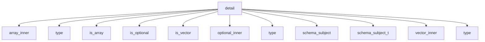

# Namespace `clore::net::openai::schema::detail`

## Summary

命名空间 `clore::net::openai::schema::detail` 是 `OpenAI` JSON Schema 生成与验证的底层实现细节。它提供了一组编译期类型特征（如 `is_optional`、`is_vector`、`is_array` 及其对应的 `_v` 变量和 `_inner` 元函数），用于解包标准容器（`std::optional`、`std::vector`、`std::array`）并提取其内部元素类型，再通过 `schema_subject` 及其别名 `schema_subject_t` 归纳出模式描述的核心目标类型。同时，该命名空间封装了运行时 schema 构建与验证的所有内部函数，包括验证 JSON 值或对象是否符合 `OpenAI` 约定的 `validate_openai_schema_value`、`validate_openai_schema` 以及 `validate_required_properties` 等，以及生成标量或组合 schema 的 `make_scalar_type_schema`、`make_schema_object`、`make_any_of_schema` 等，并辅以 `sanitize_schema_name` 等实用工具。

在架构上，`detail` 层隐藏了类型到模式映射的递归推导逻辑以及 JSON 结构与 C++ 类型之间的校验细节，为上层公共接口（如 `clore::net::openai::schema`）提供稳定的内部支持。任何需要理解或扩展 schema 自动转化过程的调用方都应参考此命名空间中的类型特征与函数，但它们并不直接暴露给最终用户，从而保持公共 API 的简洁性。

## Diagram

## Types

### `clore::net::openai::schema::detail::array_inner`

Declaration: `network/schema.cppm:72`

Implementation: [`Module schema`](../../../../../../modules/schema/index.md)

结构体 `clore::net::openai::schema::detail::array_inner` 是一个模板类型萃取工具，用于提取定长数组（如 `std::array`）的内部元素类型。它定义了一个 `type` 别名成员，将数组类型映射为其元素类型。该结构体与 `vector_inner`、`optional_inner` 等同属于 `detail` 命名空间下的 schema 类型解析工具集，是自动为数组类型生成 JSON Schema 描述的内部实现的一部分。通过特化，`array_inner` 可从 `std::array<T, N>` 中萃取出元素类型 `T`，便于后续的 schema 推导和序列化处理。

#### Invariants

- 类型 `T` 无约束

#### Key Members

- 模板参数 `T`

#### Usage Patterns

- 可能用于类型映射或元编程中的标签
- 作为 `detail` 命名空间下的实现细节

### `clore::net::openai::schema::detail::is_array`

Declaration: `network/schema.cppm:63`

Definition: `network/schema.cppm:63`

Implementation: [`Module schema`](../../../../../../modules/schema/index.md)

`clore::net::openai::schema::detail::is_array` 是一个模板结构体，用于在编译时判断给定类型 `T` 是否为数组形式。它被用作类型特征，辅助 schema 的推导过程，帮助确定是否应将某个 C++ 类型映射为 JSON Schema 的数组类型。该结构体位于实现细节命名空间，通常与 `is_vector`、`is_optional` 等其他类型特征配合使用，以区分不同的容器或序列化类别。

#### Invariants

- 默认 `value` 为 `false`
- 可通过模板特化为数组类型提供 `value` 为 `true`

#### Key Members

- 继承自 `std::false_type` 的静态常量 `value`

#### Usage Patterns

- 作为编译期类型判断的基础特征
- 可供其他模板通过特化来针对数组类型启用特定行为

### `clore::net::openai::schema::detail::is_optional`

Declaration: `network/schema.cppm:23`

Definition: `network/schema.cppm:23`

Implementation: [`Module schema`](../../../../../../modules/schema/index.md)

`clore::net::openai::schema::detail::is_optional` 是一个模板类型特征，用于在编译时判断给定的类型 `T` 是否为 `std::optional` 的特化。它属于 `clore::net::openai::schema` 命名空间的内部实现细节，与 `is_vector`、`is_array` 等特征协同工作，共同构成值类型分类体系。

该特征通常被其他元函数或调度机制引用，例如在 `optional_inner` 或 `schema_subject` 等设施中，用于根据类型是否为 optional 来决定处理路径。通过继承自 `std::true_type` 或 `std::false_type`，它提供编译期布尔常量，从而在模板特化或 `if constexpr` 分支中简化类型分派逻辑。

#### Invariants

- Default value is `false`
- Inherits from `std::false_type`
- Value is constant at compile time

#### Key Members

- `value` (inherited from `std::false_type`)

#### Usage Patterns

- Used in template metaprogramming to conditionally enable code
- Specialized for types that are optional wrappers

### `clore::net::openai::schema::detail::is_vector`

Declaration: `network/schema.cppm:43`

Definition: `network/schema.cppm:43`

Implementation: [`Module schema`](../../../../../../modules/schema/index.md)

Insufficient evidence to summarize; provide more EVIDENCE.

#### Invariants

- `value` 恒为 `false`，除非通过特化覆盖
- 所有实例化共享相同的 `false_type` 接口

#### Key Members

- 继承的 `std::false_type::value` 常量

#### Usage Patterns

- 作为基类用于定义向量类型的特征特化
- 在模板元编程中用作编译时布尔判定

### `clore::net::openai::schema::detail::optional_inner`

Declaration: `network/schema.cppm:32`

Implementation: [`Module schema`](../../../../../../modules/schema/index.md)

模板结构体 `clore::net::openai::schema::detail::optional_inner<T>` 是一个内部元函数，用于提取 `std::optional<T>` 模板参数的内部值类型。它在类型萃取体系中与 `array_inner`、`vector_inner` 等结构体协同工作，从标准容器或包装类型中解构出元素类型，供上层的 `schema_subject` 等类型特征使用。通过 `::type` 别名公开萃取结果，帮助将 C++ 类型映射到对应的 JSON Schema 表示。

### `clore::net::openai::schema::detail::schema_subject`

Declaration: `network/schema.cppm:83`

Definition: `network/schema.cppm:83`

Implementation: [`Module schema`](../../../../../../modules/schema/index.md)

`clore::net::openai::schema::detail::schema_subject` 是一个模板结构体，用于在 `OpenAPI` 模式生成过程中标识给定类型 `T` 所对应的“主题”类型。它通过特化机制配合 `is_vector`、`is_optional`、`is_array` 等类型特征，提取容器（如 `std::vector`、`std::optional`、`std::array`）的内部元素类型，从而归纳出模式描述的核心目标类型。

该结构体通常在类型萃取链的底层使用，其推导结果通过别名 `schema_subject_t` 向外暴露。编译器会依据 `T` 的具体形式选择对应的特化版本，若无匹配则默认将 `T` 自身作为主题。这使得上层代码能够统一处理原始类型与嵌套容器，简化递归模式构建逻辑。

#### Invariants

- `type` 始终为 `T` 去除顶层 cv 和引用后的结果。
- 不存在运行时状态或可变成员。

#### Key Members

- 成员别名 `type`

#### Usage Patterns

- 作为类型萃取工具，用于获取实参的底层类型。
- 可能用于 SFINAE 上下文中约束模板参数。

### `clore::net::openai::schema::detail::schema_subject_t`

Declaration: `network/schema.cppm:95`

Implementation: [`Module schema`](../../../../../../modules/schema/index.md)

`clore::net::openai::schema::detail::schema_subject_t<T>` 是一个模板类型别名，它作为 `schema_subject<T>::type` 的简写形式，用于提取给定类型 `T` 的“主题”或内部元素类型。该别名通常与一组相关类型 trait（如 `is_optional`、`is_vector`、`is_array` 以及对应的 `optional_inner`、`vector_inner`、`array_inner`）协同工作，以处理经过标准容器或可选包装的类型。在 `OpenAPI` schema 的生成过程中，通过 `schema_subject_t` 可以统一地获取实际需要描述的基础数据类型，从而简化对不同包装层次类型的处理逻辑。

### `clore::net::openai::schema::detail::vector_inner`

Declaration: `network/schema.cppm:52`

Implementation: [`Module schema`](../../../../../../modules/schema/index.md)

`clore::net::openai::schema::detail::vector_inner` 是一个模板元函数，用于提取 `std::vector` 容器所含元素的类型。它通过公开 `type` 别名，将 `std::vector<T>` 中的 `T` 暴露为最终类型，从而支持在编译期根据容器类型推导其元素类型。该结构体通常在模式推断链中配合其他 traits（如 `optional_inner`、`array_inner` 等）使用，以便递归地解析复合类型的 JSON Schema 表示。

## Variables

### `clore::net::openai::schema::detail::is_array_v`

Declaration: `network/schema.cppm:69`

Implementation: [`Module schema`](../../../../../../modules/schema/index.md)

The template variable `clore::net::openai::schema::detail::is_array_v` is a compile-time constant defined as `constexpr bool`. It is a type trait that indicates whether a given type `T` is an array.

#### Usage Patterns

- Compile-time type detection
- Conditional template instantiation (inferred)

### `clore::net::openai::schema::detail::is_optional_v`

Declaration: `network/schema.cppm:29`

Implementation: [`Module schema`](../../../../../../modules/schema/index.md)

A compile-time constant template variable that indicates whether a given type `T` is an optional type (e.g., `std::optional`). It is defined as `constexpr bool` in the `clore::net::openai::schema::detail` namespace.

### `clore::net::openai::schema::detail::is_vector_v`

Declaration: `network/schema.cppm:49`

Implementation: [`Module schema`](../../../../../../modules/schema/index.md)

`clore::net::openai::schema::detail::is_vector_v` is a constexpr `bool` template variable that evaluates to `true` if the type `T` is a vector type, otherwise `false`. It is declared in `network/schema.cppm` and serves as a compile-time type trait.

#### Usage Patterns

- template metaprogramming
- type trait checks
- compile-time branching

## Functions

### `clore::net::openai::schema::detail::make_any_of_schema`

Declaration: `network/schema.cppm:156`

Definition: `network/schema.cppm:156`

Implementation: [`Module schema`](../../../../../../modules/schema/index.md)

`clore::net::openai::schema::detail::make_any_of_schema` 是一个模板函数，用于生成表示 `anyOf` 组合的 schema 节点。调用者传入一个整数参数（通常指示子模式的索引或数量），函数返回一个代表生成 schema 的整数标识符。该函数是 schema 构建工具链的内部组件，供其他 schema 生成函数在需要表达多类型可选匹配时使用。调用者应保证传入的参数在上下文中有效，并妥善处理返回的标识符以参与后续 schema 组装。

#### Usage Patterns

- building an `anyOf` schema from a list of choices

### `clore::net::openai::schema::detail::make_scalar_type_schema`

Declaration: `network/schema.cppm:146`

Definition: `network/schema.cppm:146`

Implementation: [`Module schema`](../../../../../../modules/schema/index.md)

给定一个类型名称字符串，函数 `clore::net::openai::schema::detail::make_scalar_type_schema` 生成并返回一个表示该标量类型的模式标识符。输入 `std::string_view` 应为一个合法的标量类型名称（如 `"string"`、`"number"` 或 `"boolean"`）。返回值 `int` 指示操作结果：0 通常表示成功，非零值表示错误的类型名称或处理失败。调用者应确保传入的名称在支持的标量类型范围内。

#### Usage Patterns

- Used to generate JSON schema for scalar types
- Called by other schema construction functions like `make_schema_value`

### `clore::net::openai::schema::detail::make_schema_object`

Declaration: `network/schema.cppm:132`

Definition: `network/schema.cppm:132`

Implementation: [`Module schema`](../../../../../../modules/schema/index.md)

`clore::net::openai::schema::detail::make_schema_object` 是一个模板函数，负责为给定类型 `T` 生成对应的 `OpenAI` JSON Schema 对象，并以一个整型标识符返回。该标识符可以被其他 schema 构造函数（如 `populate_object_schema`）使用，以进一步填充或处理生成的 schema。

调用者应当确保 `T` 满足 schema 生成的必要条件（例如，类型具有合适的结构或序列化支持）。函数返回的 `int` 值在 schema 构建流水线内部有效，不应直接用于其他上下文；调用者应将其视为不透明的句柄，并仅传递给预期的 schema 构造或验证函数。

#### Usage Patterns

- generates `OpenAPI` schema object for type `T`
- used in schema serialization

### `clore::net::openai::schema::detail::make_schema_value`

Declaration: `network/schema.cppm:129`

Definition: `network/schema.cppm:225`

Implementation: [`Module schema`](../../../../../../modules/schema/index.md)

函数 `clore::net::openai::schema::detail::make_schema_value` 是一个模板函数，接受类型参数 `T`，并返回一个 `int` 值。它负责生成与类型 `T` 对应的模式值（schema value），作为 `OpenAI` 模式构建流程中的一部分。调用者应当将返回的整数视为一个标识符或状态码，用于后续的模式处理步骤；具体的语义和约定由实现定义。函数位于内部实现命名空间 `detail` 中，通常由更高层的模式构建函数间接使用，而非直接暴露给最终用户。

#### Usage Patterns

- Generate JSON schema value for C++ types
- Recursively called for nested types
- Used within schema generation pipeline

### `clore::net::openai::schema::detail::populate_object_schema`

Declaration: `network/schema.cppm:173`

Definition: `network/schema.cppm:173`

Implementation: [`Module schema`](../../../../../../modules/schema/index.md)

该函数负责填充一个表示 `OpenAI` 对象模式的 JSON 对象。调用方需提供一个可修改的 `json::Object` 引用以及一个整数实参（通常表示索引或状态标记）；函数将根据模板参数 `Object` 和 `Indices` 展开的结果改写该对象。返回值指示操作是否成功或反映处理中的错误条件，通常用于在模式构建链中传递状态。该函数是内部模式填充流程的一部分，旨在处理泛型对象类型的模式表示。

#### Usage Patterns

- 在 `OpenAI` schema 生成管线的内部调用
- 通常由 `make_object_schema` 等高级函数调用

### `clore::net::openai::schema::detail::sanitize_schema_name`

Declaration: `network/schema.cppm:97`

Definition: `network/schema.cppm:97`

Implementation: [`Module schema`](../../../../../../modules/schema/index.md)

该函数负责清理传入的模式名称字符串，使其符合 `OpenAI` schema 的命名约定。调用者提供一个原始名称作为 `std::string_view`，函数返回一个 `std::string`，其中任何非法或不符合规范的字符都会被替换或移除，从而生成一个安全、有效的 schema 标识符。

#### Usage Patterns

- 清理 `OpenAI` schema 的名称

### `clore::net::openai::schema::detail::schema_type_name`

Declaration: `network/schema.cppm:120`

Definition: `network/schema.cppm:120`

Implementation: [`Module schema`](../../../../../../modules/schema/index.md)

函数 `clore::net::openai::schema::detail::schema_type_name` 是一个公开的模板函数，接受一个模板参数 `T`，返回 `int`。调用方应使用此函数获取类型 `T` 在 `OpenAI` schema 内部表示中的整数标识符。该标识符通常用于后续 schema 构建或验证过程中的类型匹配与分发。契约要求返回值是一个非负整数，代表特定类型的唯一编号；具体含义由同命名空间下的其他函数（如 `make_scalar_type_schema` 或 `validate_openai_schema_value`）解释。此函数自身不修改状态，不抛出异常，且对于相同类型 `T` 在程序同一生命周期内一致返回相同的值。

#### Usage Patterns

- called during schema generation to derive a schema name for a C++ type
- used by `make_schema_object` and similar functions

### `clore::net::openai::schema::detail::validate_openai_schema`

Declaration: `network/schema.cppm:328`

Definition: `network/schema.cppm:373`

Implementation: [`Module schema`](../../../../../../modules/schema/index.md)

该函数负责验证传入的 JSON 对象是否符合 `OpenAI` 模式规范。调用者应提供待验证的模式对象（类型为 `const json::Object &`），一个描述该模式上下文或路径的字符串视图 `std::string_view`，以及一个布尔标志 `bool` 用于控制验证的严格程度。函数返回一个 `int`，通常约定返回零表示验证通过，非零值表示验证失败或错误代码。调用者需确保传入的对象结构有效，并且字符串视图与模式身份一致。

#### Usage Patterns

- Validating root schema objects from `OpenAI` API requests
- Validating nested schema definitions in tool-calling configurations
- Called during schema registration or preprocessing to ensure compliance

### `clore::net::openai::schema::detail::validate_openai_schema_value`

Declaration: `network/schema.cppm:331`

Definition: `network/schema.cppm:331`

Implementation: [`Module schema`](../../../../../../modules/schema/index.md)

The function `clore::net::openai::schema::detail::validate_openai_schema_value` validates a single JSON value against the expected structure for an `OpenAI` schema. Two overloads are provided: one accepts a `const json::Value &` directly, and the other accepts a `json::Cursor` to support both direct and cursor‑based inspection.

The caller supplies a `std::string_view` that typically describes the schema path or context for error reporting, and a `bool` flag that often indicates whether strict or lenient validation is required. The function returns an `int`; a value of `0` signals that the value conforms, while any non‑zero value indicates a specific validation failure according to the module’s internal error conventions. Callers must check this return code and interpret it accordingly.

#### Usage Patterns

- Used to validate a JSON value that is expected to be an `OpenAI` schema object
- Called by higher-level schema validation logic

### `clore::net::openai::schema::detail::validate_openai_schema_value`

Declaration: `network/schema.cppm:340`

Definition: `network/schema.cppm:340`

Implementation: [`Module schema`](../../../../../../modules/schema/index.md)

函数 `clore::net::openai::schema::detail::validate_openai_schema_value` 验证给定的 JSON 游标（或 JSON 值）所引用的值是否满足预期的 `OpenAI` schema 约定规范。调用者必须提供有效的 `json::Cursor`（或 `const json::Value &`）、一个描述当前验证上下文位置的 `std::string_view`（如路径或标识符）以及一个 `bool` 参数，该参数指示是否启用严格验证模式。该函数返回一个 `int` 状态码，其中零表示验证成功，非零值表示验证失败或发现不一致。调用者应当检查该返回值以决定下一步操作，例如继续处理或报告错误。

#### Usage Patterns

- Wrapping a JSON cursor into object validation
- Entry point for validating schema values from external JSON sources

### `clore::net::openai::schema::detail::validate_required_properties`

Declaration: `network/schema.cppm:349`

Definition: `network/schema.cppm:349`

Implementation: [`Module schema`](../../../../../../modules/schema/index.md)

函数 `clore::net::openai::schema::detail::validate_required_properties` 在 `int`、`int` 和 `std::string_view` 参数下执行必需属性的验证逻辑。它负责检查给定模式对象中声明的必需属性集合是否完整且有效，返回 `int` 类型的状态码以指示验证通过或具体的错误类型。调用者需确保传递的模式标识索引、属性计数以及模式名称参数反映待验证的架构定义，该函数不修改输入状态，仅返回验证结果。

#### Usage Patterns

- Called during schema validation when `strict` mode is enabled
- Used to ensure all object properties are explicitly required

### `clore::net::openai::schema::detail::validate_schema_array_of_types`

Declaration: `network/schema.cppm:295`

Definition: `network/schema.cppm:295`

Implementation: [`Module schema`](../../../../../../modules/schema/index.md)

该函数 `clore::net::openai::schema::detail::validate_schema_array_of_types` 验证一个 JSON 数组是否为合法的 `OpenAI` 模式类型数组。调用者需传入一个 `json::Array` 对象、一个描述当前路径的 `std::string_view` 以及一个 `bool` 标志用于指示是否启用严格检查。返回值为 `int`：零表示验证通过，非零值代表失败的具体错误码。调用者应确保输入数组符合类型规范，否则函数将返回错误信息并通过提供的路径辅助定位。

#### Usage Patterns

- used in schema validation pipelines
- called when processing `type` arrays in `OpenAI` schema objects

## Related Pages

- [Namespace clore::net::openai::schema](../index.md)

