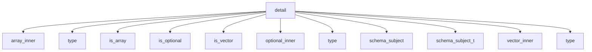

# Namespace `clore::net::openai::schema::detail`

## Summary

该命名空间是 `clore::net::openai::schema` 库的内部实现细节层，封装了 `OpenAI` 模式生成与验证所需的底层支持。它提供了一系列类型萃取工具（如 `is_array`、`is_vector`、`is_optional` 及其对应的内嵌类型提取器）来在编译期识别标准容器和可选类型，以便递归地提取出需要生成 schema 的底层元素类型；同时，它还包含了用于校验 JSON 对象、数组和值的验证函数（如 `validate_openai_schema`、`validate_openai_schema_value`、`validate_schema_array_of_types`），以及用于构建 schema 对象的辅助函数（如 `make_schema_object`、`make_any_of_schema`、`populate_object_schema`、`sanitize_schema_name` 等）。这些函数和类型特征协同工作，构成了 schema 生成管道的核心处理单元，支持从 C++ 类型到符合 `OpenAI` 规范的 JSON 模式描述的自动推导、构造与合规性检查。

在架构上，该命名空间扮演了“基础设施”角色，它不直接暴露给外部调用者，而是被高层 API 所依赖。内部的结构体、别名和函数通过模板元编程实现编译期决策和运行时构造的解耦，其返回值（通常为整数状态码）和参数约定（如使用 `std::string_view` 表示路径或名称）在实现层面统一了验证与构建的接口风格。任何需要根据 C++ 类型生成或验证 `OpenAI` 模式的操作，最终都会路由到此命名空间中的相应组件完成，从而保证了模式定义的一致性和可维护性。

## Diagram

## Types

### `clore::net::openai::schema::detail::array_inner`

Declaration: `network/schema.cppm:72`

Implementation: [`Module schema`](../../../../../../modules/schema/index.md)

`clore::net::openai::schema::detail::array_inner` 是一个模板元函数（trait），用于提取 `std::array` 容器中存储的元素类型。其 `type` 成员别名表示数组的元素类型，例如 `array_inner<std::array<int, 5>>::type` 为 `int`。此结构体是 `OpenAI` schema 实现内部的类型萃取工具，与 `vector_inner`、`optional_inner` 等协同工作，在 schema 推导和生成流程中统一获取不同容器（如 `std::vector`、`std::optional`）的内部元素类型。

### `clore::net::openai::schema::detail::is_array`

Declaration: `network/schema.cppm:63`

Definition: `network/schema.cppm:63`

Implementation: [`Module schema`](../../../../../../modules/schema/index.md)

`clore::net::openai::schema::detail::is_array` 是一个模板结构体，用于在编译时判断给定类型 `T` 是否为数组类型（例如 `std::array`）。它属于该库内部 schema 生成流程的类型特征工具集，与 `is_vector`、`is_optional` 等一同用于区分不同的容器形态，从而正确抽取元素类型并生成对应的 JSON schema 描述。该特征通常通过特化或继承机制实现，并常与 `array_inner` 等内嵌类型别名配合使用，以获取数组元素的具体类型。

#### Invariants

- 对于任意类型 `T`，`is_array<T>::value` 恒为 `false`（基础模板）
- 无其他约束或保证

#### Key Members

- 继承的静态成员 `value`（类型 `bool`，值为 `false`）

#### Usage Patterns

- 作为编译时谓词用于类型检查或 SFINAE 上下文
- 可被特化以区分数组类型与非数组类型
- 其他特征或代码依赖其 `value` 进行条件编译

### `clore::net::openai::schema::detail::is_optional`

Declaration: `network/schema.cppm:23`

Definition: `network/schema.cppm:23`

Implementation: [`Module schema`](../../../../../../modules/schema/index.md)

`clore::net::openai::schema::detail::is_optional` 是一个模板元函数（traits），用于在编译期判断给定的模板类型参数 `T` 是否为 `std::optional` 的特化。它通常与 `is_array`、`is_vector` 等类型特征一同被定义，服务于 `OpenAI` Schema 库的序列化与类型反射机制。当需要对类型进行条件化处理（例如展开 optional 容器或提取其内部值类型）时，`is_optional` 会返回一个编译期布尔常量，从而让其他元编程组件（如 `optional_inner` 或 `schema_subject`）能够据此选择正确的类型转换路径。

#### Invariants

- 对于任意未特化的类型 `T`，`is_optional<T>::value` 恒为 `false`。
- 主模板不提供任何自定义成员或嵌套类型，仅继承 `std::false_type` 的接口。

#### Key Members

- 继承自 `std::false_type` 的静态常量 `value`
- 继承自 `std::false_type` 的 `value_type` 和 `type` 别名

#### Usage Patterns

- 在其他模板元编程中用作类型约束或条件分支的基础，例如 `if constexpr (is_optional<T>::value)`。
- 可作为特化模板（如针对 `std::optional`、`std::unique_ptr` 等）的基类，通过启用模板特化来标记特定类型为 optional。

### `clore::net::openai::schema::detail::is_vector`

Declaration: `network/schema.cppm:43`

Definition: `network/schema.cppm:43`

Implementation: [`Module schema`](../../../../../../modules/schema/index.md)

`clore::net::openai::schema::detail::is_vector` 是一个模板元编程工具，用于在编译时判断给定类型 `T` 是否为 `std::vector` 的实例化。它属于 `detail` 命名空间下的内部实现，与 `vector_inner`、`is_array` 等类型 trait 协同工作，共同支撑 `OpenAI` schema 生成过程中对容器类型的静态识别和特性提取。通过 `is_vector`，代码可以在编译期分支处理向量类型与其他序列类型，从而实现正确的 schema 结构描述。

#### Invariants

- For any unspecialized type `T`, `is_vector<T>::value` is `false`.
- Specializations for `std::vector` (or user-defined vector types) override `value` to `true`.
- The trait is intended for use in compile-time type introspection and SFINAE contexts.

#### Key Members

- Inherited `value` (static constexpr bool) from `std::false_type`.
- Inherited `type` (typedef for `std::false_type`) from `std::false_type`.

#### Usage Patterns

- Used as a base for type-disambiguation via partial or full specialization (e.g., `template<typename T> struct is_vector<std::vector<T>> : std::true_type {}`).
- Leveraged in conditionals like `if constexpr` or `std::enable_if` to activate code paths only for vector types.
- Expected to be queried by other traits or template metafunctions within the `clore::net::openai::schema` namespace.

### `clore::net::openai::schema::detail::optional_inner`

Declaration: `network/schema.cppm:32`

Implementation: [`Module schema`](../../../../../../modules/schema/index.md)

`clore::net::openai::schema::detail::optional_inner` 是一个辅助类型萃取模板，用于从 `std::optional` 中提取其包裹的值类型。当模板参数 `T` 为 `std::optional<U>` 时，其 `::type` 成员被定义为 `U`。该结构体常与 `is_optional` 等类型特征联合使用，在编译期判断并解析可选类型的内容，从而为 `OpenAI` API 的 JSON Schema 自动生成提供底层类型信息。

### `clore::net::openai::schema::detail::schema_subject`

Declaration: `network/schema.cppm:83`

Definition: `network/schema.cppm:83`

Implementation: [`Module schema`](../../../../../../modules/schema/index.md)

该结构体是 `OpenAPI` Schema 生成实现细节的一部分，用于为给定类型 `T` 确定其 Schema 描述的“主题”类型。它通常通过模板特化来处理容器（如 `std::vector`、`std::optional`、`std::array`）或简单类型，从这些类型中提取出需要为其生成 Schema 的内部元素类型，而非直接使用容器本身。该结构体不对外开放，而是通过别名 `schema_subject_t` 间接使用，以简化后续特征和转换代码的编写。

#### Invariants

- `type` is always `std::remove_cvref_t<T>`
- The struct has no runtime state or behavior
- The alias is valid for any complete type `T`

#### Key Members

- `using type = std::remove_cvref_t<T>`

#### Usage Patterns

- Used by other schema classes to normalize type arguments
- May be instantiated as a base class or nested type for type erasure
- Provides a consistent way to obtain a canonical type from `T`

### `clore::net::openai::schema::detail::schema_subject_t`

Declaration: `network/schema.cppm:95`

Implementation: [`Module schema`](../../../../../../modules/schema/index.md)

类型别名 `schema_subject_t` 是一个模板别名，用于递归地剥离给定类型 `T` 外层的标准库容器包装（如 `std::vector`、`std::optional`、`std::array`），以提取最终的基础“主题”类型。它位于 `detail` 命名空间内，是 `OpenAI` schema 生成机制的内部实现细节，供诸如 `schema_subject` 等元函数使用，以确定需要为其生成 JSON schema 的原始数据类型。

#### Invariants

- 必须存在 `schema_subject<T>::type` 定义
- 别名的解析结果由 `schema_subject` 特化决定
- 不保证对所有 `T` 均有效

#### Key Members

- `schema_subject<T>::type` 成员类型

#### Usage Patterns

- 作为便捷名称替代冗长的 `typename schema_subject<T>::type`
- 在模板元编程中统一对外暴露类型

### `clore::net::openai::schema::detail::vector_inner`

Declaration: `network/schema.cppm:52`

Implementation: [`Module schema`](../../../../../../modules/schema/index.md)

模板结构体 `clore::net::openai::schema::detail::vector_inner` 是一个类型萃取工具，用于从 `std::vector` 中提取其元素类型。其公开的 `type` 别名成员给出了向量中存储的元素类型。该结构体与 `clore::net::openai::schema::detail::optional_inner` 和 `clore::net::openai::schema::detail::array_inner` 等类似特质协同工作，作为 `OpenAPI` 模式生成机制的一部分，统一处理标准容器类型的内部元素推导。

#### Invariants

- 未从证据中提取到明确的不变性

#### Key Members

- 无已知的成员、嵌套类型或方法

#### Usage Patterns

- 未从证据中提取到使用模式

## Variables

### `clore::net::openai::schema::detail::is_array_v`

Declaration: `network/schema.cppm:69`

Implementation: [`Module schema`](../../../../../../modules/schema/index.md)

Template variable `clore::net::openai::schema::detail::is_array_v` is a `constexpr bool` constant that indicates whether a given type `T` is an array type.

### `clore::net::openai::schema::detail::is_optional_v`

Declaration: `network/schema.cppm:29`

Implementation: [`Module schema`](../../../../../../modules/schema/index.md)

A `constexpr bool` template variable that resolves to `true` when the type `T` is an optional type, as determined by the schema detail traits.

### `clore::net::openai::schema::detail::is_vector_v`

Declaration: `network/schema.cppm:49`

Implementation: [`Module schema`](../../../../../../modules/schema/index.md)

类型 `clore::net::openai::schema::detail::is_vector_v` 是一个 `constexpr` 布尔模板变量，用于在编译时判断模板参数 `T` 是否为 `std::vector` 类型。

#### Usage Patterns

- 作为编译时布尔常量用于判断类型是否为 `std::vector`
- 参与模板特化或条件编译中的类型筛选

## Functions

### `clore::net::openai::schema::detail::make_any_of_schema`

Declaration: `network/schema.cppm:156`

Definition: `network/schema.cppm:156`

Implementation: [`Module schema`](../../../../../../modules/schema/index.md)

函数 `clore::net::openai::schema::detail::make_any_of_schema` 是一个模板函数，负责构造表示 `OpenAI` 模式中 `anyOf` 约束的 JSON 模式片段。调用方必须提供模板参数 `T`，该参数应满足特定内省要求（如具有成员或类型特征），函数根据该类型生成对应的 `anyOf` 模式定义。函数返回一个整数，用于指示操作结果或状态，但具体含义未在公开接口中明确；调用方应检查该返回值以判断模式构建是否成功。此函数是模式生成管道的一部分，通常在需要为联合类型或备选类型生成模式时由上层函数（如 `make_schema_value` 或 `populate_object_schema`）间接调用。

#### Usage Patterns

- Used to assemble an `anyOf` schema from a list of sub-schemas
- Called when generating `OpenAI`-compatible schema representations

### `clore::net::openai::schema::detail::make_scalar_type_schema`

Declaration: `network/schema.cppm:146`

Definition: `network/schema.cppm:146`

Implementation: [`Module schema`](../../../../../../modules/schema/index.md)

函数模板 `clore::net::openai::schema::detail::make_scalar_type_schema` 为指定的 C++ 类型 `T` 生成一个 `OpenAPI` 标量类型 schema，并将结果写入当前 schema 对象中。调用者需提供一个字符串标识符（通常为 schema 的引用名称或路径），用于在最终输出的 schema 文档中标识该类型定义。函数返回一个 `int` 值，表示操作结果：零表示成功，非零表示失败或错误状态。该函数主要用于 schema 构建的内部流程，不应由外部代码直接调用。

#### Usage Patterns

- 被高层 schema 构建函数（如 `make_schema_object`、`make_schema_value`）调用，将基础 C++ 类型映射为 `OpenAI` 兼容的 schema 格式

### `clore::net::openai::schema::detail::make_schema_object`

Declaration: `network/schema.cppm:132`

Definition: `network/schema.cppm:132`

Implementation: [`Module schema`](../../../../../../modules/schema/index.md)

`clore::net::openai::schema::detail::make_schema_object` 是一个模板函数，根据模板参数 `T` 创建一个用于 `OpenAI` 模式定义的 JSON 对象。它返回一个 `int` 值，用于指示操作是否成功完成。该函数属于 `detail` 命名空间，是内部 schema 构建流程的一部分，不应由用户直接调用；调用者需要确保 `T` 是一个合法类型，否则行为未定义或返回错误代码。

#### Usage Patterns

- called when generating a JSON schema object for a type `T`
- used in schema construction pipeline alongside `make_schema_value` and `populate_object_schema`

### `clore::net::openai::schema::detail::make_schema_value`

Declaration: `network/schema.cppm:129`

Definition: `network/schema.cppm:225`

Implementation: [`Module schema`](../../../../../../modules/schema/index.md)

函数 `clore::net::openai::schema::detail::make_schema_value` 是一个模板函数，用于根据模板参数 `T` 生成并返回一个表示 `OpenAPI` schema 值的整数标识或状态码。调用者负责提供类型 `T`，该函数会为该类型构建一个对应的 schema value 描述（通常为 JSON schema 中的值子结构），返回的 `int` 可用于后续 schema 组装或验证流程（如 `populate_object_schema` 或 `validate_openai_schema_value`）。此函数是 schema 生成内部实现的一环，不应被外部代码直接依赖，其正确性依赖于类型 `T` 的元信息可被正确识别为 schema 中的合法值类型。

#### Usage Patterns

- Used internally by `OpenAI` schema generation to produce `json::Value` for a given C++ type
- Called recursively for nested container and optional types
- Expected to be consumed by higher-level schema assembly functions

### `clore::net::openai::schema::detail::populate_object_schema`

Declaration: `network/schema.cppm:173`

Definition: `network/schema.cppm:173`

Implementation: [`Module schema`](../../../../../../modules/schema/index.md)

该函数负责向传入的 `json::Object` 中填充模式（schema）描述，通常用于构造符合 `OpenAI` 规范的 JSON 模式对象。第一个参数为待填充的目标对象，第二个参数充当起始位置或计数指示符，返回值表示填充过程中使用的元素数量或下一次调用的起始偏移量。模板参数 `Object` 与 `Indices` 允许在编译期按索引序列展开，以适应不同的属性遍历策略。调用者应保证目标对象处于可写状态，并在调用后根据返回值决定后续处理（例如继续填充其他模式组件）。

#### Usage Patterns

- 在自动生成 `OpenAI` schema 时用于处理结构体类型
- 与 `make_schema_value` 一起为每个字段创建 schema
- 通常在 `detail` 命名空间的更高层 schema 生成函数中被调用

### `clore::net::openai::schema::detail::sanitize_schema_name`

Declaration: `network/schema.cppm:97`

Definition: `network/schema.cppm:97`

Implementation: [`Module schema`](../../../../../../modules/schema/index.md)

函数 `clore::net::openai::schema::detail::sanitize_schema_name` 接受一个 `std::string_view` 类型的输入，返回一个 `std::string`。它将输入字符串转换为一个符合 `OpenAI` Schema 命名规则的安全、有效的模式名称。调用者应提供一个原始名称，函数会负责移除或替换其中可能违反模式名称规范（如包含不适用的字符或空格）的部分。返回的字符串可以直接用于模式定义中的 `"name"` 字段或其他需要命名的地方。

#### Usage Patterns

- 用于清理模式名称以符合标识符规则
- 在生成模式对象时作为辅助函数调用

### `clore::net::openai::schema::detail::schema_type_name`

Declaration: `network/schema.cppm:120`

Definition: `network/schema.cppm:120`

Implementation: [`Module schema`](../../../../../../modules/schema/index.md)

函数模板 `clore::net::openai::schema::detail::schema_type_name<T>` 返回一个整数，该整数标识类型 `T` 在 `OpenAI` Schema 系统中的类型名称。此函数供内部 schema 构造与验证设施使用，用于将 C++ 类型映射到对应的类型标识。调用者应确保 `T` 是一个受支持的、可映射的 schema 类型；否则，返回值的语义未定义或可能导致编译时错误。

#### Usage Patterns

- Generating schema type names for template types within the schema generation pipeline

### `clore::net::openai::schema::detail::validate_openai_schema`

Declaration: `network/schema.cppm:328`

Definition: `network/schema.cppm:373`

Implementation: [`Module schema`](../../../../../../modules/schema/index.md)

该函数负责验证传入的 JSON 对象是否符合 `OpenAI` schema 规范，并返回一个整型值指示验证结果。调用者需提供待验证的 `const json::Object &`、一个 `std::string_view` 标识（通常表示 schema 名称或路径）以及一个 `bool` 标志（可能控制验证严格性或是否启用特殊模式）。返回的 `int` 值通常表示验证通过或错误码，具体含义由调用者根据函数契约解释。作为 `clore::net::openai::schema::detail` 命名空间中的内部接口，该函数主要用于 schema 处理管线中，其他 detail 函数会依赖其输出来决定后续步骤。

#### Usage Patterns

- Called recursively for nested schemas and sub-schemas
- Invoked in the `OpenAI` schema validation pipeline

### `clore::net::openai::schema::detail::validate_openai_schema_value`

Declaration: `network/schema.cppm:331`

Definition: `network/schema.cppm:331`

Implementation: [`Module schema`](../../../../../../modules/schema/index.md)

该函数验证给定的 JSON 值是否符合 `OpenAI` schema 规范。它有两个重载：一个接受 `const json::Value &`，另一个接受 `json::Cursor`。两个重载都接受一个 `std::string_view`（通常表示被验证的 schema 名称或路径）和一个 `bool` 标志（可能控制验证严格性）。返回值是一个 `int`，通常 `0` 表示验证成功，非零值表示错误代码或失败原因。调用者负责提供格式正确的 JSON 值，并确保该值应遵循 `OpenAI` schema 的结构和约束。该函数仅检查值的结构和语义正确性，不修改传入的数据。

#### Usage Patterns

- used to validate a JSON value as an `OpenAI` schema object
- called by overloads that take a `json::Cursor` instead of `json::Value`

### `clore::net::openai::schema::detail::validate_openai_schema_value`

Declaration: `network/schema.cppm:340`

Definition: `network/schema.cppm:340`

Implementation: [`Module schema`](../../../../../../modules/schema/index.md)

函数 `clore::net::openai::schema::detail::validate_openai_schema_value` 用于验证一个 JSON 值是否符合指定的 `OpenAI` schema 子模式。调用者需传入一个指向待验证值的 `json::Cursor`（或 `const json::Value &`）、一个标识 schema 名称的 `std::string_view`，以及一个 `bool` 参数控制是否启用宽松验证。函数返回一个整数状态码，指示验证通过或失败的具体原因。该函数专注于单个值的校验，与处理完整 schema 对象的 `validate_openai_schema` 相辅相成。

#### Usage Patterns

- Wraps cursor-to-object conversion for schema validation
- Delegates to `validate_openai_schema` after extracting the object
- Used in the schema validation chain
- Handles error propagation from `expect_object`

### `clore::net::openai::schema::detail::validate_required_properties`

Declaration: `network/schema.cppm:349`

Definition: `network/schema.cppm:349`

Implementation: [`Module schema`](../../../../../../modules/schema/index.md)

该函数用于验证一组必需属性是否满足模式定义中的约束条件。调用者提供两个整数参数（可能描述属性数量或索引范围）以及一个 `std::string_view`（通常为当前模式名称或路径），函数返回一个 `int` 值以表示验证结果（例如成功或特定的错误码）。此函数是 `clore::net::openai::schema::detail` 内部实现的一部分，供上层验证流程（如 `validate_openai_schema` 或 `validate_openai_schema_value`）在检查对象模式时调用。

#### Usage Patterns

- called during schema validation to enforce strict mode requirement
- ensures all properties are referenced in the required array

### `clore::net::openai::schema::detail::validate_schema_array_of_types`

Declaration: `network/schema.cppm:295`

Definition: `network/schema.cppm:295`

Implementation: [`Module schema`](../../../../../../modules/schema/index.md)

验证给定的 JSON 数组是否为有效的 `OpenAI` Schema 类型数组。该函数接受一个 `json::Array` 引用、一个描述上下文的 `std::string_view` 标识符，以及一个指示是否允许严格模式的布尔值。返回值为整数，零通常表示验证通过，非零值表示错误码或失败状态。调用者应确保传入的数组包含合法的类型表示，并根据返回值决定后续处理流程。

#### Usage Patterns

- Called when the `type` field of a schema is an array (e.g., `["string", "null"]`)
- Used by higher-level validation functions like `clore::net::openai::schema::detail::validate_openai_schema`
- Ensures compliance with `OpenAI` schema constraints on type unions

## Related Pages

- [Namespace clore::net::openai::schema](../index.md)

