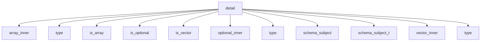

# Namespace `clore::net::openai::schema::detail`

## Summary

命名空间 `clore::net::openai::schema::detail` 是 `OpenAI` Schema 生成的内部实现层，专注于提供类型萃取、模式构建和验证等底层工具。其中类型萃取结构体（如 `is_optional`、`is_vector`、`is_array`、`optional_inner`、`vector_inner`、`array_inner` 及 `schema_subject`）用于在编译期解析 C++ 类型（`std::optional`、`std::vector`、`std::array` 等）的内部元素类型，为后续的模式映射奠定基础。构建函数（如 `make_schema_object`、`make_scalar_type_schema`、`make_any_of_schema`、`make_schema_value`）负责将特定类型或类型成分转换为 JSON Schema 片段的整数标识，而验证相关函数（如 `validate_openai_schema`、`validate_openai_schema_value`、`validate_required_properties`、`validate_schema_array_of_types`）则确保生成的 Schema 符合 `OpenAI` 规范。此外，`sanitize_schema_name` 和 `populate_object_schema` 等辅助函数提供了名称清洗和对象填充等基本操作。该命名空间承担了模式管线中所有关键的内部协调工作，是上层公共接口的支撑基石。

## Diagram

```mermaid
graph TD
    NS["detail"]
    T0["array_inner"]
    NS --> T0
    T1["type"]
    NS --> T1
    T2["is_array"]
    NS --> T2
    T3["is_optional"]
    NS --> T3
    T4["is_vector"]
    NS --> T4
    T5["optional_inner"]
    NS --> T5
    T6["type"]
    NS --> T6
    T7["schema_subject"]
    NS --> T7
    T8["schema_subject_t"]
    NS --> T8
    T9["vector_inner"]
    NS --> T9
    T10["type"]
    NS --> T10
```

## Types

### `clore::net::openai::schema::detail::array_inner`

Declaration: `src/network/schema.cppm:82`

Implementation: [`Module schema`](../../../../../../modules/schema/index.md)

结构体模板 `clore::net::openai::schema::detail::array_inner` 是一个类型萃取元函数，用于提取数组容器类型的内部元素类型。它配合其他同类元函数（如 `vector_inner` 和 `optional_inner`）使用，通过对 `std::array` 的特化暴露 `::type` 别名，指向数组的元素类型。该类型通常出现在模式（schema）推导路径中，为泛型算法（如 `schema_subject_t` 的选取）提供元素类型信息，从而支持对容器内元素进行递归的模式描述。

### `clore::net::openai::schema::detail::is_array`

Declaration: `src/network/schema.cppm:73`

Definition: `src/network/schema.cppm:73`

Implementation: [`Module schema`](../../../../../../modules/schema/index.md)

Insufficient evidence to summarize; provide more EVIDENCE.

#### Invariants

- 对于 primary template，`value` 始终为 `false`
- 继承自 `std::false_type`，符合 C++ traits 惯例
- 无运行时状态，仅在编译时使用

#### Key Members

- 继承的 `value` 成员（`false`）
- 继承的 `type` 类型别名（`std::false_type`）

#### Usage Patterns

- 用于编译时判断类型是否为数组，配合模板特化或 SFINAE
- 可能作为其他 traits 的基础或默认实现

### `clore::net::openai::schema::detail::is_optional`

Declaration: `src/network/schema.cppm:33`

Definition: `src/network/schema.cppm:33`

Implementation: [`Module schema`](../../../../../../modules/schema/index.md)

`clore::net::openai::schema::detail::is_optional` 是一个模板结构体，用作编译期类型特征。它接受一个模板参数 `T`，并继承自 `std::true_type` 或 `std::false_type`，用于检测 `T` 是否为 `std::optional` 的特化。该特征通常配合 `optional_inner` 等工具使用，在 `OpenAPI` 模式生成过程中识别可选字段，并据此控制后续的类型消去或模式组装逻辑。它与其他姊妹特征（如 `is_vector`、`is_array`）共同构成 schema 生成框架中对容器与包装器类型的辨识支持。

#### Invariants

- Default value is `false` for all types unless a specialization overrides it
- Inherits from `std::false_type`
- Primary template itself provides no custom logic

#### Key Members

- Implicit static constant `value` (from `std::false_type`)
- Inherited `operator()` returning `false`

#### Usage Patterns

- Used in template metaprogramming to query if a type is optional
- Expected to be specialized for actual optional types (e.g., `std::optional`)
- Checked via `is_optional<T>::value` in conditional enable-if constructs

### `clore::net::openai::schema::detail::is_vector`

Declaration: `src/network/schema.cppm:53`

Definition: `src/network/schema.cppm:53`

Implementation: [`Module schema`](../../../../../../modules/schema/index.md)

`clore::net::openai::schema::detail::is_vector` 是一个模板元函数（类型萃取），用于在编译时判断模板参数 `T` 是否为 `std::vector` 类型。它通常继承自 `std::true_type` 或 `std::false_type`，为后续的 SFINAE 重载或条件选择提供布尔常量。该结构体与 `detail::vector_inner` 等辅助工具配合，用于解析向量容器的内部元素类型，在 `OpenAI` 模式生成相关的 SFINAE 逻辑中起到类型分派的作用。

### `clore::net::openai::schema::detail::optional_inner`

Declaration: `src/network/schema.cppm:42`

Implementation: [`Module schema`](../../../../../../modules/schema/index.md)

`clore::net::openai::schema::detail::optional_inner` 是一个元函数，用于提取 `std::optional` 所包装的类型。当模板参数 `T` 为 `std::optional<U>` 的实例时，其 `type` 成员代表 `U`；否则该特化不适用。该类型常与辅助类型 `is_optional` 配合使用，在编译期检查类型是否为 optional，再通过 `optional_inner` 获取内部类型。在 `OpenAI` Schema 的 JSON 生成流程中，它被用于将可选的模式字段映射为其底层类型的 schema 描述。

#### Invariants

- 无已知不变性

#### Key Members

- 无公开成员

#### Usage Patterns

- 未在现有证据中明确描述

### `clore::net::openai::schema::detail::schema_subject`

Declaration: `src/network/schema.cppm:93`

Definition: `src/network/schema.cppm:93`

Implementation: [`Module schema`](../../../../../../modules/schema/index.md)

`clore::net::openai::schema::detail::schema_subject` 是一个模板结构体，用于从给定的类型 `T` 中提取其“主题”类型。它通常与辅助 trait 如 `optional_inner`、`vector_inner` 和 `array_inner` 配合使用，以剥离 `std::optional`、`std::vector` 或 `std::array` 等包装，返回内部元素的类型。当 `T` 不是这些包装类型时，`schema_subject<T>` 会退化为其自身类型。该结构体的结果通过类型别名 `schema_subject_t` 暴露给外界，用作 `clore::net::openai::schema` 命名空间中类型推导和解构的核心工具。

#### Invariants

- `schema_subject<T>::type` 始终为移除 cv 限定符和引用后的类型

#### Key Members

- 类型别名 `type`

#### Usage Patterns

- 在 `clore::net::openai::schema` 内部用于获取模板参数的底层类型
- 用于构建或推导模式定义中的实际类型

### `clore::net::openai::schema::detail::schema_subject_t`

Declaration: `src/network/schema.cppm:105`

Implementation: [`Module schema`](../../../../../../modules/schema/index.md)

Insufficient evidence to summarize; provide more EVIDENCE.

#### Invariants

- `schema_subject<T>` 必须为每个使用到的 `T` 提供有效的 `type` 嵌套类型
- 别名自身不引入任何约束或副作用

#### Key Members

- 别名 `schema_subject_t` 无成员，其作用依赖于 `schema_subject<T>::type`

#### Usage Patterns

- 其他模板代码通过 `schema_subject_t<T>` 获取关联的主题类型
- 常用于元编程中简化类型提取

### `clore::net::openai::schema::detail::vector_inner`

Declaration: `src/network/schema.cppm:62`

Implementation: [`Module schema`](../../../../../../modules/schema/index.md)

`clore::net::openai::schema::detail::vector_inner` 是一个模板元函数，用于提取 `std::vector` 容器所持有的元素类型。它接受一个模板类型参数 `T`，并通常通过特化来匹配形如 `std::vector<E, A>` 的类型，将其内部元素类型 `E` 暴露为 `::type`。该类型别名与其他类似的内萃取（如 `optional_inner`、`array_inner`）一同服务于 `OpenAI` schema 生成过程中的类型推导与映射，使得外部实现可以统一处理不同容器类型的内部元素类型。

#### Invariants

- No invariants are specified in the evidence.

#### Key Members

- No key members are documented in the evidence.

#### Usage Patterns

- The struct is intended for use within the `clore::net::openai::schema` detail implementation, but specific usage patterns are not provided.

## Variables

### `clore::net::openai::schema::detail::is_array_v`

Declaration: `src/network/schema.cppm:79`

Implementation: [`Module schema`](../../../../../../modules/schema/index.md)

`clore::net::openai::schema::detail::is_array_v` 是一个编译期布尔常量模板变量，用于判断模板参数 `T` 是否为数组类型。

### `clore::net::openai::schema::detail::is_optional_v`

Declaration: `src/network/schema.cppm:39`

Implementation: [`Module schema`](../../../../../../modules/schema/index.md)

A constexpr boolean variable template `clore::net::openai::schema::detail::is_optional_v` that evaluates to `true` for types that represent an optional field in the schema context.

### `clore::net::openai::schema::detail::is_vector_v`

Declaration: `src/network/schema.cppm:59`

Implementation: [`Module schema`](../../../../../../modules/schema/index.md)

变量 `clore::net::openai::schema::detail::is_vector_v` 是一个 `constexpr bool` 模板变量，用于在编译时判断给定类型 `T` 是否表示一个向量类型。

## Functions

### `clore::net::openai::schema::detail::make_any_of_schema`

Declaration: `src/network/schema.cppm:166`

Definition: `src/network/schema.cppm:166`

Implementation: [`Module schema`](../../../../../../modules/schema/index.md)

函数 `clore::net::openai::schema::detail::make_any_of_schema` 是一个模板函数（模板参数 `typename T`），用于在 `OpenAI` 模式生成的内部分工中负责构造表示“`anyOf`”语义的 JSON Schema 片段。它接受一个 `int` 类型的参数并返回一个 `int`；调用方应确保传入的参数有效并依据返回值判断生成是否成功。该函数属于 `detail` 命名空间，作为内部实现组件，应与同一命名空间下的 `make_schema_object`、`make_scalar_type_schema` 等协同完成完整模式构建，外部代码通常通过上层接口间接调用。

#### Usage Patterns

- Called to produce an `anyOf` schema from a collection of alternative schemas
- Used to wrap multiple schema options into a single `json::Value` object

### `clore::net::openai::schema::detail::make_scalar_type_schema`

Declaration: `src/network/schema.cppm:156`

Definition: `src/network/schema.cppm:156`

Implementation: [`Module schema`](../../../../../../modules/schema/index.md)

`clore::net::openai::schema::detail::make_scalar_type_schema` 为一个给定的标量类型名称生成对应的 `OpenAI` JSON Schema 片段。调用方需传入一个标识标量类型的 `std::string_view`（例如 `"string"`、`"number"`、`"boolean"` 等）；函数返回一个 `int` 值，表示操作的结果或生成的 schema 对象的标识。该函数是架构构建流程中的内部工具，预期由 `detail` 命名空间中的其他 schema 工厂函数调用，不应直接对外暴露。

#### Usage Patterns

- Called when building JSON schemas for scalar types (e.g., string, number, boolean)
- Part of the `OpenAI` schema generation utility functions

### `clore::net::openai::schema::detail::make_schema_object`

Declaration: `src/network/schema.cppm:142`

Definition: `src/network/schema.cppm:142`

Implementation: [`Module schema`](../../../../../../modules/schema/index.md)

函数 `clore::net::openai::schema::detail::make_schema_object` 是一个模板函数，负责为给定类型 `T` 生成一个 `OpenAI` schema 对象。它返回一个整数标识符，该标识符在后续的模式构建流程中代表所创建的对象 schema。

调用者应确保 `T` 是受支持的类型，并且该函数在模式生成管线中与其他 `detail` 层函数（如 `populate_object_schema`、`validate_openai_schema` 等）协同工作。返回值仅用于内部协调，调用者不应假设其具体含义或持久性。

#### Usage Patterns

- Generating root schema object for a type `T`
- Creating JSON object schema from a C++ type for `OpenAI` compatibility

### `clore::net::openai::schema::detail::make_schema_value`

Declaration: `src/network/schema.cppm:139`

Definition: `src/network/schema.cppm:235`

Implementation: [`Module schema`](../../../../../../modules/schema/index.md)

该函数为给定的模板参数 `T` 生成一个 `OpenAPI` schema value 的整数表示。返回的整数标识符可被其他 schema 构建辅助函数（例如 `make_schema_object`、`make_any_of_schema`）直接引用，用于在复杂的 schema 组装过程中标识或索引该 value。调用者必须确保 `T` 是库支持的可映射类型，函数不会对无效类型进行运行时检查。该函数属于 `clore::net::openai::schema::detail` 内部实现细节，通常不应直接调用的外部接口，而是通过高级 schema 生成入口间接使用。

#### Usage Patterns

- Called during JSON schema generation for a type `T` as part of building prompt definitions or validation schemas.
- Used in conjunction with `validate_openai_schema`, `populate_object_schema`, and other schema utilities to produce the final schema object.

### `clore::net::openai::schema::detail::populate_object_schema`

Declaration: `src/network/schema.cppm:183`

Definition: `src/network/schema.cppm:183`

Implementation: [`Module schema`](../../../../../../modules/schema/index.md)

该函数用于填充一个 `json::Object`，使其成为符合 `OpenAI` Schema 规范的对象表示。调用者需提供一个可修改的 `json::Object` 引用和一个整数参数，函数会根据模板参数 `Object` 和 `Indices...` 所描述的内部结构，向该对象中添加属性定义。第二个整数参数通常用于指示当前处理的位置或索引，调用者应确保其值在合理范围内。函数返回一个整数，表示填充操作的执行结果（例如成功添加的属性数量或状态码）。

#### Usage Patterns

- Called when generating an `OpenAI`-compatible JSON schema for a structured type
- Used in conjunction with `make_schema_value` and other schema utilities
- Typically invoked for aggregate types with multiple fields

### `clore::net::openai::schema::detail::sanitize_schema_name`

Declaration: `src/network/schema.cppm:107`

Definition: `src/network/schema.cppm:107`

Implementation: [`Module schema`](../../../../../../modules/schema/index.md)

接受一个模式名称字符串视图，并返回一个清理后的标准字符串。该函数确保返回的字符串符合 `OpenAI` 模式命名约定，移除或替换任何无效字符，以便该名称可用作 JSON Schema 中的 `$ref` 或标题类属性的值。

调用者应使用返回的清理后字符串，而不是原始输入。此函数不修改传入的`std::string_view`对象；它通过返回值提供一个新的`std::string`。如果不需要清理，返回的字符串可能与输入相同。

#### Usage Patterns

- sanitize externally provided schema names for use as identifiers
- called internally during schema object creation to ensure valid property names

### `clore::net::openai::schema::detail::schema_type_name`

Declaration: `src/network/schema.cppm:130`

Definition: `src/network/schema.cppm:130`

Implementation: [`Module schema`](../../../../../../modules/schema/index.md)

对于给定的模板类型 `T`，`clore::net::openai::schema::detail::schema_type_name` 返回一个整数标识符。该标识符对应于 `OpenAI` schema 规范中该类型对应的内部类型名称表示。调用者应使用此值来填充 schema 对象的 `type` 字段，或在需要类型区分的上下文中进行匹配。模板参数 `T` 必须是能够映射到已知 schema 类型集合中的类型，否则行为未定义。此函数是 schema 生成过程中的内部辅助工具，不应在公共 API 中使用。

#### Usage Patterns

- Called by schema generation functions to obtain a validated type name
- Used to convert a C++ type name into a sanitized `OpenAI` schema name

### `clore::net::openai::schema::detail::validate_openai_schema`

Declaration: `src/network/schema.cppm:338`

Definition: `src/network/schema.cppm:383`

Implementation: [`Module schema`](../../../../../../modules/schema/index.md)

`clore::net::openai::schema::detail::validate_openai_schema` 验证一个给定的 JSON 对象是否符合 `OpenAI` 语义架构的规范。它检查结构的完整性、必需属性以及类型的合法性，确保生成的架构能够被 `OpenAI` API 正确消费。

调用者需要提供待验证的 `json::Object` 引用、一个标识该架构的 `std::string_view` 名称，以及一个 `bool` 标志指示是否启用严格校验。函数返回一个 `int` 值：0 表示验证通过，非零值对应特定的错误码，调用者可以据此诊断架构中的无效部分。

#### Usage Patterns

- called from schema validation entry points
- used recursively via `validate_openai_schema_value`
- applied to both root and nested schemas
- integral to ensure schema conforms to `OpenAI` restrictions

### `clore::net::openai::schema::detail::validate_openai_schema_value`

Declaration: `src/network/schema.cppm:350`

Definition: `src/network/schema.cppm:350`

Implementation: [`Module schema`](../../../../../../modules/schema/index.md)

`clore::net::openai::schema::detail::validate_openai_schema_value` 验证由 `json::Cursor` 指向的 JSON 值是否构成一个有效的 `OpenAI` 模式值。调用者需提供字符串上下文（通常为属性名称或路径）及布尔严格标志，函数返回整数表示验证结果（0 表示成功，非零值指示错误）。该函数用于校验单个模式值的结构正确性，是模式验证流程中的基础组件，通常被更高层验证函数（如 `validate_openai_schema`）依赖。

#### Usage Patterns

- 作为验证 `OpenAI` schema 值的外部入口
- 在递归或迭代遍历 schema 时对单个值进行验证

### `clore::net::openai::schema::detail::validate_openai_schema_value`

Declaration: `src/network/schema.cppm:341`

Definition: `src/network/schema.cppm:341`

Implementation: [`Module schema`](../../../../../../modules/schema/index.md)

验证给定的 JSON 值是否符合 `OpenAI` schema 规范。接受一个 `json::Value`（或 `json::Cursor`）作为待验证的值，一个 `std::string_view` 表示该值在其所在 schema 中的名称或路径，以及一个 `bool` 标志（可能控制严格性或是否允许额外字段）。返回一个 `int` 状态码，指示验证结果（通常返回 `0` 表示成功，非零值表示失败或错误）。该函数是 `OpenAI` schema 验证流程中用于值级别校验的内部组成部分，供所在 `detail` 命名空间中的其他验证函数调用。

#### Usage Patterns

- used in schema validation pipeline to validate that a JSON value is an `OpenAI` schema object
- called by higher-level schema processing functions
- invoked with top-level JSON values and nested schema values

### `clore::net::openai::schema::detail::validate_required_properties`

Declaration: `src/network/schema.cppm:359`

Definition: `src/network/schema.cppm:359`

Implementation: [`Module schema`](../../../../../../modules/schema/index.md)

`clore::net::openai::schema::detail::validate_required_properties` 负责校验 `OpenAI` Schema 对象中 `required` 属性列表的合法性。调用方需提供两个 `int` 参数（分别标识所属的 schema 上下文与 required 列表中的索引位置）以及一个 `std::string_view` 参数（描述当前校验路径）。函数返回一个 `int` 值，表示校验结果（通常为成功或特定错误码）。调用该函数前应确保传入的索引和路径有效，且该函数仅执行校验逻辑，不修改 schema 对象。

#### Usage Patterns

- Validating that all object properties are listed in required array for strict structured output

### `clore::net::openai::schema::detail::validate_schema_array_of_types`

Declaration: `src/network/schema.cppm:305`

Definition: `src/network/schema.cppm:305`

Implementation: [`Module schema`](../../../../../../modules/schema/index.md)

该函数验证给定的 JSON 数组是否表示一组有效的 `OpenAI` schema 类型。它接受一个 `const json::Array &` 作为待检验的类型数组，一个 `std::string_view` 描述当前正在验证的 schema 路径（用于错误报告），以及一个 `bool` 标志指示是否以宽松模式进行验证。返回值是 `int`，零表示验证通过，非零值表示遇到了不符合规范的情况。调用者应当在构建或处理 schema 之前，使用此函数确保类型数组内容的合法性。

#### Usage Patterns

- 在`schema`验证流程中被`validate_openai_schema`调用，用于处理`type`字段值为数组的情况。

## Related Pages

- [Namespace clore::net::openai::schema](../index.md)

