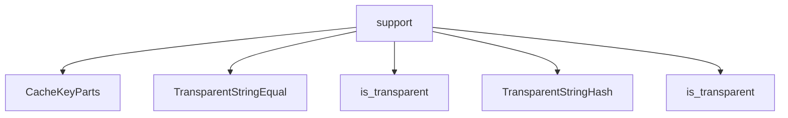

# Namespace `clore::support`

## Summary

`clore::support` 命名空间提供了一组底层工具函数和类型，用于处理文件 I/O、编码规范化、字符串操作和缓存标识符的构建。其核心职责包括：确保 UTF‑8 文本的正确读写与转换（如 `read_utf8_text_file`、`write_utf8_text_file`、`ensure_utf8`、`truncate_utf8`），统一路径表示（`normalize_path_string`）和行结束符（`normalize_line_endings`），以及为日志级别名称提供规范映射（`canonical_log_level_name`）和从 Markdown 文本中提取纯文本段落（`extract_first_plain_paragraph`）。此外，该命名空间提供了用于高效异构字符串查找的透明比较与哈希类型（`TransparentStringEqual`、`TransparentStringHash`），以及缓存键与编译签名的生成函数（`build_cache_key`、`build_compile_signature`、`split_cache_key`）。在架构上，`clore::support` 扮演着基础支持模块的角色，为系统其他部分（如依赖排序、日志记录、缓存分层）提供可复用的、平台无关的文本与数据操作原语。

## Diagram



## Types

### `clore::support::CacheKeyParts`

Declaration: `support/logging.cppm:57`

Definition: `support/logging.cppm:57`

Implementation: [`Module support`](../../../modules/support/index.md)

Insufficient evidence to summarize; provide more EVIDENCE.

#### Invariants

- `compile_signature` 默认初始化为 0
- `path` 应包含有效的文件路径字符串

#### Key Members

- `path`
- `compile_signature`

#### Usage Patterns

- 用于组成缓存键，将路径和编译签名作为哈希或比较的一部分

### `clore::support::TransparentStringEqual`

Declaration: `support/logging.cppm:33`

Definition: `support/logging.cppm:33`

Implementation: [`Module support`](../../../modules/support/index.md)

`clore::support::TransparentStringEqual` 是一个函数对象类型，用于提供字符串键的透明相等比较。其内部定义的 `is_transparent` 类型别名表明它支持异构查找（heterogeneous lookup），这使得在关联容器（如 `std::unordered_map` 或 `std::set`）中可以使用 `std::string_view`、`const char*` 或其他与 `std::string` 可比较的类型作为查找参数，而无需临时构造 `std::string` 对象。该类型旨在优化字符串键容器的查找性能，并简化代码中对不同字符串表示形式的兼容处理。

#### Member Types

##### `clore::support::TransparentStringEqual::is_transparent`

Declaration: `support/logging.cppm:34`

Implementation: [`Module support`](../../../modules/support/index.md)

###### Declaration

```cpp
using is_transparent = void
```

#### Member Functions

##### `clore::support::TransparentStringEqual::operator()`

Declaration: `support/logging.cppm:46`

Definition: `support/logging.cppm:46`

Implementation: [`Module support`](../../../modules/support/index.md)

###### Declaration

```cpp
auto (std::string_view, const std::string &) const noexcept -> bool;
```

##### `clore::support::TransparentStringEqual::operator()`

Declaration: `support/logging.cppm:36`

Definition: `support/logging.cppm:36`

Implementation: [`Module support`](../../../modules/support/index.md)

###### Declaration

```cpp
auto (std::string_view, std::string_view) const noexcept -> bool;
```

##### `clore::support::TransparentStringEqual::operator()`

Declaration: `support/logging.cppm:51`

Definition: `support/logging.cppm:51`

Implementation: [`Module support`](../../../modules/support/index.md)

###### Declaration

```cpp
auto (const std::string &, const std::string &) const noexcept -> bool;
```

##### `clore::support::TransparentStringEqual::operator()`

Declaration: `support/logging.cppm:41`

Definition: `support/logging.cppm:41`

Implementation: [`Module support`](../../../modules/support/index.md)

###### Declaration

```cpp
auto (const std::string &, std::string_view) const noexcept -> bool;
```

### `clore::support::TransparentStringHash`

Declaration: `support/logging.cppm:17`

Definition: `support/logging.cppm:17`

Implementation: [`Module support`](../../../modules/support/index.md)

Insufficient evidence to summarize; provide more EVIDENCE.

#### Member Types

##### `clore::support::TransparentStringHash::is_transparent`

Declaration: `support/logging.cppm:18`

Implementation: [`Module support`](../../../modules/support/index.md)

###### Declaration

```cpp
using is_transparent = void
```

#### Member Functions

##### `clore::support::TransparentStringHash::operator()`

Declaration: `support/logging.cppm:24`

Definition: `support/logging.cppm:24`

Implementation: [`Module support`](../../../modules/support/index.md)

###### Declaration

```cpp
auto (const std::string &) const noexcept -> std::size_t;
```

##### `clore::support::TransparentStringHash::operator()`

Declaration: `support/logging.cppm:20`

Definition: `support/logging.cppm:20`

Implementation: [`Module support`](../../../modules/support/index.md)

###### Declaration

```cpp
auto (std::string_view) const noexcept -> std::size_t;
```

##### `clore::support::TransparentStringHash::operator()`

Declaration: `support/logging.cppm:28`

Definition: `support/logging.cppm:28`

Implementation: [`Module support`](../../../modules/support/index.md)

###### Declaration

```cpp
auto (const char *) const noexcept -> std::size_t;
```

## Functions

### `clore::support::build_cache_key`

Declaration: `support/logging.cppm:70`

Definition: `support/logging.cppm:368`

Implementation: [`Module support`](../../../modules/support/index.md)

`clore::support::build_cache_key` 接受一个标识符前缀（`std::string_view`）和一个 64 位签名值（`std::uint64_t`），并返回一个用于缓存键的 `std::string`。调用者负责提供能唯一标识缓存条目的前缀与签名组合；该函数将二者封装为可比较、可存储的键字符串，供后续的查找与匹配操作使用。

#### Usage Patterns

- used to generate a key for caching compilation results based on file path and signature

### `clore::support::build_compile_signature`

Declaration: `support/logging.cppm:66`

Definition: `support/logging.cppm:352`

Implementation: [`Module support`](../../../modules/support/index.md)

`clore::support::build_compile_signature` 根据两个字符串标识符（例如源文件路径和编译配置）以及一个整数引用，计算一个全局唯一的编译签名，返回 `std::uint64_t`。调用者必须保证传入的字符串视图在函数执行期间有效，且整数引用指向的对象在此期间可读。该函数内部通过 `clore::support::normalize_path_string` 对路径进行规范化，以确保相同语义的输入产生一致的签名。

#### Usage Patterns

- Creating a hash-based signature for compilation input
- Used for cache key generation

### `clore::support::canonical_log_level_name`

Declaration: `support/logging.cppm:77`

Definition: `support/logging.cppm:424`

Implementation: [`Module support`](../../../modules/support/index.md)

函数 `clore::support::canonical_log_level_name` 接受一个表示日志级别名称的 `std::string_view`，并返回一个 `std::optional<std::string>`。它尝试将调用者提供的名称转换为该日志级别的规范形式。如果输入名称可以被识别为一个已知的日志级别（例如，通过不区分大小写的匹配或处理常见别名），则返回对应的规范字符串；否则返回 `std::nullopt`。调用者应检查返回的可选值：若存在，则保证该字符串是该级别的稳定、可预期的规范表示；若为空，则表示输入的级别名称未被识别。

#### Usage Patterns

- canonicalize log level names
- validate log level strings
- obtain normalized level string

### `clore::support::enable_utf8_console`

Declaration: `support/logging.cppm:91`

Definition: `support/logging.cppm:534`

Implementation: [`Module support`](../../../modules/support/index.md)

`clore::support::enable_utf8_console` 配置标准控制台流以正确接收和显示 UTF‑8 编码文本。调用此函数后，写入 `stdout` 或 `stderr` 的 UTF‑8 字符串应能无误地呈现于支持 Unicode 的控制台上。该函数无参数且不返回值；调用者应在任何依赖 UTF‑8 输出的操作之前于程序早期调用它一次。

#### Usage Patterns

- Called during program initialization to enable UTF-8 console support

### `clore::support::ensure_utf8`

Declaration: `support/logging.cppm:75`

Definition: `support/logging.cppm:405`

Implementation: [`Module support`](../../../modules/support/index.md)

Declaration: [Declaration](functions/ensure-utf8.md)

函数 `clore::support::ensure_utf8` 接受一个 `std::string_view` 输入，返回一个 `std::string`，其内容保证为正确的 UTF‑8 编码。调用方可以依赖返回值在需要 UTF‑8 合规性的场景（如写入 UTF‑8 文本文件或进行 UTF‑8 字符串操作）中安全使用；若输入已为有效 UTF‑8，则实现可能直接生成副本，否则会修正无效序列以达到 UTF‑8 合规。

#### Usage Patterns

- called by `write_utf8_text_file` to ensure valid UTF-8 before writing
- called by `truncate_utf8` to sanitize input before truncation

### `clore::support::extract_first_plain_paragraph`

Declaration: `support/logging.cppm:62`

Definition: `support/logging.cppm:303`

Implementation: [`Module support`](../../../modules/support/index.md)

从给定字符串视图中提取第一个纯文本段落。该函数期望输入为 UTF-8 编码，可能包含 Markdown 格式，并返回第一个段落去除所有内联 Markdown 标记后的纯文本内容。调用方无需提供段落分隔符；该函数按标准 Markdown 段落边界进行识别（例如空行分隔）。若输入为空或不存在任何段落，函数返回空字符串。

#### Usage Patterns

- extracting the first paragraph of markdown documentation for display or logging
- obtaining a plain text summary from markdown strings

### `clore::support::normalize_line_endings`

Declaration: `support/logging.cppm:79`

Definition: `support/logging.cppm:442`

Implementation: [`Module support`](../../../modules/support/index.md)

函数 `clore::support::normalize_line_endings` 接受一个 `std::string_view` 作为输入，并返回一个 `std::string`，其中所有行结束符均已统一规范化为一种标准格式。调用者可使用此函数消除跨平台文本数据（如不同操作系统来源的文件内容）中换行符表示方式的差异，从而保证下游处理的一致性。返回的字符串中不再包含混合或不规范的行结束符序列。

#### Usage Patterns

- 标准化文本文件中的行结束符
- 统一跨平台换行符为 `\n`

### `clore::support::normalize_path_string`

Declaration: `support/logging.cppm:64`

Definition: `support/logging.cppm:348`

Implementation: [`Module support`](../../../modules/support/index.md)

接受一个路径字符串并返回其归一化形式。该函数主要用于使路径表示标准化，例如统一目录分隔符、解析相对段或进行平台特定的格式调整。调用者应提供一个有效的路径字符串；返回的归一化字符串适合用于后续的文件路径比较、缓存键构建或日志记录等场景，确保等价路径具有一致的文本表示。

#### Usage Patterns

- Used in `clore::support::build_compile_signature` to normalize paths before hashing or comparison

### `clore::support::read_utf8_text_file`

Declaration: `support/logging.cppm:85`

Definition: `support/logging.cppm:480`

Implementation: [`Module support`](../../../modules/support/index.md)

`clore::support::read_utf8_text_file` 接受一个 `const int&` 参数并返回一个 `int`。调用者负责提供表示有效文件描述符或句柄的整数引用。该函数以 UTF-8 编码读取关联的文本文件，并使用返回的整数值指示操作结果或编码某些元数据。具体的返回语义应在该函数所在模块的相应文档中定义。

#### Usage Patterns

- 读取文本文件内容（如配置、数据文件）
- 用于需要处理 UTF-8 并自动处理 BOM 的场景

### `clore::support::split_cache_key`

Declaration: `support/logging.cppm:73`

Definition: `support/logging.cppm:378`

Implementation: [`Module support`](../../../modules/support/index.md)

接受一个字符串视图形式的缓存键并返回一个整数，该整数表示对缓存键进行分割后的结果。调用者通常使用此函数将缓存键映射到对应的缓存分片或索引，返回值的具体语义由调用方定义。

#### Usage Patterns

- used to parse a cache key into path and signature
- called after reading a cache key from storage
- pair with `build_cache_key` to round-trip cache keys

### `clore::support::strip_utf8_bom`

Declaration: `support/logging.cppm:83`

Definition: `support/logging.cppm:470`

Implementation: [`Module support`](../../../modules/support/index.md)

Declaration: [Declaration](functions/strip-utf8-bom.md)

接受一个 `std::string_view` 输入，返回一个新的 `std::string_view`，该视图指向移除头部 UTF-8 字节顺序标记（BOM）后的原始数据。如果输入不以 BOM 开头，则返回与输入相同的视图。函数不分配内存也不修改数据；调用者必须确保输入视图的生命周期覆盖返回的视图。

#### Usage Patterns

- 用于从文件读取的 UTF-8 文本中剥离 BOM 前缀

### `clore::support::topological_order`

Declaration: `support/logging.cppm:93`

Definition: `support/logging.cppm:547`

Implementation: [`Module support`](../../../modules/support/index.md)

函数 `clore::support::topological_order` 接收三个整数参数（前两个为 `const int &`，第三个为 `int`），并返回一个整数。该整数代表基于输入参数的拓扑顺序关系值。调用者负责提供在预期上下文中具有一致语义的参数；该函数不对参数的有效性进行运行时验证。此函数属于日志支持模块，供内部算法使用。

#### Usage Patterns

- Compute topological order for dependency resolution.
- Detect cycles in a directed graph.

### `clore::support::truncate_utf8`

Declaration: `support/logging.cppm:81`

Definition: `support/logging.cppm:460`

Implementation: [`Module support`](../../../modules/support/index.md)

`clore::support::truncate_utf8` 接受一个 `std::string_view` 类型的 UTF‑8 编码文本和一个 `std::size_t` 类型的最大字节数，返回一个 `std::string`。该函数将文本截断到指定的字节长度，同时保证不拆分多字节 UTF‑8 字符，从而保持截断后的字符串仍为有效的 UTF‑8 编码。

调用者需要传入待截断的 UTF‑8 字符串视图和允许的最大字节数。如果原始文本的字节长度未超过限制，则返回其副本；否则返回一个在字符边界处截断的子序列。该函数不修改原始输入，返回值是独立持有的新字符串。

#### Usage Patterns

- Truncating a UTF-8 string to a maximum byte count
- Ensuring the truncated output is valid UTF-8

### `clore::support::write_utf8_text_file`

Declaration: `support/logging.cppm:88`

Definition: `support/logging.cppm:515`

Implementation: [`Module support`](../../../modules/support/index.md)

将提供的 `std::string_view` 内容作为 UTF-8 编码的文本写入由 `const int &` 参数表示的文件描述符中。返回一个 `int` 值指示操作结果（成功或错误码）。调用者负责确保文件描述符已打开且可写，以及输入的字符串是有效的 UTF-8 编码（函数内部会通过 `clore::support::ensure_utf8` 进行规范化）。

#### Usage Patterns

- Writing UTF-8 text files after content normalization
- Replacing raw file writes with UTF-8 validation

## Related Pages

- [Namespace clore](../index.md)

