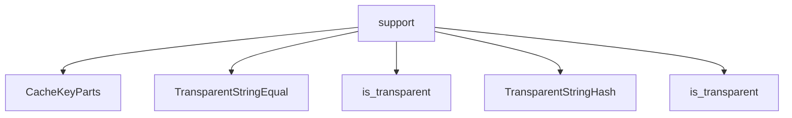

# Namespace `clore::support`

## Summary

`clore::support` 命名空间提供了一组底层实用工具，负责处理与平台相关的文本文件、路径、编码和缓存等基础操作。其中包含用于读取和写入 UTF-8 文本文件、移除 BOM、截断多字节字符串、规范化行结束符与路径表示的函数，以及针对无序容器的透明字符串哈希与比较仿函数。这些工具为上层模块提供了可复用的基础设施，隐藏了底层实现细节，并确保不同环境下行为的可预测性。

在架构上，该命名空间扮演着“基石”角色：**`enable_utf8_console`** 确保跨平台控制台输出正确，**`normalize_path_string`** 和 **`normalize_line_endings`** 统一了输入格式，**`build_cache_key`** 和 **`split_cache_key`** 等函数则支撑了缓存系统。这些组件被其他多个模块依赖，既降低了代码重复，又通过集中处理常见问题（如编码、文件 I/O 错误处理）提升了整体健壮性。

## Diagram



## Types

### `clore::support::CacheKeyParts`

Declaration: `support/logging.cppm:57`

Definition: `support/logging.cppm:57`

Implementation: [`Module support`](../../../modules/support/index.md)

Insufficient evidence to summarize; provide more EVIDENCE.

#### Invariants

- `compile_signature` 默认初始化为 `0`
- 成员变量直接公开访问

#### Key Members

- `path`
- `compile_signature`

#### Usage Patterns

- 作为缓存键的组成部分被其他模块使用
- 通常与 `clore::support::Cache` 相关组件配合

### `clore::support::TransparentStringEqual`

Declaration: `support/logging.cppm:33`

Definition: `support/logging.cppm:33`

Implementation: [`Module support`](../../../modules/support/index.md)

Insufficient evidence to summarize; provide more EVIDENCE.

#### Invariants

- All `operator()` overloads are `const` and `noexcept`
- The equality comparison is symmetric across `std::string` and `std::string_view`
- The function object is stateless with no data members

#### Key Members

- `operator()(std::string_view, std::string_view)`
- `operator()(const std::string&, std::string_view)`
- `operator()(std::string_view, const std::string&)`
- `operator()(const std::string&, const std::string&)`
- `is_transparent` type alias

#### Usage Patterns

- Used as a transparent equality predicate for unordered containers (e.g., `std::unordered_set`) to allow heterogeneous lookup with `std::string_view`
- Can be passed as the `Pred` template argument to `std::unordered_set<std::string, Hash, TransparentStringEqual>`
- Enables use of `find` and similar member functions with `std::string_view` arguments without constructing a temporary `std::string`

#### Member Types

##### `clore::support::TransparentStringEqual::is_transparent`

Declaration: `support/logging.cppm:34`

Implementation: [`Module support`](../../../modules/support/index.md)

###### Declaration

```cpp
using is_transparent = void
```

#### Member Functions

##### `clore::support::TransparentStringEqual::operator()`

Declaration: `support/logging.cppm:46`

Definition: `support/logging.cppm:46`

Implementation: [`Module support`](../../../modules/support/index.md)

###### Declaration

```cpp
auto (std::string_view, const std::string &) const noexcept -> bool;
```

##### `clore::support::TransparentStringEqual::operator()`

Declaration: `support/logging.cppm:36`

Definition: `support/logging.cppm:36`

Implementation: [`Module support`](../../../modules/support/index.md)

###### Declaration

```cpp
auto (std::string_view, std::string_view) const noexcept -> bool;
```

##### `clore::support::TransparentStringEqual::operator()`

Declaration: `support/logging.cppm:51`

Definition: `support/logging.cppm:51`

Implementation: [`Module support`](../../../modules/support/index.md)

###### Declaration

```cpp
auto (const std::string &, const std::string &) const noexcept -> bool;
```

##### `clore::support::TransparentStringEqual::operator()`

Declaration: `support/logging.cppm:41`

Definition: `support/logging.cppm:41`

Implementation: [`Module support`](../../../modules/support/index.md)

###### Declaration

```cpp
auto (const std::string &, std::string_view) const noexcept -> bool;
```

### `clore::support::TransparentStringHash`

Declaration: `support/logging.cppm:17`

Definition: `support/logging.cppm:17`

Implementation: [`Module support`](../../../modules/support/index.md)

`clore::support::TransparentStringHash` 是一个用于字符串哈希的透明仿函数（transparent functor），通常与 `clore::support::TransparentStringEqual` 搭配使用。它通过定义类型别名 `is_transparent` 来启用无序关联容器的异构查找（heterogeneous lookup），使得可以在 `std::unordered_set` 或 `std::unordered_map` 中使用 `std::string_view`、`const char*` 等字符串类型直接作为查找键，而无需临时构造 `std::string` 对象。该结构体常用于需要高效字符串键查找且避免额外分配的场景。

#### Invariants

- 所有运算符重载均保证不抛出异常（`noexcept`）。
- 对于任何字符串类型输入，哈希值仅依赖于其字符内容和字符顺序，类型转换不影响结果。
- `is_transparent` 类型别名为 `void`，表明该哈希器是透明的。

#### Key Members

- `is_transparent` 类型别名
- `operator()(std::string_view)`
- `operator()(const std::string&)`
- `operator()(const char*)`

#### Usage Patterns

- 用作 `std::unordered_set` 或 `std::unordered_map` 的自定义哈希器。
- 允许使用 `std::string_view` 或 `const char*` 进行查找，无需创建 `std::string` 对象。
- 可与 `std::equal_to<void>` 或类似的透明比较器配合使用。

#### Member Types

##### `clore::support::TransparentStringHash::is_transparent`

Declaration: `support/logging.cppm:18`

Implementation: [`Module support`](../../../modules/support/index.md)

###### Declaration

```cpp
using is_transparent = void
```

#### Member Functions

##### `clore::support::TransparentStringHash::operator()`

Declaration: `support/logging.cppm:24`

Definition: `support/logging.cppm:24`

Implementation: [`Module support`](../../../modules/support/index.md)

###### Declaration

```cpp
auto (const std::string &) const noexcept -> std::size_t;
```

##### `clore::support::TransparentStringHash::operator()`

Declaration: `support/logging.cppm:20`

Definition: `support/logging.cppm:20`

Implementation: [`Module support`](../../../modules/support/index.md)

###### Declaration

```cpp
auto (std::string_view) const noexcept -> std::size_t;
```

##### `clore::support::TransparentStringHash::operator()`

Declaration: `support/logging.cppm:28`

Definition: `support/logging.cppm:28`

Implementation: [`Module support`](../../../modules/support/index.md)

###### Declaration

```cpp
auto (const char *) const noexcept -> std::size_t;
```

## Functions

### `clore::support::build_cache_key`

Declaration: `support/logging.cppm:70`

Definition: `support/logging.cppm:368`

Implementation: [`Module support`](../../../modules/support/index.md)

`clore::support::build_cache_key` 结合一个字符串标识符和一个 `std::uint64_t` 签名值，生成一个可用于缓存系统的唯一 `std::string` 键。调用方应提供标识缓存对象的文本标签（例如文件路径或操作名称）以及代表该对象状态的签名（通常由 `clore::support::build_compile_signature` 等函数产生）。此函数保证对于相同的输入始终返回相同的键值，且键的格式稳定，适合作为哈希表的键或文件系统路径的一部分。返回的字符串不包含换行符或空字符，可直接用于后续的查询或存储操作。

#### Usage Patterns

- Called to build a cache key for a file path and its compilation signature
- Used in conjunction with `split_cache_key` for round‑tripping cache entries

### `clore::support::build_compile_signature`

Declaration: `support/logging.cppm:66`

Definition: `support/logging.cppm:352`

Implementation: [`Module support`](../../../modules/support/index.md)

`clore::support::build_compile_signature` 接受两个 `std::string_view` 参数和一个 `const int&` 参数，返回一个 `std::uint64_t`。该函数根据提供的输入生成一个唯一的编译签名，用于标识一组特定的编译配置。调用者应保证第一个 `std::string_view` 代表源文件路径，第二个代表目标文件路径，整数参数作为额外的区分符（例如版本或选项标识）。返回的签名可用于缓存查找或比较编译结果是否一致；路径参数会经过内部规范化处理（依赖 `clore::support::normalize_path_string`），因此调用者无须预先规范化。

#### Usage Patterns

- generating a unique digest for compilation inputs
- building a cache key for build systems
- identifying identical compile configurations

### `clore::support::canonical_log_level_name`

Declaration: `support/logging.cppm:77`

Definition: `support/logging.cppm:424`

Implementation: [`Module support`](../../../modules/support/index.md)

该函数接受一个表示日志级别名称的字符串视图，并尝试将其转换为规范形式。如果输入能够被识别为一个有效的日志级别名称，则返回对应的规范字符串；否则返回 `std::nullopt`。

调用者应当传递一个可能非规范的日志级别名称（例如 `"info"`、`"INFO"` 或 `"warning"`）。成功时，返回的 `std::optional<std::string>` 中会包含该级别在代码库中统一使用的标准字符串形式；失败时，结果为 `std::nullopt`，表示该输入无法映射到任何已知的日志级别。

#### Usage Patterns

- Normalizing log level names before using them with spdlog

### `clore::support::enable_utf8_console`

Declaration: `support/logging.cppm:91`

Definition: `support/logging.cppm:534`

Implementation: [`Module support`](../../../modules/support/index.md)

函数 `clore::support::enable_utf8_console` 用于激活当前进程控制台的 UTF-8 编码支持，使标准输出（`stdout` 或 `std::cout`）能够正确显示多字节 UTF-8 文本。调用者应在任何涉及 UTF-8 数据的控制台输出操作之前调用此函数。该函数不接收参数，也不返回任何值；其效果在调用后持续至进程结束。

#### Usage Patterns

- Called early in program initialization to ensure UTF-8 console I/O
- Typically invoked once at startup

### `clore::support::ensure_utf8`

Declaration: `support/logging.cppm:75`

Definition: `support/logging.cppm:405`

Implementation: [`Module support`](../../../modules/support/index.md)

Declaration: [Declaration](functions/ensure-utf8.md)

接受一个 `std::string_view`，返回一个 `std::string`。该函数保证输出字符串是有效的 UTF-8 编码，无论输入是否已符合该编码。它内部会验证输入序列的合法性，并在必要时进行规范化或修复，确保调用者获得一个可以安全用于任何期望 UTF-8 文本的上下文的字符串。

#### Usage Patterns

- 在输出或进一步处理前清理字符串
- 被 `write_utf8_text_file` 和 `truncate_utf8` 调用

### `clore::support::extract_first_plain_paragraph`

Declaration: `support/logging.cppm:62`

Definition: `support/logging.cppm:303`

Implementation: [`Module support`](../../../modules/support/index.md)

从给定的字符串视图输入中提取第一个纯文本段落，移除任何内联 Markdown 标记。该函数适用于需要从可能包含 Markdown 格式的内容中获取纯文本首段落的场景。

调用者应当提供有效的 UTF-8 字符串；返回的 `std::string` 包含提取出的第一个段落，其中所有内联 Markdown 格式（如粗体、斜体、内联代码等）已被剥离。如果输入为空或不包含可识别的段落，行为由实现定义，但通常返回空字符串或截断后的内容。

#### Usage Patterns

- Extracts a plain text description from a Markdown‑formatted string, typically for logging or display purposes where formatting is not required.

### `clore::support::normalize_line_endings`

Declaration: `support/logging.cppm:79`

Definition: `support/logging.cppm:442`

Implementation: [`Module support`](../../../modules/support/index.md)

`clore::support::normalize_line_endings` 接受一个 `std::string_view` 输入的文本，返回一个新分配的 `std::string`。调用者需确保输入字符串包含可能是混合风格的行结束符（例如 `CRLF`、`CR` 或 `LF`）；该函数将这些序列转换为统一的规范形式，从而消除平台间的行结束符差异。返回的字符串可以安全地用于需要一致行结束符处理的后续操作，如日志写入或文本比较。该函数不修改原始输入，且调用者无需关心内部采用的特定规范形式。

#### Usage Patterns

- normalizing line endings in text read from files or external sources
- preparing text for consistent processing in the `clore::support` module

### `clore::support::normalize_path_string`

Declaration: `support/logging.cppm:64`

Definition: `support/logging.cppm:348`

Implementation: [`Module support`](../../../modules/support/index.md)

`clore::support::normalize_path_string` 接受一个路径字符串视图，并返回一个标准化的 `std::string`。其目的是将传入的路径转换为一致的形式，以便可靠地用作查找键、哈希输入或字符串比较。调用方应提供一个有效的路径字符串；该函数不执行文件系统 I/O 或验证路径的实际存在。返回的规范形式旨在消除平台相关的差异，从而在不同的环境中产生可重复的结果。

#### Usage Patterns

- normalize paths before building compile signature in `build_compile_signature`
- convert path to canonical generic form

### `clore::support::read_utf8_text_file`

Declaration: `support/logging.cppm:85`

Definition: `support/logging.cppm:480`

Implementation: [`Module support`](../../../modules/support/index.md)

函数 `clore::support::read_utf8_text_file` 接受一个 `const int &` 类型的文件标识符，读取对应文件的内容，并返回一个 `int` 表示操作结果。调用者必须确保提供的标识符指向一个可读取的、以 UTF-8 编码存储的文本文件；文件内容中的 UTF-8 字节顺序标记（BOM）会被自动移除。返回值的具体语义（成功码或错误码）由实现定义，调用者应据此判断读取是否成功。

#### Usage Patterns

- Loading configuration files or input data
- Reading UTF-8 text files for processing in applications
- Utility for reading text files with automatic BOM handling

### `clore::support::split_cache_key`

Declaration: `support/logging.cppm:73`

Definition: `support/logging.cppm:378`

Implementation: [`Module support`](../../../modules/support/index.md)

函数 `clore::support::split_cache_key` 接受一个 `std::string_view` 参数（表示缓存键）并返回一个 `int`。调用者应确保传入的字符串是符合缓存键格式的有效数据；返回的整数通常标识该键的某个分解部分或派生标识符，用于后续的查找或路由决策。该函数不修改输入字符串，其行为由缓存键的约定语义定义。

#### Usage Patterns

- 在日志或缓存机制中解析统一格式的缓存键以分离路径和签名
- 作为 `build_cache_key` 的反向操作使用

### `clore::support::strip_utf8_bom`

Declaration: `support/logging.cppm:83`

Definition: `support/logging.cppm:470`

Implementation: [`Module support`](../../../modules/support/index.md)

Declaration: [Declaration](functions/strip-utf8-bom.md)

`clore::support::strip_utf8_bom` 接受一个以 `std::string_view` 表示的 UTF-8 编码文本，并移除可能出现在开头的 UTF-8 字节顺序标记（BOM, `0xEF 0xBB 0xBF`）。如果输入的开始处存在 BOM，函数返回指向紧随 BOM 之后内容的 `std::string_view`；否则返回与输入相同的 `std::string_view`。调用者保证输入字符串在返回的视图生命周期内保持有效，且函数本身不复制或修改底层数据。

#### Usage Patterns

- used by `clore::support::read_utf8_text_file` to remove a BOM before further text processing

### `clore::support::topological_order`

Declaration: `support/logging.cppm:93`

Definition: `support/logging.cppm:547`

Implementation: [`Module support`](../../../modules/support/index.md)

`clore::support::topological_order` accepts two `const int &` parameters and one `int` parameter, returning an `int`. Based on its name, it determines or indicates the relative topological ordering of two elements, likely for dependency resolution or structural sorting. A negative return value suggests the first element precedes the second in the topological sequence, a positive value suggests the opposite, and zero implies they are equivalent or incomparable. The third integer may serve as a contextual argument such as a node count, depth limit, or flag.

Callers must provide valid integer identifiers and ensure that any implied dependency graph is acyclic. The exact interpretation of the arguments and return value is implementation-defined; consult the full documentation for the precise contract expected by this function.

#### Usage Patterns

- Used to obtain a linear order for dependency resolution
- Called when computing compilation order or task scheduling

### `clore::support::truncate_utf8`

Declaration: `support/logging.cppm:81`

Definition: `support/logging.cppm:460`

Implementation: [`Module support`](../../../modules/support/index.md)

给定一个 UTF-8 编码的字符串 `std::string_view` 和一个最大长度（以字节为单位）`std::size_t`，`clore::support::truncate_utf8` 返回一个截断后的 `std::string`。截断结果的长度不会超过指定的字节数，并且在截断点处保证不会破坏多字节字符的完整性，即不会在字符中间截断。

调用者负责确保输入的字符串是有效的 UTF-8 编码；若输入包含无效序列，行为未定义。该函数不修改输入，返回一个独立的新字符串。

#### Usage Patterns

- Truncating UTF-8 strings for storage in fixed-size buffers
- Ensuring string length limits while respecting character boundaries
- Normalizing and truncating user input

### `clore::support::write_utf8_text_file`

Declaration: `support/logging.cppm:88`

Definition: `support/logging.cppm:515`

Implementation: [`Module support`](../../../modules/support/index.md)

`clore::support::write_utf8_text_file` 接受一个文件描述符引用（`const int &`）和一个要写入的文本（`std::string_view`），将文本内容写入文件。调用者需确保文件描述符已打开并具备写权限。函数在写入前会通过 `ensure_utf8` 确保文本为合法 UTF-8 序列。返回一个整数值表示操作结果，通常 0 表示成功，非零表示错误。

#### Usage Patterns

- writing text content to a file
- persisting string data as UTF-8

## Related Pages

- [Namespace clore](../index.md)

