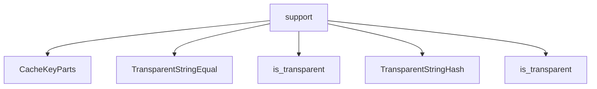

# Namespace `clore::support`

## Summary

命名空间 `clore::support` 是 `clore` 库的基础支持层，提供跨模块复用的通用工具与基础设施。其显著声明包括用于缓存键构建与解析的 `build_cache_key`、`split_cache_key` 和 `CacheKeyParts`；用于 UTF‑8 文件读写、规范化与转码的 `read_utf8_text_file`、`write_utf8_text_file`、`ensure_utf8`、`normalize_line_endings`、`strip_utf8_bom` 及 `truncate_utf8`；用于路径标准化的 `normalize_path_string`；用于容器异构查找的透明哈希器 `TransparentStringHash` 与相等比较器 `TransparentStringEqual`；以及拓扑排序函数 `topological_order`、编译签名生成函数 `build_compile_signature`、控制台 UTF‑8 支持函数 `enable_utf8_console` 和日志级别规范化函数 `canonical_log_level_name` 等。该命名空间的职责明确：为编译缓存、文件系统交互、字符串处理、容器优化和日志系统提供稳定可靠的底层支持，体现其在架构中的工具层定位。

## Diagram


```mermaid
graph TD
    NS["support"]
    T0["CacheKeyParts"]
    NS --> T0
    T1["TransparentStringEqual"]
    NS --> T1
    T2["is_transparent"]
    NS --> T2
    T3["TransparentStringHash"]
    NS --> T3
    T4["is_transparent"]
    NS --> T4
```

## Types

### `clore::support::CacheKeyParts`

Declaration: `src/support/logging.cppm:80`

Definition: `src/support/logging.cppm:80`

Implementation: [`Module support`](../../../modules/support/index.md)

Insufficient evidence to summarize; provide more EVIDENCE.

#### Invariants

- `compile_signature` 默认值为 `0`，表示未设置或无效签名

#### Key Members

- `path`
- `compile_signature`

#### Usage Patterns

- 直接访问 `path` 和 `compile_signature` 成员以构造缓存键或进行键匹配
- 作为 `clore::support` 命名空间中缓存机制的输入数据单元

### `clore::support::TransparentStringEqual`

Declaration: `src/support/logging.cppm:56`

Definition: `src/support/logging.cppm:56`

Implementation: [`Module support`](../../../modules/support/index.md)

结构体 `clore::support::TransparentStringEqual` 是一个透明的字符串相等比较器，用于支持异构查找场景。它通过定义 `is_transparent` 类型别名来启用透明操作，允许在不显式转换类型的情况下，比较 `std::string`、`std::string_view` 或其他兼容字符串类型。该类通常与 `TransparentStringHash` 配合使用，用于定义支持透明查找的关联容器（如 `std::unordered_set` 或 `std::unordered_map`），使得查找时无需构造临时 `std::string` 对象，从而提高性能。

#### Invariants

- 无内部状态，所有操作纯函数式
- 所有 `operator()` 重载保证不抛出异常
- 比较结果对称且传递，等价于 `std::string_view` 的相等性
- 与 `std::string` 及 `std::string_view` 的混合比较语义一致

#### Key Members

- `is_transparent` 类型别名
- `operator()` 四个重载：`(string_view, string_view)`, `(const string&, string_view)`, `(string_view, const string&)`, `(const string&, const string&)`

#### Usage Patterns

- 作为自定义比较器用于 `std::unordered_set` 或 `std::unordered_map`，配合透明哈希函数实现异质查找
- 在需要高效字符串键比较且避免不必要 `std::string` 构造的场景中使用

#### Member Types

##### `clore::support::TransparentStringEqual::is_transparent`

Declaration: `src/support/logging.cppm:57`

Implementation: [`Module support`](../../../modules/support/index.md)

###### Declaration

```cpp
using is_transparent = void
```

#### Member Functions

##### `clore::support::TransparentStringEqual::operator()`

Declaration: `src/support/logging.cppm:64`

Definition: `src/support/logging.cppm:64`

Implementation: [`Module support`](../../../modules/support/index.md)

###### Declaration

```cpp
auto (const std::string &, std::string_view) const noexcept -> bool;
```

##### `clore::support::TransparentStringEqual::operator()`

Declaration: `src/support/logging.cppm:69`

Definition: `src/support/logging.cppm:69`

Implementation: [`Module support`](../../../modules/support/index.md)

###### Declaration

```cpp
auto (std::string_view, const std::string &) const noexcept -> bool;
```

##### `clore::support::TransparentStringEqual::operator()`

Declaration: `src/support/logging.cppm:74`

Definition: `src/support/logging.cppm:74`

Implementation: [`Module support`](../../../modules/support/index.md)

###### Declaration

```cpp
auto (const std::string &, const std::string &) const noexcept -> bool;
```

##### `clore::support::TransparentStringEqual::operator()`

Declaration: `src/support/logging.cppm:59`

Definition: `src/support/logging.cppm:59`

Implementation: [`Module support`](../../../modules/support/index.md)

###### Declaration

```cpp
auto (std::string_view, std::string_view) const noexcept -> bool;
```

### `clore::support::TransparentStringHash`

Declaration: `src/support/logging.cppm:40`

Definition: `src/support/logging.cppm:40`

Implementation: [`Module support`](../../../modules/support/index.md)

`clore::support::TransparentStringHash` 是一个自定义哈希函数对象，设计用于与无序容器（如 `std::unordered_set` 或 `std::unordered_map`）配合使用，以支持异质查找（heterogeneous lookup）。通过定义 `is_transparent` 类型别名，它满足透明哈希器的要求，允许在查找操作中直接使用 `std::string_view`、`const char*` 或其他可隐式转换为 `std::string_view` 的类型作为键，从而避免为进行哈希计算而构造临时的 `std::string` 对象。

该类型通常与 `clore::support::TransparentStringEqual` 一同使用，两者结合使容器能够高效地比较和哈希字符串类型，提升查找性能并减少不必要的内存分配。它主要用于 `clore` 库的日志或缓存模块中，例如被 `clore::support::CacheKeyParts` 等组件使用。

#### Invariants

- 所有 `operator()` 重载都是 `noexcept` 的
- 哈希计算完全基于 `std::hash<std::string_view>` 实现，无自定义状态或额外逻辑
- 接受 `const std::string&` 和 `const char*` 的参数会隐式转换为 `std::string_view`
- 类型别名 `is_transparent` 为 `void`，表明支持透明查找

#### Key Members

- `is_transparent` 类型别名
- `operator()(std::string_view) const noexcept`
- `operator()(const std::string&) const noexcept`
- `operator()(const char*) const noexcept`

#### Usage Patterns

- 作为 `std::unordered_set<std::string, TransparentStringHash>` 或 `std::unordered_map<std::string, T, TransparentStringHash>` 的哈希器，允许使用 `std::string_view` 或 `const char*` 进行查找
- 与其他支持透明哈希的容器或算法配合，例如 `std::unordered_set<std::string, TransparentStringHash>::find(std::string_view)`
- 被用作代码库中需要字符串哈希且支持异构查找的通用组件

#### Member Types

##### `clore::support::TransparentStringHash::is_transparent`

Declaration: `src/support/logging.cppm:41`

Implementation: [`Module support`](../../../modules/support/index.md)

###### Declaration

```cpp
using is_transparent = void
```

#### Member Functions

##### `clore::support::TransparentStringHash::operator()`

Declaration: `src/support/logging.cppm:43`

Definition: `src/support/logging.cppm:43`

Implementation: [`Module support`](../../../modules/support/index.md)

###### Declaration

```cpp
auto (std::string_view) const noexcept -> std::size_t;
```

##### `clore::support::TransparentStringHash::operator()`

Declaration: `src/support/logging.cppm:51`

Definition: `src/support/logging.cppm:51`

Implementation: [`Module support`](../../../modules/support/index.md)

###### Declaration

```cpp
auto (const char *) const noexcept -> std::size_t;
```

##### `clore::support::TransparentStringHash::operator()`

Declaration: `src/support/logging.cppm:47`

Definition: `src/support/logging.cppm:47`

Implementation: [`Module support`](../../../modules/support/index.md)

###### Declaration

```cpp
auto (const std::string &) const noexcept -> std::size_t;
```

## Functions

### `clore::support::build_cache_key`

Declaration: `src/support/logging.cppm:93`

Definition: `src/support/logging.cppm:391`

Implementation: [`Module support`](../../../modules/support/index.md)

函数 `clore::support::build_cache_key` 根据给定的字符串标识符和一个无符号 64 位整数构造一个缓存键字符串。调用者应将一个代表缓存条目标识的 `std::string_view` 和一个版本或哈希值（通常由 `clore::support::build_compile_signature` 等函数生成）传递给它。返回的 `std::string` 与 `clore::support::split_cache_key` 函数兼容，从而允许将生成的键用于从缓存中存储或检索数据。合同未明确要求输入非空，但建议调用者确保标识符和整数值在此上下文中有效；不一致的输入可能导致键无法被对应的拆分函数正确解析。

#### Usage Patterns

- Used to generate a cache key from a normalized file path and a compile signature
- Called before storing or retrieving cached compile results

### `clore::support::build_compile_signature`

Declaration: `src/support/logging.cppm:89`

Definition: `src/support/logging.cppm:375`

Implementation: [`Module support`](../../../modules/support/index.md)

函数 `clore::support::build_compile_signature` 根据给定的编译信息生成一个紧凑的数值签名。调用者应当提供两个标识符——通常第一个代表编译目标或输入源，第二个代表变体或平台——以及一个包含额外配置选项的字符串列表。返回的 `std::uint64_t` 值可用于唯一标识这组编译参数，例如与 `clore::support::build_cache_key` 配合构造缓存键。为保证签名在不同环境下的一致性，调用者应确保传入的路径字符串已经是规范化形式（该函数可能内部调用 `clore::support::normalize_path_string` 进行预处理）。

#### Usage Patterns

- Called to produce a compile signature for caching compile results
- Used together with `clore::support::build_cache_key` to form a cache key

### `clore::support::canonical_log_level_name`

Declaration: `src/support/logging.cppm:100`

Definition: `src/support/logging.cppm:447`

Implementation: [`Module support`](../../../modules/support/index.md)

接受一个日志级别名称的字符串视图，返回其规范形式。如果输入无法识别为有效的日志级别名称，则返回 `std::nullopt`。调用者应确保传入的字符串视图在函数返回前保持有效。函数不修改输入，结果所有权由返回的 `std::optional<std::string>` 持有。

#### Usage Patterns

- Canonicalizing user-provided log level strings
- Validating log level names before configuration

### `clore::support::enable_utf8_console`

Declaration: `src/support/logging.cppm:114`

Definition: `src/support/logging.cppm:557`

Implementation: [`Module support`](../../../modules/support/index.md)

`clore::support::enable_utf8_console` 函数负责配置控制台的 I/O 环境以支持 UTF‑8 编码。调用此函数不需要任何参数，且不产生返回值。建议调用者在程序启动的早期（例如在 `main` 函数开头）调用一次，以保证后续的宽字符输出和 UTF‑8 文本处理在控制台中正确呈现。

#### Usage Patterns

- Called during application initialization to enable UTF-8 console I/O on Windows
- Invoked once at program startup to ensure console handles UTF-8 encoding

### `clore::support::ensure_utf8`

Declaration: `src/support/logging.cppm:98`

Definition: `src/support/logging.cppm:428`

Implementation: [`Module support`](../../../modules/support/index.md)

Declaration: [Declaration](functions/ensure-utf8.md)

`clore::support::ensure_utf8` 接受一个 `std::string_view` 并返回一个 `std::string`，该结果保证是有效的 UTF‑8 编码。调用者可将此函数用作一个适配层，确保无论输入数据的编码状态如何，下游处理都能接收到一个符合 UTF‑8 规范的字符串。函数内部会处理任何无效的字节序列，生成语义上可用的输出。

#### Usage Patterns

- Normalizing input strings to ensure valid UTF-8 encoding
- Used by `write_utf8_text_file` to guarantee valid UTF-8 before writing
- Used by `truncate_utf8` to ensure truncated string ends at a valid boundary

### `clore::support::extract_first_plain_paragraph`

Declaration: `src/support/logging.cppm:85`

Definition: `src/support/logging.cppm:326`

Implementation: [`Module support`](../../../modules/support/index.md)

`clore::support::extract_first_plain_paragraph` 接受一个 `std::string_view` 输入，返回一个 `std::string`。它提取并返回输入文本中的第一个纯文本段落，通常用于从可能包含 Markdown 格式内容的字符串中获取简介性的连续文本块。

调用方应提供一个字符串（通常为 Markdown 内容），函数会忽略其内联格式（如粗体、斜体、代码等），只保留第一个非空段落中去除格式后的纯文本。如果输入为空或不包含有效段落，结果为空字符串。函数不解析复杂的 Markdown 结构（如表格、代码块），仅处理段落边界和简单内联标记。

#### Usage Patterns

- Used to obtain a plain text summary from Markdown documentation or comments
- Applied to extract the first paragraph for previews or search indexing

### `clore::support::normalize_line_endings`

Declaration: `src/support/logging.cppm:102`

Definition: `src/support/logging.cppm:465`

Implementation: [`Module support`](../../../modules/support/index.md)

`clore::support::normalize_line_endings` 接受一个 `std::string_view` 输入，返回一个 `std::string`。该函数将其接收的字符串中的所有行结束符序列（包括 `"\r\n"`、`"\r"` 以及 `"\n"`）统一转换为单个换行符 `"\n"`。调用者负责提供一个合法的、可能包含混合行结束符的文本视图，而函数保证返回的字符串采用一致的 LF 结尾格式。此转换是深拷贝的：原始输入不会被修改，结果字符串拥有独立的所有权。

#### Usage Patterns

- Normalizing line endings before further text processing or file output
- Used in pipelines that require consistent line ending style (e.g., before parsing or comparison)

### `clore::support::normalize_path_string`

Declaration: `src/support/logging.cppm:87`

Definition: `src/support/logging.cppm:371`

Implementation: [`Module support`](../../../modules/support/index.md)

Declaration: [Declaration](functions/normalize-path-string.md)

`clore::support::normalize_path_string` 接受一个路径字符串视图并返回一个标准化后的路径字符串。标准化处理使得路径表示一致：通常包括规范分隔符、消除冗余的点或双点段，并可能转换大小写或格式，具体取决于平台约定。返回的字符串是调用方可预期用于比较、哈希或作为缓存键一部分的稳定形式。

调用方提供任意格式的路径字符串；函数负责输出一个规范、可重复的表示。该结果旨在与 `clore::support::build_compile_signature` 等需要唯一标识文件路径的上下文一起使用。调用方不应假定原路径被保留（例如，前导或尾随分隔符可能被修改），但保证输出是一个有效的标准化路径字符串。

#### Usage Patterns

- 用于构建编译签名时规范化路径字符串
- 在 `clore::support::build_compile_signature` 中被调用

### `clore::support::read_utf8_text_file`

Declaration: `src/support/logging.cppm:108`

Definition: `src/support/logging.cppm:503`

Implementation: [`Module support`](../../../modules/support/index.md)

`clore::support::read_utf8_text_file` 接受一个 `std::filesystem::path` 参数，尝试读取该路径对应的 UTF-8 文本文件。成功时返回包含文件完整内容的 `std::string`；失败时返回一个描述错误信息的 `std::string`。函数会妥善处理文件开头的 UTF-8 字节顺序标记（BOM），返回不含 BOM 的纯文本内容。使用 `std::expected` 返回类型，调用方应检查返回值以确定操作是否成功。

#### Usage Patterns

- reading configuration or resource files
- loading source code files
- importing UTF-8 text data from the filesystem

### `clore::support::split_cache_key`

Declaration: `src/support/logging.cppm:96`

Definition: `src/support/logging.cppm:401`

Implementation: [`Module support`](../../../modules/support/index.md)

将缓存键字符串解析为其组成部分。接受一个 `std::string_view` 作为完整的缓存键，返回 `CacheKeyParts`（成功时）或一个错误描述字符串（输入不符合预期格式时）。调用者需确保传入的键有效；函数会进行验证，若无法解析则返回错误结果。

#### Usage Patterns

- Splitting a cache key into path and compile signature
- Validating cache key format and parsing signature
- Used in conjunction with `build_cache_key` for cache key decomposition

### `clore::support::strip_utf8_bom`

Declaration: `src/support/logging.cppm:106`

Definition: `src/support/logging.cppm:493`

Implementation: [`Module support`](../../../modules/support/index.md)

Declaration: [Declaration](functions/strip-utf8-bom.md)

如果输入以 UTF‑8 字节顺序标记（U+FEFF，编码为 `\xEF\xBB\xBF`）开头，`clore::support::strip_utf8_bom` 返回一个指向紧随 BOM 之后的子串的 `std::string_view`；否则原样返回输入的视图。此函数不进行任何内存分配或修改。调用者有责任确保传入的 `std::string_view` 所引用的字符缓冲区的生命周期在返回值的使用期间内保持有效。

#### Usage Patterns

- Stripping BOM from text loaded by `clore::support::read_utf8_text_file`

### `clore::support::topological_order`

Declaration: `src/support/logging.cppm:116`

Definition: `src/support/logging.cppm:570`

Implementation: [`Module support`](../../../modules/support/index.md)

The function `clore::support::topological_order` computes a topological ordering of a set of named nodes given their dependency relationships. It accepts a list of all node names, a map from each node to the vector of nodes it depends on, and a map of initial per‑node integer values (such as in‑degree counts). If the dependency graph is acyclic, the function returns an `std::optional` containing the nodes in topological order; otherwise it returns `std::nullopt`.

#### Usage Patterns

- Used to compute a topological ordering of compilation units or graph nodes
- Called with dependency information to detect cycles
- Suitable for build systems and task scheduling

### `clore::support::truncate_utf8`

Declaration: `src/support/logging.cppm:104`

Definition: `src/support/logging.cppm:483`

Implementation: [`Module support`](../../../modules/support/index.md)

`clore::support::truncate_utf8` 接受一个有效的 UTF-8 字符串视图和一个最大字节数，返回截断后的 `std::string`。结果字符串不包含超过指定字节数的完整字符，且始终在码点边界处结束，保证输出为有效的 UTF-8 序列。调用者必须确保输入 **不包含** 无效的 UTF-8 编码；否则行为未定义。返回的字符串拥有独立存储，调用者负责管理其生命周期。

#### Usage Patterns

- Truncating UTF-8 strings to fit within a byte limit
- Ensuring valid UTF-8 boundaries after truncation
- Preprocessing strings before storage or display

### `clore::support::write_utf8_text_file`

Declaration: `src/support/logging.cppm:111`

Definition: `src/support/logging.cppm:538`

Implementation: [`Module support`](../../../modules/support/index.md)

函数 `clore::support::write_utf8_text_file` 接受一个 `const std::filesystem::path &` 和一个 `std::string_view`，将提供的文本内容写入指定的文件，以 UTF-8 编码存储。成功时返回 `std::expected<void, std::string>` 的空值；失败时返回描述错误的字符串。调用者应确保目标路径有效且具有写入权限，且写入操作是原子性（取决于底层文件系统）的。该函数会自动将输入内容转为合法的 UTF-8 序列（通过 `clore::support::ensure_utf8`），因此调用者无需预先处理编码。

#### Usage Patterns

- used to write UTF-8 text files
- complement to `clore::support::read_utf8_text_file`
- called with a path and a string view of the content to persist

## Related Pages

- [Namespace clore](../index.md)

